# ⬆️ Microsoft Azure AZ-204 (Desarrollo de soluciones para Microsoft Azure) Pruebas de práctica del examen: preguntas y respuestas

## ❣️ Soporte

Hay muchas formas de apoyarnos; a cambio, obtendras este material en un formato adecuado:

- ❤️ [shop.ditectrev.com, en formatos EPUB o PDF, con respuestas marcadas](https://shop.ditectrev.com/product/microsoft-azure-az-204-developing-solutions-for-azure-practice-tests-exams-questions-answers),
- ❤️ [shop.ditectrev.com, en formatos EPUB o PDF, sin respuestas marcadas](https://shop.ditectrev.com/product/microsoft-azure-az-204-developing-solutions-for-azure-practice-tests-exams-questions-no-answers),
- 📖 [Udemy es el unico que tiene explicaciones para las preguntas](https://www.udemy.com/course/developing-solutions-for-azure-az-204-practice-test-exams/?referralCode=94E823A45873B0E39FE3),
- 📚 [Google Play Books, en formato PDF, con respuestas marcadas](https://play.google.com/store/books/details?id=vvwcEQAAQBAJ),
- 📚 [Google Play Books, en formato PDF, sin respuestas marcadas](https://play.google.com/store/books/details?id=wPwcEQAAQBAJ),
- 🛍️ [Etsy, en formato PDF, con respuestas marcadas](https://ditectrev.etsy.com/listing/1506993824),
- 🛍️ [Etsy, en formato PDF, sin respuestas marcadas](https://ditectrev.etsy.com/listing/1521177797),
- 🛒 [eBay, en formato PDF, con respuestas marcadas](https://www.ebay.com/itm/404899852791?mkcid=16&mkevt=1&mkrid=711-127632-2357-0&ssspo=_ptbuk3gqdw&sssrc=2524149&ssuid=_ptbuk3gqdw&widget_ver=artemis&media=COPY),
- 🛒 [eBay, en formato PDF, sin respuestas marcadas](https://www.ebay.com/itm/405079754203?mkcid=16&mkevt=1&mkrid=711-127632-2357-0&ssspo=_ptbuk3gqdw&sssrc=2524149&ssuid=_ptbuk3gqdw&widget_ver=artemis&media=COPY),
- 🔄 [La suscripcion de Patreon permite acceder a todos los materiales en formatos EPUB y PDF. Tambien puedes comprar articulos individuales en Patreon, pero tecnicamente la suscripcion nos permite incluir todas las actualizaciones en EPUB y PDF. Por lo tanto, recibes actualizaciones de EPUB y PDF cuando te suscribes a Patreon](https://patreon.com/Ditectrev?utm_medium=unknown&utm_source=join_link&utm_campaign=creatorshare_creator&utm_content=copyLink).

💰 Si trabajas para una empresa, probablemente puedas reclamar este gasto con facilidad mientras te preparas para el examen. Para nosotros, se trata de estar en el juego o no.

⭐ Las buenas calificaciones y reseñas nos ayudan a sobrevivir. Por favor, no olvides dejar una buena cuando compres un articulo.

## 👩‍💻 & 👨‍💻 Curso(s) interactivo(s)

Es excelente aprender estas preguntas como preparacion para el examen y, si, deberias aprobar solo con eso. Sin embargo, recomendamos mucho mas aprendizaje interactivo si quieres convertirte en un experto. Actualmente, recomendamos estos cursos:

- 🎬 [Coursera: curso oficial de Microsoft basado en video](https://imp.i384100.net/o4vrxe).
- 📖 [Educative: curso basado en texto y sin video, con Cloud Labs listos para practicar sin necesidad de configurar un entorno (y pagos). El enlace incluye el mayor descuento disponible de Educative](https://www.educative.io/courses/event-driven-microservices-azure?aff=VALz).

Si, tenemos una pequena comision por ese enlace. Por lo tanto, al usarlo, nos estas apoyando.

## ✨ Este curso no se parece a ningun curso de Microsoft Azure AZ-204 (Desarrollo de soluciones para Azure) que encuentres en linea.

✋ Unete a una comunidad en linea en vivo y a un curso impartido por expertos de la industria y aprueba con confianza el Microsoft Azure AZ-204 (Desarrollo de soluciones para Azure). Nuestro objetivo es construir un ecosistema de certificaciones de Tecnologias de la Informacion (TI) y cursos en linea en cooperacion con la industria tecnologica. Creemos que esto dara a nuestros estudiantes 100% de confianza en el mercado, en un entorno de codigo abierto. Estamos apenas al inicio de nuestro camino, asi que es aun mejor que te unas ahora.

## ⌛️ Corto y al grano; por que deberias tomar el curso:

1. Siempre felices de responder tus preguntas en las preguntas y respuestas de Udemy y fuera de alli :)
2. ¿No aprobaste? Envia una captura de tu resultado y solicita un reembolso (a traves de nuestra proxima plataforma; no es posible en Udemy); siempre lo aceptaremos.
3. Aprende sobre temas como:
   - Control de acceso;
   - Autenticacion y autorizacion;
   - Azure API Management;
   - Azure App Service;
   - Interfaz de linea de comandos de Azure (Azure CLI);
   - Azure Cosmos DB;
   - Azure Event Hubs;
   - Azure Front Door;
   - Azure Functions;
   - Azure Log Analytics;
   - Azure Logic Apps;
   - Azure Monitor;
   - Azure Policies;
   - Recursos de Azure;
   - Azure Service Bus;
   - Servicios de Azure;
   - Azure SQL Databases;
   - Azure Storage;
   - Azure Storage Queues;
   - Azure Web Application Firewall (Azure WAF);
   - Azure Web Apps;
   - Trafico de datos entrante y saliente;
   - Microsoft Entra ID;
   - PowerShell;
   - Nube publica y privada;
   - Grupos de recursos;
   - Serverless;
   - Acuerdo de nivel de servicio (SLA);
   - Software as a Service (SaaS);
   - Maquinas virtuales (VMs);
   - **¡Mucho mas!**
4. Las preguntas son similares al examen real, sin duplicaciones (como en otros cursos ;-)).
5. Las pruebas de práctica simulan el contenido, el tiempo y el porcentaje requerido para aprobar el examen.
6. Este curso **no** es un Exam Dump de Microsoft Azure AZ-204 (Desarrollo de soluciones para Azure). Algunas personas usan brain dumps o exam dumps, pero eso es absurdo y no lo practicamos.
7. 220 preguntas **unicas**.

## ☝️ Actualizaciones del curso

**[v1.0.0](../../releases/tag/v1.0.0): 10 de julio de 2023.**

- Lanzamiento del curso.

**[v1.0.1](../../releases/tag/v1.0.1): 7 de agosto de 2023.**

- Correccion de 2 respuestas incorrectas.

**[v1.1.0](../../releases/tag/v1.1.0): 10 de noviembre de 2023.**

- Correccion de todos los errores tipograficos restantes con apoyo de software de correccion automatica y 4 respuestas incorrectas.

**[v1.1.1](../../releases/tag/v1.1.1): 4 de febrero de 2024.**

- Actualizacion de 1 pregunta con respuesta obsoleta.

**[v1.1.1](../../releases/tag/v1.1.1): 6 de agosto de 2024.**

- Explicaciones generadas por IA (solo en [Udemy](https://www.udemy.com/course/developing-solutions-for-azure-az-204-practice-test-exams/?referralCode=94E823A45873B0E39FE3)).

**[v1.1.2](../../releases/tag/v1.1.2): 11 de noviembre de 2024.**

- Correccion de 4 respuestas incorrectas.

**[v1.1.3](../../releases/tag/v1.1.3): 1 de marzo de 2025.**

- Correccion de 3 respuestas incorrectas.

**[v1.2.0](../../releases/tag/v1.2.0): 1 de agosto de 2025.**

- Actualizacion de la terminologia obsoleta relacionada con Azure Active Directory (Azure AD) (ahora Microsoft Entra ID). Ademas, mejoras significativas de formato para palabras tecnicas, correcciones menores de errores tipograficos y se corrigieron 5 preguntas con respuestas incorrectas.

## 🙋‍♀️ & 🙋‍♂️ Contribucion

Estamos muy agradecidos por cada contribucion, que nos permite entregar contenido de primera. Cuando encuentres un recurso faltante, un enlace roto en la [Tabla de contenidos](../..#table-of-contents) o una respuesta incorrecta, envia un [issue](../../issues). Aun mejor seria un [Pull Request (PR)](../../pulls).

## Para quien es este curso:

- 👨‍🎓 Estudiantes que se preparan para el examen Developing Solutions for Azure (AZ-204);
- 👨‍🎓 Ingenieros de Amazon Web Services (AWS);
- 👨‍🎓 Ingenieros de Azure;
- 👨‍🎓 Ingenieros de nube;
- 👨‍🎓 Ingenieros DevOps;
- 👨‍🎓 Ingenieros de Google Cloud Platform (GCP);
- 👨‍🎓 Ingenieros de infraestructura;
- 👨‍🎓 Ingenieros lideres;
- 👨‍🎓 Ingenieros de confiabilidad del sitio (SRE);
- 👨‍🎓 Desarrolladores/ingenieros de software;
- 👨‍🎓 Lideres de equipo.

## Requisitos

- 🤩 ¡Entusiasmo por aprender!
- 0️⃣ No se requiere conocimiento previo;
- ✅ Puedes aprobar el examen Developing Solutions for Azure (AZ-204) solo con nuestras pruebas de práctica.

## Tabla de contenidos

| No. | Questions |
| --- | --------------------------- |
| 1   | [Estás implementando un servicio web ASP.NET Core de software como servicio (SaaS) que se ejecutará como una Azure Web App. El servicio web usará una base de datos SQL Server local para el almacenamiento. El servicio web también incluye un WebJob que procesa actualizaciones de datos. Cuatro clientes usarán el servicio web. Cada instancia del WebJob procesa datos de un único cliente y debe ejecutarse como una instancia singleton. Cada implementación debe probarse mediante ranuras de implementación antes de servir datos de producción. Los costos de Azure deben minimizarse. Los recursos de Azure deben estar en una red aislada. Necesitas configurar el plan de App Service para la Web App. ¿Cómo debes configurar el plan de App Service?](#you-are-implementing-a-software-as-a-service-saas-aspnet-core-web-service-that-will-run-as-an-azure-web-app-the-web-service-will-use-an-on-premises-sql-server-database-for-storage-the-web-service-also-includes-a-webjob-that-processes-data-updates-four-customers-will-use-the-web-service-each-instance-of-the-webjob-processes-data-for-a-single-customer-and-must-run-as-a-singleton-instance-each-deployment-must-be-tested-by-using-deployment-slots-prior-to-serving-production-data-azure-costs-must-be-minimized-azure-resources-must-be-located-in-an-isolated-network-you-need-to-configure-the-app-service-plan-for-the-web-app-how-should-you-configure-the-app-service-plan)
| 2   | [Eres desarrollador de una empresa de software como servicio (SaaS) que usa una Azure Function para procesar pedidos. La Azure Function actualmente se ejecuta en una Function App de Azure que se activa con una cola de Azure Storage. Te estás preparando para migrar la Azure Function a Kubernetes usando Kubernetes-based Event Driven Autoscaling (KEDA). Necesitas configurar las Definiciones de recursos personalizados (CRD) de Kubernetes para la Azure Function. ¿Qué CRD debes configurar?](#you-are-a-developer-for-a-software-as-a-service-saas-company-that-uses-an-azure-function-to-process-orders-the-azure-function-currently-runs-on-an-azure-function-app-that-is-triggered-by-an-azure-storage-queue-you-are-preparing-to-migrate-the-azure-function-to-kubernetes-using-kubernetes-based-event-driven-autoscaling-keda-you-need-to-configure-kubernetes-custom-resource-definitions-crd-for-the-azure-function-which-crds-should-you-configure)
| 3   | [Estás creando un script de CLI que crea una web app de Azure y servicios relacionados en Azure App Service. La web app usa las siguientes variables. Necesitas implementar automáticamente código desde GitHub en la web app recién creada. ¿Cómo debes completar el script?](#you-are-creating-a-cli-script-that-creates-an-azure-web-app-and-related-services-in-azure-app-service-the-web-app-uses-the-following-variables-you-need-to-automatically-deploy-code-from-github-to-the-newly-created-web-app-how-should-you-complete-the-script)
| 4   | [Desarrollas una oferta de software como servicio (SaaS) para administrar fotografías. Los usuarios cargan fotos a un servicio web que luego almacena las fotos en Azure Storage Blob. El tipo de cuenta de almacenamiento es de propósito general v2. Cuando se cargan las fotos, deben procesarse para producir y guardar una versión apta para móviles de la imagen. El proceso para producir una versión apta para móviles debe iniciarse en menos de un minuto. Necesitas diseñar el proceso que inicia el procesamiento de fotos. Solución: Iniciar el procesamiento de fotos desde eventos de Blob Storage. ¿La solución cumple el objetivo?](#you-develop-a-software-as-a-service-saas-offering-to-manage-photographs-users-upload-photos-to-a-web-service-which-then-stores-the-photos-in-azure-storage-blob-storage-the-storage-account-type-is-general-purpose-v2-when-photos-are-uploaded-they-must-be-processed-to-produce-and-save-a-mobile-friendly-version-of-the-image-the-process-to-produce-a-mobile-friendly-version-of-the-image-must-start-in-less-than-one-minute-you-need-to-design-the-process-that-starts-the-photo-processing-solution-trigger-the-photo-processing-from-blob-storage-events-does-the-solution-meet-the-goal)
| 5   | [Desarrollas e implementas una app de API de Azure App Service en una ranura de implementación hospedada en Windows llamada `Development`. Creas ranuras adicionales llamadas `Testing` y `Production`. Habilitas el auto swap en la ranura `Production`. Necesitas asegurarte de que los scripts se ejecuten y los recursos estén disponibles antes de que ocurra una operación de intercambio. Solución: Actualizar el archivo `web.config` para incluir el elemento de configuración `applicationInitialization`. Especificar acciones de inicialización personalizadas para ejecutar los scripts. ¿La solución cumple el objetivo?](#you-develop-and-deploy-an-azure-app-service-api-app-to-a-windows-hosted-deployment-slot-named-development-you-create-additional-deployment-slots-named-testing-and-production-you-enable-auto-swap-on-the-production-deployment-slot-you-need-to-ensure-that-scripts-run-and-resources-are-available-before-a-swap-operation-occurs-solution-update-the-webconfig-file-to-include-the-applicationinitialization-configuration-element-specify-custom-initialization-actions-to-run-the-scripts-does-the-solution-meet-the-goal)
| 6   | [Desarrollas e implementas una app de API de Azure App Service en una ranura de implementación hospedada en Windows llamada `Development`. Creas ranuras adicionales llamadas `Testing` y `Production`. Habilitas el auto swap en la ranura `Production`. Necesitas asegurarte de que los scripts se ejecuten y los recursos estén disponibles antes de que ocurra una operación de intercambio. Solución: Habilitar auto swap para la ranura `Testing`. Implementar la app en la ranura `Testing`. ¿La solución cumple el objetivo?](#you-develop-and-deploy-an-azure-app-service-api-app-to-a-windows-hosted-deployment-slot-named-development-you-create-additional-deployment-slots-named-testing-and-production-you-enable-auto-swap-on-the-production-deployment-slot-you-need-to-ensure-that-scripts-run-and-resources-are-available-before-a-swap-operation-occurs-solution-enable-auto-swap-for-the-testing-slot-deploy-the-app-to-the-testing-slot-does-the-solution-meet-the-goal)
| 7   | [Desarrollas e implementas una app de API de Azure App Service en una ranura de implementación hospedada en Windows llamada `Development`. Creas ranuras adicionales llamadas `Testing` y `Production`. Habilitas el auto swap en la ranura `Production`. Necesitas asegurarte de que los scripts se ejecuten y los recursos estén disponibles antes de que ocurra una operación de intercambio. Solución: Deshabilitar auto swap. Actualizar la app con un método llamado `statuscheck` para ejecutar los scripts. Volver a habilitar auto swap e implementar la app en la ranura `Production`. ¿La solución cumple el objetivo?](#you-develop-and-deploy-an-azure-app-service-api-app-to-a-windows-hosted-deployment-slot-named-development-you-create-additional-deployment-slots-named-testing-and-production-you-enable-auto-swap-on-the-production-deployment-slot-you-need-to-ensure-that-scripts-run-and-resources-are-available-before-a-swap-operation-occurs-solution-disable-auto-swap-update-the-app-with-a-method-named-statuscheck-to-run-the-scripts-re-enable-auto-swap-and-deploy-the-app-to-the-production-slot-does-the-solution-meet-the-goal)
| 8   | [Desarrollas una oferta de software como servicio (SaaS) para administrar fotografías. Los usuarios cargan fotos a un servicio web que luego almacena las fotos en Azure Storage Blob. El tipo de cuenta de almacenamiento es de propósito general v2. Cuando se cargan las fotos, deben procesarse para producir y guardar una versión apta para móviles de la imagen. El proceso para producir una versión apta para móviles debe iniciarse en menos de un minuto. Necesitas diseñar el proceso que inicia el procesamiento de fotos. Solución: Convertir la cuenta de Azure Storage a una cuenta de almacenamiento BlockBlobStorage. ¿La solución cumple el objetivo?](#you-develop-a-software-as-a-service-saas-offering-to-manage-photographs-users-upload-photos-to-a-web-service-which-then-stores-the-photos-in-azure-storage-blob-storage-the-storage-account-type-is-general-purpose-v2-when-photos-are-uploaded-they-must-be-processed-to-produce-and-save-a-mobile-friendly-version-of-the-image-the-process-to-produce-a-mobile-friendly-version-of-the-image-must-start-in-less-than-one-minute-you-need-to-design-the-process-that-starts-the-photo-processing-solution-convert-the-azure-storage-account-to-a-blockblobstorage-storage-account-does-the-solution-meet-the-goal)
| 9   | [Estás desarrollando una Azure Web App. Configuras autenticación mutua TLS para la web app. Necesitas validar el certificado de cliente en la web app.](#you-are-developing-an-azure-web-app-you-configure-tls-mutual-authentication-for-the-web-app-you-need-to-validate-the-client-certificate-in-the-web-app)
| 10   | [Estás desarrollando Docker/Go usando Azure App Service Web App for Containers. Planeas ejecutar el contenedor en un App Service en Linux. Identificas una imagen de contenedor Docker para usar. Ninguno de tus grupos de recursos actuales se encuentra en una ubicación que admita Linux. Debes minimizar el número de grupos de recursos requeridos. Necesitas crear la aplicación y realizar una implementación inicial. ¿Qué tres comandos de Azure CLI deberías usar para desarrollar la solución?](#you-are-developing-a-dockergo-using-azure-app-service-web-app-for-containers-you-plan-to-run-the-container-in-an-app-service-on-linux-you-identify-a-docker-container-image-to-use-none-of-your-current-resource-groups-reside-in-a-location-that-supports-linux-you-must-minimize-the-number-of-resource-groups-required-you-need-to-create-the-application-and-perform-an-initial-deployment-which-three-azure-cli-commands-should-you-use-to-develop-the-solution)
| 11   | [Fourth Coffee tiene una web app ASP.NET Core que se ejecuta en Docker. La app está asignada al dominio `www.fourthcoffee.com`. Fourth Coffee está migrando esta aplicación a Azure. Necesitas aprovisionar una App Service Web App para hospedar esta imagen de Docker y asignar el dominio personalizado a la web app de App Service. Se ha creado un grupo de recursos llamado `FourthCoffeePublicWebResourceGroup` en la región WestUS que contiene un App Service Plan llamado `AppServiceLinuxDockerPlan`. ¿En qué orden deberían usarse los comandos de CLI para desarrollar la solución?](#fourth-coffee-has-an-aspnet-core-web-app-that-runs-in-docker-the-app-is-mapped-to-the-wwwfourthcoffeecom-domain-fourth-coffee-is-migrating-this-application-to-azure-you-need-to-provision-an-app-service-web-app-to-host-this-docker-image-and-map-the-custom-domain-to-the-app-service-web-app-a-resource-group-named-fourthcoffeepublicwebresourcegroup-has-been-created-in-the-westus-region-that-contains-an-app-service-plan-named-appservicelinuxdockerplan-which-order-should-the-cli-commands-be-used-to-develop-the-solution)
| 12   | [Estás desarrollando una aplicación Java sin servidor en Azure. Creas un nuevo Azure Key Vault para trabajar con secretos de una nueva aplicación de Azure Functions. La aplicación debe cumplir los siguientes requisitos: Referenciar Azure Key Vault sin requerir cambios en el código Java. Agregar y quitar dinámicamente instancias del host de Azure Functions según el número de eventos de la aplicación entrantes. Asegurar que las instancias permanezcan siempre calientes para evitar arranques en frío. Conectarse a una VNet. La autenticación a la instancia de Azure Key Vault debe eliminarse si se elimina la aplicación de Azure Functions. Necesitas conceder a la aplicación de Azure Functions acceso a Azure Key Vault. ¿Qué tres acciones debes realizar en secuencia?](#you-are-developing-a-serverless-java-application-on-azure-you-create-a-new-azure-key-vault-to-work-with-secrets-from-a-new-azure-functions-application-the-application-must-meet-the-following-requirements-reference-the-azure-key-vault-without-requiring-any-changes-to-the-java-code-dynamically-add-and-remove-instances-of-the-azure-functions-host-based-on-the-number-of-incoming-application-events-ensure-that-instances-are-perpetually-warm-to-avoid-any-cold-starts-connect-to-a-vnet-authentication-to-the-azure-key-vault-instance-must-be-removed-if-the-azure-function-application-is-deleted-you-need-to-grant-the-azure-functions-application-access-to-the-azure-key-vault-which-three-actions-should-you-perform-in-sequence)
| 13   | [Desarrollas un sitio web. Planeas hospedar el sitio web en Azure. Esperas que el sitio experimente altos volúmenes de tráfico después de publicarse. Debes asegurarte de que el sitio permanezca disponible y responsivo mientras minimizas el costo. Necesitas implementar el sitio web. ¿Qué debes hacer?](#you-develop-a-website-you-plan-to-host-the-website-in-azure-you-expect-the-website-to-experience-high-traffic-volumes-after-it-is-published-you-must-ensure-that-the-website-remains-available-and-responsive-while-minimizing-cost-you-need-to-deploy-the-website-what-should-you-do)
| 14   | [Una empresa desarrolla una web app Java. El código de la web app está alojado en un repositorio de GitHub ubicado en `https://github.com/Contoso/webapp`. La web app debe evaluarse antes de pasarse a producción. Debes implementar la versión inicial del código en una ranura de implementación llamada `staging`. Necesitas crear la web app e implementar el código. ¿Cómo debes completar los comandos?](#a-company-is-developing-a-java-web-app-the-web-app-code-is-hosted-in-a-github-repository-located-at-httpsgithubcomcontosowebapp-the-web-app-must-be-evaluated-before-it-is-moved-to-production-you-must-deploy-the-initial-code-release-to-a-deployment-slot-named-staging-you-need-to-create-the-web-app-and-deploy-the-code-how-should-you-complete-the-commands)
| 15   | [Tienes un servicio web que se usa para pagar entregas de comida. El servicio web usa Azure Cosmos DB como almacén de datos. Planeas agregar una nueva función que permite a los usuarios establecer un monto de propina. La nueva función requiere que una propiedad llamada tip en el documento de Cosmos DB esté presente y contenga un valor numérico. Hay muchos sitios web y apps móviles existentes que no se actualizarán para establecer la propiedad tip por algún tiempo. ¿Cómo debes completar el disparador?](#you-have-a-web-service-that-is-used-to-pay-for-food-deliveries-the-web-service-uses-azure-cosmos-db-as-the-data-store-you-plan-to-add-a-new-feature-that-allows-users-to-set-a-tip-amount-the-new-feature-requires-that-a-property-named-tip-on-the-document-in-cosmos-db-must-be-present-and-contain-a-numeric-value-there-are-many-existing-websites-and-mobile-apps-that-use-the-web-service-that-will-not-be-updated-to-set-the-tip-property-for-some-time-how-should-you-complete-the-trigger)
| 16   | [Desarrollas una Azure Function app con disparador HTTP para procesar datos de blobs de Azure Storage. La app se activa usando un enlace de salida en el blob. La app sigue agotando el tiempo de espera después de cuatro minutos. La app debe procesar los datos del blob. Necesitas asegurarte de que la app no agote el tiempo de espera y procese los datos del blob. Solución: Usar el patrón asíncrono de Durable Function para procesar los datos del blob. ¿La solución cumple el objetivo?](#you-develop-an-http-triggered-azure-function-app-to-process-azure-storage-blob-data-the-app-is-triggered-using-an-output-binding-on-the-blob-the-app-continues-to-time-out-after-four-minutes-the-app-must-process-the-blob-data-you-need-to-ensure-the-app-does-not-time-out-and-processes-the-blob-data-solution-use-the-durable-function-async-pattern-to-process-the-blob-data-does-the-solution-meet-the-goal)
| 17   | [Desarrollas una Azure Function app con disparador HTTP para procesar datos de blobs de Azure Storage. La app se activa usando un enlace de salida en el blob. La app sigue agotando el tiempo de espera después de cuatro minutos. La app debe procesar los datos del blob. Necesitas asegurarte de que la app no agote el tiempo de espera y procese los datos del blob. Solución: Enviar el payload del disparador HTTP a una cola de Azure Service Bus para que lo procese una función con disparador de cola y devolver una respuesta HTTP de éxito inmediata. ¿La solución cumple el objetivo?](#you-develop-an-http-triggered-azure-function-app-to-process-azure-storage-blob-data-the-app-is-triggered-using-an-output-binding-on-the-blob-the-app-continues-to-time-out-after-four-minutes-the-app-must-process-the-blob-data-you-need-to-ensure-the-app-does-not-time-out-and-processes-the-blob-data-solution-pass-the-http-trigger-payload-into-an-azure-service-bus-queue-to-be-processed-by-a-queue-trigger-function-and-return-an-immediate-http-success-response-does-the-solution-meet-the-goal)
| 18   | [Desarrollas una Azure Function app con disparador HTTP para procesar datos de blobs de Azure Storage. La app se activa usando un enlace de salida en el blob. La app sigue agotando el tiempo de espera después de cuatro minutos. La app debe procesar los datos del blob. Necesitas asegurarte de que la app no agote el tiempo de espera y procese los datos del blob. Solución: Configurar la app para usar un plan de hospedaje de App Service y habilitar la opción Always On. ¿La solución cumple el objetivo?](#you-develop-an-http-triggered-azure-function-app-to-process-azure-storage-blob-data-the-app-is-triggered-using-an-output-binding-on-the-blob-the-app-continues-to-time-out-after-four-minutes-the-app-must-process-the-blob-data-you-need-to-ensure-the-app-does-not-time-out-and-processes-the-blob-data-solution-configure-the-app-to-use-an-app-service-hosting-plan-and-enable-the-always-on-setting-does-the-solution-meet-the-goal)
| 19   | [Desarrollas una oferta de software como servicio (SaaS) para administrar fotografías. Los usuarios cargan fotos a un servicio web que luego almacena las fotos en Azure Storage Blob. El tipo de cuenta de almacenamiento es de propósito general v2. Cuando se cargan las fotos, deben procesarse para producir y guardar una versión apta para móviles de la imagen. El proceso para producir una versión apta para móviles debe iniciarse en menos de un minuto. Necesitas diseñar el proceso que inicia el procesamiento de fotos. Solución: Mover el procesamiento de fotos a una Azure Function desencadenada por la carga del blob. ¿La solución cumple el objetivo?](#you-develop-a-software-as-a-service-saas-offering-to-manage-photographs-users-upload-photos-to-a-web-service-which-then-stores-the-photos-in-azure-storage-blob-storage-the-storage-account-type-is-general-purpose-v2-when-photos-are-uploaded-they-must-be-processed-to-produce-and-save-a-mobile-friendly-version-of-the-image-the-process-to-produce-a-mobile-friendly-version-of-the-image-must-start-in-less-than-one-minute-you-need-to-design-the-process-that-starts-the-photo-processing-solution-move-photo-processing-to-an-azure-function-triggered-from-the-blob-upload-does-the-solution-meet-the-goal)
| 20   | [Estás desarrollando una aplicación que usa Azure Blob Storage. La aplicación debe leer los registros de transacciones de todos los cambios que ocurren en los blobs y en los metadatos de blobs en la cuenta de almacenamiento con fines de auditoría. Los cambios deben estar en el orden en que ocurrieron, incluir solo operaciones de crear, actualizar, eliminar y copiar, y conservarse por razones de cumplimiento. Necesitas procesar los registros de transacciones de forma asíncrona. ¿Qué debes hacer?](#you-are-developing-an-application-that-uses-azure-blob-storage-the-application-must-read-the-transaction-logs-of-all-the-changes-that-occur-to-the-blobs-and-the-blob-metadata-in-the-storage-account-for-auditing-purposes-the-changes-must-be-in-the-order-in-which-they-occurred-include-only-create-update-delete-and-copy-operations-and-be-retained-for-compliance-reasons-you-need-to-process-the-transaction-logs-asynchronously-what-should-you-do)
| 21   | [Planeas crear una imagen Docker que ejecuta una aplicación ASP.NET Core llamada `ContosoApp`. Tienes un script de configuración llamado `setupScript.ps1` y una serie de archivos de aplicación que incluyen `ContosoApp.dll`. Necesitas crear un documento Dockerfile que cumpla los siguientes requisitos: Ejecutar setupScript.ps1 cuando se crea el contenedor. Ejecutar `ContosoApp.dll` cuando se inicia el contenedor. El documento Dockerfile debe crearse en la misma carpeta donde se almacenan `ContosoApp.dll` y `setupScript.ps1`. ¿Qué cinco comandos debes usar para desarrollar la solución?](#you-plan-to-create-a-docker-image-that-runs-an-aspnet-core-application-named-contosoapp-you-have-a-setup-script-named-setupscriptps1-and-a-series-of-application-files-including-contosoappdll-you-need-to-create-a-dockerfile-document-that-meets-the-following-requirements-call-setupscriptsps1-when-the-container-is-built-run-contosoappdll-when-the-container-starts-the-dockerfile-document-must-be-created-in-the-same-folder-where-contosoappdll-and-setupscriptps1-are-stored-which-five-commands-should-you-use-to-develop-the-solution)
| 22   | [Estás desarrollando una Azure Function App que procesa imágenes que se cargan en un contenedor de Azure Blob. Las imágenes deben procesarse lo más rápido posible después de cargarse y la solución debe minimizar la latencia. Creas código para procesar imágenes cuando se activa la Function App. Necesitas configurar la Function App. ¿Qué debes hacer?](#you-are-developing-an-azure-function-app-that-processes-images-that-are-uploaded-to-an-azure-blob-container-images-must-be-processed-as-quickly-as-possible-after-they-are-uploaded-and-the-solution-must-minimize-latency-you-create-code-to-process-images-when-the-function-app-is-triggered-you-need-to-configure-the-function-app-what-should-you-do)
| 23   | [Estás configurando un nuevo entorno de desarrollo para una aplicación Java. El entorno requiere un Virtual Machine Scale Set (VMSS), varias cuentas de almacenamiento y componentes de red. El VMSS no debe crearse hasta que las cuentas de almacenamiento se hayan creado correctamente y se haya configurado un balanceador de carga y una red virtual asociada. ¿Cómo debes completar la plantilla de Azure Resource Manager?](#you-are-configuring-a-new-development-environment-for-a-java-application-the-environment-requires-a-virtual-machine-scale-set-vmss-several-storage-accounts-and-networking-components-the-vmss-must-not-be-created-until-the-storage-accounts-have-been-successfully-created-and-an-associated-load-balancer-and-virtual-network-is-configured-how-should-you-complete-the-azure-resource-manager-template)
| 24   | [Estás desarrollando una Azure Function App usando Visual Studio. La app procesará pedidos ingresados por una Azure Web App. La web app coloca la información de los pedidos en Azure Queue Storage. Necesitas revisar el código de la Azure Function App que se muestra abajo. Pregunta 1: El código registrará la hora en que el pedido se procesó desde la cola.](#you-are-developing-an-azure-function-app-by-using-visual-studio-the-app-will-process-orders-input-by-an-azure-web-app-the-web-app-places-the-order-information-into-azure-queue-storage-you-need-to-review-the-azure-function-app-code-shown-below-question-1-the-code-will-log-the-time-that-the-order-was-processed-from-the-queue)
| 25   | [Estás desarrollando una Azure Function App usando Visual Studio. La app procesará pedidos ingresados por una Azure Web App. La web app coloca la información de los pedidos en Azure Queue Storage. Necesitas revisar el código de la Azure Function App que se muestra abajo. Pregunta 2: Cuando falla la función ProcessOrders, la función reintentará hasta cinco veces para un pedido dado, incluido el primer intento.](#you-are-developing-an-azure-function-app-by-using-visual-studio-the-app-will-process-orders-input-by-an-azure-web-app-the-web-app-places-the-order-information-into-azure-queue-storage-you-need-to-review-the-azure-function-app-code-shown-below-question-2-when-the-processorders-function-fails-the-function-will-retry-up-to-five-times-for-a-given-order-including-the-first-try)
| 26   | [Estás desarrollando una Azure Function App usando Visual Studio. La app procesará pedidos ingresados por una Azure Web App. La web app coloca la información de los pedidos en Azure Queue Storage. Necesitas revisar el código de la Azure Function App que se muestra abajo. Pregunta 3: Cuando hay varios pedidos en la cola, se recibirá un lote de pedidos desde la cola y la función ProcessOrders ejecutará varias instancias de forma concurrente para procesar los pedidos.](#you-are-developing-an-azure-function-app-by-using-visual-studio-the-app-will-process-orders-input-by-an-azure-web-app-the-web-app-places-the-order-information-into-azure-queue-storage-you-need-to-review-the-azure-function-app-code-shown-below-question-3-when-there-are-multiple-orders-in-the-queue-a-batch-of-orders-will-be-received-from-the-queue-and-the-processorders-function-will-run-multiple-instances-concurrently-to-process-the-orders)
| 27   | [Estás desarrollando una Azure Function App usando Visual Studio. La app procesará pedidos ingresados por una Azure Web App. La web app coloca la información de los pedidos en Azure Queue Storage. Necesitas revisar el código de la Azure Function App que se muestra abajo. Pregunta 4: La función ProcessOrders enviará el pedido a una tabla Orders en Azure Table Storage.](#you-are-developing-an-azure-function-app-by-using-visual-studio-the-app-will-process-orders-input-by-an-azure-web-app-the-web-app-places-the-order-information-into-azure-queue-storage-you-need-to-review-the-azure-function-app-code-shown-below-question-4-the-processorders-function-will-output-the-order-to-an-orders-table-in-azure-table-storage)
| 28   | [Estás desarrollando una solución para un hospital para admitir los siguientes casos de uso: Los detalles más recientes del estado del paciente deben recuperarse incluso si varios usuarios en diferentes ubicaciones han actualizado el registro del paciente. Los datos de monitoreo de salud del paciente recuperados deben ser la versión actual o la versión anterior. Después de que un paciente es dado de alta y se han evaluado todos los cargos, el registro de facturación del paciente contiene los cargos finales. Aprovisionas una base de datos NoSQL de Cosmos DB y estableces el nivel de consistencia predeterminado de la cuenta de base de datos en Strong. Estableces el valor de Indexing Mode en Consistent. Necesitas minimizar la latencia y cualquier impacto en la disponibilidad de la solución. Debes invalidar el nivel de consistencia predeterminado en el nivel de consulta para cumplir las garantías de consistencia requeridas para los escenarios. ¿Qué niveles de consistencia debes implementar?](#you-are-developing-a-solution-for-a-hospital-to-support-the-following-use-cases-the-most-recent-patient-status-details-must-be-retrieved-even-if-multiple-users-in-different-locations-have-updated-the-patient-record-patient-health-monitoring-data-retrieved-must-be-the-current-version-or-the-prior-version-after-a-patient-is-discharged-and-all-charges-have-been-assessed-the-patient-billing-record-contains-the-final-charges-you-provision-a-cosmos-db-nosql-database-and-set-the-default-consistency-level-for-the-database-account-to-strong-you-set-the-value-for-indexing-mode-to-consistent-you-need-to-minimize-latency-and-any-impact-to-the-availability-of-the-solution-you-must-override-the-default-consistency-level-at-the-query-level-to-meet-the-required-consistency-guarantees-for-the-scenarios-which-consistency-levels-should-you-implement)
| 29   | [Estás configurando un entorno de desarrollo para tu equipo. Implementas la imagen más reciente de Visual Studio desde Azure Marketplace en tu suscripción de Azure. El entorno de desarrollo requiere varios kits de desarrollo de software (SDK) y componentes de terceros para admitir el desarrollo de aplicaciones en toda la organización. Instalas y personalizas la máquina virtual (VM) implementada para tu equipo de desarrollo. La VM personalizada debe guardarse para permitir el aprovisionamiento del entorno de desarrollo de un nuevo miembro del equipo. Necesitas guardar la VM personalizada para futuros aprovisionamientos. ¿Qué herramientas o servicios debes usar?](#you-are-configuring-a-development-environment-for-your-team-you-deploy-the-latest-visual-studio-image-from-the-azure-marketplace-to-your-azure-subscription-the-development-environment-requires-several-software-development-kits-sdks-and-third-party-components-to-support-application-development-across-the-organization-you-install-and-customize-the-deployed-virtual-machine-vm-for-your-development-team-the-customized-vm-must-be-saved-to-allow-provisioning-of-a-new-team-member-development-environment-you-need-to-save-the-customized-vm-for-future-provisioning-which-tools-or-services-should-you-use)
| 30   | [Estás preparando la implementación de un sitio web en una Azure Web App desde un repositorio de GitHub. El sitio web incluye contenido estático generado por un script. Planeas usar la característica de implementación continua de Azure Web App. Necesitas ejecutar el script de generación de contenido estático antes de que el sitio web empiece a servir tráfico. ¿Cuáles son dos posibles formas de lograrlo?](#you-are-preparing-to-deploy-a-website-to-an-azure-web-app-from-a-github-repository-the-website-includes-static-content-generated-by-a-script-you-plan-to-use-the-azure-web-app-continuous-deployment-feature-you-need-to-run-the-static-generation-script-before-the-website-starts-serving-traffic-what-are-two-possible-ways-to-achieve-this-goal)
| 31   | [Estás desarrollando una aplicación para usar Azure Blob Storage. Has configurado Azure Blob Storage para incluir change feeds. Debe crearse una copia de tu cuenta de almacenamiento en otra región. Los datos deben copiarse de la cuenta de almacenamiento actual a la nueva cuenta de almacenamiento directamente entre los servidores de almacenamiento. Necesitas crear una copia de la cuenta de almacenamiento en otra región y copiar los datos. ¿En qué orden debes realizar las acciones?](#you-are-developing-an-application-to-use-azure-blob-storage-you-have-configured-azure-blob-storage-to-include-change-feeds-a-copy-of-your-storage-account-must-be-created-in-another-region-data-must-be-copied-from-the-current-storage-account-to-the-new-storage-account-directly-between-the-storage-servers-you-need-to-create-a-copy-of-the-storage-account-in-another-region-and-copy-the-data-in-which-order-should-you-perform-the-actions)
| 32   | [Estás preparando la implementación de una aplicación basada en máquinas virtuales (VM) de Azure. Las VM que ejecutan la aplicación tienen los siguientes requisitos: Cuando se aprovisiona una VM, el firewall debe configurarse automáticamente antes de que pueda acceder a recursos de Azure. Los servicios de soporte deben instalarse usando un script de Azure PowerShell que está almacenado en Azure Storage. Necesitas asegurarte de que se cumplan los requisitos. ¿Qué características debes usar?](#you-are-preparing-to-deploy-an-azure-virtual-machine-vm-based-application-the-vms-that-run-the-application-have-the-following-requirements-when-a-vm-is-provisioned-the-firewall-must-be-automatically-configured-before-it-can-access-azure-resources-supporting-services-must-be-installed-by-using-an-azure-powershell-script-that-is-stored-in-azure-storage-you-need-to-ensure-that-the-requirements-are-met-which-features-should-you-use)
| 33   | [Una empresa está desarrollando una web app Node.js. El código de la web app está alojado en un repositorio de GitHub ubicado en `https://github.com/TailSpinToys/webapp`. La web app debe revisarse antes de pasar a producción. Debes implementar la versión inicial del código en una ranura de implementación llamada `review`. Necesitas crear la web app e implementar el código. ¿Cómo debes completar los comandos?](#a-company-is-developing-a-nodejs-web-app-the-web-app-code-is-hosted-in-a-github-repository-located-at-httpsgithubcomtailspintoyswebapp-the-web-app-must-be-reviewed-before-it-is-moved-to-production-you-must-deploy-the-initial-code-release-to-a-deployment-slot-named-review-you-need-to-create-the-web-app-and-deploy-the-code-how-should-you-complete-the-commands)
| 34   | [Estás desarrollando una aplicación que necesita acceso a una máquina virtual (VM) de Azure. El ciclo de vida de acceso de la aplicación debe estar asociado con la instancia del servicio de la VM. Necesitas habilitar la identidad administrada para la VM. ¿Cómo debes completar el segmento de PowerShell?](#you-are-developing-an-application-that-needs-access-to-an-azure-virtual-machine-vm-the-access-lifecycle-for-the-application-must-be-associated-with-the-vm-service-instance-you-need-to-enable-managed-identity-for-the-vm-how-should-you-complete-the-powershell-segment)
| 35   | [Desarrollas una oferta de software como servicio (SaaS) para administrar fotografías. Los usuarios cargan fotos a un servicio web que luego almacena las fotos en Azure Storage Blob. El tipo de cuenta de almacenamiento es de propósito general v2. Cuando se cargan las fotos, deben procesarse para producir y guardar una versión apta para móviles de la imagen. El proceso para producir una versión apta para móviles de la imagen debe iniciarse en menos de un minuto. Necesitas diseñar el proceso que inicia el procesamiento de fotos. Solución: Crear una Azure Function app que use el modelo de hospedaje Consumption y que se active con la carga del blob. ¿La solución cumple el objetivo?](#you-develop-a-software-as-a-service-saas-offering-to-manage-photographs-users-upload-photos-to-a-web-service-which-then-stores-the-photos-in-azure-storage-blob-storage-the-storage-account-type-is-general-purpose-v2-when-photos-are-uploaded-they-must-be-processed-to-produce-and-save-a-mobile-friendly-version-of-the-image-the-process-to-produce-a-mobile-friendly-version-of-the-image-must-start-in-less-than-one-minute-you-need-to-design-the-process-that-starts-the-photo-processing-solution-create-an-azure-function-app-that-uses-the-consumption-hosting-model-and-that-is-triggered-from-the-blob-upload-does-the-solution-meet-the-goal)
| 36   | [Desarrollas e implementas una app de API de Azure App Service en una ranura de implementación hospedada en Windows llamada `Development`. Creas ranuras adicionales llamadas `Testing` y `Production`. Habilitas el auto swap en la ranura de implementación `Production`. Necesitas asegurarte de que los scripts se ejecuten y los recursos estén disponibles antes de que ocurra una operación de intercambio. Solución: Actualizar la app con un método llamado `statuscheck` para ejecutar los scripts. Actualizar la configuración de la app. Establecer `WEBSITE_SWAP_WARMUP_PING_PATH` y `WEBSITE_SWAP_WARMUP_PING_STATUSES` con una ruta al nuevo método y códigos de respuesta apropiados. ¿La solución cumple el objetivo?](#you-develop-and-deploy-an-azure-app-service-api-app-to-a-windows-hosted-deployment-slot-named-development-you-create-additional-deployment-slots-named-testing-and-production-you-enable-auto-swap-on-the-production-deployment-slot-you-need-to-ensure-that-scripts-run-and-resources-are-available-before-a-swap-operation-occurs-solution-update-the-app-with-a-method-named-statuscheck-to-run-the-scripts-update-the-app-settings-for-the-app-set-the-website_swap_warmup_ping_path-and-website_swap_warmup_ping_statuses-with-a-path-to-the-new-method-and-appropriate-response-codes-does-the-solution-meet-the-goal)
| 37   | [Creas el siguiente script de PowerShell. Pregunta 1: Se crea una alerta de registro que envía un correo cuando el porcentaje de CPU supera el 60 por ciento durante cinco minutos.](#you-create-the-following-powershell-script-question-1-a-log-alert-is-created-that-sends-an-email-when-the-cpu-percentage-is-above-60-percent-for-five-minutes)
| 38   | [Creas el siguiente script de PowerShell. Pregunta 2: Se crea una alerta de registro que envía un correo cuando el número de latidos de máquina en la última hora es menor que cinco.](#you-create-the-following-powershell-script-question-2-a-log-alert-is-created-that-sends-an-email-when-the-number-of-machine-heartbeats-in-the-past-hour-is-less-than-five)
| 39   | [Creas el siguiente script de PowerShell. Pregunta 3: La alerta de registro está programada para ejecutarse cada dos horas.](#you-create-the-following-powershell-script-question-3-the-log-alert-is-scheduled-to-run-every-two-hours)
| 40   | [Estás desarrollando una Azure Function app. La app debe cumplir los siguientes requisitos: Permitir que los desarrolladores escriban las funciones usando el lenguaje Rust. Conectarse de forma declarativa a una cuenta de Azure Blob Storage. Necesitas implementar la app. ¿Qué características de la Azure Function app debes usar?](#you-are-developing-an-azure-function-app-the-app-must-meet-the-following-requirements-enable-developers-to-write-the-functions-by-using-the-rust-language-declaratively-connect-to-an-azure-blob-storage-account-you-need-to-implement-the-app-which-azure-function-app-features-should-you-use)
| 41   | [Estás desarrollando una aplicación web ASP.NET Core. Planeas implementar la aplicación en Azure Web App for Containers. La aplicación necesita almacenar datos de diagnóstico en tiempo de ejecución que deben persistirse entre reinicios de la aplicación. Tienes el siguiente código. Necesitas configurar la configuración de la aplicación para que los datos de diagnóstico se almacenen según lo requerido. ¿Cómo debes configurar la configuración de la web app?](#you-are-developing-an-aspnet-core-web-application-you-plan-to-deploy-the-application-to-azure-web-app-for-containers-the-application-needs-to-store-runtime-diagnostic-data-that-must-be-persisted-across-application-restarts-you-have-the-following-code-you-need-to-configure-the-application-settings-so-that-diagnostic-data-is-stored-as-required-how-should-you-configure-the-web-apps-settings)
| 42   | [Estás desarrollando una web app que está protegida por Azure Web Application Firewall (WAF). Todo el tráfico hacia la web app se enruta a través de una instancia de Azure Application Gateway que se usa por varias web apps. La dirección de la web app es `contoso.azurewebsites.net`. Todo el tráfico debe estar protegido con SSL. La instancia de Azure Application Gateway se usa por varias web apps. Necesitas configurar Azure Application Gateway para la web app. ¿Qué dos acciones debes realizar?](#you-are-developing-a-web-app-that-is-protected-by-azure-web-application-firewall-waf-all-traffic-to-the-web-app-is-routed-through-an-azure-application-gateway-instance-that-is-used-by-multiple-web-apps-the-web-app-address-is-contosoazurewebsitesnet-all-traffic-must-be-secured-with-ssl-the-azure-application-gateway-instance-is-used-by-multiple-web-apps-you-need-to-configure-the-azure-application-gateway-for-the-web-app-which-two-actions-should-you-perform)
| 43   | [Desarrollas una oferta de software como servicio (SaaS) para administrar fotografías. Los usuarios cargan fotos a un servicio web que luego almacena las fotos en Azure Storage Blob. El tipo de cuenta de almacenamiento es de propósito general v2. Cuando se cargan las fotos, deben procesarse para producir y guardar una versión apta para móviles de la imagen. El proceso para producir una versión apta para móviles de la imagen debe iniciarse en menos de un minuto. Necesitas diseñar el proceso que inicia el procesamiento de fotos. Solución: Usar el change feed de Azure Blob Storage para activar el procesamiento de fotos. ¿La solución cumple el objetivo?](#you-develop-a-software-as-a-service-saas-offering-to-manage-photographs-users-upload-photos-to-a-web-service-which-then-stores-the-photos-in-azure-storage-blob-storage-the-storage-account-type-is-general-purpose-v2-when-photos-are-uploaded-they-must-be-processed-to-produce-and-save-a-mobile-friendly-version-of-the-image-the-process-to-produce-a-mobile-friendly-version-of-the-image-must-start-in-less-than-one-minute-you-need-to-design-the-process-that-starts-the-photo-processing-solution-use-the-azure-blob-storage-change-feed-to-trigger-photo-processing-does-the-solution-meet-the-goal)
| 44   | [Una empresa desarrolla una serie de juegos móviles. Todos los juegos usan un único servicio de tabla de clasificación. Tienes los siguientes requisitos: El código debe ser escalable y permitir el crecimiento. Cada registro debe constar de playerId, gameId, score y time played. Cuando los usuarios alcanzan un nuevo puntaje máximo, el sistema guardará el nuevo puntaje usando la función SaveScore que se muestra a continuación. A cada juego se le asigna un Id basado en el título de la serie. Planeas almacenar la información de clientes en Azure Cosmos DB. Los siguientes datos ya existen en la base de datos: Desarrollas el siguiente código para guardar puntuaciones en el almacén de datos. (Los números de línea se incluyen solo como referencia). Desarrollas el siguiente código para consultar la base de datos. (Los números de línea se incluyen solo como referencia). Pregunta 1: SaveScore funcionará con Cosmos DB.](#a-company-develops-a-series-of-mobile-games-all-games-use-a-single-leaderboard-service-you-have-the-following-requirements-code-must-be-scalable-and-allow-for-growth-each-record-must-consist-of-a-playerid-gameid-score-and-time-played-when-users-reach-a-new-high-score-the-system-will-save-the-new-score-using-the-savescore-function-below-each-game-is-assigned-an-id-based-on-the-series-title-you-plan-to-store-customer-information-in-azure-cosmos-db-the-following-data-already-exists-in-the-database-you-develop-the-following-code-to-save-scores-in-the-data-store-line-numbers-are-included-for-reference-only-you-develop-the-following-code-to-query-the-database-line-numbers-are-included-for-reference-only-question-1-savescore-will-work-with-cosmos-db)
| 45   | [Una empresa desarrolla una serie de juegos móviles. Todos los juegos usan un único servicio de tabla de clasificación. Tienes los siguientes requisitos: El código debe ser escalable y permitir el crecimiento. Cada registro debe constar de playerId, gameId, score y time played. Cuando los usuarios alcanzan un nuevo puntaje máximo, el sistema guardará el nuevo puntaje usando la función SaveScore que se muestra a continuación. A cada juego se le asigna un Id basado en el título de la serie. Planeas almacenar la información de clientes en Azure Cosmos DB. Los siguientes datos ya existen en la base de datos: Desarrollas el siguiente código para guardar puntuaciones en el almacén de datos. (Los números de línea se incluyen solo como referencia). Desarrollas el siguiente código para consultar la base de datos. (Los números de línea se incluyen solo como referencia). Pregunta 2: SaveScore actualizará y reemplazará un registro si ya existe uno con el mismo playerId y gameId.](#a-company-develops-a-series-of-mobile-games-all-games-use-a-single-leaderboard-service-you-have-the-following-requirements-code-must-be-scalable-and-allow-for-growth-each-record-must-consist-of-a-playerid-gameid-score-and-time-played-when-users-reach-a-new-high-score-the-system-will-save-the-new-score-using-the-savescore-function-below-each-game-is-assigned-an-id-based-on-the-series-title-you-plan-to-store-customer-information-in-azure-cosmos-db-the-following-data-already-exists-in-the-database-you-develop-the-following-code-to-save-scores-in-the-data-store-line-numbers-are-included-for-reference-only-you-develop-the-following-code-to-query-the-database-line-numbers-are-included-for-reference-only-question-2-savescore-will-update-and-replace-a-record-if-one-already-exists-with-the-same-playerid-and-gameid)
| 46   | [Una empresa desarrolla una serie de juegos móviles. Todos los juegos usan un único servicio de tabla de clasificación. Tienes los siguientes requisitos: El código debe ser escalable y permitir el crecimiento. Cada registro debe constar de playerId, gameId, score y time played. Cuando los usuarios alcanzan un nuevo puntaje máximo, el sistema guardará el nuevo puntaje usando la función SaveScore que se muestra a continuación. A cada juego se le asigna un Id basado en el título de la serie. Planeas almacenar la información de clientes en Azure Cosmos DB. Los siguientes datos ya existen en la base de datos: Desarrollas el siguiente código para guardar puntuaciones en el almacén de datos. (Los números de línea se incluyen solo como referencia). Desarrollas el siguiente código para consultar la base de datos. (Los números de línea se incluyen solo como referencia). Pregunta 3: Los datos de la tabla de clasificación del juego se particionarán automáticamente usando gameId.](#a-company-develops-a-series-of-mobile-games-all-games-use-a-single-leaderboard-service-you-have-the-following-requirements-code-must-be-scalable-and-allow-for-growth-each-record-must-consist-of-a-playerid-gameid-score-and-time-played-when-users-reach-a-new-high-score-the-system-will-save-the-new-score-using-the-savescore-function-below-each-game-is-assigned-an-id-based-on-the-series-title-you-plan-to-store-customer-information-in-azure-cosmos-db-the-following-data-already-exists-in-the-database-you-develop-the-following-code-to-save-scores-in-the-data-store-line-numbers-are-included-for-reference-only-you-develop-the-following-code-to-query-the-database-line-numbers-are-included-for-reference-only-question-3-leader-board-data-for-the-game-will-be-automatically-partitioned-using-gameid)
| 47   | [Una empresa desarrolla una serie de juegos móviles. Todos los juegos usan un único servicio de tabla de clasificación. Tienes los siguientes requisitos: El código debe ser escalable y permitir el crecimiento. Cada registro debe constar de playerId, gameId, score y time played. Cuando los usuarios alcanzan un nuevo puntaje máximo, el sistema guardará el nuevo puntaje usando la función SaveScore que se muestra a continuación. A cada juego se le asigna un Id basado en el título de la serie. Planeas almacenar la información de clientes en Azure Cosmos DB. Los siguientes datos ya existen en la base de datos: Desarrollas el siguiente código para guardar puntuaciones en el almacén de datos. (Los números de línea se incluyen solo como referencia). Desarrollas el siguiente código para consultar la base de datos. (Los números de línea se incluyen solo como referencia). Pregunta 4: SaveScore almacenará los valores de los parámetros gameId y playerId en la base de datos.](#a-company-develops-a-series-of-mobile-games-all-games-use-a-single-leaderboard-service-you-have-the-following-requirements-code-must-be-scalable-and-allow-for-growth-each-record-must-consist-of-a-playerid-gameid-score-and-time-played-when-users-reach-a-new-high-score-the-system-will-save-the-new-score-using-the-savescore-function-below-each-game-is-assigned-an-id-based-on-the-series-title-you-plan-to-store-customer-information-in-azure-cosmos-db-the-following-data-already-exists-in-the-database-you-develop-the-following-code-to-save-scores-in-the-data-store-line-numbers-are-included-for-reference-only-you-develop-the-following-code-to-query-the-database-line-numbers-are-included-for-reference-only-question-4-savescore-will-store-the-values-for-the-gameid-and-playerid-parameters-in-the-database)
| 48   | [Estás desarrollando una solución que usa la biblioteca cliente de Azure Storage para .NET. Tienes el siguiente código: (Los números de línea se incluyen solo como referencia.). Pregunta 1: El código crea un arrendamiento infinito.](#you-are-developing-a-solution-that-uses-the-azure-storage-client-library-for-net-you-have-the-following-code-line-numbers-are-included-for-reference-only-question-1-the-code-creates-an-infinite-lease)
| 49   | [Estás desarrollando una solución que usa la biblioteca cliente de Azure Storage para .NET. Tienes el siguiente código: (Los números de línea se incluyen solo como referencia.). Pregunta 2: El código en la línea 06 siempre crea un blob nuevo.](#you-are-developing-a-solution-that-uses-the-azure-storage-client-library-for-net-you-have-the-following-code-line-numbers-are-included-for-reference-only-question-2-the-code-at-line-06-always-creates-a-new-blob)
| 50   | [Estás desarrollando una solución que usa la biblioteca cliente de Azure Storage para .NET. Tienes el siguiente código: (Los números de línea se incluyen solo como referencia.). Pregunta 3: El bloque finally libera el arrendamiento.](#you-are-developing-a-solution-that-uses-the-azure-storage-client-library-for-net-you-have-the-following-code-line-numbers-are-included-for-reference-only-question-3-the-finally-block-releases-the-lease)
| 51   | [Estás creando un sitio web que usa Azure Blob Storage para almacenamiento de datos. Configuras el ciclo de vida de Azure Blob Storage para mover todos los blobs al nivel de archivo después de 30 días. Los clientes han solicitado un acuerdo de nivel de servicio (SLA) para ver datos con más de 30 días. Necesitas documentar el SLA mínimo para la recuperación de datos. ¿Qué SLA debes usar?](#you-are-building-a-website-that-uses-azure-blob-storage-for-data-storage-you-configure-azure-blob-storage-lifecycle-to-move-all-blobs-to-the-archive-tier-after-30-days-customers-have-requested-a-service-level-agreement-sla-for-viewing-data-older-than-30-days-you-need-to-document-the-minimum-sla-for-data-recovery-which-sla-should-you-use)
| 52   | [Estás desarrollando un sistema de reserva de boletos para una aerolínea. La solución de almacenamiento para la aplicación debe cumplir los siguientes requisitos: Garantizar al menos 99.99% de disponibilidad y proporcionar baja latencia. Aceptar reservas incluso cuando ocurran interrupciones de red localizadas u otras fallas imprevistas. Procesar las reservas en la secuencia exacta en que se envían para minimizar la sobreventa o la venta del mismo asiento a múltiples viajeros. Permitir reservas simultáneas y fuera de orden con una ventana de tolerancia máxima de cinco segundos. Aprovisionas un grupo de recursos llamado `airlineResourceGroup` en la región Azure South-Central US. Necesitas aprovisionar una cuenta de Cosmos DB con SQL API para soportar la aplicación. ¿Cómo debes completar los comandos de Azure CLI?](#you-are-developing-a-ticket-reservation-system-for-an-airline-the-storage-solution-for-the-application-must-meet-the-following-requirements-ensure-at-least-9999-availability-and-provide-low-latency-accept-reservations-even-when-localized-network-outages-or-other-unforeseen-failures-occur-process-reservations-in-the-exact-sequence-as-reservations-are-submitted-to-minimize-overbooking-or-selling-the-same-seat-to-multiple-travelers-allow-simultaneous-and-out-of-order-reservations-with-a-maximum-five-second-tolerance-window-you-provision-a-resource-group-named-airlineresourcegroup-in-the-azure-south-central-us-region-you-need-to-provision-a-sql-api-cosmos-db-account-to-support-the-app-how-should-you-complete-the-azure-cli-commands)
| 53   | [Te estás preparando para implementar un sitio web Python en una Azure Web App usando un contenedor. La solución usará múltiples contenedores en el mismo grupo de contenedores. El Dockerfile que construye el contenedor es el siguiente. Construyes un contenedor usando el siguiente comando. La instancia de Azure Container Registry llamada `images` es un registro privado. El nombre de usuario y la contraseña del registro es `admin`. La Web App debe ejecutar siempre la misma versión del sitio web independientemente de futuras compilaciones. Necesitas crear una Azure Web App para ejecutar el sitio web. ¿Cómo debes completar los comandos?](#you-are-preparing-to-deploy-a-python-website-to-an-azure-web-app-using-a-container-the-solution-will-use-multiple-containers-in-the-same-container-group-the-dockerfile-that-builds-the-container-is-as-follows-you-build-a-container-by-using-the-following-command-the-azure-container-registry-instance-named-images-is-a-private-registry-the-user-name-and-password-for-the-registry-is-admin-the-web-app-must-always-run-the-same-version-of-the-website-regardless-of-future-builds-you-need-to-create-an-azure-web-app-to-run-the-website-how-should-you-complete-the-commands)
| 54   | [Estás desarrollando un Azure App Service back-end que escala en función del número de mensajes contenidos en una cola de Service Bus. Ya existe una regla para escalar horizontalmente el App Service cuando la longitud promedio de la cola de mensajes no procesados y válidos es mayor que 1000. Necesitas agregar una nueva regla que reduzca continuamente la escala del App Service mientras la condición de escalado horizontal no se cumpla. ¿Cómo debes configurar la regla de escalado?](#you-are-developing-a-back-end-azure-app-service-that-scales-based-on-the-number-of-messages-contained-in-a-service-bus-queue-a-rule-already-exists-to-scale-up-the-app-service-when-the-average-queue-length-of-unprocessed-and-valid-queue-messages-is-greater-than-1000-you-need-to-add-a-new-rule-that-will-continuously-scale-down-the-app-service-as-long-as-the-scale-up-condition-is-not-met-how-should-you-configure-the-scale-rule)
| 55   | [Tienes una aplicación que usa Azure Blob Storage. Necesitas actualizar los metadatos de los blobs. ¿Qué tres métodos debes usar para desarrollar la solución?](#you-have-an-application-that-uses-azure-blob-storage-you-need-to-update-the-metadata-of-the-blobs-which-three-methods-should-you-use-to-develop-the-solution)
| 56   | [Estás desarrollando una solución de Azure para recopilar datos de dispositivos de punto de venta (POS) de 2,000 tiendas ubicadas en todo el mundo. Un solo dispositivo puede producir 2 megabytes (MB) de datos cada 24 horas. Cada ubicación de tienda tiene de uno a cinco dispositivos que envían datos. Debes almacenar los datos del dispositivo en Azure Blob Storage. Los datos del dispositivo deben correlacionarse en función de un identificador de dispositivo. Se espera que se abran tiendas adicionales en el futuro. Necesitas implementar una solución para recibir los datos del dispositivo. Solución: Aprovisionar un Azure Event Grid. Configurar el identificador de máquina como clave de partición y habilitar la captura. ¿La solución cumple con el objetivo?](#you-are-developing-an-azure-solution-to-collect-point-of-sale-pos-device-data-from-2000-stores-located-throughout-the-world-a-single-device-can-produce-2-megabytes-mb-of-data-every-24-hours-each-store-location-has-one-to-five-devices-that-send-data-you-must-store-the-device-data-in-azure-blob-storage-device-data-must-be-correlated-based-on-a-device-identifier-additional-stores-are-expected-to-open-in-the-future-you-need-to-implement-a-solution-to-receive-the-device-data-solution-provision-an-azure-event-grid-configure-the-machine-identifier-as-the-partition-key-and-enable-capture-does-the-solution-meet-the-goal)
| 57   | [Desarrollas soluciones de Azure. Una aplicación .NET necesita recibir un mensaje cada vez que una máquina virtual de Azure termina de procesar datos. Los mensajes NO deben persistir después de ser procesados por la aplicación receptora. Necesitas implementar el objeto .NET que recibirá los mensajes. ¿Qué objeto debes usar?](#you-develop-azure-solutions-a-net-application-needs-to-receive-a-message-each-time-an-azure-virtual-machine-finishes-processing-data-the-messages-must-not-persist-after-being-processed-by-the-receiving-application-you-need-to-implement-the-net-object-that-will-receive-the-messages-which-object-should-you-use)
| 58   | [Estás manteniendo una aplicación existente que usa una cuenta de almacenamiento Azure Blob GPv1 Premium. Los datos con más de tres meses rara vez se usan. Los datos con menos de tres meses deben estar disponibles inmediatamente. Los datos con más de un año deben guardarse pero no necesitan estar disponibles inmediatamente. Necesitas configurar la cuenta para soportar una regla de administración del ciclo de vida que mueva los datos de blob al almacenamiento de archivo para los datos no modificados en el último año. ¿Qué tres acciones debes realizar en secuencia?](#you-are-maintaining-an-existing-application-that-uses-an-azure-blob-gpv1-premium-storage-account-data-older-than-three-months-is-rarely-used-data-newer-than-three-months-must-be-available-immediately-data-older-than-a-year-must-be-saved-but-does-not-need-to-be-available-immediately-you-need-to-configure-the-account-to-support-a-lifecycle-management-rule-that-moves-blob-data-to-archive-storage-for-data-not-modified-in-the-last-year-which-three-actions-should-you-perform-in-sequence)
| 59   | [Desarrollas soluciones de Azure. Debes conectarte a una base de datos No-SQL distribuida globalmente usando la API .NET. Necesitas crear un objeto para configurar y ejecutar solicitudes en la base de datos. ¿Qué segmento de código debes usar?](#you-develop-azure-solutions-you-must-connect-to-a-no-sql-globally-distributed-database-by-using-the-net-api-you-need-to-create-an-object-to-configure-and-execute-requests-in-the-database-which-code-segment-should-you-use)
| 60   | [Tienes una cuenta de almacenamiento de Azure existente que almacena grandes volúmenes de datos en múltiples contenedores. Necesitas copiar todos los datos de la cuenta de almacenamiento existente a una nueva cuenta de almacenamiento. El proceso de copia debe cumplir los siguientes requisitos: Automatizar el movimiento de datos. Minimizar la entrada del usuario requerida para realizar la operación. Asegurar que el proceso de movimiento de datos sea recuperable. ¿Qué debes usar?](#you-have-an-existing-azure-storage-account-that-stores-large-volumes-of-data-across-multiple-containers-you-need-to-copy-all-data-from-the-existing-storage-account-to-a-new-storage-account-the-copy-process-must-meet-the-following-requirements-automate-data-movement-minimize-user-input-required-to-perform-the-operation-ensure-that-the-data-movement-process-is-recoverable-what-should-you-use)
| 61   | [Estás desarrollando un servicio web que se ejecutará en máquinas virtuales de Azure que usan Azure Storage. Configuras todas las máquinas virtuales para usar identidades administradas. Tienes los siguientes requisitos: No se permiten mecanismos de autenticación basados en secretos para acceder a una cuenta de Azure Storage. Debe usar solo los puntos de conexión de Azure Instance Metadata Service. Necesitas escribir código para recuperar un token de acceso para acceder a Azure Storage.](#you-are-developing-a-web-service-that-will-run-on-azure-virtual-machines-that-use-azure-storage-you-configure-all-virtual-machines-to-use-managed-identities-you-have-the-following-requirements-secret-based-authentication-mechanisms-are-not-permitted-for-accessing-an-azure-storage-account-must-use-only-azure-instance-metadata-service-endpoints-you-need-to-write-code-to-retrieve-an-access-token-to-access-azure-storage)
| 62   | [Estás desarrollando una nueva página para un sitio web que usa Azure Cosmos DB para almacenamiento de datos. La característica usa documentos que tienen el siguiente formato. Debes mostrar datos para la nueva página en un orden específico. Creas la siguiente consulta para la página. Necesitas configurar una política de Cosmos DB para soportar la consulta. ¿Cómo debes configurar la política?](#you-are-developing-a-new-page-for-a-website-that-uses-azure-cosmos-db-for-data-storage-the-feature-uses-documents-that-have-the-following-format-you-must-display-data-for-the-new-page-in-a-specific-order-you-create-the-following-query-for-the-page-you-need-to-configure-a-cosmos-db-policy-to-support-the-query-how-should-you-configure-the-policy)
| 63   | [Estás construyendo un sistema de monitoreo de tráfico que supervisa el tráfico en seis autopistas. El sistema produce informes basados en análisis de series temporales para cada autopista. Los datos de los sensores de tráfico se almacenan en Azure Event Hub. Los datos de tráfico son consumidos por cuatro departamentos. Cada departamento tiene una Azure Web App que muestra los informes basados en series temporales y contiene un WebJob que procesa los datos entrantes de Event Hub. Todas las Web Apps se ejecutan en App Service Plans con tres instancias. El rendimiento de datos debe maximizarse. La latencia debe minimizarse. Necesitas implementar el Azure Event Hub. ¿Qué configuración debes usar?](#you-are-building-a-traffic-monitoring-system-that-monitors-traffic-along-six-highways-the-system-produces-time-series-analysis-based-reports-for-each-highway-data-from-traffic-sensors-are-stored-in-azure-event-hub-traffic-data-is-consumed-by-four-departments-each-department-has-an-azure-web-app-that-displays-the-time-series-based-reports-and-contains-a-webjob-that-processes-the-incoming-data-from-event-hub-all-web-apps-run-on-app-service-plans-with-three-instances-data-throughput-must-be-maximized-latency-must-be-minimized-you-need-to-implement-the-azure-event-hub-which-settings-should-you-use)
| 64   | [Estás desarrollando una solución de microservicios. Planeas implementar la solución en un clúster multinodo de Azure Kubernetes Service (AKS). Necesitas implementar una solución que incluya las siguientes características: capacidades de proxy inverso, enrutamiento de tráfico configurable, terminación TLS con un certificado personalizado. ¿Qué componentes debes usar?](#you-are-developing-a-microservices-solution-you-plan-to-deploy-the-solution-to-a-multinode-azure-kubernetes-service-aks-cluster-you-need-to-deploy-a-solution-that-includes-the-following-features-reverse-proxy-capabilities-configurable-traffic-routing-tls-termination-with-a-custom-certificate-which-components-should-you-use)
| 65   | [Estás implementando un sistema de procesamiento de pedidos. Una aplicación de punto de venta publica pedidos en temas de una cola de Azure Service Bus. La propiedad Label del tema incluye los siguientes datos. El sistema tiene los siguientes requisitos para las suscripciones. Necesitas implementar filtrado y maximizar el rendimiento mientras evalúas los filtros. ¿Qué tipos de filtro debes implementar?](#you-are-implementing-an-order-processing-system-a-point-of-sale-application-publishes-orders-to-topics-in-an-azure-service-bus-queue-the-label-property-for-the-topic-includes-the-following-data-the-system-has-the-following-requirements-for-subscriptions-you-need-to-implement-filtering-and-maximize-throughput-while-evaluating-filters-which-filter-types-should-you-implement)
| 66   | [Tu empresa tiene varios sitios web que usan una imagen del logotipo de la empresa. Usas Azure Content Delivery Network (CDN) para almacenar la imagen estática. Necesitas determinar el proceso correcto de cómo la CDN y el servidor Point of Presence (POP) distribuirán la imagen y listar los elementos en el orden correcto. ¿En qué orden ocurren las acciones?](#your-company-has-several-websites-that-use-a-company-logo-image-you-use-azure-content-delivery-network-cdn-to-store-the-static-image-you-need-to-determine-the-correct-process-of-how-the-cdn-and-the-point-of-presence-pop-server-will-distribute-the-image-and-list-the-items-in-the-correct-order-in-which-order-do-the-actions-occur)
| 67   | [Estás desarrollando una solución de Azure Cosmos DB usando Azure Cosmos DB SQL API. Los datos incluyen millones de documentos. Cada documento puede contener cientos de propiedades. Las propiedades de los documentos no contienen valores distintos para particionar. Azure Cosmos DB debe escalar contenedores individuales en la base de datos para satisfacer las necesidades de rendimiento de la aplicación distribuyendo la carga de trabajo uniformemente entre todas las particiones con el tiempo. Necesitas seleccionar una clave de partición. ¿Qué dos claves de partición puedes usar?](#you-are-developing-an-azure-cosmos-db-solution-by-using-the-azure-cosmos-db-sql-api-the-data-includes-millions-of-documents-each-document-may-contain-hundreds-of-properties-the-properties-of-the-documents-do-not-contain-distinct-values-for-partitioning-azure-cosmos-db-must-scale-individual-containers-in-the-database-to-meet-the-performance-needs-of-the-application-by-spreading-the-workload-evenly-across-all-partitions-over-time-you-need-to-select-a-partition-key-which-two-partition-keys-can-you-use)
| 68   | [Estás desarrollando una aplicación web de comercio electrónico alojada en Azure. La aplicación usará Azure Cosmos DB para almacenar órdenes de venta. Estás usando el SDK más reciente para administrar las órdenes de venta en la base de datos. Creas una nueva instancia de Azure Cosmos DB. Incluyes un punto de conexión válido y una clave de autorización válida en un archivo `appSettings.json` en el proyecto de código. Estás evaluando el siguiente código de aplicación: (Los números de línea se incluyen solo como referencia.). Pregunta 1: Se crea una base de datos llamada `SalesOrders`. La base de datos incluirá dos contenedores.](#you-are-developing-an-azure-hosted-e-commerce-web-application-the-application-will-use-azure-cosmos-db-to-store-sales-orders-you-are-using-the-latest-sdk-to-manage-the-sales-orders-in-the-database-you-create-a-new-azure-cosmos-db-instance-you-include-a-valid-endpoint-and-valid-authorization-key-to-an-appsettingsjson-file-in-the-code-project-you-are-evaluating-the-following-application-code-line-number-are-included-for-reference-only-question-1-a-database-named-salesorders-is-created-the-database-will-include-two-containers)
| 69   | [Estás desarrollando una aplicación web de comercio electrónico alojada en Azure. La aplicación usará Azure Cosmos DB para almacenar órdenes de venta. Estás usando el SDK más reciente para administrar las órdenes de venta en la base de datos. Creas una nueva instancia de Azure Cosmos DB. Incluyes un punto de conexión válido y una clave de autorización válida en un archivo `appSettings.json` en el proyecto de código. Estás evaluando el siguiente código de aplicación: (Los números de línea se incluyen solo como referencia.). Pregunta 2: `Container1` contendrá dos elementos.](#you-are-developing-an-azure-hosted-e-commerce-web-application-the-application-will-use-azure-cosmos-db-to-store-sales-orders-you-are-using-the-latest-sdk-to-manage-the-sales-orders-in-the-database-you-create-a-new-azure-cosmos-db-instance-you-include-a-valid-endpoint-and-valid-authorization-key-to-an-appsettingsjson-file-in-the-code-project-you-are-evaluating-the-following-application-code-line-number-are-included-for-reference-only-question-2-container1-will-contain-two-items)
| 70   | [Estás desarrollando una aplicación web de comercio electrónico alojada en Azure. La aplicación usará Azure Cosmos DB para almacenar órdenes de venta. Estás usando el SDK más reciente para administrar las órdenes de venta en la base de datos. Creas una nueva instancia de Azure Cosmos DB. Incluyes un punto de conexión válido y una clave de autorización válida en un archivo `appSettings.json` en el proyecto de código. Estás evaluando el siguiente código de aplicación: (Los números de línea se incluyen solo como referencia.). Pregunta 3: `Container2` contendrá un elemento.](#you-are-developing-an-azure-hosted-e-commerce-web-application-the-application-will-use-azure-cosmos-db-to-store-sales-orders-you-are-using-the-latest-sdk-to-manage-the-sales-orders-in-the-database-you-create-a-new-azure-cosmos-db-instance-you-include-a-valid-endpoint-and-valid-authorization-key-to-an-appsettingsjson-file-in-the-code-project-you-are-evaluating-the-following-application-code-line-number-are-included-for-reference-only-question-3-container2-will-contain-one-item)
| 71   | [Desarrollas una solución de Azure que usa Cosmos DB. El contenedor actual de Cosmos DB debe replicarse y debe usar una clave de partición optimizada para consultas. Necesitas implementar una solución de procesador de fuente de cambios. ¿Qué componentes del procesador de fuente de cambios debes usar?](#you-develop-an-azure-solution-that-uses-cosmos-db-the-current-cosmos-db-container-must-be-replicated-and-must-use-a-partition-key-that-is-optimized-for-queries-you-need-to-implement-a-change-feed-processor-solution-which-change-feed-processor-components-should-you-use)
| 72   | [Desarrollas una aplicación web. Necesitas registrar la aplicación con un inquilino activo de Microsoft Entra ID. ¿Qué tres acciones debes realizar en secuencia?](#you-develop-a-web-application-you-need-to-register-the-application-with-an-active-microsoft-entra-id-tenant-which-three-actions-should-you-perform-in-sequence)
| 73   | [Tienes una nueva suscripción de Azure. Estás desarrollando un sitio web interno para que los empleados vean datos confidenciales. El sitio web usa Microsoft Entra ID para autenticación. Necesitas implementar autenticación multifactor para el sitio web. ¿Qué dos acciones debes realizar?](#you-have-a-new-azure-subscription-you-are-developing-an-internal-website-for-employees-to-view-sensitive-data-the-website-uses-microsoft-entra-id-for-authentication-you-need-to-implement-multifactor-authentication-for-the-website-which-two-actions-should-you-perform)
| 74   | [Estás desarrollando una aplicación Java que usa Cassandra para almacenar datos de clave y valor. Planeas usar un nuevo recurso de Azure Cosmos DB y la API de Cassandra en la aplicación. Creas un grupo de Microsoft Entra ID llamado Cosmos DB Creators para habilitar el aprovisionamiento de cuentas, bases de datos y contenedores de Azure Cosmos. El grupo de Microsoft Entra ID no debe poder acceder a las claves requeridas para acceder a los datos. Necesitas restringir el acceso al grupo de Microsoft Entra ID. ¿Qué control de acceso basado en roles debes usar?](#you-are-developing-a-java-application-that-uses-cassandra-to-store-key-and-value-data-you-plan-to-use-a-new-azure-cosmos-db-resource-and-the-cassandra-api-in-the-application-you-create-an-microsoft-entra-id-group-named-cosmos-db-creators-to-enable-provisioning-of-azure-cosmos-accounts-databases-and-containers-the-microsoft-entra-id-group-must-not-be-able-to-access-the-keys-that-are-required-to-access-the-data-you-need-to-restrict-access-to-the-microsoft-entra-id-group-which-role-based-access-control-should-you-use)
| 75   | [Estás desarrollando un sitio web que se ejecutará como una Azure Web App. Los usuarios se autenticarán usando sus credenciales de Microsoft Entra ID. Planeas asignar a los usuarios uno de los siguientes niveles de permiso para el sitio web: `admin`, `normal` y `reader`. La pertenencia a grupos de Microsoft Entra ID del usuario debe usarse para determinar el nivel de permiso. Necesitas configurar la autorización. Solución: Configurar la Azure Web App para el sitio web para permitir solo solicitudes autenticadas y requerir el inicio de sesión con Microsoft Entra ID. ¿La solución cumple con el objetivo?](#you-are-developing-a-website-that-will-run-as-an-azure-web-app-users-will-authenticate-by-using-their-microsoft-entra-id-credentials-you-plan-to-assign-users-one-of-the-following-permission-levels-for-the-website-admin-normal-and-reader-a-users-microsoft-entra-id-group-membership-must-be-used-to-determine-the-permission-level-you-need-to-configure-authorization-solution-configure-the-azure-web-app-for-the-website-to-allow-only-authenticated-requests-and-require-microsoft-entra-id-log-on-does-the-solution-meet-the-goal)
| 76   | [Estás desarrollando un sitio web que se ejecutará como una Azure Web App. Los usuarios se autenticarán usando sus credenciales de Microsoft Entra ID. Planeas asignar a los usuarios uno de los siguientes niveles de permiso para el sitio web: `admin`, `normal` y `reader`. La pertenencia a grupos de Microsoft Entra ID del usuario debe usarse para determinar el nivel de permiso. Necesitas configurar la autorización. Solución: Crear una nueva aplicación de Microsoft Entra ID. En el manifiesto de la aplicación, establecer el valor de la opción `groupMembershipClaims` en All. En el sitio web, usar el valor de la reclamación de grupos del JWT del usuario para determinar los permisos. ¿La solución cumple con el objetivo?](#you-are-developing-a-website-that-will-run-as-an-azure-web-app-users-will-authenticate-by-using-their-microsoft-entra-id-credentials-you-plan-to-assign-users-one-of-the-following-permission-levels-for-the-website-admin-normal-and-reader-a-users-microsoft-entra-id-group-membership-must-be-used-to-determine-the-permission-level-you-need-to-configure-authorization-solution-create-a-new-microsoft-entra-id-application-in-the-applications-manifest-set-value-of-the-groupmembershipclaims-option-to-all-in-the-website-use-the-value-of-the-groups-claim-from-the-jwt-for-the-user-to-determine-permissions-does-the-solution-meet-the-goal)
| 77   | [Estás desarrollando un sitio web que se ejecutará como una Azure Web App. Los usuarios se autenticarán usando sus credenciales de Microsoft Entra ID. Planeas asignar a los usuarios uno de los siguientes niveles de permiso para el sitio web: `admin`, `normal` y `reader`. La pertenencia a grupos de Microsoft Entra ID del usuario debe usarse para determinar el nivel de permiso. Necesitas configurar la autorización. Solución: Crear una nueva aplicación de Microsoft Entra ID. En el manifiesto de la aplicación, definir roles de aplicación que coincidan con los niveles de permiso requeridos para la aplicación. Asignar el grupo apropiado de Microsoft Entra ID a cada rol. En el sitio web, usar el valor de la reclamación de roles del JWT del usuario para determinar los permisos. ¿La solución cumple con el objetivo?](#you-are-developing-a-website-that-will-run-as-an-azure-web-app-users-will-authenticate-by-using-their-microsoft-entra-id-credentials-you-plan-to-assign-users-one-of-the-following-permission-levels-for-the-website-admin-normal-and-reader-a-users-microsoft-entra-id-group-membership-must-be-used-to-determine-the-permission-level-you-need-to-configure-authorization-solution-create-a-new-microsoft-entra-id-application-in-the-applications-manifest-define-application-roles-that-match-the-required-permission-levels-for-the-application-assign-the-appropriate-microsoft-entra-id-group-to-each-role-in-the-website-use-the-value-of-the-roles-claim-from-the-jwt-for-the-user-to-determine-permissions-does-the-solution-meet-the-goal)
| 78   | [Estás desarrollando una aplicación para transferir datos de forma segura entre sistemas de archivos locales y Azure Blob Storage. La aplicación almacena claves, secretos y certificados en Azure Key Vault. La aplicación usa las API de Azure Key Vault. La aplicación debe permitir la recuperación de una eliminación accidental del almacén de claves o los objetos del almacén de claves. Los objetos del almacén de claves deben retenerse durante 90 días después de la eliminación. Necesitas proteger el almacén de claves y los objetos del almacén de claves. ¿Qué característica de Azure Key Vault debes usar?](#you-are-developing-an-application-to-securely-transfer-data-between-on-premises-file-systems-and-azure-blob-storage-the-application-stores-keys-secrets-and-certificates-in-azure-key-vault-the-application-uses-the-azure-key-vault-apis-the-application-must-allow-recovery-of-an-accidental-deletion-of-the-key-vault-or-key-vault-objects-key-vault-objects-must-be-retained-for-90-days-after-deletion-you-need-to-protect-the-key-vault-and-key-vault-objects-which-azure-key-vault-feature-should-you-use)
| 79   | [Proporcionas un servicio web administrado de Azure API Management a los clientes. El servicio web back-end implementa HTTP Strict Transport Security (HSTS). Cada solicitud al servicio back-end debe incluir un encabezado de autorización HTTP válido. Necesitas configurar la instancia de Azure API Management con una política de autenticación. ¿Qué dos políticas puedes usar?](#you-provide-an-azure-api-management-managed-web-service-to-clients-the-back-end-web-service-implements-http-strict-transport-security-hsts-every-request-to-the-backend-service-must-include-a-valid-http-authorization-header-you-need-to-configure-the-azure-api-management-instance-with-an-authentication-policy-which-two-policies-can-you-use)
| 80   | [Estás desarrollando un sitio web ASP.NET Core que se puede usar para administrar fotografías almacenadas en contenedores de Azure Blob Storage. Los usuarios del sitio web se autentican usando sus credenciales de Microsoft Entra ID. Implementas permisos de roles de control de acceso basado en roles (RBAC) en los contenedores que almacenan fotografías. Asignas usuarios a roles RBAC. Necesitas configurar la aplicación de Microsoft Entra ID del sitio web para que los permisos de los usuarios se puedan usar con los contenedores de Azure Blob. ¿Cómo debes configurar la aplicación?](#you-are-developing-an-aspnet-core-website-that-can-be-used-to-manage-photographs-which-are-stored-in-azure-blob-storage-containers-users-of-the-website-authenticate-by-using-their-microsoft-entra-id-credentials-you-implement-role-based-access-control-rbac-role-permissions-on-the-containers-that-store-photographs-you-assign-users-to-rbac-roles-you-need-to-configure-the-websites-microsoft-entra-id-application-so-that-users-permissions-can-be-used-with-the-azure-blob-containers-how-should-you-configure-the-application)
| 81   | [Estás desarrollando una aplicación ASP.NET Core que incluye feature flags administrados por Azure App Configuration. Creas un almacén de Azure App Configuration llamado `AppFeatureFlagStore` que contiene un feature flag llamado `Export`. Necesitas actualizar la aplicación para cumplir los siguientes requisitos: Usar la característica `Export` en la aplicación sin requerir un reinicio de la aplicación. Validar usuarios antes de que se les permita acceder a recursos seguros. Permitir que los usuarios accedan a recursos seguros. ¿Cómo debes completar el segmento de código?](#you-are-developing-an-aspnet-core-app-that-includes-feature-flags-which-are-managed-by-azure-app-configuration-you-create-an-azure-app-configuration-store-named-appfeatureflagstore-that-contains-a-feature-flag-named-export-you-need-to-update-the-app-to-meet-the-following-requirements-use-the-export-feature-in-the-app-without-requiring-a-restart-of-the-app-validate-users-before-users-are-allowed-access-to-secure-resources-permit-users-to-access-secure-resources-how-should-you-complete-the-code-segment)
| 82   | [Tienes una aplicación que incluye una Azure Web App y varias Azure Function Apps. Los secretos de la aplicación, incluidas las cadenas de conexión y los certificados, se almacenan en Azure Key Vault. Los secretos no deben almacenarse en la aplicación ni en el entorno de ejecución de la aplicación. Los cambios en Microsoft Entra ID deben minimizarse. Necesitas diseñar el enfoque para cargar los secretos de la aplicación. ¿Qué debes hacer?](#you-have-an-application-that-includes-an-azure-web-app-and-several-azure-function-apps-application-secrets-including-connection-strings-and-certificates-are-stored-in-azure-key-vault-secrets-must-not-be-stored-in-the-application-or-application-runtime-environment-changes-to-microsoft-entra-id-must-be-minimized-you-need-to-design-the-approach-to-loading-application-secrets-what-should-you-do)
| 83   | [Estás desarrollando un sitio web de gestión de documentos de registros médicos. El sitio web se usa para almacenar copias escaneadas de formularios de admisión de pacientes. Si los formularios de admisión almacenados son descargados del almacenamiento por un tercero, el contenido de los formularios no debe verse comprometido. Necesitas almacenar los formularios de admisión según los requisitos. Solución: 1. Crear una clave de Azure Key Vault llamada `skey`. 2. Cifrar los formularios de admisión usando la porción de clave pública de `skey`. 3. Almacenar los datos cifrados en Azure Blob Storage. ¿La solución cumple con el objetivo?](#you-are-developing-a-medical-records-document-management-website-the-website-is-used-to-store-scanned-copies-of-patient-intake-forms-if-the-stored-intake-forms-are-downloaded-from-storage-by-a-third-party-the-contents-of-the-forms-must-not-be-compromised-you-need-to-store-the-intake-forms-according-to-the-requirements-solution-1-create-an-azure-key-vault-key-named-skey-2-encrypt-the-intake-forms-using-the-public-key-portion-of-skey-3-store-the-encrypted-data-in-azure-blob-storage-does-the-solution-meet-the-goal)
| 84   | [Estás desarrollando un sitio web de gestión de documentos de registros médicos. El sitio web se usa para almacenar copias escaneadas de formularios de admisión de pacientes. Si los formularios de admisión almacenados son descargados del almacenamiento por un tercero, el contenido de los formularios no debe verse comprometido. Necesitas almacenar los formularios de admisión según los requisitos. Solución: 1. Crear una base de datos de Azure Cosmos DB con Storage Service Encryption habilitado. 2. Almacenar los formularios de admisión en la base de datos de Azure Cosmos DB. ¿La solución cumple con el objetivo?](#you-are-developing-a-medical-records-document-management-website-the-website-is-used-to-store-scanned-copies-of-patient-intake-forms-if-the-stored-intake-forms-are-downloaded-from-storage-by-a-third-party-the-contents-of-the-forms-must-not-be-compromised-you-need-to-store-the-intake-forms-according-to-the-requirements-solution-1-create-an-azure-cosmos-db-database-with-storage-service-encryption-enabled-2-store-the-intake-forms-in-the-azure-cosmos-db-database-does-the-solution-meet-the-goal)
| 85   | [Estás desarrollando un sitio web de gestión de documentos de registros médicos. El sitio web se usa para almacenar copias escaneadas de formularios de admisión de pacientes. Si los formularios de admisión almacenados son descargados del almacenamiento por un tercero, el contenido de los formularios no debe verse comprometido. Necesitas almacenar los formularios de admisión según los requisitos. Solución: Almacenar los formularios de admisión como secretos de Azure Key Vault. ¿La solución cumple con el objetivo?](#you-are-developing-a-medical-records-document-management-website-the-website-is-used-to-store-scanned-copies-of-patient-intake-forms-if-the-stored-intake-forms-are-downloaded-from-storage-by-a-third-party-the-contents-of-the-forms-must-not-be-compromised-you-need-to-store-the-intake-forms-according-to-the-requirements-solution-store-the-intake-forms-as-azure-key-vault-secrets-does-the-solution-meet-the-goal)
| 86   | [Planeas implementar una nueva aplicación en una máquina virtual (VM) Linux alojada en Azure. Toda la VM debe estar protegida en reposo usando tecnología de cifrado estándar de la industria para cumplir con los requisitos de seguridad y cumplimiento de la organización. Necesitas configurar Azure Disk Encryption para la VM. ¿Cómo debes completar los comandos de Azure CLI?](#you-plan-to-deploy-a-new-application-to-a-linux-virtual-machine-vm-that-is-hosted-in-azure-the-entire-vm-must-be-secured-at-rest-by-using-industry-standard-encryption-technology-to-address-organizational-security-and-compliance-requirements-you-need-to-configure-azure-disk-encryption-for-the-vm-how-should-you-complete-the-azure-cli-commands)
| 87   | [Tu empresa está desarrollando una API de Azure alojada en Azure. Necesitas implementar autenticación para que la API de Azure acceda a otros recursos de Azure. Tienes los siguientes requisitos: Todas las llamadas a la API deben estar autenticadas. Los llamadores de la API no deben enviar credenciales a la API. ¿Qué mecanismo de autenticación debes usar?](#your-company-is-developing-an-azure-api-hosted-in-azure-you-need-to-implement-authentication-for-the-azure-api-to-access-other-azure-resources-you-have-the-following-requirements-all-api-calls-must-be-authenticated-callers-to-the-api-must-not-send-credentials-to-the-api-which-authentication-mechanism-should-you-use)
| 88   | [Estás usando Azure Front Door Service. Esperas que los archivos entrantes se compriman usando compresión Brotli. Descubres que los archivos XML entrantes no se comprimen. Los archivos tienen un tamaño de 9 megabytes (MB). Necesitas determinar la causa raíz del problema. Pregunta 1: El tipo MIME del archivo es compatible con el servicio.](#you-are-using-azure-front-door-service-you-are-expecting-inbound-files-to-be-compressed-by-using-brotli-compression-you-discover-that-inbound-xml-files-are-not-compressed-the-files-are-9-megabytes-mb-in-size-you-need-to-determine-the-root-cause-for-the-issue-question-1-the-file-mime-type-is-supported-by-the-service)
| 89   | [Estás usando Azure Front Door Service. Esperas que los archivos entrantes se compriman usando compresión Brotli. Descubres que los archivos XML entrantes no se comprimen. Los archivos tienen un tamaño de 9 megabytes (MB). Necesitas determinar la causa raíz del problema. Pregunta 2: Los nodos perimetrales deben purgarse de todos los activos en caché.](#you-are-using-azure-front-door-service-you-are-expecting-inbound-files-to-be-compressed-by-using-brotli-compression-you-discover-that-inbound-xml-files-are-not-compressed-the-files-are-9-megabytes-mb-in-size-you-need-to-determine-the-root-cause-for-the-issue-question-2-edge-nodes-must-be-purged-of-all-cache-assets)
| 90   | [Estás usando Azure Front Door Service. Esperas que los archivos entrantes se compriman usando compresión Brotli. Descubres que los archivos XML entrantes no se comprimen. Los archivos tienen un tamaño de 9 megabytes (MB). Necesitas determinar la causa raíz del problema. Pregunta 3: El tipo de compresión es compatible.](#you-are-using-azure-front-door-service-you-are-expecting-inbound-files-to-be-compressed-by-using-brotli-compression-you-discover-that-inbound-xml-files-are-not-compressed-the-files-are-9-megabytes-mb-in-size-you-need-to-determine-the-root-cause-for-the-issue-question-3-the-compression-type-is-supported)
| 91   | [Estás desarrollando una aplicación. Tienes una cuenta de usuario de Azure que tiene acceso a dos suscripciones. Necesitas recuperar un secreto de clave de cuenta de almacenamiento de Azure Key Vault. ¿En qué orden debes organizar los comandos de PowerShell para desarrollar la solución?](#you-are-developing-an-application-you-have-an-azure-user-account-that-has-access-to-two-subscriptions-you-need-to-retrieve-a-storage-account-key-secret-from-azure-key-vault-in-which-order-should-you-arrange-the-powershell-commands-to-develop-the-solution)
| 92   | [Desarrollas soluciones de Azure. Debes otorgar acceso a una máquina virtual (VM) a grupos de recursos específicos en Azure Resource Manager. Necesitas obtener un token de acceso de Azure Resource Manager. Solución: Usar un certificado `X.509` para autenticar la VM con Azure Resource Manager. ¿La solución cumple con el objetivo?](#you-develop-azure-solutions-you-must-grant-a-virtual-machine-vm-access-to-specific-resource-groups-in-azure-resource-manager-you-need-to-obtain-an-azure-resource-manager-access-token-solution-use-an-x509-certificate-to-authenticate-the-vm-with-azure-resource-manager-does-the-solution-meet-the-goal)
| 93   | [Desarrollas soluciones de Azure. Debes otorgar acceso a una máquina virtual (VM) a grupos de recursos específicos en Azure Resource Manager. Necesitas obtener un token de acceso de Azure Resource Manager. Solución: Usar el rol de control de acceso basado en roles (RBAC) `Reader` para autenticar la VM con Azure Resource Manager. ¿La solución cumple con el objetivo?](#you-develop-azure-solutions-you-must-grant-a-virtual-machine-vm-access-to-specific-resource-groups-in-azure-resource-manager-you-need-to-obtain-an-azure-resource-manager-access-token-solution-use-the-reader-role-based-access-control-rbac-role-to-authenticate-the-vm-with-azure-resource-manager-does-the-solution-meet-the-goal)
| 94   | [Estás construyendo un sitio web que se usa para reseñar restaurantes. El sitio web usará una Azure CDN para mejorar el rendimiento y agregar funcionalidad a las solicitudes. Construyes e implementas una aplicación móvil para iPhones de Apple. Cada vez que un usuario accede al sitio web desde un iPhone, el usuario debe ser redirigido a la App Store. Necesitas implementar una regla de Azure CDN que asegure que los usuarios de iPhone sean redirigidos a la App Store. ¿Cómo debes completar la plantilla de Azure Resource Manager?](#you-are-building-a-website-that-is-used-to-review-restaurants-the-website-will-use-an-azure-cdn-to-improve-performance-and-add-functionality-to-requests-you-build-and-deploy-a-mobile-app-for-apple-iphones-whenever-a-user-accesses-the-website-from-an-iphone-the-user-must-be-redirected-to-the-app-store-you-need-to-implement-an-azure-cdn-rule-that-ensures-that-iphone-users-are-redirected-to-the-app-store-how-should-you-complete-the-azure-resource-manager-template)
| 95   | [Estás desarrollando un sitio web que se ejecutará como una Azure Web App. Los usuarios se autenticarán usando sus credenciales de Microsoft Entra ID. Planeas asignar a los usuarios uno de los siguientes niveles de permiso para el sitio web: `admin`, `normal` y `reader`. La pertenencia a grupos de Microsoft Entra ID del usuario debe usarse para determinar el nivel de permiso. Necesitas configurar la autorización. Solución: Configurar y usar Autenticación Integrada de Windows en el sitio web. En el sitio web, consultar la API de Microsoft Graph para cargar el grupo al que pertenece el usuario. ¿La solución cumple con el objetivo?](#you-are-developing-a-website-that-will-run-as-an-azure-web-app-users-will-authenticate-by-using-their-microsoft-entra-id-credentials-you-plan-to-assign-users-one-of-the-following-permission-levels-for-the-website-admin-normal-and-reader-a-users-microsoft-entra-id-group-membership-must-be-used-to-determine-the-permission-level-you-need-to-configure-authorization-solution-configure-and-use-integrated-windows-authentication-in-the-website-in-the-website-query-microsoft-graph-api-to-load-the-group-to-which-the-user-is-a-member-does-the-solution-meet-the-goal)
| 96   | [Desarrollas soluciones de Azure. Debes otorgar acceso a una máquina virtual (VM) a grupos de recursos específicos en Azure Resource Manager. Necesitas obtener un token de acceso de Azure Resource Manager. Solución: Ejecutar el cmdlet `Invoke-RestMethod` para realizar una solicitud al punto de conexión de identidad administrada local para recursos de Azure. ¿La solución cumple con el objetivo?](#you-develop-azure-solutions-you-must-grant-a-virtual-machine-vm-access-to-specific-resource-groups-in-azure-resource-manager-you-need-to-obtain-an-azure-resource-manager-access-token-solution-run-the-invoke-restmethod-cmdlet-to-make-a-request-to-the-local-managed-identity-for-azure-resources-endpoint-does-the-solution-meet-the-goal)
| 97   | [La suscripción de Azure de tu empresa incluye un workspace de Azure Log Analytics. Tu empresa tiene cien servidores locales que ejecutan Windows Server 2012 R2 o Windows Server 2016, y están vinculados al workspace de Azure Log Analytics. El workspace de Azure Log Analytics está configurado para recopilar contadores de rendimiento asociados con la seguridad de estos servidores vinculados. Debes configurar alertas basadas en la información recopilada por el workspace de Azure Log Analytics. Debes asegurarte de que las reglas de alerta permitan dimensiones y que el tiempo de creación de alertas se mantenga al mínimo. Además, se debe crear una única notificación de alerta cuando se cree la alerta y cuando se resuelva la alerta. Necesitas usar el tipo de señal necesario al crear las reglas de alerta. ¿Cuál de las siguientes opciones debes usar?](#your-companys-azure-subscription-includes-an-azure-log-analytics-workspace-your-company-has-a-hundred-on-premises-servers-that-run-either-windows-server-2012-r2-or-windows-server-2016-and-is-linked-to-the-azure-log-analytics-workspace-the-azure-log-analytics-workspace-is-set-up-to-gather-performance-counters-associated-with-security-from-these-linked-servers-you-must-configure-alerts-based-on-the-information-gathered-by-the-azure-log-analytics-workspace-you-have-to-make-sure-that-alert-rules-allow-for-dimensions-and-that-alert-creation-time-should-be-kept-to-a-minimum-furthermore-a-single-alert-notification-must-be-created-when-the-alert-is-created-and-when-the-alert-is-resolved-you-need-to-make-use-of-the-necessary-signal-type-when-creating-the-alert-rules-which-of-the-following-is-the-option-you-should-use)
| 98   | [Estás desarrollando una aplicación .NET Core MVC que permite a los clientes investigar proveedores independientes de alojamiento vacacional. Quieres implementar Azure Search para permitir que la aplicación busque en el índice usando varios criterios para localizar documentos relacionados con alojamiento. Quieres que la aplicación permita a los clientes buscar en el índice usando expresiones regulares. ¿Qué debes hacer?](#you-are-developing-a-net-core-mvc-application-that-allows-customers-to-research-independent-holiday-accommodation-providers-you-want-to-implement-azure-search-to-allow-the-application-to-search-the-index-by-using-various-criteria-to-locate-documents-related-to-accommodation-you-want-the-application-to-allow-customers-to-search-the-index-by-using-regular-expressions-what-should-you-do)
| 99   | [Eres desarrollador en tu empresa. Necesitas actualizar las definiciones de una Logic App existente. ¿Qué debes usar?](#you-are-a-developer-at-your-company-you-need-to-update-the-definitions-for-an-existing-logic-app-what-should-you-use)
| 101   | [El clúster usa Azure Monitor para contenedores para monitorear el clúster. La aplicación tiene sesiones persistentes habilitadas en el controlador de ingreso. Algunos clientes reportan una gran cantidad de errores en la aplicación en las últimas 24 horas. Necesitas determinar en qué máquinas virtuales (VM) están ocurriendo los errores. ¿Cómo debes completar la consulta de Azure Monitor?](#you-plan-to-deploy-a-web-app-to-app-service-on-linux-you-create-an-app-service-plan-you-create-and-push-a-custom-docker-image-that-contains-the-web-app-to-azure-container-registry-you-need-to-access-the-console-logs-generated-from-inside-the-container-in-real-time-how-should-you-complete-the-azure-cli-command)
| 102   | [Planeas implementar una web app en App Service en Linux. Creas un plan de App Service. Creas y envías una imagen Docker personalizada que contiene la web app a Azure Container Registry. Necesitas acceder a los registros de consola generados desde dentro del contenedor en tiempo real. ¿Cómo debes completar el comando de Azure CLI?](#you-develop-an-app-that-allows-users-to-upload-photos-and-videos-to-azure-storage-the-app-uses-a-storage-rest-api-call-to-upload-the-media-to-a-blob-storage-account-named-account1-you-have-blob-storage-containers-named-container1-and-container2-uploading-of-videos-occurs-on-an-irregular-basis-you-need-to-copy-specific-blobs-from-container1-to-container2-when-a-new-video-is-uploaded-what-should-you-do)
| 103   | [Desarrollas una aplicación que permite a los usuarios subir fotos y videos a Azure Storage. La aplicación usa una llamada a la API REST de almacenamiento para subir los medios a una cuenta de Blob Storage llamada `Account1`. Tienes contenedores de Blob Storage llamados `Container1` y `Container2`. La carga de videos ocurre de forma irregular. Necesitas copiar blobs específicos de `Container1` a `Container2` cuando se sube un nuevo video. ¿Qué debes hacer?](#a-web-service-provides-customer-summary-information-for-e-commerce-partners-the-web-service-is-implemented-as-an-azure-function-app-with-an-http-trigger-access-to-the-api-is-provided-by-an-azure-api-management-instance-the-api-management-instance-is-configured-in-consumption-plan-mode-all-api-calls-are-authenticated-by-using-oauth-api-calls-must-be-cached-customers-must-not-be-able-to-view-cached-data-for-other-customers-you-need-to-configure-api-management-policies-for-caching-how-should-you-complete-the-policy-statement)
| 104   | [Un servicio web proporciona información resumida de clientes para socios de comercio electrónico. El servicio web se implementa como una Azure Function App con un desencadenador HTTP. El acceso a la API se proporciona mediante una instancia de Azure API Management. La instancia de API Management está configurada en modo de plan de consumo. Todas las llamadas a la API se autentican usando OAuth. Las llamadas a la API deben almacenarse en caché. Los clientes no deben poder ver datos en caché de otros clientes. Necesitas configurar políticas de API Management para el almacenamiento en caché. ¿Cómo debes completar la declaración de política?](#you-are-developing-an-aspnet-core-website-that-uses-azure-frontdoor-the-website-is-used-to-build-custom-weather-data-sets-for-researchers-data-sets-are-downloaded-by-users-as-comma-separated-value-csv-files-the-data-is-refreshed-every-10-hours-specific-files-must-be-purged-from-the-frontdoor-cache-based-upon-response-header-values-you-need-to-purge-individual-assets-from-the-front-door-cache-which-type-of-cache-purge-should-you-use)
| 105   | [Estás desarrollando un sitio web ASP.NET Core que usa Azure FrontDoor. El sitio web se usa para construir conjuntos de datos meteorológicos personalizados para investigadores. Los conjuntos de datos son descargados por los usuarios como archivos de valores separados por comas (CSV). Los datos se actualizan cada 10 horas. Archivos específicos deben purgarse de la caché de FrontDoor basándose en los valores del encabezado de respuesta. Necesitas purgar activos individuales de la caché de Front Door. ¿Qué tipo de purga de caché debes usar?](#contoso-ltd-provides-an-api-to-customers-by-using-azure-api-management-apim-the-api-authorizes-users-with-a-jwt-token-you-must-implement-response-caching-for-the-apim-gateway-the-caching-mechanism-must-detect-the-user-id-of-the-client-that-accesses-data-for-a-given-location-and-cache-the-response-for-that-user-id-you-need-to-add-the-following-policies-to-the-policies-file-a-set-variable-policy-to-store-the-detected-user-identity-a-cache-lookup-value-policy-a-cache-store-value-policy-a-find-and-replace-policy-to-update-the-response-body-with-the-user-profile-information-to-which-policy-section-should-you-add-the-policies)
| 106   | [Contoso, Ltd. proporciona una API a los clientes usando Azure API Management (APIM). La API autoriza a los usuarios con un token JWT. Debes implementar almacenamiento en caché de respuestas para la puerta de enlace de APIM. El mecanismo de almacenamiento en caché debe detectar el ID de usuario del cliente que accede a los datos de una ubicación dada y almacenar en caché la respuesta para ese ID de usuario. Necesitas agregar las siguientes políticas al archivo de políticas: una política set-variable para almacenar la identidad de usuario detectada, una política cache-lookup-value, una política cache-store-value, una política find-and-replace para actualizar el cuerpo de la respuesta con la información del perfil de usuario. ¿A qué sección de política debes agregar las políticas?](#you-are-developing-an-application-to-retrieve-user-profile-information-the-application-will-use-the-microsoft-graph-sdk-the-app-must-retrieve-user-profile-information-by-using-a-microsoft-graph-api-call-you-need-to-call-the-microsoft-graph-api-from-the-application-in-which-order-should-you-perform-the-actions)
| 107   | [Estás desarrollando una aplicación para recuperar información de perfil de usuario. La aplicación usará el SDK de Microsoft Graph. La aplicación debe recuperar información de perfil de usuario usando una llamada a la API de Microsoft Graph. Necesitas llamar a la API de Microsoft Graph desde la aplicación. ¿En qué orden debes realizar las acciones?](#you-develop-and-deploy-an-azure-logic-app-that-calls-an-azure-function-app-the-azure-function-app-includes-an-openapi-swagger-definition-and-uses-an-azure-blob-storage-account-all-resources-are-secured-by-using-microsoft-entra-id-the-logic-app-must-use-azure-monitor-logs-to-record-and-store-information-about-runtime-data-and-events-the-logs-must-be-stored-in-the-azure-blob-storage-account-you-need-to-set-up-azure-monitor-logs-and-collect-diagnostics-data-for-the-azure-logic-app-which-three-actions-should-you-perform-in-sequence)
| 108   | [Desarrollas e implementas una Azure Logic App que llama a una Azure Function App. La Azure Function App incluye una definición OpenAPI (Swagger) y usa una cuenta de Azure Blob Storage. Todos los recursos están protegidos usando Microsoft Entra ID. La Logic App debe usar registros de Azure Monitor para registrar y almacenar información sobre datos y eventos de tiempo de ejecución. Los registros deben almacenarse en la cuenta de Azure Blob Storage. Necesitas configurar los registros de Azure Monitor y recopilar datos de diagnóstico para la Azure Logic App. ¿Qué tres acciones debes realizar en secuencia?](#you-develop-an-application-you-plan-to-host-the-application-on-a-set-of-virtual-machines-vms-in-azure-you-need-to-configure-azure-monitor-to-collect-logs-from-the-application-which-four-actions-should-you-perform-in-sequence)
| 109   | [Desarrollas una aplicación. Planeas hospedar la aplicación en un conjunto de máquinas virtuales (VM) en Azure. Necesitas configurar Azure Monitor para recopilar registros de la aplicación. ¿Qué cuatro acciones debes realizar en secuencia?](#you-have-an-application-that-provides-weather-forecasting-data-to-external-partners-you-use-azure-api-management-to-publish-apis-you-must-change-the-behavior-of-the-api-to-meet-the-following-requirements-support-alternative-input-parameters-remove-formatting-text-from-responses-provide-additional-context-to-back-end-services-which-types-of-policies-should-you-implement)
| 110   | [Tienes una aplicación que proporciona datos de pronóstico meteorológico a socios externos. Usas Azure API Management para publicar API. Debes cambiar el comportamiento de la API para cumplir los siguientes requisitos: Soportar parámetros de entrada alternativos. Eliminar texto de formato de las respuestas. Proporcionar contexto adicional a los servicios back-end. ¿Qué tipos de políticas debes implementar?](#your-company-is-developing-an-azure-api-you-need-to-implement-authentication-for-the-azure-api-you-have-the-following-requirements-all-api-calls-must-be-secure-callers-to-the-api-must-not-send-credentials-to-the-api-which-authentication-mechanism-should-you-use)
| 111   | [Tu empresa está desarrollando una API de Azure. Necesitas implementar autenticación para la API de Azure. Tienes los siguientes requisitos: Todas las llamadas a la API deben ser seguras. Los llamadores de la API no deben enviar credenciales a la API. ¿Qué mecanismo de autenticación debes usar?](#you-are-a-developer-for-a-saas-company-that-offers-many-web-services-all-web-services-for-the-company-must-meet-the-following-requirements-use-api-management-to-access-the-services-use-openid-connect-for-authentication-prevent-anonymous-usage-a-recent-security-audit-found-that-several-web-services-can-be-called-without-any-authentication-which-api-management-policy-should-you-implement)
| 112   | [Eres desarrollador de una empresa SaaS que ofrece muchos servicios web. Todos los servicios web de la empresa deben cumplir los siguientes requisitos: Usar API Management para acceder a los servicios, usar OpenID Connect para autenticación, prevenir el uso anónimo. Una auditoría de seguridad reciente descubrió que varios servicios web pueden llamarse sin autenticación. ¿Qué política de API Management debes implementar?](#you-are-developing-an-azure-app-service-rest-api-the-api-must-be-called-by-an-azure-app-service-web-app-the-api-must-retrieve-and-update-user-profile-information-stored-in-microsoft-entra-id-you-need-to-configure-the-api-to-make-the-updates-which-two-tools-should-you-use)
| 113   | [Estás desarrollando una API REST de Azure App Service. La API debe ser llamada por una Azure App Service Web App. La API debe recuperar y actualizar información de perfil de usuario almacenada en Microsoft Entra ID. Necesitas configurar la API para realizar las actualizaciones. ¿Qué dos herramientas debes usar?](#you-develop-a-rest-api-you-implement-a-user-delegation-sas-token-to-communicate-with-azure-blob-storage-the-token-is-compromised-you-need-to-revoke-the-token-what-are-two-possible-ways-to-achieve-this-goal)
| 114   | [Desarrollas una API REST. Implementas un token SAS de delegación de usuario para comunicarte con Azure Blob Storage. El token se ve comprometido. Necesitas revocar el token. ¿Cuáles son dos formas posibles de lograr este objetivo?](#you-are-developing-an-azure-hosted-application-that-must-use-an-on-premises-hardware-security-module-hsm-key-the-key-must-be-transferred-to-your-existing-azure-key-vault-by-using-the-bring-your-own-key-byok-process-you-need-to-securely-transfer-the-key-to-azure-key-vault-which-four-actions-should-you-perform-in-sequence)
| 115   | [Estás desarrollando una aplicación alojada en Azure que debe usar una clave de módulo de seguridad de hardware (HSM) local. La clave debe transferirse a tu Azure Key Vault existente usando el proceso Bring Your Own Key (BYOK). Necesitas transferir la clave de forma segura a Azure Key Vault. ¿Qué cuatro acciones debes realizar en secuencia?](#you-develop-and-deploy-an-azure-logic-app-that-calls-an-azure-function-app-the-azure-function-app-includes-an-openapi-swagger-definition-and-uses-an-azure-blob-storage-account-all-resources-are-secured-by-using-microsoft-entra-id-the-azure-logic-app-must-securely-access-the-azure-blob-storage-account-microsoft-entra-id-resources-must-remain-if-the-azure-logic-app-is-deleted-you-need-to-secure-the-azure-logic-app-what-should-you-do)
| 116   | [Desarrollas e implementas una Azure Logic App que llama a una Azure Function App. La Azure Function App incluye una definición OpenAPI (Swagger) y usa una cuenta de Azure Blob Storage. Todos los recursos están protegidos usando Microsoft Entra ID. La Azure Logic App debe acceder de forma segura a la cuenta de Azure Blob Storage. Los recursos de Microsoft Entra ID deben permanecer si se elimina la Azure Logic App. Necesitas proteger la Azure Logic App. ¿Qué debes hacer?](#you-manage-several-existing-logic-apps-you-need-to-change-definitions-add-new-logic-and-optimize-these-apps-on-a-regular-basis-what-should-you-use)
| 117   | [Administras varias Logic Apps existentes. Necesitas cambiar definiciones, agregar nueva lógica y optimizar estas aplicaciones de forma regular. ¿Qué debes usar?](#you-are-developing-a-solution-that-will-use-a-multi-partitioned-azure-cosmos-db-database-you-plan-to-use-the-latest-azure-cosmos-db-sdk-for-development-the-solution-must-meet-the-following-requirements-send-insert-and-update-operations-to-an-azure-blob-storage-account-process-changes-to-all-partitions-immediately-allow-parallelization-of-change-processing-you-need-to-process-the-azure-cosmos-db-operations-what-are-two-possible-ways-to-achieve-this-goal)
| 118   | [Estás desarrollando una solución que usará una base de datos Azure Cosmos DB multi-particionada. Planeas usar el SDK más reciente de Azure Cosmos DB para el desarrollo. La solución debe cumplir los siguientes requisitos: Enviar operaciones de inserción y actualización a una cuenta de Azure Blob Storage. Procesar cambios en todas las particiones inmediatamente. Permitir la paralelización del procesamiento de cambios. Necesitas procesar las operaciones de Azure Cosmos DB. ¿Cuáles son dos formas posibles de lograr este objetivo?](#you-are-developing-an-application-that-uses-azure-storage-queues-you-have-the-following-code-question-1-the-code-configures-the-lock-duration-for-the-queue)
| 119   | [Estás desarrollando una aplicación que usa Azure Storage Queues. Tienes el siguiente código. Pregunta 1: El código configura la duración del bloqueo para la cola.](#you-are-developing-an-application-that-uses-azure-storage-queues-you-have-the-following-code-question-2-the-last-message-read-remains-in-the-queue-after-the-code-runs)
| 120   | [Estás desarrollando una aplicación que usa Azure Storage Queues. Tienes el siguiente código. Pregunta 2: El último mensaje leído permanece en la cola después de que se ejecuta el código.](#you-are-developing-an-application-that-uses-azure-storage-queues-you-have-the-following-code-question-3-the-storage-queue-remains-in-the-storage-account-after-the-code-runs)
| 121   | [Estás desarrollando una aplicación que usa Azure Storage Queues. Tienes el siguiente código. Pregunta 3: La cola de almacenamiento permanece en la cuenta de almacenamiento después de que se ejecuta el código.](#you-develop-software-solutions-for-a-mobile-delivery-service-you-are-developing-a-mobile-app-that-users-can-use-to-order-from-a-restaurant-in-their-area-the-app-uses-the-following-workflow-1-a-driver-selects-the-restaurants-for-which-they-will-deliver-orders-2-orders-are-sent-to-all-available-drivers-in-an-area-3-only-orders-for-the-selected-restaurants-will-appear-for-the-driver-4-the-first-driver-to-accept-an-order-removes-it-from-the-list-of-available-orders-you-need-to-implement-an-azure-service-bus-solution-which-three-actions-should-you-perform-in-sequence)
| 122   | [Desarrollas soluciones de software para un servicio de entrega móvil. Estás desarrollando una aplicación móvil que los usuarios pueden usar para ordenar de un restaurante en su área. La aplicación usa el siguiente flujo de trabajo: 1. Un conductor selecciona los restaurantes para los que entregará pedidos. 2. Los pedidos se envían a todos los conductores disponibles en un área. 3. Solo los pedidos de los restaurantes seleccionados aparecerán para el conductor. 4. El primer conductor en aceptar un pedido lo elimina de la lista de pedidos disponibles. Necesitas implementar una solución de Azure Service Bus. ¿Qué tres acciones debes realizar en secuencia?](#you-develop-a-news-and-blog-content-app-for-windows-devices-a-notification-must-arrive-on-a-users-device-when-there-is-a-new-article-available-for-them-to-view-you-need-to-implement-push-notifications-how-should-you-complete-the-code-segment)
| 123   | [Desarrollas una aplicación de contenido de noticias y blog para dispositivos Windows. Una notificación debe llegar al dispositivo del usuario cuando hay un nuevo artículo disponible para ver. Necesitas implementar notificaciones push. ¿Cómo debes completar el segmento de código?](#you-are-developing-an-azure-messaging-solution-you-need-to-ensure-that-the-solution-meets-the-following-requirements-provide-transactional-support-provide-duplicate-detection-store-the-messages-for-an-unlimited-period-of-time-which-two-technologies-will-meet-the-requirements)
| 124   | [Estás desarrollando una solución de mensajería de Azure. Necesitas asegurar que la solución cumpla los siguientes requisitos: Proporcionar soporte transaccional. Proporcionar detección de duplicados. Almacenar los mensajes por un período de tiempo ilimitado. ¿Qué dos tecnologías cumplirán con los requisitos?](#you-develop-a-gateway-solution-for-a-public-facing-news-api-the-news-api-back-end-is-implemented-as-a-restful-service-and-hosted-in-an-azure-app-service-instance-you-need-to-configure-back-end-authentication-for-the-api-management-service-instance-which-target-and-gateway-credential-type-should-you-use)
| 125   | [Desarrollas una solución de gateway para una API de noticias pública. El back end de la API de noticias está implementado como un servicio RESTful y alojado en una instancia de Azure App Service. Necesitas configurar la autenticación de back-end para la instancia del servicio de API Management. ¿Qué tipo de destino y credencial de gateway debes usar?](#you-are-creating-an-app-that-uses-event-grid-to-connect-with-other-services-your-apps-event-data-will-be-sent-to-a-serverless-function-that-checks-compliance-this-function-is-maintained-by-your-company-you-write-a-new-event-subscription-at-the-scope-of-your-resource-the-event-must-be-invalidated-after-a-specific-period-of-time-you-need-to-configure-event-grid-what-should-you-do)
| 126   | [Está creando una aplicación que usa Event Grid para conectarse con otros servicios. Los datos de eventos de su aplicación se enviarán a una función serverless que verifica el cumplimiento. Esta función es mantenida por su empresa. Escribe una nueva suscripción de eventos en el ámbito de su recurso. El evento debe invalidarse después de un período de tiempo específico. Necesita configurar Event Grid. ¿Qué debe hacer?](#you-are-working-for-contoso-ltd-you-define-an-api-policy-object-by-using-the-following-xml-markup-question-1-the-xml-segment-belongs-in-the-inbound-section-of-the-policy)
| 127   | [Está trabajando para Contoso, Ltd. Define un objeto de API Policy utilizando el siguiente marcado XML. Pregunta 1: El segmento XML pertenece a la sección `<inbound>` de la política.](#you-are-working-for-contoso-ltd-you-define-an-api-policy-object-by-using-the-following-xml-markup-question-2-if-the-body-size-is-256k-an-error-will-occur)
| 128   | [Está trabajando para Contoso, Ltd. Define un objeto de API Policy utilizando el siguiente marcado XML. Pregunta 2: Si el tamaño del cuerpo es >256k, ocurrirá un error.](#you-are-working-for-contoso-ltd-you-define-an-api-policy-object-by-using-the-following-xml-markup-question-3-if-the-request-is-httpcontosocomapi92-the-policy-will-retain-the-higher-version)
| 129   | [Está trabajando para Contoso, Ltd. Define un objeto de API Policy utilizando el siguiente marcado XML. Pregunta 3: Si la solicitud es `http://contoso.com/api/9.2/`, la política retendrá la versión más alta.](#you-develop-a-gateway-solution-for-a-public-facing-news-api-the-news-api-back-end-is-implemented-as-a-restful-service-and-uses-an-openapi-specification-you-need-to-ensure-that-you-can-access-the-news-api-by-using-an-azure-api-management-service-instance-which-azure-powershell-command-should-you-run)
| 130   | [Desarrolla una solución de gateway para una API de noticias pública. El back end de la API de noticias está implementado como un servicio RESTful y utiliza una especificación OpenAPI. Necesita asegurarse de poder acceder a la API de noticias mediante una instancia del servicio Azure API Management. ¿Qué comando de Azure PowerShell debe ejecutar?](#you-are-developing-an-azure-function-that-connects-to-an-azure-sql-database-instance-the-function-is-triggered-by-an-azure-storage-queue-you-receive-reports-of-numerous-systeminvalidoperationexceptions-with-the-following-message-timeout-expired-the-timeout-period-elapsed-prior-to-obtaining-a-connection-from-the-pool-this-may-have-occurred-because-all-pooled-connections-were-in-use-and-max-pool-size-was-reached-you-need-to-prevent-the-exception-what-should-you-do)
| 131   | [Está desarrollando una función de Azure que se conecta a una instancia de Azure SQL Database. La función se desencadena mediante una cola de Azure Storage. Recibe informes de numerosas System.InvalidOperationExceptions con el siguiente mensaje: 'Timeout expired. The timeout period elapsed prior to obtaining a connection from the pool. This may have occurred because all pooled connections were in use and max pool size was reached.' Necesita prevenir la excepción. ¿Qué debe hacer?](#you-are-developing-a-rest-web-service-customers-will-access-the-service-by-using-an-azure-api-management-instance-the-web-service-does-not-correctly-handle-conflicts-instead-of-returning-an-http-status-code-of-409-the-service-returns-a-status-code-of-500-the-body-of-the-status-message-contains-only-the-word-conflict-you-need-to-ensure-that-conflicts-produce-the-correct-response-how-should-you-complete-the-policy)
| 132   | [Está desarrollando un servicio web REST. Los clientes accederán al servicio mediante una instancia de Azure API Management. El servicio web no maneja correctamente los conflictos. En lugar de devolver un código de estado HTTP 409, el servicio devuelve un código de estado 500. El cuerpo del mensaje de estado contiene solo la palabra conflict. Necesita asegurarse de que los conflictos produzcan la respuesta correcta. ¿Cómo debe completar la política?](#you-are-a-developer-for-a-software-as-a-service-saas-company-you-develop-solutions-that-provide-the-ability-to-send-notifications-by-using-azure-notification-hubs-you-need-to-create-sample-code-that-customers-can-use-as-a-reference-for-how-to-send-raw-notifications-to-windows-push-notification-services-wns-devices-the-sample-code-must-not-use-external-packages-how-should-you-complete-the-code-segment)
| 133   | [Es desarrollador de una empresa de Software como Servicio (SaaS). Desarrolla soluciones que proporcionan la capacidad de enviar notificaciones mediante Azure Notification Hubs. Necesita crear código de ejemplo que los clientes puedan usar como referencia para enviar notificaciones sin formato (raw) a dispositivos Windows Push Notification Services (WNS). El código de ejemplo no debe usar paquetes externos. ¿Cómo debe completar el segmento de código?](#you-develop-and-deploy-an-aspnet-web-app-to-azure-app-service-you-use-application-insights-telemetry-to-monitor-the-app-you-must-test-the-app-to-ensure-that-the-app-is-available-and-responsive-from-various-points-around-the-world-and-at-regular-intervals-if-the-app-is-not-responding-you-must-send-an-alert-to-support-staff-you-need-to-configure-a-test-for-the-web-app-which-two-test-types-can-you-use)
| 134   | [Desarrolla e implementa una aplicación web ASP.NET en Azure App Service. Usa la telemetría de Application Insights para monitorear la aplicación. Debe probar la aplicación para asegurarse de que esté disponible y responda desde varios puntos del mundo a intervalos regulares. Si la aplicación no responde, debe enviar una alerta al personal de soporte. Necesita configurar una prueba para la aplicación web. ¿Qué dos tipos de prueba puede usar?](#you-are-developing-an-azure-solution-to-collect-inventory-data-from-thousands-of-stores-located-around-the-world-each-store-location-will-send-the-inventory-data-hourly-to-an-azure-blob-storage-account-for-processing-the-solution-must-meet-the-following-requirements-begin-processing-when-data-is-saved-to-azure-blob-storage-filter-data-based-on-store-location-information-trigger-an-azure-logic-app-to-process-the-data-for-output-to-azure-cosmos-db-enable-high-availability-and-geographic-distribution-allow-24-hours-for-retries-implement-an-exponential-back-off-data-processing-you-need-to-configure-the-solution-what-should-you-implement)
| 135   | [Está desarrollando una solución de Azure para recopilar datos de inventario de miles de tiendas ubicadas en todo el mundo. Cada ubicación de tienda enviará los datos de inventario cada hora a una cuenta de Azure Blob Storage para su procesamiento. La solución debe cumplir con los siguientes requisitos: Comenzar el procesamiento cuando los datos se guarden en Azure Blob Storage. Filtrar datos según la información de ubicación de la tienda. Desencadenar una Azure Logic App para procesar los datos y enviarlos a Azure Cosmos DB. Habilitar alta disponibilidad y distribución geográfica. Permitir 24 horas para reintentos. Implementar un procesamiento de datos con retroceso exponencial. Necesita configurar la solución. ¿Qué debe implementar?](#determine-whether-the-solution-meets-the-stated-goals-you-are-developing-and-deploying-several-aspnet-web-applications-to-azure-app-service-you-plan-to-save-session-state-information-and-html-output-you-must-use-a-storage-mechanism-with-the-following-requirements-share-session-state-across-all-aspnet-web-applications-support-controlled-concurrent-access-to-the-same-session-state-data-for-multiple-readers-and-a-single-writer-save-full-http-responses-for-concurrent-requests-you-need-to-store-the-information-proposed-solution-enable-application-request-routing-arr-does-the-solution-meet-the-goal)
| 136   | [Determine si la solución cumple con los objetivos establecidos. Está desarrollando e implementando varias aplicaciones web ASP.NET en Azure App Service. Planea guardar información del estado de sesión y salida HTML. Debe usar un mecanismo de almacenamiento con los siguientes requisitos: Compartir el estado de sesión entre todas las aplicaciones web ASP.NET. Soportar acceso concurrente controlado a los mismos datos de estado de sesión para múltiples lectores y un solo escritor. Guardar respuestas HTTP completas para solicitudes concurrentes. Necesita almacenar la información. Solución propuesta: Habilitar Application Request Routing (ARR). ¿La solución cumple con el objetivo?](#determine-whether-the-solution-meets-the-stated-goals-you-are-developing-and-deploying-several-aspnet-web-applications-to-azure-app-service-you-plan-to-save-session-state-information-and-html-output-you-must-use-a-storage-mechanism-with-the-following-requirements-share-session-state-across-all-aspnet-web-applications-support-controlled-concurrent-access-to-the-same-session-state-data-for-multiple-readers-and-a-single-writer-save-full-http-responses-for-concurrent-requests-you-need-to-store-the-information-proposed-solution-deploy-and-configure-an-azure-database-for-postgresql-update-the-web-applications-does-the-solution-meet-the-goal)
| 137   | [Determine si la solución cumple con los objetivos establecidos. Está desarrollando e implementando varias aplicaciones web ASP.NET en Azure App Service. Planea guardar información del estado de sesión y salida HTML. Debe usar un mecanismo de almacenamiento con los siguientes requisitos: Compartir el estado de sesión entre todas las aplicaciones web ASP.NET. Soportar acceso concurrente controlado a los mismos datos de estado de sesión para múltiples lectores y un solo escritor. Guardar respuestas HTTP completas para solicitudes concurrentes. Necesita almacenar la información. Solución propuesta: Implementar y configurar una Azure Database for PostgreSQL. Actualizar las aplicaciones web. ¿La solución cumple con el objetivo?](#determine-whether-the-solution-meets-the-stated-goals-you-are-developing-and-deploying-several-aspnet-web-applications-to-azure-app-service-you-plan-to-save-session-state-information-and-html-output-you-must-use-a-storage-mechanism-with-the-following-requirements-share-session-state-across-all-aspnet-web-applications-support-controlled-concurrent-access-to-the-same-session-state-data-for-multiple-readers-and-a-single-writer-save-full-http-responses-for-concurrent-requests-you-need-to-store-the-information-proposed-solution-deploy-and-configure-azure-cache-for-redis-update-the-web-applications-does-the-solution-meet-the-goal)
| 138   | [Determine si la solución cumple con los objetivos establecidos. Está desarrollando e implementando varias aplicaciones web ASP.NET en Azure App Service. Planea guardar información del estado de sesión y salida HTML. Debe usar un mecanismo de almacenamiento con los siguientes requisitos: Compartir el estado de sesión entre todas las aplicaciones web ASP.NET. Soportar acceso concurrente controlado a los mismos datos de estado de sesión para múltiples lectores y un solo escritor. Guardar respuestas HTTP completas para solicitudes concurrentes. Necesita almacenar la información. Solución propuesta: Implementar y configurar Azure Cache for Redis. Actualizar las aplicaciones web. ¿La solución cumple con el objetivo?](#a-company-is-developing-a-gaming-platform-users-can-join-teams-to-play-online-and-see-leaderboards-that-include-player-statistics-the-solution-includes-an-entity-named-team-you-plan-to-implement-an-azure-redis-cache-instance-to-improve-the-efficiency-of-data-operations-for-entities-that-rarely-change-you-need-to-invalidate-the-cache-when-team-data-is-changed-how-should-you-complete-the-code)
| 139   | [Una empresa está desarrollando una plataforma de juegos. Los usuarios pueden unirse a equipos para jugar en línea y ver tablas de clasificación que incluyen estadísticas de jugadores. La solución incluye una entidad llamada `Team`. Planea implementar una instancia de Azure Redis Cache para mejorar la eficiencia de las operaciones de datos para entidades que rara vez cambian. Necesita invalidar la caché cuando los datos del equipo cambien. ¿Cómo debe completar el código?](#a-company-has-multiple-warehouses-each-warehouse-contains-iot-temperature-devices-which-deliver-temperature-data-to-an-azure-service-bus-queue-you-need-to-send-email-alerts-to-facility-supervisors-immediately-if-the-temperature-at-a-warehouse-goes-above-or-below-specified-threshold-temperatures-which-five-actions-should-you-perform-in-sequence)
| 140   | [Una empresa tiene múltiples almacenes. Cada almacén contiene dispositivos IoT de temperatura que entregan datos de temperatura a una cola de Azure Service Bus. Necesita enviar alertas por correo electrónico a los supervisores de las instalaciones de inmediato si la temperatura en un almacén sube o baja de los umbrales de temperatura especificados. ¿Qué cinco acciones debe realizar en secuencia?](#you-are-creating-a-hazard-notification-system-that-has-a-single-signaling-server-which-triggers-audio-and-visual-alarms-to-start-and-stop-you-implement-azure-service-bus-to-publish-alarms-each-alarm-controller-uses-azure-service-bus-to-receive-alarm-signals-as-part-of-a-transaction-alarm-events-must-be-recorded-for-audit-purposes-each-transaction-record-must-include-information-about-the-alarm-type-that-was-activated-you-need-to-implement-a-reply-trail-auditing-solution-which-two-actions-should-you-perform)
| 141   | [Está creando un sistema de notificación de peligros que tiene un solo servidor de señalización que activa alarmas de audio y visuales para iniciar y detener. Implementa Azure Service Bus para publicar alarmas. Cada controlador de alarma usa Azure Service Bus para recibir señales de alarma como parte de una transacción. Los eventos de alarma deben registrarse con fines de auditoría. Cada registro de transacción debe incluir información sobre el tipo de alarma que se activó. Necesita implementar una solución de auditoría de rastro de respuestas. ¿Qué dos acciones debe realizar?](#you-are-developing-applications-for-a-company-you-plan-to-host-the-applications-on-azure-app-services-the-company-has-the-following-requirements-every-five-minutes-verify-that-the-websites-are-responsive-verify-that-the-websites-respond-within-a-specified-time-threshold-dependent-requests-such-as-images-and-javascript-files-must-load-properly-generate-alerts-if-a-website-is-experiencing-issues-if-a-website-fails-to-load-the-system-must-attempt-to-reload-the-site-three-more-times-you-need-to-implement-this-process-with-the-least-amount-of-effort-what-should-you-do)
| 142   | [Está desarrollando aplicaciones para una empresa. Planea alojar las aplicaciones en Azure App Services. La empresa tiene los siguientes requisitos: Cada cinco minutos verificar que los sitios web respondan. Verificar que los sitios web respondan dentro de un umbral de tiempo especificado. Las solicitudes dependientes como imágenes y archivos JavaScript deben cargarse correctamente. Generar alertas si un sitio web está experimentando problemas. Si un sitio web no se carga, el sistema debe intentar recargar el sitio tres veces más. Necesita implementar este proceso con el menor esfuerzo posible. ¿Qué debe hacer?](#you-develop-and-add-several-functions-to-an-azure-function-app-that-uses-the-latest-runtime-host-the-functions-contain-several-rest-api-endpoints-secured-by-using-ssl-the-azure-function-app-runs-in-a-consumption-plan-you-must-send-an-alert-when-any-of-the-function-endpoints-are-unavailable-or-responding-too-slowly-you-need-to-monitor-the-availability-and-responsiveness-of-the-functions-what-should-you-do)
| 143   | [Desarrolla y agrega varias funciones a una Azure Function App que usa el host del runtime más reciente. Las funciones contienen varios endpoints de API REST protegidos mediante SSL. La Azure Function App se ejecuta en un plan de Consumo. Debe enviar una alerta cuando cualquiera de los endpoints de función no esté disponible o responda demasiado lento. Necesita monitorear la disponibilidad y la capacidad de respuesta de las funciones. ¿Qué debe hacer?](#you-are-developing-an-e-commerce-solution-that-uses-a-microservice-architecture-you-need-to-design-a-communication-backplane-for-communicating-transactional-messages-between-various-parts-of-the-solution-messages-must-be-communicated-in-first-in-first-out-fifo-order-what-should-you-use)
| 144   | [Está desarrollando una solución de comercio electrónico que utiliza una arquitectura de microservicios. Necesita diseñar un plano de comunicación para comunicar mensajes transaccionales entre varias partes de la solución. Los mensajes deben comunicarse en orden primero en entrar, primero en salir (FIFO). ¿Qué debe usar?](#you-are-developing-an-azure-service-application-that-processes-queue-data-when-it-receives-a-message-from-a-mobile-application-messages-may-not-be-sent-to-the-service-consistently-you-have-the-following-requirements-queue-size-must-not-grow-larger-than-80-gigabytes-gb-use-first-in-first-out-fifo-ordering-of-messages-minimize-azure-costs-you-need-to-implement-the-messaging-solution-solution-use-the-net-api-to-add-a-message-to-an-azure-service-bus-queue-from-the-mobile-application-create-an-azure-function-app-that-uses-an-azure-service-bus-queue-trigger-does-the-solution-meet-the-goal)
| 145   | [Está desarrollando una aplicación de Azure Service que procesa datos de cola cuando recibe un mensaje de una aplicación móvil. Los mensajes pueden no enviarse al servicio de manera consistente. Tiene los siguientes requisitos: El tamaño de la cola no debe crecer más de 80 gigabytes (GB). Usar orden de mensajes primero en entrar, primero en salir (FIFO). Minimizar los costos de Azure. Necesita implementar la solución de mensajería. Solución: Usar la API .Net para agregar un mensaje a una cola de Azure Service Bus desde la aplicación móvil. Crear una Azure Function App que use un desencadenador de cola de Azure Service Bus. ¿La solución cumple con el objetivo?](#you-are-developing-an-azure-solution-to-collect-point-of-sale-pos-device-data-from-2000-stores-located-throughout-the-world-a-single-device-can-produce-2-megabytes-mb-of-data-every-24-hours-each-store-location-has-one-to-five-devices-that-send-data-you-must-store-the-device-data-in-azure-blob-storage-device-data-must-be-correlated-based-on-a-device-identifier-additional-stores-are-expected-to-open-in-the-future-you-need-to-implement-a-solution-to-receive-the-device-data-solution-provision-an-azure-notification-hub-register-all-devices-with-the-hub-does-the-solution-meet-the-goal)
| 146   | [Está desarrollando una solución de Azure para recopilar datos de dispositivos de punto de venta (POS) de 2,000 tiendas ubicadas en todo el mundo. Un solo dispositivo puede producir 2 megabytes (MB) de datos cada 24 horas. Cada ubicación de tienda tiene de uno a cinco dispositivos que envían datos. Debe almacenar los datos del dispositivo en Azure Blob Storage. Los datos del dispositivo deben correlacionarse según un identificador de dispositivo. Se espera que se abran tiendas adicionales en el futuro. Necesita implementar una solución para recibir los datos del dispositivo. Solución: Aprovisionar un Azure Notification Hub. Registrar todos los dispositivos con el hub. ¿La solución cumple con el objetivo?](#you-are-developing-an-azure-solution-to-collect-point-of-sale-pos-device-data-from-2000-stores-located-throughout-the-world-a-single-device-can-produce-2-megabytes-mb-of-data-every-24-hours-each-store-location-has-one-to-five-devices-that-send-data-you-must-store-the-device-data-in-azure-blob-storage-device-data-must-be-correlated-based-on-a-device-identifier-additional-stores-are-expected-to-open-in-the-future-you-need-to-implement-a-solution-to-receive-the-device-data-solution-provision-an-azure-service-bus-configure-a-topic-to-receive-the-device-data-by-using-a-correlation-filter-does-the-solution-meet-the-goal)
| 147   | [Está desarrollando una solución de Azure para recopilar datos de dispositivos de punto de venta (POS) de 2,000 tiendas ubicadas en todo el mundo. Un solo dispositivo puede producir 2 megabytes (MB) de datos cada 24 horas. Cada ubicación de tienda tiene de uno a cinco dispositivos que envían datos. Debe almacenar los datos del dispositivo en Azure Blob Storage. Los datos del dispositivo deben correlacionarse según un identificador de dispositivo. Se espera que se abran tiendas adicionales en el futuro. Necesita implementar una solución para recibir los datos del dispositivo. Solución: Aprovisionar un Azure Service Bus. Configurar un tema para recibir los datos del dispositivo mediante un filtro de correlación. ¿La solución cumple con el objetivo?](#you-are-developing-an-azure-solution-to-collect-point-of-sale-pos-device-data-from-2000-stores-located-throughout-the-world-a-single-device-can-produce-2-megabytes-mb-of-data-every-24-hours-each-store-location-has-one-to-five-devices-that-send-data-you-must-store-the-device-data-in-azure-blob-storage-device-data-must-be-correlated-based-on-a-device-identifier-additional-stores-are-expected-to-open-in-the-future-you-need-to-implement-a-solution-to-receive-the-device-data-solution-provision-an-azure-event-grid-configure-event-filtering-to-evaluate-the-device-identifier-does-the-solution-meet-the-goal)
| 148   | [Está desarrollando una solución de Azure para recopilar datos de dispositivos de punto de venta (POS) de 2,000 tiendas ubicadas en todo el mundo. Un solo dispositivo puede producir 2 megabytes (MB) de datos cada 24 horas. Cada ubicación de tienda tiene de uno a cinco dispositivos que envían datos. Debe almacenar los datos del dispositivo en Azure Blob Storage. Los datos del dispositivo deben correlacionarse según un identificador de dispositivo. Se espera que se abran tiendas adicionales en el futuro. Necesita implementar una solución para recibir los datos del dispositivo. Solución: Aprovisionar un Azure Event Grid. Configurar el filtrado de eventos para evaluar el identificador del dispositivo. ¿La solución cumple con el objetivo?](#you-are-developing-an-azure-service-application-that-processes-queue-data-when-it-receives-a-message-from-a-mobile-application-messages-may-not-be-sent-to-the-service-consistently-you-have-the-following-requirements-queue-size-must-not-grow-larger-than-80-gigabytes-gb-use-first-in-first-out-fifo-ordering-of-messages-minimize-azure-costs-you-need-to-implement-the-messaging-solution-solution-use-the-net-api-to-add-a-message-to-an-azure-storage-queue-from-the-mobile-application-create-an-azure-function-app-that-uses-an-azure-storage-queue-trigger-does-the-solution-meet-the-goal)
| 149   | [Está desarrollando una aplicación de Azure Service que procesa datos de cola cuando recibe un mensaje de una aplicación móvil. Los mensajes pueden no enviarse al servicio de manera consistente. Tiene los siguientes requisitos: El tamaño de la cola no debe crecer más de 80 gigabytes (GB). Usar orden de mensajes primero en entrar, primero en salir (FIFO). Minimizar los costos de Azure. Necesita implementar la solución de mensajería. Solución: Usar la API .Net para agregar un mensaje a una Azure Storage Queue desde la aplicación móvil. Crear una Azure Function App que use un desencadenador de Azure Storage Queue. ¿La solución cumple con el objetivo?](#you-are-developing-an-azure-service-application-that-processes-queue-data-when-it-receives-a-message-from-a-mobile-application-messages-may-not-be-sent-to-the-service-consistently-you-have-the-following-requirements-queue-size-must-not-grow-larger-than-80-gigabytes-gb-use-first-in-first-out-fifo-ordering-of-messages-minimize-azure-costs-you-need-to-implement-the-messaging-solution-solution-use-the-net-api-to-add-a-message-to-an-azure-storage-queue-from-the-mobile-application-create-an-azure-vm-that-is-triggered-from-azure-storage-queue-events-does-the-solution-meet-the-goal)
| 150   | [Está desarrollando una aplicación de Azure Service que procesa datos de cola cuando recibe un mensaje de una aplicación móvil. Los mensajes pueden no enviarse al servicio de manera consistente. Tiene los siguientes requisitos: El tamaño de la cola no debe crecer más de 80 gigabytes (GB). Usar orden de mensajes primero en entrar, primero en salir (FIFO). Minimizar los costos de Azure. Necesita implementar la solución de mensajería. Solución: Usar la API .Net para agregar un mensaje a una Azure Storage Queue desde la aplicación móvil. Crear una Azure VM que se desencadene desde eventos de Azure Storage Queue. ¿La solución cumple con el objetivo?](#you-are-developing-a-solution-that-will-use-azure-messaging-services-you-need-to-ensure-that-the-solution-uses-a-publish-subscribe-model-and-eliminates-the-need-for-constant-polling-what-are-two-possible-ways-to-achieve-the-goal)
| 151   | [Está desarrollando una solución que usará servicios de mensajería de Azure. Necesita asegurarse de que la solución use un modelo de publicación-suscripción y elimine la necesidad de sondeo constante. ¿Cuáles son dos formas posibles de lograr el objetivo?](#a-company-is-implementing-a-publish-subscribe-pubsub-messaging-component-by-using-azure-service-bus-you-are-developing-the-first-subscription-application-in-the-azure-portal-you-see-that-messages-are-being-sent-to-the-subscription-for-each-topic-you-create-and-initialize-a-subscription-client-object-by-supplying-the-correct-details-but-the-subscription-application-is-still-not-consuming-the-messages-you-need-to-ensure-that-the-subscription-client-processes-all-messages-which-code-segment-should-you-use)
| 152   | [Una empresa está implementando un componente de mensajería de publicación-suscripción (Pub/Sub) utilizando Azure Service Bus. Está desarrollando la primera aplicación de suscripción. En el portal de Azure ve que se están enviando mensajes a la suscripción para cada tema. Crea e inicializa un objeto de cliente de suscripción proporcionando los detalles correctos, pero la aplicación de suscripción aún no consume los mensajes. Necesita asegurarse de que el cliente de suscripción procese todos los mensajes. ¿Qué segmento de código debe usar?](#you-are-developing-an-azure-solution-to-collect-point-of-sale-pos-device-data-from-2000-stores-located-throughout-the-world-a-single-device-can-produce-2-megabytes-mb-of-data-every-24-hours-each-store-location-has-one-to-five-devices-that-send-data-you-must-store-the-device-data-in-azure-blob-storage-device-data-must-be-correlated-based-on-a-device-identifier-additional-stores-are-expected-to-open-in-the-future-you-need-to-implement-a-solution-to-receive-the-device-data-solution-provision-an-azure-event-hub-configure-the-machine-identifier-as-the-partition-key-and-enable-capture-does-the-solution-meet-the-goal)
| 153   | [Está desarrollando una solución de Azure para recopilar datos de dispositivos de punto de venta (POS) de 2,000 tiendas ubicadas en todo el mundo. Un solo dispositivo puede producir 2 megabytes (MB) de datos cada 24 horas. Cada ubicación de tienda tiene de uno a cinco dispositivos que envían datos. Debe almacenar los datos del dispositivo en Azure Blob Storage. Los datos del dispositivo deben correlacionarse según un identificador de dispositivo. Se espera que se abran tiendas adicionales en el futuro. Necesita implementar una solución para recibir los datos del dispositivo. Solución: Aprovisionar un Azure Event Hub. Configurar el identificador de máquina como la clave de partición y habilitar la captura. ¿La solución cumple con el objetivo?](#a-company-is-developing-a-solution-that-allows-smart-refrigerators-to-send-temperature-information-to-a-central-location-the-solution-must-receive-and-store-messages-until-they-can-be-processed-you-create-an-azure-service-bus-instance-by-providing-a-name-pricing-tier-subscription-resource-group-and-location-you-need-to-complete-the-configuration-which-azure-cli-or-powershell-command-should-you-run)
| 154   | [Una empresa está desarrollando una solución que permite a los refrigeradores inteligentes enviar información de temperatura a una ubicación central. La solución debe recibir y almacenar mensajes hasta que puedan ser procesados. Crea una instancia de Azure Service Bus proporcionando un nombre, nivel de precios, suscripción, grupo de recursos y ubicación. Necesita completar la configuración. ¿Qué comando de Azure CLI o PowerShell debe ejecutar?](#your-company-has-an-azure-subscription-that-includes-a-storage-account-a-resource-group-a-blob-container-and-a-file-share-a-fellow-administrator-named-jon-ross-used-an-azure-resource-manager-template-to-deploy-a-virtual-machine-and-an-azure-storage-account-you-need-to-identify-the-azure-resource-manager-template-the-jon-ross-used-solution-you-access-the-container-blade-does-the-solution-meet-the-goal)
| 155   | [Su empresa tiene una suscripción de Azure que incluye una cuenta de almacenamiento, un grupo de recursos, un contenedor de blobs y un recurso compartido de archivos. Un compañero administrador llamado `Jon Ross` usó una plantilla de Azure Resource Manager para implementar una máquina virtual y una cuenta de Azure Storage. Necesita identificar la plantilla de Azure Resource Manager que Jon Ross usó. Solución: Accede a la hoja `Container`. ¿La solución cumple con el objetivo?](#your-company-has-an-azure-subscription-that-includes-a-storage-account-a-resource-group-a-blob-container-and-a-file-share-a-fellow-administrator-named-jon-ross-used-an-azure-resource-manager-template-to-deploy-a-virtual-machine-and-an-azure-storage-account-you-need-to-identify-the-azure-resource-manager-template-the-jon-ross-used-solution-you-access-the-virtual-machine-blade-does-the-solution-meet-the-goal)
| 156   | [Su empresa tiene una suscripción de Azure que incluye una cuenta de almacenamiento, un grupo de recursos, un contenedor de blobs y un recurso compartido de archivos. Un compañero administrador llamado `Jon Ross` usó una plantilla de Azure Resource Manager para implementar una máquina virtual y una cuenta de Azure Storage. Necesita identificar la plantilla de Azure Resource Manager que Jon Ross usó. Solución: Accede a la hoja `Virtual Machine`. ¿La solución cumple con el objetivo?](#your-company-has-an-azure-subscription-that-includes-a-storage-account-a-resource-group-a-blob-container-and-a-file-share-a-fellow-administrator-named-jon-ross-used-an-azure-resource-manager-template-to-deploy-a-virtual-machine-and-an-azure-storage-account-you-need-to-identify-the-azure-resource-manager-template-the-jon-ross-used-solution-you-access-the-resource-group-blade-does-the-solution-meet-the-goal)
| 157   | [Su empresa tiene una suscripción de Azure que incluye una cuenta de almacenamiento, un grupo de recursos, un contenedor de blobs y un recurso compartido de archivos. Un compañero administrador llamado `Jon Ross` usó una plantilla de Azure Resource Manager para implementar una máquina virtual y una cuenta de Azure Storage. Necesita identificar la plantilla de Azure Resource Manager que Jon Ross usó. Solución: Accede a la hoja `Resource Group`. ¿La solución cumple con el objetivo?](#you-are-developing-a-web-app-named-mywebapp1-mywebapp1-uses-the-address-myapp1azurewebsitesnet-you-protect-mywebapp1-by-implementing-an-azure-web-application-firewall-waf-the-traffic-to-mywebapp1-is-routed-through-an-azure-application-gateway-instance-that-is-also-used-by-other-web-apps-you-want-to-secure-all-traffic-to-mywebapp1-by-using-ssl-solution-you-open-the-azure-application-gateways-http-setting-and-set-the-override-backend-path-option-to-mywebapp1azurewebsitesnet-you-then-enable-the-use-for-app-service-option-does-this-meet-the-goal)
| 158   | [Está desarrollando una aplicación web llamada `mywebapp1`. `Mywebapp1` usa la dirección `myapp1.azurewebsites.net`. Protege `mywebapp1` implementando un Azure Web Application Firewall (WAF). El tráfico hacia `mywebapp1` se enruta a través de una instancia de Azure Application Gateway que también es utilizada por otras aplicaciones web. Desea proteger todo el tráfico hacia `mywebapp1` usando SSL. Solución: Abre la configuración HTTP del Azure Application Gateway y establece la opción `Override` backend path en `mywebapp1.azurewebsites.net`. Luego habilita la opción Use for App service. ¿Esto cumple con el objetivo?](#you-are-developing-a-web-app-named-mywebapp1-mywebapp1-uses-the-address-myapp1azurewebsitesnet-you-protect-mywebapp1-by-implementing-an-azure-web-application-firewall-waf-the-traffic-to-mywebapp1-is-routed-through-an-azure-application-gateway-instance-that-is-also-used-by-other-web-apps-you-want-to-secure-all-traffic-to-mywebapp1-by-using-ssl-solution-you-configure-mywebapp1-to-run-in-an-azure-app-service-environment-ase-does-this-meet-the-goal)
| 159   | [Está desarrollando una aplicación web llamada `mywebapp1`. `Mywebapp1` usa la dirección `myapp1.azurewebsites.net`. Protege `mywebapp1` implementando un Azure Web Application Firewall (WAF). El tráfico hacia `mywebapp1` se enruta a través de una instancia de Azure Application Gateway que también es utilizada por otras aplicaciones web. Desea proteger todo el tráfico hacia `mywebapp1` usando SSL. Solución: Configura `mywebapp1` para que se ejecute en un Azure App Service Environment (ASE). ¿Esto cumple con el objetivo?](#you-are-developing-a-web-app-named-mywebapp1-mywebapp1-uses-the-address-myapp1azurewebsitesnet-you-protect-mywebapp1-by-implementing-an-azure-web-application-firewall-waf-the-traffic-to-mywebapp1-is-routed-through-an-azure-application-gateway-instance-that-is-also-used-by-other-web-apps-you-want-to-secure-all-traffic-to-mywebapp1-by-using-ssl-solution-you-open-the-azure-application-gateways-http-setting-and-set-the-override-backend-path-option-to-mywebapp1azurewebsitesnet-you-then-add-an-authentication-certificate-for-mywebapp1azurewebsitesnet-does-this-meet-the-goal)
| 160   | [Está desarrollando una aplicación web llamada `mywebapp1`. `Mywebapp1` usa la dirección `myapp1.azurewebsites.net`. Protege `mywebapp1` implementando un Azure Web Application Firewall (WAF). El tráfico hacia `mywebapp1` se enruta a través de una instancia de Azure Application Gateway que también es utilizada por otras aplicaciones web. Desea proteger todo el tráfico hacia `mywebapp1` usando SSL. Solución: Abre la configuración HTTP del Azure Application Gateway y establece la opción `Override` backend path en `mywebapp1.azurewebsites.net`. Luego agrega un certificado de autenticación para `mywebapp1.azurewebsites.net`. ¿Esto cumple con el objetivo?](#your-company-has-a-web-app-named-webapp1-you-use-the-webjobs-sdk-to-design-a-triggered-app-service-background-task-that-automatically-invokes-a-function-in-the-code-every-time-new-data-is-received-in-a-queue-you-are-preparing-to-configure-the-service-processes-a-queue-data-item-which-of-the-following-is-the-service-you-should-use)
| 161   | [Su empresa tiene una aplicación web llamada `WebApp1`. Usa el SDK de WebJobs para diseñar una tarea en segundo plano desencadenada de App Service que invoca automáticamente una función en el código cada vez que se reciben nuevos datos en una cola. Está preparando la configuración del servicio que procesa un elemento de datos de la cola. ¿Cuál de los siguientes es el servicio que debe usar?](#your-company-has-an-azure-subscription-you-need-to-deploy-a-number-of-azure-virtual-machines-to-the-subscription-by-using-azure-resource-manager-arm-templates-the-virtual-machines-will-be-included-in-a-single-availability-set-you-need-to-ensure-that-the-arm-template-allows-for-as-many-virtual-machines-as-possible-to-remain-accessible-in-the-event-of-fabric-failure-or-maintenance-which-of-the-following-is-the-value-that-you-should-configure-for-the-platformfaultdomaincount-property)
| 162   | [Su empresa tiene una suscripción de Azure. Necesita implementar varias máquinas virtuales de Azure en la suscripción mediante plantillas de Azure Resource Manager (ARM). Las máquinas virtuales se incluirán en un solo conjunto de disponibilidad. Necesita asegurarse de que la plantilla ARM permita que la mayor cantidad posible de máquinas virtuales permanezcan accesibles en caso de fallo de fabric o mantenimiento. ¿Cuál es el valor que debe configurar para la propiedad `platformFaultDomainCount`?](#you-have-two-hyper-v-hosts-named-host1-and-host2-host1-has-an-azure-virtual-machine-named-vm1-that-was-deployed-by-using-a-custom-azure-resource-manager-template-you-need-to-move-vm1-to-host2-what-should-you-do)
| 163   | [Tiene dos hosts Hyper-V llamados `Host1` y `Host2`. Host1 tiene una máquina virtual de Azure llamada `VM1` que fue implementada usando una plantilla personalizada de Azure Resource Manager. Necesita mover `VM1` a `Host2`. ¿Qué debe hacer?](#your-company-has-an-azure-kubernetes-service-aks-cluster-that-you-manage-from-an-microsoft-entra-id-joined-device-the-cluster-is-located-in-a-resource-group-developers-have-created-an-application-named-myapp-myapp-was-packaged-into-a-container-image-you-need-to-deploy-the-yaml-manifest-file-for-the-application-solution-you-install-the-azure-cli-on-the-device-and-run-the-kubectl-apply--f-myappyaml-command-does-this-meet-the-goal)
| 164   | [Su empresa tiene un clúster de Azure Kubernetes Service (AKS) que administra desde un dispositivo unido a Microsoft Entra ID. El clúster está ubicado en un grupo de recursos. Los desarrolladores han creado una aplicación llamada `MyApp`. `MyApp` fue empaquetada en una imagen de contenedor. Necesita implementar el archivo de manifiesto YAML para la aplicación. Solución: Instala la Azure CLI en el dispositivo y ejecuta el comando `kubectl apply -f myapp.yaml`. ¿Esto cumple con el objetivo?](#your-company-has-an-azure-kubernetes-service-aks-cluster-that-you-manage-from-an-microsoft-entra-id-joined-device-the-cluster-is-located-in-a-resource-group-developers-have-created-an-application-named-myapp-myapp-was-packaged-into-a-container-image-you-need-to-deploy-the-yaml-manifest-file-for-the-application-solution-you-install-the-docker-client-on-the-device-and-run-the-docker-run--it-microsoftazure-cli01017-command-does-this-meet-the-goal)
| 165   | [Su empresa tiene un clúster de Azure Kubernetes Service (AKS) que administra desde un dispositivo unido a Microsoft Entra ID. El clúster está ubicado en un grupo de recursos. Los desarrolladores han creado una aplicación llamada `MyApp`. `MyApp` fue empaquetada en una imagen de contenedor. Necesita implementar el archivo de manifiesto YAML para la aplicación. Solución: Instala el cliente docker en el dispositivo y ejecuta el comando `docker run -it microsoft/azure-cli:0.10.17`. ¿Esto cumple con el objetivo?](#your-company-has-an-azure-subscription-you-need-to-deploy-a-number-of-azure-virtual-machines-to-the-subscription-by-using-azure-resource-manager-arm-templates-the-virtual-machines-will-be-included-in-a-single-availability-set-you-need-to-ensure-that-the-arm-template-allows-for-as-many-virtual-machines-as-possible-to-remain-accessible-in-the-event-of-fabric-failure-or-maintenance-which-of-the-following-is-the-value-that-you-should-configure-for-the-platformupdatedomaincount-property)
| 166   | [Su empresa tiene una suscripción de Azure. Necesita implementar varias máquinas virtuales de Azure en la suscripción mediante plantillas de Azure Resource Manager (ARM). Las máquinas virtuales se incluirán en un solo conjunto de disponibilidad. Necesita asegurarse de que la plantilla ARM permita que la mayor cantidad posible de máquinas virtuales permanezcan accesibles en caso de fallo de fabric o mantenimiento. ¿Cuál es el valor que debe configurar para la propiedad `platformUpdateDomainCount`?](#you-are-designing-an-azure-webjob-that-will-run-on-the-same-instances-as-a-web-app-you-want-to-make-use-of-a-suitable-webjob-type-the-webjob-type-should-also-allow-for-the-option-to-restrict-the-webjob-to-a-single-instance-solution-you-configure-the-use-of-the-triggered-webjob-type-does-the-solution-meet-the-goal)
| 167   | [Está diseñando un Azure WebJob que se ejecutará en las mismas instancias que una aplicación web. Desea usar un tipo de WebJob adecuado. El tipo de WebJob también debe permitir la opción de restringir el WebJob a una sola instancia. Solución: Configura el uso del tipo de WebJob Triggered (desencadenado). ¿La solución cumple con el objetivo?](#you-are-designing-an-azure-webjob-that-will-run-on-the-same-instances-as-a-web-app-you-want-to-make-use-of-a-suitable-webjob-type-the-webjob-type-should-also-allow-for-the-option-to-restrict-the-webjob-to-a-single-instance-solution-you-configure-the-use-of-the-continuous-webjob-type-does-the-solution-meet-the-goal)
| 168   | [Está diseñando un Azure WebJob que se ejecutará en las mismas instancias que una aplicación web. Desea usar un tipo de WebJob adecuado. El tipo de WebJob también debe permitir la opción de restringir el WebJob a una sola instancia. Solución: Configura el uso del tipo de WebJob Continuous (continuo). ¿La solución cumple con el objetivo?](#you-company-has-an-on-premises-deployment-of-mongodb-and-an-azure-cosmos-db-account-that-makes-use-of-the-mongodb-api-you-need-to-devise-a-strategy-to-migrate-mongodb-to-the-azure-cosmos-db-account-you-include-the-data-management-gateway-tool-in-your-migration-strategy)
| 169   | [Su empresa tiene una implementación local de MongoDB y una cuenta de Azure Cosmos DB que utiliza la API de MongoDB. Necesita diseñar una estrategia para migrar MongoDB a la cuenta de Azure Cosmos DB. Incluye la herramienta [Data Management Gateway] en su estrategia de migración.](#you-are-developing-an-application-that-processes-azure-blob-storage-events-your-application-has-the-following-requirements-process-transaction-logs-asynchronously-for-changes-that-occur-to-the-blobs-and-the-blob-metadata-process-changes-in-the-order-in-which-they-occurred-retain-changes-for-compliance-reasons-solution-you-use-azure-event-grid-with-a-subscriber-azure-function-app-does-the-solution-meet-the-goal)
| 170   | [Está desarrollando una aplicación que procesa eventos de Azure Blob Storage. Su aplicación tiene los siguientes requisitos: Procesar registros de transacciones de forma asincrónica para los cambios que ocurran en los blobs y los metadatos del blob. Procesar los cambios en el orden en que ocurrieron. Retener los cambios por razones de cumplimiento. Solución: Usa Azure Event Grid con una Azure Function App como suscriptor. ¿La solución cumple con el objetivo?](#you-are-developing-an-application-that-processes-azure-blob-storage-events-your-application-has-the-following-requirements-process-transaction-logs-asynchronously-for-changes-that-occur-to-the-blobs-and-the-blob-metadata-process-changes-in-the-order-in-which-they-occurred-retain-changes-for-compliance-reasons-solution-you-use-azure-monitor-http-data-collector-api-does-the-solution-meet-the-goal)
| 171   | [Está desarrollando una aplicación que procesa eventos de Azure Blob Storage. Su aplicación tiene los siguientes requisitos: Procesar registros de transacciones de forma asincrónica para los cambios que ocurran en los blobs y los metadatos del blob. Procesar los cambios en el orden en que ocurrieron. Retener los cambios por razones de cumplimiento. Solución: Usa la API de Azure Monitor HTTP Data Collector. ¿La solución cumple con el objetivo?](#you-are-developing-a-mobile-app-that-uses-an-azure-sql-database-named-weyland-the-database-contains-a-table-named-customers-that-has-a-field-named-email_address-you-want-to-implement-dynamic-data-masking-to-hide-the-data-in-the-email_address-field-solution-you-run-the-follows-transact-sql-statement-alter-table-dboweylandcustomers-alter-column-email_address-add-masked-with-function--email-does-the-solution-meet-the-goal)
| 172   | [Está desarrollando una aplicación móvil que usa una instancia de Azure SQL Database llamada `Weyland`. La base de datos contiene una tabla llamada `Customers` que tiene un campo llamado `email_address`. Desea implementar el enmascaramiento dinámico de datos para ocultar los datos en el campo `email_address`. Solución: Ejecuta la siguiente instrucción Transact-SQL: `ALTER TABLE [dbo].[Weyland].[Customers] ALTER COLUMN [email_address] ADD MASKED WITH (FUNCTION = 'email()')`. ¿La solución cumple con el objetivo?](#you-are-developing-a-mobile-app-that-uses-an-azure-sql-database-named-weyland-the-database-contains-a-table-named-customers-that-has-a-field-named-email_address-you-want-to-implement-dynamic-data-masking-to-hide-the-data-in-the-email_address-field-solution-you-run-the-set-azsqldatabasedatamaskingpolicy--databasename-weyland-powershell-cmdlet-does-the-solution-meet-the-goal)
| 173   | [Está desarrollando una aplicación móvil que usa una instancia de Azure SQL Database llamada `Weyland`. La base de datos contiene una tabla llamada `Customers` que tiene un campo llamado `email_address`. Desea implementar el enmascaramiento dinámico de datos para ocultar los datos en el campo `email_address`. Solución: Ejecuta el cmdlet de PowerShell `Set-AzSqlDatabaseDataMaskingPolicy -DatabaseName 'Weyland'`. ¿La solución cumple con el objetivo?](#you-are-developing-a-mobile-app-that-uses-an-azure-sql-database-named-weyland-the-database-contains-a-table-named-customers-that-has-a-field-named-email_address-you-want-to-implement-dynamic-data-masking-to-hide-the-data-in-the-email_address-field-solution-you-run-the-set-azsqldatabasedatamaskingrule--databasename-weyland--schemaname-dbo--tablename-customers--columnname-email_address--maskingfunction-email-powershell-cmdlet-does-the-solution-meet-the-goal)
| 174   | [Está desarrollando una aplicación móvil que usa una instancia de Azure SQL Database llamada `Weyland`. La base de datos contiene una tabla llamada `Customers` que tiene un campo llamado `email_address`. Desea implementar el enmascaramiento dinámico de datos para ocultar los datos en el campo `email_address`. Solución: Ejecuta el cmdlet de PowerShell `Set-AzSqlDatabaseDataMaskingRule -DatabaseName 'Weyland' -SchemaName 'dbo' -TableName 'Customers' -ColumnName 'email_address' -MaskingFunction 'email'`. ¿La solución cumple con el objetivo?](#you-are-developing-an-e-commerce-web-app-you-want-to-use-azure-key-vault-to-ensure-that-sign-ins-to-the-e-commerce-web-app-are-secured-by-using-azure-app-service-authentication-and-microsoft-entra-id-what-should-you-do-on-the-e-commerce-web-app)
| 175   | [Está desarrollando una aplicación web de comercio electrónico. Desea usar Azure Key Vault para asegurarse de que los inicios de sesión en la aplicación web estén protegidos mediante la autenticación de Azure App Service y Microsoft Entra ID. ¿Qué debe hacer en la aplicación web de comercio electrónico?](#you-are-developing-a-web-app-that-uses-microsoft-entra-id-for-authentication-you-want-to-configure-the-web-app-to-use-multifactor-authentication-what-should-you-do)
| 176   | [Está desarrollando una aplicación web que usa Microsoft Entra ID para autenticación. Desea configurar la aplicación web para usar autenticación multifactor. ¿Qué debe hacer?](#you-are-creating-an-azure-key-vault-using-powershell-objects-deleted-from-the-key-vault-must-be-kept-for-a-set-period-of-90-days-which-two-of-the-following-parameters-must-be-used-in-conjunction-to-meet-the-requirement-choose-two)
| 177   | [Está creando un Azure Key Vault usando PowerShell. Los objetos eliminados del key vault deben conservarse durante un período establecido de 90 días. ¿Cuáles de los siguientes dos parámetros deben usarse en conjunto para cumplir con el requisito? (Elija dos.)](#your-company-has-an-microsoft-entra-id-environment-users-occasionally-connect-to-microsoft-entra-id-via-the-internet-you-need-to-ensure-that-users-who-connect-to-microsoft-entra-id-via-the-internet-using-an-unidentified-ip-address-are-automatically-instructed-to-change-their-passwords-solution-you-configure-the-use-of-azure-key-vault-does-the-solution-meet-the-goal)
| 178   | [Su empresa tiene un entorno de Microsoft Entra ID. Los usuarios ocasionalmente se conectan a Microsoft Entra ID a través de Internet. Necesita asegurarse de que los usuarios que se conecten a Microsoft Entra ID a través de Internet usando una dirección IP no identificada, reciban automáticamente la instrucción de cambiar sus contraseñas. Solución: Configura el uso de Azure Key Vault. ¿La solución cumple con el objetivo?](#your-company-has-an-microsoft-entra-id-environment-users-occasionally-connect-to-microsoft-entra-id-via-the-internet-you-need-to-ensure-that-users-who-connect-to-microsoft-entra-id-via-the-internet-using-an-unidentified-ip-address-are-automatically-instructed-to-change-their-passwords-solution-you-configure-the-use-of-microsoft-entra-id-identity-protection-does-the-solution-meet-the-goal)
| 179   | [Su empresa tiene un entorno de Microsoft Entra ID. Los usuarios ocasionalmente se conectan a Microsoft Entra ID a través de Internet. Necesita asegurarse de que los usuarios que se conecten a Microsoft Entra ID a través de Internet usando una dirección IP no identificada, reciban automáticamente la instrucción de cambiar sus contraseñas. Solución: Configura el uso de Microsoft Entra ID Identity Protection. ¿La solución cumple con el objetivo?](#your-company-has-an-microsoft-entra-id-environment-users-occasionally-connect-to-microsoft-entra-id-via-the-internet-you-need-to-ensure-that-users-who-connect-to-microsoft-entra-id-via-the-internet-using-an-unidentified-ip-address-are-automatically-instructed-to-change-their-passwords-solution-you-configure-the-use-of-microsoft-entra-id-privileged-identity-management-does-the-solution-meet-the-goal)
| 180   | [Su empresa tiene un entorno de Microsoft Entra ID. Los usuarios ocasionalmente se conectan a Microsoft Entra ID a través de Internet. Necesita asegurarse de que los usuarios que se conecten a Microsoft Entra ID a través de Internet usando una dirección IP no identificada, reciban automáticamente la instrucción de cambiar sus contraseñas. Solución: Configura el uso de Microsoft Entra ID Privileged Identity Management. ¿La solución cumple con el objetivo?](#you-manage-an-azure-sql-database-that-allows-for-microsoft-entra-id-authentication-you-need-to-make-sure-that-database-developers-can-connect-to-the-sql-database-via-microsoft-sql-server-management-studio-ssms-you-also-need-to-make-sure-the-developers-use-their-on-premises-microsoft-entra-id-account-for-authentication-your-strategy-should-allow-for-authentication-prompts-to-be-kept-to-a-minimum-which-of-the-following-should-you-implement)
| 181   | [Administra una base de datos de Azure SQL que permite la autenticación de Microsoft Entra ID. Necesita asegurarse de que los desarrolladores de bases de datos puedan conectarse a la base de datos SQL a través de Microsoft SQL Server Management Studio (SSMS). También necesita asegurarse de que los desarrolladores usen su cuenta local de Microsoft Entra ID para la autenticación. Su estrategia debe permitir que las solicitudes de autenticación se mantengan al mínimo. ¿Cuál de los siguientes debe implementar?](#you-are-developing-an-application-to-transfer-data-between-on-premises-file-servers-and-azure-blob-storage-the-application-stores-keys-secrets-and-certificates-in-azure-key-vault-and-makes-use-of-the-azure-key-vault-apis-you-want-to-configure-the-application-to-allow-recovery-of-an-accidental-deletion-of-the-key-vault-or-key-vault-objects-for-90-days-after-deletion-what-should-you-do)
| 182   | [Está desarrollando una aplicación para transferir datos entre servidores de archivos locales y Azure Blob Storage. La aplicación almacena claves, secretos y certificados en Azure Key Vault y utiliza las API de Azure Key Vault. Desea configurar la aplicación para permitir la recuperación de una eliminación accidental del key vault o de los objetos del key vault durante 90 días después de la eliminación. ¿Qué debe hacer?](#you-are-configuring-a-web-app-that-delivers-streaming-video-to-users-the-application-makes-use-of-continuous-integration-and-deployment-you-need-to-ensure-that-the-application-is-highly-available-and-that-the-users-streaming-experience-is-constant-you-also-want-to-configure-the-application-to-store-data-in-a-geographic-location-that-is-nearest-to-the-user-solution-you-include-the-use-of-azure-redis-cache-in-your-design-does-the-solution-meet-the-goal)
| 183   | [Está configurando una aplicación web que entrega video en streaming a los usuarios. La aplicación utiliza integración e implementación continuas. Necesita asegurarse de que la aplicación tenga alta disponibilidad y que la experiencia de streaming de los usuarios sea constante. También desea configurar la aplicación para almacenar datos en una ubicación geográfica más cercana al usuario. Solución: Incluye el uso de Azure Redis Cache en su diseño. ¿La solución cumple con el objetivo?](#you-are-configuring-a-web-app-that-delivers-streaming-video-to-users-the-application-makes-use-of-continuous-integration-and-deployment-you-need-to-ensure-that-the-application-is-highly-available-and-that-the-users-streaming-experience-is-constant-you-also-want-to-configure-the-application-to-store-data-in-a-geographic-location-that-is-nearest-to-the-user-solution-you-include-the-use-of-an-azure-content-delivery-network-cdn-in-your-design-does-the-solution-meet-the-goal)
| 184   | [Está configurando una aplicación web que entrega video en streaming a los usuarios. La aplicación utiliza integración e implementación continuas. Necesita asegurarse de que la aplicación tenga alta disponibilidad y que la experiencia de streaming de los usuarios sea constante. También desea configurar la aplicación para almacenar datos en una ubicación geográfica más cercana al usuario. Solución: Incluye el uso de una Azure Content Delivery Network (CDN) en su diseño. ¿La solución cumple con el objetivo?](#you-are-configuring-a-web-app-that-delivers-streaming-video-to-users-the-application-makes-use-of-continuous-integration-and-deployment-you-need-to-ensure-that-the-application-is-highly-available-and-that-the-users-streaming-experience-is-constant-you-also-want-to-configure-the-application-to-store-data-in-a-geographic-location-that-is-nearest-to-the-user-solution-you-include-the-use-of-a-storage-area-network-san-in-your-design-does-the-solution-meet-the-goal)
| 185   | [Está configurando una aplicación web que entrega video en streaming a los usuarios. La aplicación utiliza integración e implementación continuas. Necesita asegurarse de que la aplicación tenga alta disponibilidad y que la experiencia de streaming de los usuarios sea constante. También desea configurar la aplicación para almacenar datos en una ubicación geográfica más cercana al usuario. Solución: Incluye el uso de una Storage Area Network (SAN) en su diseño. ¿La solución cumple con el objetivo?](#you-develop-a-web-app-on-a-tier-d1-app-service-plan-you-notice-that-page-load-times-increase-during-periods-of-peak-traffic-you-want-to-implement-automatic-scaling-when-cpu-load-is-above-80-percent-your-solution-must-minimize-costs-what-should-you-do-first)
| 186   | [Desarrolla una aplicación web en un plan de App Service de nivel D1. Nota que los tiempos de carga de página aumentan durante los períodos de tráfico máximo. Desea implementar el escalado automático cuando la carga de CPU esté por encima del 80 por ciento. Su solución debe minimizar los costos. ¿Qué debe hacer primero?](#you-are-developing-a-solution-for-a-public-facing-api-the-api-back-end-is-hosted-in-an-azure-app-service-instance-you-have-implemented-a-restful-service-for-the-api-back-end-you-must-configure-back-end-authentication-for-the-api-management-service-instance-solution-you-configure-basic-gateway-credentials-for-the-azure-resource-does-the-solution-meet-the-goal)
| 187   | [Está desarrollando una solución para una API pública. El back end de la API está alojado en una instancia de Azure App Service. Ha implementado un servicio RESTful para el back end de la API. Debe configurar la autenticación del back end para la instancia del servicio API Management. Solución: Configura credenciales de gateway Basic para el recurso de Azure. ¿La solución cumple con el objetivo?](#you-are-developing-a-solution-for-a-public-facing-api-the-api-back-end-is-hosted-in-an-azure-app-service-instance-you-have-implemented-a-restful-service-for-the-api-back-end-you-must-configure-back-end-authentication-for-the-api-management-service-instance-solution-you-configure-client-cert-gateway-credentials-for-the-https-endpoint-does-the-solution-meet-the-goal)
| 188   | [Está desarrollando una solución para una API pública. El back end de la API está alojado en una instancia de Azure App Service. Ha implementado un servicio RESTful para el back end de la API. Debe configurar la autenticación del back end para la instancia del servicio API Management. Solución: Configura credenciales de gateway Client cert para el endpoint HTTP(s). ¿La solución cumple con el objetivo?](#you-are-developing-a-solution-for-a-public-facing-api-the-api-back-end-is-hosted-in-an-azure-app-service-instance-you-have-implemented-a-restful-service-for-the-api-back-end-you-must-configure-back-end-authentication-for-the-api-management-service-instance-solution-you-configure-basic-gateway-credentials-for-the-https-endpoint-does-the-solution-meet-the-goal)
| 189   | [Está desarrollando una solución para una API pública. El back end de la API está alojado en una instancia de Azure App Service. Ha implementado un servicio RESTful para el back end de la API. Debe configurar la autenticación del back end para la instancia del servicio API Management. Solución: Configura credenciales de gateway Basic para el endpoint HTTP(s). ¿La solución cumple con el objetivo?](#you-are-developing-a-solution-for-a-public-facing-api-the-api-back-end-is-hosted-in-an-azure-app-service-instance-you-have-implemented-a-restful-service-for-the-api-back-end-you-must-configure-back-end-authentication-for-the-api-management-service-instance-solution-you-configure-client-cert-gateway-credentials-for-the-azure-resource-does-the-solution-meet-the-goal)
| 190   | [Está desarrollando una solución para una API pública. El back end de la API está alojado en una instancia de Azure App Service. Ha implementado un servicio RESTful para el back end de la API. Debe configurar la autenticación del back end para la instancia del servicio API Management. Solución: Configura credenciales de gateway Client cert para el recurso de Azure. ¿La solución cumple con el objetivo?](#you-are-developing-a-net-core-mvc-application-that-allows-customers-to-research-independent-holiday-accommodation-providers-you-want-to-implement-azure-search-to-allow-the-application-to-search-the-index-by-using-various-criteria-to-locate-documents-related-to-accommodation-venues-you-want-the-application-to-list-holiday-accommodation-venues-that-fall-within-a-specific-price-range-and-are-within-a-specified-distance-to-an-airport-what-should-you-do)
| 191   | [Está desarrollando una aplicación .NET Core MVC que permite a los clientes investigar proveedores de alojamiento vacacional independientes. Desea implementar Azure Search para permitir que la aplicación busque en el índice utilizando varios criterios para localizar documentos relacionados con lugares de alojamiento. Desea que la aplicación liste los lugares de alojamiento vacacional que estén dentro de un rango de precio específico y dentro de una distancia especificada a un aeropuerto. ¿Qué debe hacer?](#you-are-a-developer-at-your-company-you-need-to-edit-the-workflows-for-an-existing-logic-app-what-should-you-use)
| 192   | [Es desarrollador en su empresa. Necesita editar los flujos de trabajo de una Logic App existente. ¿Qué debe usar?](#you-are-developing-an-application-that-applies-a-set-of-governance-policies-for-internal-and-external-services-as-well-as-for-applications-you-develop-a-stateful-aspnet-core-21-web-application-named-policyapp-and-deploy-it-to-an-azure-app-service-web-app-the-policyapp-reacts-to-events-from-azure-event-grid-and-performs-policy-actions-based-on-those-events-you-have-the-following-requirements-authentication-events-must-be-used-to-monitor-users-when-they-sign-in-and-sign-out-all-authentication-events-must-be-processed-by-policyapp-sign-outs-must-be-processed-as-fast-as-possible-what-should-you-do)
| 193   | [Está desarrollando una aplicación que aplica un conjunto de políticas de gobernanza para servicios internos y externos, así como para aplicaciones. Desarrolla una aplicación web ASP.NET Core 2.1 con estado llamada `PolicyApp` y la implementa en una Azure App Service Web App. `PolicyApp` reacciona a eventos de Azure Event Grid y realiza acciones de política basadas en esos eventos. Tiene los siguientes requisitos: Los eventos de autenticación deben usarse para monitorear a los usuarios cuando inician y cierran sesión. Todos los eventos de autenticación deben ser procesados por `PolicyApp`. Los cierres de sesión deben procesarse lo más rápido posible. ¿Qué debe hacer?](#you-are-a-developer-for-contoso-ltd-the-company-has-a-social-networking-website-that-is-developed-as-a-single-page-application-spa-the-main-web-application-for-the-social-networking-website-loads-user-uploaded-content-from-blob-storage-you-are-developing-a-solution-to-monitor-uploaded-data-for-inappropriate-content-the-following-process-occurs-when-users-upload-content-by-using-the-spa-messages-are-sent-to-contentuploadservice-content-is-processed-by-contentanalysisservice-after-processing-is-complete-the-content-is-posted-to-the-social-network-or-a-rejection-message-is-posted-in-its-place-the-contentanalysisservice-is-deployed-with-azure-container-instances-from-a-private-azure-container-registry-named-contosoimages-the-solution-will-use-eight-cpu-cores-microsoft-entra-id-contoso-ltd-uses-microsoft-entra-id-for-both-internal-and-guest-accounts-requirements-contentanalysisservice---the-companys-data-science-group-built-contentanalysisservice-which-accepts-user-generated-content-as-a-string-and-returns-a-probable-value-for-inappropriate-content-any-values-over-a-specific-threshold-must-be-reviewed-by-an-employee-of-contoso-ltd-you-must-create-an-azure-function-named-checkusercontent-to-perform-the-content-checks-costs-you-must-minimize-costs-for-all-azure-services-manual-review-to-review-content-the-user-must-authenticate-to-the-website-portion-of-the-contentanalysisservice-using-their-microsoft-entra-id-credentials-the-website-is-built-using-react-and-all-pages-and-api-endpoints-require-authentication-in-order-to-review-content-a-user-must-be-part-of-a-contentreviewer-role-all-completed-reviews-must-include-the-reviewers-email-address-for-auditing-purposes-high-availability-all-services-must-run-in-multiple-regions-the-failure-of-any-service-in-a-region-must-not-impact-overall-application-availability-monitoring-an-alert-must-be-raised-if-the-contentuploadservice-uses-more-than-80-percent-of-available-cpu-cores-security-you-have-the-following-security-requirements-any-web-service-accessible-over-the-internet-must-be-protected-from-cross-site-scripting-attacks-all-websites-and-services-must-use-ssl-from-a-valid-root-certificate-authority-azure-storage-access-keys-must-only-be-stored-in-memory-and-must-be-available-only-to-the-service-all-internal-services-must-only-be-accessible-from-internal-virtual-networks-vnets-all-parts-of-the-system-must-support-inbound-and-outbound-traffic-restrictions-all-service-calls-must-be-authenticated-by-using-microsoft-entra-id-user-agreements-when-a-user-submits-content-they-must-agree-to-a-user-agreement-the-agreement-allows-employees-of-contoso-ltd-to-review-content-store-cookies-on-user-devices-and-track-users-ip-addresses-information-regarding-agreements-is-used-by-multiple-divisions-within-contoso-ltd-user-responses-must-not-be-lost-and-must-be-available-to-all-parties-regardless-of-individual-service-uptime-the-volume-of-agreements-is-expected-to-be-in-the-millions-per-hour-validation-testing-when-a-new-version-of-the-contentanalysisservice-is-available-the-previous-seven-days-of-content-must-be-processed-with-the-new-version-to-verify-that-the-new-version-does-not-significantly-deviate-from-the-old-version-issues-users-of-the-contentuploadservice-report-that-they-occasionally-see-http-502-responses-on-specific-pages-code---contentuploadservice---applicationmanifest-you-need-to-add-code-at-line-am09-to-ensure-that-users-can-review-content-using-contentanalysisservice-how-should-you-complete-the-code)
| 194   | [Es desarrollador de Contoso, Ltd. La empresa tiene un sitio web de red social desarrollado como una Single Page Application (SPA). La aplicación web principal del sitio web de red social carga contenido subido por usuarios desde blob storage. Está desarrollando una solución para monitorear los datos subidos en busca de contenido inapropiado. El siguiente proceso ocurre cuando los usuarios suben contenido usando la SPA: Los mensajes se envían a `ContentUploadService`. El contenido es procesado por `ContentAnalysisService`. Después de que se completa el procesamiento, el contenido se publica en la red social o se publica un mensaje de rechazo en su lugar. El `ContentAnalysisService` se implementa con Azure Container Instances desde un Azure Container Registry privado llamado `contosoimages`. La solución usará ocho núcleos de CPU. Microsoft Entra ID: Contoso, Ltd. usa Microsoft Entra ID tanto para cuentas internas como de invitados. Requisitos: `ContentAnalysisService` - El grupo de ciencia de datos de la empresa construyó `ContentAnalysisService` que acepta contenido generado por el usuario como una cadena y devuelve un valor probable de contenido inapropiado. Cualquier valor por encima de un umbral específico debe ser revisado por un empleado de Contoso, Ltd. Debe crear una Azure Function llamada `CheckUserContent` para realizar las verificaciones de contenido. Costos: Debe minimizar los costos de todos los servicios de Azure. Revisión manual: Para revisar contenido, el usuario debe autenticarse en la parte del sitio web del `ContentAnalysisService` usando sus credenciales de Microsoft Entra ID. El sitio web está construido con React y todas las páginas y endpoints de API requieren autenticación. Para revisar contenido, un usuario debe ser parte del rol ContentReviewer. Todas las revisiones completadas deben incluir la dirección de correo electrónico del revisor con fines de auditoría. Alta disponibilidad: Todos los servicios deben ejecutarse en múltiples regiones. La falla de cualquier servicio en una región no debe impactar la disponibilidad general de la aplicación. Monitoreo: Se debe generar una alerta si el `ContentUploadService` usa más del 80 por ciento de los núcleos de CPU disponibles. Seguridad: Tiene los siguientes requisitos de seguridad: Cualquier servicio web accesible a través de Internet debe estar protegido contra ataques de cross-site scripting. Todos los sitios web y servicios deben usar SSL de una autoridad certificadora raíz válida. Las claves de acceso de Azure Storage solo deben almacenarse en memoria y estar disponibles solo para el servicio. Todos los servicios internos solo deben ser accesibles desde Virtual Networks (VNets) internas. Todas las partes del sistema deben soportar restricciones de tráfico entrante y saliente. Todas las llamadas de servicio deben autenticarse usando Microsoft Entra ID. Acuerdos de usuario: Cuando un usuario envía contenido, debe aceptar un acuerdo de usuario. El acuerdo permite a los empleados de Contoso, Ltd. revisar contenido, almacenar cookies en dispositivos de usuario y rastrear direcciones IP de usuarios. La información sobre los acuerdos es utilizada por múltiples divisiones dentro de Contoso, Ltd. Las respuestas de los usuarios no deben perderse y deben estar disponibles para todas las partes independientemente del tiempo de actividad de cada servicio. Se espera que el volumen de acuerdos sea de millones por hora. Pruebas de validación: Cuando una nueva versión del `ContentAnalysisService` está disponible, el contenido de los siete días anteriores debe procesarse con la nueva versión para verificar que la nueva versión no se desvíe significativamente de la versión anterior. Problemas: Los usuarios del `ContentUploadService` informan que ocasionalmente ven respuestas HTTP `502` en páginas específicas. Código - `ContentUploadService` - `ApplicationManifest`. Necesita agregar código en la línea AM09 para asegurar que los usuarios puedan revisar contenido usando `ContentAnalysisService`. ¿Cómo debe completar el código?](#you-are-a-developer-for-contoso-ltd-the-company-has-a-social-networking-website-that-is-developed-as-a-single-page-application-spa-the-main-web-application-for-the-social-networking-website-loads-user-uploaded-content-from-blob-storage-you-are-developing-a-solution-to-monitor-uploaded-data-for-inappropriate-content-the-following-process-occurs-when-users-upload-content-by-using-the-spa-messages-are-sent-to-contentuploadservice-content-is-processed-by-contentanalysisservice-after-processing-is-complete-the-content-is-posted-to-the-social-network-or-a-rejection-message-is-posted-in-its-place-the-contentanalysisservice-is-deployed-with-azure-container-instances-from-a-private-azure-container-registry-named-contosoimages-the-solution-will-use-eight-cpu-cores-microsoft-entra-id-contoso-ltd-uses-microsoft-entra-id-for-both-internal-and-guest-accounts-requirements-contentanalysisservice---the-companys-data-science-group-built-contentanalysisservice-which-accepts-user-generated-content-as-a-string-and-returns-a-probable-value-for-inappropriate-content-any-values-over-a-specific-threshold-must-be-reviewed-by-an-employee-of-contoso-ltd-you-must-create-an-azure-function-named-checkusercontent-to-perform-the-content-checks-costs-you-must-minimize-costs-for-all-azure-services-manual-review-to-review-content-the-user-must-authenticate-to-the-website-portion-of-the-contentanalysisservice-using-their-microsoft-entra-id-credentials-the-website-is-built-using-react-and-all-pages-and-api-endpoints-require-authentication-in-order-to-review-content-a-user-must-be-part-of-a-contentreviewer-role-all-completed-reviews-must-include-the-reviewers-email-address-for-auditing-purposes-high-availability-all-services-must-run-in-multiple-regions-the-failure-of-any-service-in-a-region-must-not-impact-overall-application-availability-monitoring-an-alert-must-be-raised-if-the-contentuploadservice-uses-more-than-80-percent-of-available-cpu-cores-security-you-have-the-following-security-requirements-any-web-service-accessible-over-the-internet-must-be-protected-from-cross-site-scripting-attacks-all-websites-and-services-must-use-ssl-from-a-valid-root-certificate-authority-azure-storage-access-keys-must-only-be-stored-in-memory-and-must-be-available-only-to-the-service-all-internal-services-must-only-be-accessible-from-internal-virtual-networks-vnets-all-parts-of-the-system-must-support-inbound-and-outbound-traffic-restrictions-all-service-calls-must-be-authenticated-by-using-microsoft-entra-id-user-agreements-when-a-user-submits-content-they-must-agree-to-a-user-agreement-the-agreement-allows-employees-of-contoso-ltd-to-review-content-store-cookies-on-user-devices-and-track-users-ip-addresses-information-regarding-agreements-is-used-by-multiple-divisions-within-contoso-ltd-user-responses-must-not-be-lost-and-must-be-available-to-all-parties-regardless-of-individual-service-uptime-the-volume-of-agreements-is-expected-to-be-in-the-millions-per-hour-validation-testing-when-a-new-version-of-the-contentanalysisservice-is-available-the-previous-seven-days-of-content-must-be-processed-with-the-new-version-to-verify-that-the-new-version-does-not-significantly-deviate-from-the-old-version-issues-users-of-the-contentuploadservice-report-that-they-occasionally-see-http-502-responses-on-specific-pages-code---contentuploadservice---applicationmanifest-you-need-to-add-code-at-line-am10-of-the-application-manifest-to-ensure-that-the-requirement-for-manually-reviewing-content-can-be-met-how-should-you-complete-the-code)
| 195   | [Es desarrollador de Contoso, Ltd. [Mismo escenario de Contoso]. Necesita agregar código en la línea AM10 del manifiesto de la aplicación para asegurar que se pueda cumplir el requisito de revisión manual de contenido. ¿Cómo debe completar el código?](#you-are-a-developer-for-contoso-ltd-the-company-has-a-social-networking-website-that-is-developed-as-a-single-page-application-spa-the-main-web-application-for-the-social-networking-website-loads-user-uploaded-content-from-blob-storage-you-are-developing-a-solution-to-monitor-uploaded-data-for-inappropriate-content-the-following-process-occurs-when-users-upload-content-by-using-the-spa-messages-are-sent-to-contentuploadservice-content-is-processed-by-contentanalysisservice-after-processing-is-complete-the-content-is-posted-to-the-social-network-or-a-rejection-message-is-posted-in-its-place-the-contentanalysisservice-is-deployed-with-azure-container-instances-from-a-private-azure-container-registry-named-contosoimages-the-solution-will-use-eight-cpu-cores-microsoft-entra-id-contoso-ltd-uses-microsoft-entra-id-for-both-internal-and-guest-accounts-requirements-contentanalysisservice---the-companys-data-science-group-built-contentanalysisservice-which-accepts-user-generated-content-as-a-string-and-returns-a-probable-value-for-inappropriate-content-any-values-over-a-specific-threshold-must-be-reviewed-by-an-employee-of-contoso-ltd-you-must-create-an-azure-function-named-checkusercontent-to-perform-the-content-checks-costs-you-must-minimize-costs-for-all-azure-services-manual-review-to-review-content-the-user-must-authenticate-to-the-website-portion-of-the-contentanalysisservice-using-their-microsoft-entra-id-credentials-the-website-is-built-using-react-and-all-pages-and-api-endpoints-require-authentication-in-order-to-review-content-a-user-must-be-part-of-a-contentreviewer-role-all-completed-reviews-must-include-the-reviewers-email-address-for-auditing-purposes-high-availability-all-services-must-run-in-multiple-regions-the-failure-of-any-service-in-a-region-must-not-impact-overall-application-availability-monitoring-an-alert-must-be-raised-if-the-contentuploadservice-uses-more-than-80-percent-of-available-cpu-cores-security-you-have-the-following-security-requirements-any-web-service-accessible-over-the-internet-must-be-protected-from-cross-site-scripting-attacks-all-websites-and-services-must-use-ssl-from-a-valid-root-certificate-authority-azure-storage-access-keys-must-only-be-stored-in-memory-and-must-be-available-only-to-the-service-all-internal-services-must-only-be-accessible-from-internal-virtual-networks-vnets-all-parts-of-the-system-must-support-inbound-and-outbound-traffic-restrictions-all-service-calls-must-be-authenticated-by-using-microsoft-entra-id-user-agreements-when-a-user-submits-content-they-must-agree-to-a-user-agreement-the-agreement-allows-employees-of-contoso-ltd-to-review-content-store-cookies-on-user-devices-and-track-users-ip-addresses-information-regarding-agreements-is-used-by-multiple-divisions-within-contoso-ltd-user-responses-must-not-be-lost-and-must-be-available-to-all-parties-regardless-of-individual-service-uptime-the-volume-of-agreements-is-expected-to-be-in-the-millions-per-hour-validation-testing-when-a-new-version-of-the-contentanalysisservice-is-available-the-previous-seven-days-of-content-must-be-processed-with-the-new-version-to-verify-that-the-new-version-does-not-significantly-deviate-from-the-old-version-issues-users-of-the-contentuploadservice-report-that-they-occasionally-see-http-502-responses-on-specific-pages-code---contentuploadservice---applicationmanifest-you-need-to-ensure-that-network-security-policies-are-met-how-should-you-configure-network-security)
| 196   | [Es desarrollador de Contoso, Ltd. [Mismo escenario de Contoso]. Necesita asegurarse de que se cumplan las políticas de seguridad de red. ¿Cómo debe configurar la seguridad de red?](#you-are-building-a-website-to-access-project-data-related-to-teams-within-your-organization-the-website-does-not-allow-anonymous-access-authentication-is-performed-using-an-microsoft-entra-id-app-named-internal-the-website-has-the-following-authentication-requirements-microsoft-entra-id-users-must-be-able-to-login-to-the-website-personalization-of-the-website-must-be-based-on-membership-in-microsoft-entra-id-groups-you-need-to-configure-the-applications-manifest-to-meet-the-authentication-requirements-how-should-you-configure-the-manifest)
| 197   | [Está creando un sitio web para acceder a datos de proyectos relacionados con equipos dentro de su organización. El sitio web no permite acceso anónimo. La autenticación se realiza usando una aplicación de Microsoft Entra ID llamada internal. El sitio web tiene los siguientes requisitos de autenticación: Los usuarios de Microsoft Entra ID deben poder iniciar sesión en el sitio web. La personalización del sitio web debe basarse en la membresía en grupos de Microsoft Entra ID. Necesita configurar el manifiesto de la aplicación para cumplir con los requisitos de autenticación. ¿Cómo debe configurar el manifiesto?](#you-are-developing-an-azure-solution-you-need-to-develop-code-to-access-a-secret-stored-in-azure-key-vault-how-should-you-complete-the-code-segment)
| 198   | [Está desarrollando una solución de Azure. Necesita desarrollar código para acceder a un secreto almacenado en Azure Key Vault. ¿Cómo debe completar el segmento de código?](#you-are-developing-a-web-application-that-makes-calls-to-the-microsoft-graph-api-you-register-the-application-in-the-azure-portal-and-upload-a-valid-x509-certificate-you-create-an-appsettingsjson-file-containing-the-certificate-name-client-identifier-for-the-application-and-the-tenant-identifier-of-the-microsoft-entra-id-you-create-a-method-named-readcertificate-to-return-the-x509-certificate-by-name-you-need-to-implement-code-that-acquires-a-token-by-using-the-certificate-how-should-you-complete-the-code-segment)
| 199   | [Está desarrollando una aplicación web que realiza llamadas a la API de Microsoft Graph. Registra la aplicación en el portal de Azure y carga un certificado `X509` válido. Crea un archivo appsettings.json que contiene el nombre del certificado, el identificador de cliente de la aplicación y el identificador de tenant de Microsoft Entra ID. Crea un método llamado `ReadCertificate` para devolver el certificado `X509` por nombre. Necesita implementar código que adquiera un token usando el certificado. ¿Cómo debe completar el segmento de código?](#you-are-developing-an-aspnet-core-web-api-web-service-the-web-service-uses-azure-application-insights-for-all-telemetry-and-dependency-tracking-the-web-service-reads-and-writes-data-to-a-database-other-than-microsoft-sql-server-you-need-to-ensure-that-dependency-tracking-works-for-calls-to-the-third-party-database-which-two-dependency-telemetry-properties-should-you-use)
| 200   | [Está desarrollando un servicio web ASP.NET Core Web API. El servicio web usa Azure Application Insights para toda la telemetría y el seguimiento de dependencias. El servicio web lee y escribe datos en una base de datos que no es Microsoft SQL Server. Necesita asegurarse de que el seguimiento de dependencias funcione para las llamadas a la base de datos de terceros. ¿Qué dos propiedades de telemetría de dependencias debe usar?](#you-are-developing-an-azure-app-service-hosted-aspnet-core-web-app-to-deliver-video-on-demand-streaming-media-you-enable-an-azure-content-delivery-network-cdn-standard-for-the-web-endpoint-customer-videos-are-downloaded-from-the-web-app-by-using-the-following-example-url-httpwwwcontosocomcontentmp4quality1-all-media-content-must-expire-from-the-cache-after-one-hour-customer-videos-with-varying-quality-must-be-delivered-to-the-closest-regional-point-of-presence-pop-node-you-need-to-configure-azure-cdn-caching-rules-which-options-should-you-use)
| 201   | [Está desarrollando una aplicación web ASP.NET Core alojada en Azure App Service para entregar streaming de video bajo demanda. Habilita un Azure Content Delivery Network (CDN) Standard para el endpoint web. Los videos de los clientes se descargan de la aplicación web usando la siguiente URL de ejemplo: `http://www.contoso.com/content.mp4?quality=1`. Todo el contenido multimedia debe expirar de la caché después de una hora. Los videos de los clientes con calidad variable deben entregarse al nodo de punto de presencia (POP) regional más cercano. Necesita configurar las reglas de caché de Azure CDN. ¿Qué opciones debe usar?](#you-develop-a-web-app-that-uses-tier-d1-app-service-plan-by-using-the-web-apps-feature-of-microsoft-azure-app-service-spikes-in-traffic-have-caused-increases-in-page-load-times-you-need-to-ensure-that-the-web-app-automatically-scales-when-cpu-load-is-about-85-percent-and-minimize-costs-which-four-actions-should-you-perform-in-sequence)
| 202   | [Desarrolla una aplicación web que usa un plan de App Service de nivel D1 mediante la característica Web Apps de Microsoft Azure App Service. Los picos de tráfico han causado aumentos en los tiempos de carga de página. Necesita asegurarse de que la aplicación web escale automáticamente cuando la carga de CPU sea del 85 por ciento aproximadamente y minimizar los costos. ¿Qué cuatro acciones debe realizar en secuencia?](#a-company-backs-up-all-manufacturing-data-to-azure-blob-storage-admins-move-blobs-from-hot-storage-to-archive-tier-storage-every-month-you-must-automatically-move-blobs-to-archive-tier-after-they-have-not-been-modified-within-180-days-the-path-for-any-item-that-is-not-archived-must-be-placed-in-an-existing-queue-this-operation-must-be-performed-automatically-once-a-month-you-set-the-value-of-tierageindays-to--180-how-should-you-configure-the-logic-app)
| 203   | [Una empresa hace copias de seguridad de todos los datos de fabricación en Azure Blob Storage. Los administradores mueven los blobs del almacenamiento en caliente al nivel de almacenamiento de archivo cada mes. Debe mover automáticamente los blobs al nivel Archive después de que no hayan sido modificados en 180 días. La ruta de cualquier elemento que no esté archivado debe colocarse en una cola existente. Esta operación debe realizarse automáticamente una vez al mes. Establece el valor de TierAgeInDays en -180. ¿Cómo debe configurar la Logic App?](#you-have-an-azure-web-app-that-uses-cosmos-db-as-a-data-store-you-create-a-cosmosdb-container-by-running-the-following-powershell-script-resourcegroupname--testresourcegroup-accountname--testcosmosaccount-databasename--testdatabase-containername--testcontainer-partitionkeypath--employeeid-autoscalemaxthroughput--5000-new-azcosmosdbsqlcontainer----resourcegroupname-resourcegroupname--accountname-accountname--databasename-databasename--name-containername--partitionkeykind-hash--partitionkeypath-partitionkeypath--autoscalemaxthroughput-autoscalemaxthroughput-you-create-the-following-queries-that-target-the-container-select--from-c-where-cemployeeid--12345-select--from-c-where-cuserid--12345-question-1-the-minimum-throughput-for-the-container-is-400-rus)
| 204   | [Tiene una aplicación web de Azure que usa Cosmos DB como almacén de datos. Crea un contenedor de CosmosDB ejecutando el siguiente script de PowerShell: `$resourceGroupName = 'testResourceGroup' $accountName = 'testCosmosAccount' $databaseName = 'testDatabase' $containerName = 'testContainer' $partitionKeyPath = '/EmployeeId' $autoscaleMaxThroughput = 5000 New-AzCosmosDBSqlContainer - -ResourceGroupName $resourceGroupName -AccountName $accountName -DatabaseName $databaseName -Name $containerName -PartitionKeyKind Hash -PartitionKeyPath $partitionKeyPath -AutoscaleMaxThroughput $autoscaleMaxThroughput`. Crea las siguientes consultas que apuntan al contenedor: `SELECT * FROM c WHERE c.EmployeeId > '12345' SELECT * FROM c WHERE c.UserID = '12345'`. ¿Es el rendimiento mínimo para el contenedor 400 R/Us?](#you-have-an-azure-web-app-that-uses-cosmos-db-as-a-data-store-you-create-a-cosmosdb-container-by-running-the-following-powershell-script-resourcegroupname--testresourcegroup-accountname--testcosmosaccount-databasename--testdatabase-containername--testcontainer-partitionkeypath--employeeid-autoscalemaxthroughput--5000-new-azcosmosdbsqlcontainer----resourcegroupname-resourcegroupname--accountname-accountname--databasename-databasename--name-containername--partitionkeykind-hash--partitionkeypath-partitionkeypath--autoscalemaxthroughput-autoscalemaxthroughput-you-create-the-following-queries-that-target-the-container-select--from-c-where-cemployeeid--12345-select--from-c-where-cuserid--12345-question-2-the-first-query-statement-is-an-in-partition-query)
| 205   | [Tiene una aplicación web de Azure que usa Cosmos DB como almacén de datos. [Mismo script de PowerShell]. Crea las siguientes consultas: `SELECT * FROM c WHERE c.EmployeeId > '12345' SELECT * FROM c WHERE c.UserID = '12345'`. ¿Es la primera instrucción de consulta una consulta dentro de la partición (in-partition)?](#you-have-an-azure-web-app-that-uses-cosmos-db-as-a-data-store-you-create-a-cosmosdb-container-by-running-the-following-powershell-script-resourcegroupname--testresourcegroup-accountname--testcosmosaccount-databasename--testdatabase-containername--testcontainer-partitionkeypath--employeeid-autoscalemaxthroughput--5000-new-azcosmosdbsqlcontainer----resourcegroupname-resourcegroupname--accountname-accountname--databasename-databasename--name-containername--partitionkeykind-hash--partitionkeypath-partitionkeypath--autoscalemaxthroughput-autoscalemaxthroughput-you-create-the-following-queries-that-target-the-container-select--from-c-where-cemployeeid--12345-select--from-c-where-cuserid--12345-question-3-the-second-query-statement-is-a-cross-partition-query)
| 206   | [Tiene una aplicación web de Azure que usa Cosmos DB como almacén de datos. [Mismo script de PowerShell]. Crea las siguientes consultas: `SELECT * FROM c WHERE c.EmployeeId > '12345' SELECT * FROM c WHERE c.UserID = '12345'`. ¿Es la segunda instrucción de consulta una consulta entre particiones (cross-partition)?](#your-microsoft-entra-id-tenant-has-an-azure-subscription-linked-to-it-your-developer-has-created-a-mobile-application-that-obtains-microsoft-entra-id-access-tokens-using-the-oauth-2-implicit-grant-type-the-mobile-application-must-be-registered-in-microsoft-entra-id-you-require-a-redirect-uri-from-the-developer-for-registration-purposes)
| 207   | [Su tenant de Microsoft Entra ID tiene una suscripción de Azure vinculada. Su desarrollador ha creado una aplicación móvil que obtiene tokens de acceso de Microsoft Entra ID usando el tipo de concesión implícita OAuth 2. La aplicación móvil debe registrarse en Microsoft Entra ID. Requiere [un URI de redirección] del desarrollador para fines de registro.](#you-develop-an-aspnet-core-mvc-application-you-configure-the-application-to-track-webpages-and-custom-events-you-need-to-identify-trends-in-application-usage-which-azure-application-insights-usage-analysis-features-should-you-use)
| 208   | [Desarrolla una aplicación ASP.NET Core MVC. Configura la aplicación para rastrear páginas web y eventos personalizados. Necesita identificar tendencias en el uso de la aplicación. ¿Qué características de análisis de uso de Azure Application Insights debe usar?](#you-are-developing-an-application-that-uses-a-premium-block-blob-storage-account-you-are-optimizing-costs-by-automating-azure-blob-storage-access-tiers-you-apply-the-following-policy-rules-to-the-storage-account-you-must-determine-the-implications-of-applying-the-rules-to-the-data-line-numbers-are-included-for-reference-only-question-1-block-blobs-prefixed-with-container1salesorders-or-container2inventory-which-have-not-been-modified-in-over-60-days-are-moved-to-cool-storage-blobs-that-have-not-been-modified-in-120-days-are-moved-to-the-archive-tier)
| 209   | [Está desarrollando una aplicación que usa una cuenta de almacenamiento premium de block blob. Está optimizando costos automatizando los niveles de acceso de Azure Blob Storage. Aplica las siguientes reglas de política a la cuenta de almacenamiento. Debe determinar las implicaciones de aplicar las reglas a los datos. (Los números de línea se incluyen solo como referencia.) Pregunta 1: Los block blobs con prefijo container1/salesorders o container2/inventory que no han sido modificados en más de 60 días se mueven al almacenamiento en frío. Los blobs que no han sido modificados en 120 días se mueven al nivel archive.](#you-are-developing-an-application-that-uses-a-premium-block-blob-storage-account-you-are-optimizing-costs-by-automating-azure-blob-storage-access-tiers-you-apply-the-following-policy-rules-to-the-storage-account-you-must-determine-the-implications-of-applying-the-rules-to-the-data-line-numbers-are-included-for-reference-only-question-2-blobs-are-moved-to-cool-storage-if-they-have-not-been-accessed-for-30-days)
| 210   | [Está desarrollando una aplicación que usa una cuenta de almacenamiento premium de block blob. Está optimizando costos automatizando los niveles de acceso de Azure Blob Storage. [Mismas reglas de política]. Pregunta 2: Los blobs se mueven al almacenamiento en frío si no se han accedido durante 30 días.](#you-are-developing-an-application-that-uses-a-premium-block-blob-storage-account-you-are-optimizing-costs-by-automating-azure-blob-storage-access-tiers-you-apply-the-following-policy-rules-to-the-storage-account-you-must-determine-the-implications-of-applying-the-rules-to-the-data-line-numbers-are-included-for-reference-only-question-3-blobs-will-automatically-be-tiered-from-cool-back-to-hot-if-accessed-again-after-being-tiered-to-cool)
| 211   | [Está desarrollando una aplicación que usa una cuenta de almacenamiento premium de block blob. [Mismas reglas de política]. Pregunta 3: Los blobs se moverán automáticamente del nivel frío de vuelta al caliente si se accede a ellos nuevamente después de haber sido movidos al nivel frío.](#you-are-developing-an-application-that-uses-a-premium-block-blob-storage-account-you-are-optimizing-costs-by-automating-azure-blob-storage-access-tiers-you-apply-the-following-policy-rules-to-the-storage-account-you-must-determine-the-implications-of-applying-the-rules-to-the-data-line-numbers-are-included-for-reference-only-question-4-all-block-blobs-older-than-730-days-will-be-deleted)
| 212   | [Está desarrollando una aplicación que usa una cuenta de almacenamiento premium de block blob. [Mismas reglas de política]. Pregunta 4: Todos los block blobs con más de 730 días serán eliminados.](#you-are-a-developer-for-contoso-ltd-the-company-has-a-social-networking-website-that-is-developed-as-a-single-page-application-spa-the-main-web-application-for-the-social-networking-website-loads-user-uploaded-content-from-blob-storage-you-are-developing-a-solution-to-monitor-uploaded-data-for-inappropriate-content-the-following-process-occurs-when-users-upload-content-by-using-the-spa-messages-are-sent-to-contentuploadservice-content-is-processed-by-contentanalysisservice-after-processing-is-complete-the-content-is-posted-to-the-social-network-or-a-rejection-message-is-posted-in-its-place-the-contentanalysisservice-is-deployed-with-azure-container-instances-from-a-private-azure-container-registry-named-contosoimages-the-solution-will-use-eight-cpu-cores-microsoft-entra-id-contoso-ltd-uses-microsoft-entra-id-for-both-internal-and-guest-accounts-requirements-contentanalysisservice---the-companys-data-science-group-built-contentanalysisservice-which-accepts-user-generated-content-as-a-string-and-returns-a-probable-value-for-inappropriate-content-any-values-over-a-specific-threshold-must-be-reviewed-by-an-employee-of-contoso-ltd-you-must-create-an-azure-function-named-checkusercontent-to-perform-the-content-checks-costs-you-must-minimize-costs-for-all-azure-services-manual-review-to-review-content-the-user-must-authenticate-to-the-website-portion-of-the-contentanalysisservice-using-their-microsoft-entra-id-credentials-the-website-is-built-using-react-and-all-pages-and-api-endpoints-require-authentication-in-order-to-review-content-a-user-must-be-part-of-a-contentreviewer-role-all-completed-reviews-must-include-the-reviewers-email-address-for-auditing-purposes-high-availability-all-services-must-run-in-multiple-regions-the-failure-of-any-service-in-a-region-must-not-impact-overall-application-availability-monitoring-an-alert-must-be-raised-if-the-contentuploadservice-uses-more-than-80-percent-of-available-cpu-cores-security-you-have-the-following-security-requirements-any-web-service-accessible-over-the-internet-must-be-protected-from-cross-site-scripting-attacks-all-websites-and-services-must-use-ssl-from-a-valid-root-certificate-authority-azure-storage-access-keys-must-only-be-stored-in-memory-and-must-be-available-only-to-the-service-all-internal-services-must-only-be-accessible-from-internal-virtual-networks-vnets-all-parts-of-the-system-must-support-inbound-and-outbound-traffic-restrictions-all-service-calls-must-be-authenticated-by-using-microsoft-entra-id-user-agreements-when-a-user-submits-content-they-must-agree-to-a-user-agreement-the-agreement-allows-employees-of-contoso-ltd-to-review-content-store-cookies-on-user-devices-and-track-users-ip-addresses-information-regarding-agreements-is-used-by-multiple-divisions-within-contoso-ltd-user-responses-must-not-be-lost-and-must-be-available-to-all-parties-regardless-of-individual-service-uptime-the-volume-of-agreements-is-expected-to-be-in-the-millions-per-hour-validation-testing-when-a-new-version-of-the-contentanalysisservice-is-available-the-previous-seven-days-of-content-must-be-processed-with-the-new-version-to-verify-that-the-new-version-does-not-significantly-deviate-from-the-old-version-issues-users-of-the-contentuploadservice-report-that-they-occasionally-see-http-502-responses-on-specific-pages-code---contentuploadservice---applicationmanifest-you-need-to-store-the-user-agreements-where-should-you-store-the-agreement-after-it-is-completed)
| 213   | [Es desarrollador de Contoso, Ltd. [Mismo escenario de Contoso]. Necesita almacenar los acuerdos de usuario. ¿Dónde debe almacenar el acuerdo después de que se complete?](#you-are-a-developer-for-contoso-ltd-the-company-has-a-social-networking-website-that-is-developed-as-a-single-page-application-spa-the-main-web-application-for-the-social-networking-website-loads-user-uploaded-content-from-blob-storage-you-are-developing-a-solution-to-monitor-uploaded-data-for-inappropriate-content-the-following-process-occurs-when-users-upload-content-by-using-the-spa-messages-are-sent-to-contentuploadservice-content-is-processed-by-contentanalysisservice-after-processing-is-complete-the-content-is-posted-to-the-social-network-or-a-rejection-message-is-posted-in-its-place-the-contentanalysisservice-is-deployed-with-azure-container-instances-from-a-private-azure-container-registry-named-contosoimages-the-solution-will-use-eight-cpu-cores-microsoft-entra-id-contoso-ltd-uses-microsoft-entra-id-for-both-internal-and-guest-accounts-requirements-contentanalysisservice---the-companys-data-science-group-built-contentanalysisservice-which-accepts-user-generated-content-as-a-string-and-returns-a-probable-value-for-inappropriate-content-any-values-over-a-specific-threshold-must-be-reviewed-by-an-employee-of-contoso-ltd-you-must-create-an-azure-function-named-checkusercontent-to-perform-the-content-checks-costs-you-must-minimize-costs-for-all-azure-services-manual-review-to-review-content-the-user-must-authenticate-to-the-website-portion-of-the-contentanalysisservice-using-their-microsoft-entra-id-credentials-the-website-is-built-using-react-and-all-pages-and-api-endpoints-require-authentication-in-order-to-review-content-a-user-must-be-part-of-a-contentreviewer-role-all-completed-reviews-must-include-the-reviewers-email-address-for-auditing-purposes-high-availability-all-services-must-run-in-multiple-regions-the-failure-of-any-service-in-a-region-must-not-impact-overall-application-availability-monitoring-an-alert-must-be-raised-if-the-contentuploadservice-uses-more-than-80-percent-of-available-cpu-cores-security-you-have-the-following-security-requirements-any-web-service-accessible-over-the-internet-must-be-protected-from-cross-site-scripting-attacks-all-websites-and-services-must-use-ssl-from-a-valid-root-certificate-authority-azure-storage-access-keys-must-only-be-stored-in-memory-and-must-be-available-only-to-the-service-all-internal-services-must-only-be-accessible-from-internal-virtual-networks-vnets-all-parts-of-the-system-must-support-inbound-and-outbound-traffic-restrictions-all-service-calls-must-be-authenticated-by-using-microsoft-entra-id-user-agreements-when-a-user-submits-content-they-must-agree-to-a-user-agreement-the-agreement-allows-employees-of-contoso-ltd-to-review-content-store-cookies-on-user-devices-and-track-users-ip-addresses-information-regarding-agreements-is-used-by-multiple-divisions-within-contoso-ltd-user-responses-must-not-be-lost-and-must-be-available-to-all-parties-regardless-of-individual-service-uptime-the-volume-of-agreements-is-expected-to-be-in-the-millions-per-hour-validation-testing-when-a-new-version-of-the-contentanalysisservice-is-available-the-previous-seven-days-of-content-must-be-processed-with-the-new-version-to-verify-that-the-new-version-does-not-significantly-deviate-from-the-old-version-issues-users-of-the-contentuploadservice-report-that-they-occasionally-see-http-502-responses-on-specific-pages-code---contentuploadservice---applicationmanifest-you-need-to-monitor-contentuploadservice-according-to-the-requirements-which-command-should-you-use)
| 214   | [Es desarrollador de Contoso, Ltd. [Mismo escenario de Contoso]. Necesita monitorear `ContentUploadService` según los requisitos. ¿Qué comando debe usar?](#you-are-a-developer-for-contoso-ltd-the-company-has-a-social-networking-website-that-is-developed-as-a-single-page-application-spa-the-main-web-application-for-the-social-networking-website-loads-user-uploaded-content-from-blob-storage-you-are-developing-a-solution-to-monitor-uploaded-data-for-inappropriate-content-the-following-process-occurs-when-users-upload-content-by-using-the-spa-messages-are-sent-to-contentuploadservice-content-is-processed-by-contentanalysisservice-after-processing-is-complete-the-content-is-posted-to-the-social-network-or-a-rejection-message-is-posted-in-its-place-the-contentanalysisservice-is-deployed-with-azure-container-instances-from-a-private-azure-container-registry-named-contosoimages-the-solution-will-use-eight-cpu-cores-microsoft-entra-id-contoso-ltd-uses-microsoft-entra-id-for-both-internal-and-guest-accounts-requirements-contentanalysisservice---the-companys-data-science-group-built-contentanalysisservice-which-accepts-user-generated-content-as-a-string-and-returns-a-probable-value-for-inappropriate-content-any-values-over-a-specific-threshold-must-be-reviewed-by-an-employee-of-contoso-ltd-you-must-create-an-azure-function-named-checkusercontent-to-perform-the-content-checks-costs-you-must-minimize-costs-for-all-azure-services-manual-review-to-review-content-the-user-must-authenticate-to-the-website-portion-of-the-contentanalysisservice-using-their-microsoft-entra-id-credentials-the-website-is-built-using-react-and-all-pages-and-api-endpoints-require-authentication-in-order-to-review-content-a-user-must-be-part-of-a-contentreviewer-role-all-completed-reviews-must-include-the-reviewers-email-address-for-auditing-purposes-high-availability-all-services-must-run-in-multiple-regions-the-failure-of-any-service-in-a-region-must-not-impact-overall-application-availability-monitoring-an-alert-must-be-raised-if-the-contentuploadservice-uses-more-than-80-percent-of-available-cpu-cores-security-you-have-the-following-security-requirements-any-web-service-accessible-over-the-internet-must-be-protected-from-cross-site-scripting-attacks-all-websites-and-services-must-use-ssl-from-a-valid-root-certificate-authority-azure-storage-access-keys-must-only-be-stored-in-memory-and-must-be-available-only-to-the-service-all-internal-services-must-only-be-accessible-from-internal-virtual-networks-vnets-all-parts-of-the-system-must-support-inbound-and-outbound-traffic-restrictions-all-service-calls-must-be-authenticated-by-using-microsoft-entra-id-user-agreements-when-a-user-submits-content-they-must-agree-to-a-user-agreement-the-agreement-allows-employees-of-contoso-ltd-to-review-content-store-cookies-on-user-devices-and-track-users-ip-addresses-information-regarding-agreements-is-used-by-multiple-divisions-within-contoso-ltd-user-responses-must-not-be-lost-and-must-be-available-to-all-parties-regardless-of-individual-service-uptime-the-volume-of-agreements-is-expected-to-be-in-the-millions-per-hour-validation-testing-when-a-new-version-of-the-contentanalysisservice-is-available-the-previous-seven-days-of-content-must-be-processed-with-the-new-version-to-verify-that-the-new-version-does-not-significantly-deviate-from-the-old-version-issues-users-of-the-contentuploadservice-report-that-they-occasionally-see-http-502-responses-on-specific-pages-code---contentuploadservice---applicationmanifest-you-need-to-investigate-the-http-server-log-output-to-resolve-the-issue-with-the-contentuploadservice-which-command-should-you-use-first)
| 215   | [Es desarrollador de Contoso, Ltd. [Mismo escenario de Contoso]. Necesita investigar la salida del registro del servidor HTTP para resolver el problema con `ContentUploadService`. ¿Qué comando debe usar primero?](#you-are-a-developer-for-contoso-ltd-the-company-has-a-social-networking-website-that-is-developed-as-a-single-page-application-spa-the-main-web-application-for-the-social-networking-website-loads-user-uploaded-content-from-blob-storage-you-are-developing-a-solution-to-monitor-uploaded-data-for-inappropriate-content-the-following-process-occurs-when-users-upload-content-by-using-the-spa-messages-are-sent-to-contentuploadservice-content-is-processed-by-contentanalysisservice-after-processing-is-complete-the-content-is-posted-to-the-social-network-or-a-rejection-message-is-posted-in-its-place-the-contentanalysisservice-is-deployed-with-azure-container-instances-from-a-private-azure-container-registry-named-contosoimages-the-solution-will-use-eight-cpu-cores-microsoft-entra-id-contoso-ltd-uses-microsoft-entra-id-for-both-internal-and-guest-accounts-requirements-contentanalysisservice---the-companys-data-science-group-built-contentanalysisservice-which-accepts-user-generated-content-as-a-string-and-returns-a-probable-value-for-inappropriate-content-any-values-over-a-specific-threshold-must-be-reviewed-by-an-employee-of-contoso-ltd-you-must-create-an-azure-function-named-checkusercontent-to-perform-the-content-checks-costs-you-must-minimize-costs-for-all-azure-services-manual-review-to-review-content-the-user-must-authenticate-to-the-website-portion-of-the-contentanalysisservice-using-their-microsoft-entra-id-credentials-the-website-is-built-using-react-and-all-pages-and-api-endpoints-require-authentication-in-order-to-review-content-a-user-must-be-part-of-a-contentreviewer-role-all-completed-reviews-must-include-the-reviewers-email-address-for-auditing-purposes-high-availability-all-services-must-run-in-multiple-regions-the-failure-of-any-service-in-a-region-must-not-impact-overall-application-availability-monitoring-an-alert-must-be-raised-if-the-contentuploadservice-uses-more-than-80-percent-of-available-cpu-cores-security-you-have-the-following-security-requirements-any-web-service-accessible-over-the-internet-must-be-protected-from-cross-site-scripting-attacks-all-websites-and-services-must-use-ssl-from-a-valid-root-certificate-authority-azure-storage-access-keys-must-only-be-stored-in-memory-and-must-be-available-only-to-the-service-all-internal-services-must-only-be-accessible-from-internal-virtual-networks-vnets-all-parts-of-the-system-must-support-inbound-and-outbound-traffic-restrictions-all-service-calls-must-be-authenticated-by-using-microsoft-entra-id-user-agreements-when-a-user-submits-content-they-must-agree-to-a-user-agreement-the-agreement-allows-employees-of-contoso-ltd-to-review-content-store-cookies-on-user-devices-and-track-users-ip-addresses-information-regarding-agreements-is-used-by-multiple-divisions-within-contoso-ltd-user-responses-must-not-be-lost-and-must-be-available-to-all-parties-regardless-of-individual-service-uptime-the-volume-of-agreements-is-expected-to-be-in-the-millions-per-hour-validation-testing-when-a-new-version-of-the-contentanalysisservice-is-available-the-previous-seven-days-of-content-must-be-processed-with-the-new-version-to-verify-that-the-new-version-does-not-significantly-deviate-from-the-old-version-issues-users-of-the-contentuploadservice-report-that-they-occasionally-see-http-502-responses-on-specific-pages-code---contentuploadservice---applicationmanifest-you-need-to-implement-the-bindings-for-the-checkusercontent-function-how-should-you-complete-the-code-segment)
| 216   | [Es desarrollador de Contoso, Ltd. [Mismo escenario de Contoso]. Necesita implementar los bindings para la función `CheckUserContent`. ¿Cómo debe completar el segmento de código?](#you-are-a-developer-for-contoso-ltd-the-company-has-a-social-networking-website-that-is-developed-as-a-single-page-application-spa-the-main-web-application-for-the-social-networking-website-loads-user-uploaded-content-from-blob-storage-you-are-developing-a-solution-to-monitor-uploaded-data-for-inappropriate-content-the-following-process-occurs-when-users-upload-content-by-using-the-spa-messages-are-sent-to-contentuploadservice-content-is-processed-by-contentanalysisservice-after-processing-is-complete-the-content-is-posted-to-the-social-network-or-a-rejection-message-is-posted-in-its-place-the-contentanalysisservice-is-deployed-with-azure-container-instances-from-a-private-azure-container-registry-named-contosoimages-the-solution-will-use-eight-cpu-cores-microsoft-entra-id-contoso-ltd-uses-microsoft-entra-id-for-both-internal-and-guest-accounts-requirements-contentanalysisservice---the-companys-data-science-group-built-contentanalysisservice-which-accepts-user-generated-content-as-a-string-and-returns-a-probable-value-for-inappropriate-content-any-values-over-a-specific-threshold-must-be-reviewed-by-an-employee-of-contoso-ltd-you-must-create-an-azure-function-named-checkusercontent-to-perform-the-content-checks-costs-you-must-minimize-costs-for-all-azure-services-manual-review-to-review-content-the-user-must-authenticate-to-the-website-portion-of-the-contentanalysisservice-using-their-microsoft-entra-id-credentials-the-website-is-built-using-react-and-all-pages-and-api-endpoints-require-authentication-in-order-to-review-content-a-user-must-be-part-of-a-contentreviewer-role-all-completed-reviews-must-include-the-reviewers-email-address-for-auditing-purposes-high-availability-all-services-must-run-in-multiple-regions-the-failure-of-any-service-in-a-region-must-not-impact-overall-application-availability-monitoring-an-alert-must-be-raised-if-the-contentuploadservice-uses-more-than-80-percent-of-available-cpu-cores-security-you-have-the-following-security-requirements-any-web-service-accessible-over-the-internet-must-be-protected-from-cross-site-scripting-attacks-all-websites-and-services-must-use-ssl-from-a-valid-root-certificate-authority-azure-storage-access-keys-must-only-be-stored-in-memory-and-must-be-available-only-to-the-service-all-internal-services-must-only-be-accessible-from-internal-virtual-networks-vnets-all-parts-of-the-system-must-support-inbound-and-outbound-traffic-restrictions-all-service-calls-must-be-authenticated-by-using-microsoft-entra-id-user-agreements-when-a-user-submits-content-they-must-agree-to-a-user-agreement-the-agreement-allows-employees-of-contoso-ltd-to-review-content-store-cookies-on-user-devices-and-track-users-ip-addresses-information-regarding-agreements-is-used-by-multiple-divisions-within-contoso-ltd-user-responses-must-not-be-lost-and-must-be-available-to-all-parties-regardless-of-individual-service-uptime-the-volume-of-agreements-is-expected-to-be-in-the-millions-per-hour-validation-testing-when-a-new-version-of-the-contentanalysisservice-is-available-the-previous-seven-days-of-content-must-be-processed-with-the-new-version-to-verify-that-the-new-version-does-not-significantly-deviate-from-the-old-version-issues-users-of-the-contentuploadservice-report-that-they-occasionally-see-http-502-responses-on-specific-pages-code---contentuploadservice---applicationmanifest-you-need-to-add-markup-at-line-am04-to-implement-the-contentreview-role-how-should-you-complete-the-markup)
| 217   | [Es desarrollador de Contoso, Ltd. [Mismo escenario de Contoso]. Necesita agregar markup en la línea AM04 para implementar el rol `ContentReview`. ¿Cómo debe completar el markup?](#you-are-a-developer-for-contoso-ltd-the-company-has-a-social-networking-website-that-is-developed-as-a-single-page-application-spa-the-main-web-application-for-the-social-networking-website-loads-user-uploaded-content-from-blob-storage-you-are-developing-a-solution-to-monitor-uploaded-data-for-inappropriate-content-the-following-process-occurs-when-users-upload-content-by-using-the-spa-messages-are-sent-to-contentuploadservice-content-is-processed-by-contentanalysisservice-after-processing-is-complete-the-content-is-posted-to-the-social-network-or-a-rejection-message-is-posted-in-its-place-the-contentanalysisservice-is-deployed-with-azure-container-instances-from-a-private-azure-container-registry-named-contosoimages-the-solution-will-use-eight-cpu-cores-microsoft-entra-id-contoso-ltd-uses-microsoft-entra-id-for-both-internal-and-guest-accounts-requirements-contentanalysisservice---the-companys-data-science-group-built-contentanalysisservice-which-accepts-user-generated-content-as-a-string-and-returns-a-probable-value-for-inappropriate-content-any-values-over-a-specific-threshold-must-be-reviewed-by-an-employee-of-contoso-ltd-you-must-create-an-azure-function-named-checkusercontent-to-perform-the-content-checks-costs-you-must-minimize-costs-for-all-azure-services-manual-review-to-review-content-the-user-must-authenticate-to-the-website-portion-of-the-contentanalysisservice-using-their-microsoft-entra-id-credentials-the-website-is-built-using-react-and-all-pages-and-api-endpoints-require-authentication-in-order-to-review-content-a-user-must-be-part-of-a-contentreviewer-role-all-completed-reviews-must-include-the-reviewers-email-address-for-auditing-purposes-high-availability-all-services-must-run-in-multiple-regions-the-failure-of-any-service-in-a-region-must-not-impact-overall-application-availability-monitoring-an-alert-must-be-raised-if-the-contentuploadservice-uses-more-than-80-percent-of-available-cpu-cores-security-you-have-the-following-security-requirements-any-web-service-accessible-over-the-internet-must-be-protected-from-cross-site-scripting-attacks-all-websites-and-services-must-use-ssl-from-a-valid-root-certificate-authority-azure-storage-access-keys-must-only-be-stored-in-memory-and-must-be-available-only-to-the-service-all-internal-services-must-only-be-accessible-from-internal-virtual-networks-vnets-all-parts-of-the-system-must-support-inbound-and-outbound-traffic-restrictions-all-service-calls-must-be-authenticated-by-using-microsoft-entra-id-user-agreements-when-a-user-submits-content-they-must-agree-to-a-user-agreement-the-agreement-allows-employees-of-contoso-ltd-to-review-content-store-cookies-on-user-devices-and-track-users-ip-addresses-information-regarding-agreements-is-used-by-multiple-divisions-within-contoso-ltd-user-responses-must-not-be-lost-and-must-be-available-to-all-parties-regardless-of-individual-service-uptime-the-volume-of-agreements-is-expected-to-be-in-the-millions-per-hour-validation-testing-when-a-new-version-of-the-contentanalysisservice-is-available-the-previous-seven-days-of-content-must-be-processed-with-the-new-version-to-verify-that-the-new-version-does-not-significantly-deviate-from-the-old-version-issues-users-of-the-contentuploadservice-report-that-they-occasionally-see-http-502-responses-on-specific-pages-code---contentuploadservice---applicationmanifest-you-need-to-add-yaml-markup-at-line-cs17-to-ensure-that-the-contentuploadservice-can-access-azure-storage-access-keys-how-should-you-complete-the-yaml-markup)
| 218   | [Es desarrollador de Contoso, Ltd. [Mismo escenario de Contoso]. Necesita agregar markup YAML en la línea CS17 para asegurar que `ContentUploadService` pueda acceder a las claves de acceso de Azure Storage. ¿Cómo debe completar el markup YAML?](#you-are-a-developer-for-contoso-ltd-the-company-has-a-social-networking-website-that-is-developed-as-a-single-page-application-spa-the-main-web-application-for-the-social-networking-website-loads-user-uploaded-content-from-blob-storage-you-are-developing-a-solution-to-monitor-uploaded-data-for-inappropriate-content-the-following-process-occurs-when-users-upload-content-by-using-the-spa-messages-are-sent-to-contentuploadservice-content-is-processed-by-contentanalysisservice-after-processing-is-complete-the-content-is-posted-to-the-social-network-or-a-rejection-message-is-posted-in-its-place-the-contentanalysisservice-is-deployed-with-azure-container-instances-from-a-private-azure-container-registry-named-contosoimages-the-solution-will-use-eight-cpu-cores-microsoft-entra-id-contoso-ltd-uses-microsoft-entra-id-for-both-internal-and-guest-accounts-requirements-contentanalysisservice---the-companys-data-science-group-built-contentanalysisservice-which-accepts-user-generated-content-as-a-string-and-returns-a-probable-value-for-inappropriate-content-any-values-over-a-specific-threshold-must-be-reviewed-by-an-employee-of-contoso-ltd-you-must-create-an-azure-function-named-checkusercontent-to-perform-the-content-checks-costs-you-must-minimize-costs-for-all-azure-services-manual-review-to-review-content-the-user-must-authenticate-to-the-website-portion-of-the-contentanalysisservice-using-their-microsoft-entra-id-credentials-the-website-is-built-using-react-and-all-pages-and-api-endpoints-require-authentication-in-order-to-review-content-a-user-must-be-part-of-a-contentreviewer-role-all-completed-reviews-must-include-the-reviewers-email-address-for-auditing-purposes-high-availability-all-services-must-run-in-multiple-regions-the-failure-of-any-service-in-a-region-must-not-impact-overall-application-availability-monitoring-an-alert-must-be-raised-if-the-contentuploadservice-uses-more-than-80-percent-of-available-cpu-cores-security-you-have-the-following-security-requirements-any-web-service-accessible-over-the-internet-must-be-protected-from-cross-site-scripting-attacks-all-websites-and-services-must-use-ssl-from-a-valid-root-certificate-authority-azure-storage-access-keys-must-only-be-stored-in-memory-and-must-be-available-only-to-the-service-all-internal-services-must-only-be-accessible-from-internal-virtual-networks-vnets-all-parts-of-the-system-must-support-inbound-and-outbound-traffic-restrictions-all-service-calls-must-be-authenticated-by-using-microsoft-entra-id-user-agreements-when-a-user-submits-content-they-must-agree-to-a-user-agreement-the-agreement-allows-employees-of-contoso-ltd-to-review-content-store-cookies-on-user-devices-and-track-users-ip-addresses-information-regarding-agreements-is-used-by-multiple-divisions-within-contoso-ltd-user-responses-must-not-be-lost-and-must-be-available-to-all-parties-regardless-of-individual-service-uptime-the-volume-of-agreements-is-expected-to-be-in-the-millions-per-hour-validation-testing-when-a-new-version-of-the-contentanalysisservice-is-available-the-previous-seven-days-of-content-must-be-processed-with-the-new-version-to-verify-that-the-new-version-does-not-significantly-deviate-from-the-old-version-issues-users-of-the-contentuploadservice-report-that-they-occasionally-see-http-502-responses-on-specific-pages-code---contentuploadservice---applicationmanifest-you-need-to-deploy-the-checkusercontent-azure-function-the-solution-must-meet-the-security-and-cost-requirements-which-hosting-model-should-you-use)
| 219   | [Es desarrollador de Contoso, Ltd. [Mismo escenario de Contoso]. Necesita implementar la Azure Function `CheckUserContent`. La solución debe cumplir con los requisitos de seguridad y costos. ¿Qué modelo de hospedaje debe usar?](#you-are-a-developer-for-contoso-ltd-the-company-has-a-social-networking-website-that-is-developed-as-a-single-page-application-spa-the-main-web-application-for-the-social-networking-website-loads-user-uploaded-content-from-blob-storage-you-are-developing-a-solution-to-monitor-uploaded-data-for-inappropriate-content-the-following-process-occurs-when-users-upload-content-by-using-the-spa-messages-are-sent-to-contentuploadservice-content-is-processed-by-contentanalysisservice-after-processing-is-complete-the-content-is-posted-to-the-social-network-or-a-rejection-message-is-posted-in-its-place-the-contentanalysisservice-is-deployed-with-azure-container-instances-from-a-private-azure-container-registry-named-contosoimages-the-solution-will-use-eight-cpu-cores-microsoft-entra-id-contoso-ltd-uses-microsoft-entra-id-for-both-internal-and-guest-accounts-requirements-contentanalysisservice---the-companys-data-science-group-built-contentanalysisservice-which-accepts-user-generated-content-as-a-string-and-returns-a-probable-value-for-inappropriate-content-any-values-over-a-specific-threshold-must-be-reviewed-by-an-employee-of-contoso-ltd-you-must-create-an-azure-function-named-checkusercontent-to-perform-the-content-checks-costs-you-must-minimize-costs-for-all-azure-services-manual-review-to-review-content-the-user-must-authenticate-to-the-website-portion-of-the-contentanalysisservice-using-their-microsoft-entra-id-credentials-the-website-is-built-using-react-and-all-pages-and-api-endpoints-require-authentication-in-order-to-review-content-a-user-must-be-part-of-a-contentreviewer-role-all-completed-reviews-must-include-the-reviewers-email-address-for-auditing-purposes-high-availability-all-services-must-run-in-multiple-regions-the-failure-of-any-service-in-a-region-must-not-impact-overall-application-availability-monitoring-an-alert-must-be-raised-if-the-contentuploadservice-uses-more-than-80-percent-of-available-cpu-cores-security-you-have-the-following-security-requirements-any-web-service-accessible-over-the-internet-must-be-protected-from-cross-site-scripting-attacks-all-websites-and-services-must-use-ssl-from-a-valid-root-certificate-authority-azure-storage-access-keys-must-only-be-stored-in-memory-and-must-be-available-only-to-the-service-all-internal-services-must-only-be-accessible-from-internal-virtual-networks-vnets-all-parts-of-the-system-must-support-inbound-and-outbound-traffic-restrictions-all-service-calls-must-be-authenticated-by-using-microsoft-entra-id-user-agreements-when-a-user-submits-content-they-must-agree-to-a-user-agreement-the-agreement-allows-employees-of-contoso-ltd-to-review-content-store-cookies-on-user-devices-and-track-users-ip-addresses-information-regarding-agreements-is-used-by-multiple-divisions-within-contoso-ltd-user-responses-must-not-be-lost-and-must-be-available-to-all-parties-regardless-of-individual-service-uptime-the-volume-of-agreements-is-expected-to-be-in-the-millions-per-hour-validation-testing-when-a-new-version-of-the-contentanalysisservice-is-available-the-previous-seven-days-of-content-must-be-processed-with-the-new-version-to-verify-that-the-new-version-does-not-significantly-deviate-from-the-old-version-issues-users-of-the-contentuploadservice-report-that-they-occasionally-see-http-502-responses-on-specific-pages-code---contentuploadservice---applicationmanifest-you-need-to-ensure-that-validation-testing-is-triggered-per-the-requirements-how-should-you-complete-the-code-segment)
| 220   | [Es desarrollador de Contoso, Ltd. [Mismo escenario de Contoso]. Necesita asegurarse de que las pruebas de validación se activen según los requisitos. ¿Cómo debe completar el segmento de código?](#you-are-a-developer-for-contoso-ltd-the-company-has-a-social-networking-website-that-is-developed-as-a-single-page-application-spa-the-main-web-application-for-the-social-networking-website-loads-user-uploaded-content-from-blob-storage-you-are-developing-a-solution-to-monitor-uploaded-data-for-inappropriate-content-the-following-process-occurs-when-users-upload-content-by-using-the-spa-messages-are-sent-to-contentuploadservice-content-is-processed-by-contentanalysisservice-after-processing-is-complete-the-content-is-posted-to-the-social-network-or-a-rejection-message-is-posted-in-its-place-the-contentanalysisservice-is-deployed-with-azure-container-instances-from-a-private-azure-container-registry-named-contosoimages-the-solution-will-use-eight-cpu-cores-microsoft-entra-id-contoso-ltd-uses-microsoft-entra-id-for-both-internal-and-guest-accounts-requirements-contentanalysisservice---the-companys-data-science-group-built-contentanalysisservice-which-accepts-user-generated-content-as-a-string-and-returns-a-probable-value-for-inappropriate-content-any-values-over-a-specific-threshold-must-be-reviewed-by-an-employee-of-contoso-ltd-you-must-create-an-azure-function-named-checkusercontent-to-perform-the-content-checks-costs-you-must-minimize-costs-for-all-azure-services-manual-review-to-review-content-the-user-must-authenticate-to-the-website-portion-of-the-contentanalysisservice-using-their-microsoft-entra-id-credentials-the-website-is-built-using-react-and-all-pages-and-api-endpoints-require-authentication-in-order-to-review-content-a-user-must-be-part-of-a-contentreviewer-role-all-completed-reviews-must-include-the-reviewers-email-address-for-auditing-purposes-high-availability-all-services-must-run-in-multiple-regions-the-failure-of-any-service-in-a-region-must-not-impact-overall-application-availability-monitoring-an-alert-must-be-raised-if-the-contentuploadservice-uses-more-than-80-percent-of-available-cpu-cores-security-you-have-the-following-security-requirements-any-web-service-accessible-over-the-internet-must-be-protected-from-cross-site-scripting-attacks-all-websites-and-services-must-use-ssl-from-a-valid-root-certificate-authority-azure-storage-access-keys-must-only-be-stored-in-memory-and-must-be-available-only-to-the-service-all-internal-services-must-only-be-accessible-from-internal-virtual-networks-vnets-all-parts-of-the-system-must-support-inbound-and-outbound-traffic-restrictions-all-service-calls-must-be-authenticated-by-using-microsoft-entra-id-user-agreements-when-a-user-submits-content-they-must-agree-to-a-user-agreement-the-agreement-allows-employees-of-contoso-ltd-to-review-content-store-cookies-on-user-devices-and-track-users-ip-addresses-information-regarding-agreements-is-used-by-multiple-divisions-within-contoso-ltd-user-responses-must-not-be-lost-and-must-be-available-to-all-parties-regardless-of-individual-service-uptime-the-volume-of-agreements-is-expected-to-be-in-the-millions-per-hour-validation-testing-when-a-new-version-of-the-contentanalysisservice-is-available-the-previous-seven-days-of-content-must-be-processed-with-the-new-version-to-verify-that-the-new-version-does-not-significantly-deviate-from-the-old-version-issues-users-of-the-contentuploadservice-report-that-they-occasionally-see-http-502-responses-on-specific-pages-code---contentuploadservice---applicationmanifest-you-need-to-configure-the-contentuploadservice-deployment-which-two-actions-should-you-perform)

<a id="you-are-implementing-a-software-as-a-service-saas-aspnet-core-web-service-that-will-run-as-an-azure-web-app-the-web-service-will-use-an-on-premises-sql-server-database-for-storage-the-web-service-also-includes-a-webjob-that-processes-data-updates-four-customers-will-use-the-web-service-each-instance-of-the-webjob-processes-data-for-a-single-customer-and-must-run-as-a-singleton-instance-each-deployment-must-be-tested-by-using-deployment-slots-prior-to-serving-production-data-azure-costs-must-be-minimized-azure-resources-must-be-located-in-an-isolated-network-you-need-to-configure-the-app-service-plan-for-the-web-app-how-should-you-configure-the-app-service-plan"></a>
### Estás implementando un servicio web ASP.NET Core de software como servicio (SaaS) que se ejecutará como una Azure Web App. El servicio web usará una base de datos SQL Server local para el almacenamiento. El servicio web también incluye un WebJob que procesa actualizaciones de datos. Cuatro clientes usarán el servicio web. Cada instancia del WebJob procesa datos de un único cliente y debe ejecutarse como una instancia singleton. Cada implementación debe probarse mediante ranuras de implementación antes de servir datos de producción. Los costos de Azure deben minimizarse. Los recursos de Azure deben estar en una red aislada. Necesitas configurar el plan de App Service para la Web App. ¿Cómo debes configurar el plan de App Service?

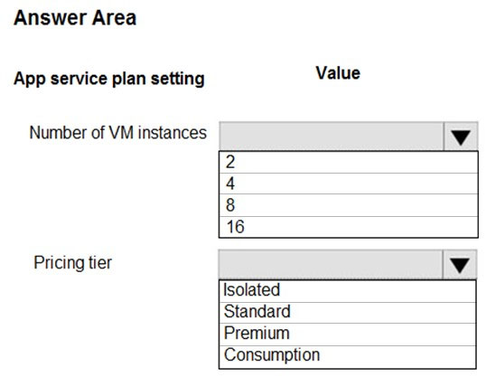

- [ ] Número de instancias de VM: 2. Nivel de precios: Aislado.
- [ ] Número de instancias de VM: 8. Nivel de precios: Estándar.
- [ ] Número de instancias de VM: 16. Nivel de precios: Premium.
- [x] Número de instancias de VM: 4. Nivel de precios: Aislado.
- [ ] Número de instancias de VM: 4. Nivel de precios: Consumo.

**[⬆ Volver arriba](#table-of-contents)**

### Eres desarrollador de una empresa de software como servicio (SaaS) que usa una Azure Function para procesar pedidos. La Azure Function actualmente se ejecuta en una Function App de Azure que se activa con una cola de Azure Storage. Te estás preparando para migrar la Azure Function a Kubernetes usando Kubernetes-based Event Driven Autoscaling (KEDA). Necesitas configurar las Definiciones de recursos personalizados (CRD) de Kubernetes para la Azure Function. ¿Qué CRD debes configurar?

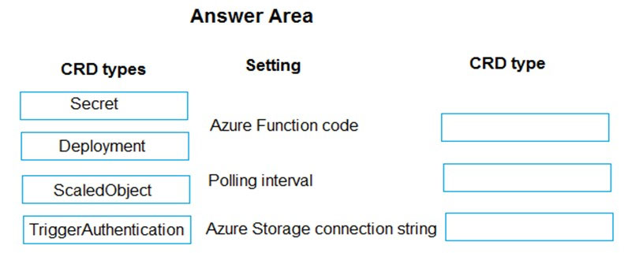

- [x] Cuadro 1, tipo de CRD: Deployment. Cuadro 2, tipo de CRD: ScaledObject. Cuadro 3, tipo de CRD: Secret.
- [ ] Cuadro 1, tipo de CRD: Secret. Cuadro 2, tipo de CRD: ScaledObject. Cuadro 3, tipo de CRD: Secret.
- [ ] Cuadro 1, tipo de CRD: TriggerAuthentication. Cuadro 2, tipo de CRD: Deployment. Cuadro 3, tipo de CRD: Secret.
- [ ] Cuadro 1, tipo de CRD: Deployment. Cuadro 2, tipo de CRD: ScaledObject. Cuadro 3, tipo de CRD: TriggerAuthentication.

**[⬆ Volver arriba](#table-of-contents)**

### Estás creando un script de CLI que crea una web app de Azure y servicios relacionados en Azure App Service. La web app usa las siguientes variables. Necesitas implementar automáticamente código desde GitHub en la web app recién creada. ¿Cómo debes completar el script?

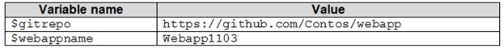
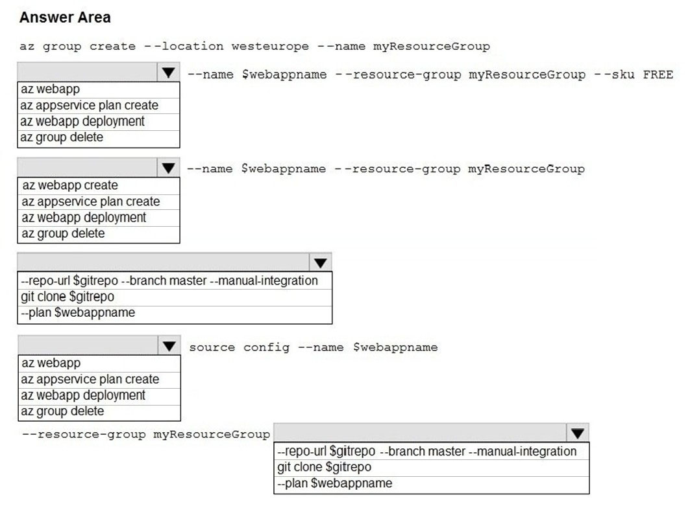

- [ ] Cuadro 1: `az webapp`. Cuadro 2: `az webapp create`. Cuadro 3: `git clone $gitrepo`. Cuadro 4: `az webapp`. Cuadro 5: `--plan $webappname`.
- [x] Cuadro 1: `az appservice plan create`. Cuadro 2: `az webapp create`. Cuadro 3: `--plan $webappname`. Cuadro 4: `az webapp deployment`. Cuadro 5: `--repo-url $gitrepo --branch master --manual-integration`.
- [ ] Cuadro 1: `az appservice plan create`. Cuadro 2: `az webapp deployment`. Cuadro 3: `--plan $webappname`. Cuadro 4: `az webapp deployment`. Cuadro 5: `--repo-url $gitrepo --branch master --manual-integration`.
- [ ] Cuadro 1: `az group delete`. Cuadro 2: `az webapp create`. Cuadro 3: `git clone $gitrepo`. Cuadro 4: `az appservice plan create`. Cuadro 5: `git clone $gitrepo`.

**[⬆ Volver arriba](#table-of-contents)**

<a id="you-develop-a-software-as-a-service-saas-offering-to-manage-photographs-users-upload-photos-to-a-web-service-which-then-stores-the-photos-in-azure-storage-blob-storage-the-storage-account-type-is-general-purpose-v2-when-photos-are-uploaded-they-must-be-processed-to-produce-and-save-a-mobile-friendly-version-of-the-image-the-process-to-produce-a-mobile-friendly-version-of-the-image-must-start-in-less-than-one-minute-you-need-to-design-the-process-that-starts-the-photo-processing-solution-trigger-the-photo-processing-from-blob-storage-events-does-the-solution-meet-the-goal"></a>
### Desarrollas una oferta de software como servicio (SaaS) para administrar fotografías. Los usuarios cargan fotos a un servicio web que luego almacena las fotos en Azure Storage Blob. El tipo de cuenta de almacenamiento es de propósito general v2. Cuando se cargan las fotos, deben procesarse para producir y guardar una versión apta para móviles de la imagen. El proceso para producir una versión apta para móviles debe iniciarse en menos de un minuto. Necesitas diseñar el proceso que inicia el procesamiento de fotos. Solución: Iniciar el procesamiento de fotos desde eventos de Blob Storage. ¿La solución cumple el objetivo?

- [ ] Sí.
- [x] No.

**[⬆ Volver arriba](#table-of-contents)**

<a id="you-develop-and-deploy-an-azure-app-service-api-app-to-a-windows-hosted-deployment-slot-named-development-you-create-additional-deployment-slots-named-testing-and-production-you-enable-auto-swap-on-the-production-deployment-slot-you-need-to-ensure-that-scripts-run-and-resources-are-available-before-a-swap-operation-occurs-solution-update-the-webconfig-file-to-include-the-applicationinitialization-configuration-element-specify-custom-initialization-actions-to-run-the-scripts-does-the-solution-meet-the-goal"></a>
### Desarrollas e implementas una app de API de Azure App Service en una ranura de implementación hospedada en Windows llamada `Development`. Creas ranuras adicionales llamadas `Testing` y `Production`. Habilitas el auto swap en la ranura `Production`. Necesitas asegurarte de que los scripts se ejecuten y los recursos estén disponibles antes de que ocurra una operación de intercambio. Solución: Actualizar el archivo `web.config` para incluir el elemento de configuración `applicationInitialization`. Especificar acciones de inicialización personalizadas para ejecutar los scripts. ¿La solución cumple el objetivo?

- [x] Sí.
- [ ] No.

**[⬆ Volver arriba](#table-of-contents)**

### Desarrollas e implementas una app de API de Azure App Service en una ranura de implementación hospedada en Windows llamada `Development`. Creas ranuras adicionales llamadas `Testing` y `Production`. Habilitas el auto swap en la ranura `Production`. Necesitas asegurarte de que los scripts se ejecuten y los recursos estén disponibles antes de que ocurra una operación de intercambio. Solución: Habilitar auto swap para la ranura `Testing`. Implementar la app en la ranura `Testing`. ¿La solución cumple el objetivo?

- [ ] Sí.
- [x] No.

**[⬆ Volver arriba](#table-of-contents)**

<a id="you-develop-and-deploy-an-azure-app-service-api-app-to-a-windows-hosted-deployment-slot-named-development-you-create-additional-deployment-slots-named-testing-and-production-you-enable-auto-swap-on-the-production-deployment-slot-you-need-to-ensure-that-scripts-run-and-resources-are-available-before-a-swap-operation-occurs-solution-disable-auto-swap-update-the-app-with-a-method-named-statuscheck-to-run-the-scripts-re-enable-auto-swap-and-deploy-the-app-to-the-production-slot-does-the-solution-meet-the-goal"></a>
### Desarrollas e implementas una app de API de Azure App Service en una ranura de implementación hospedada en Windows llamada `Development`. Creas ranuras adicionales llamadas `Testing` y `Production`. Habilitas el auto swap en la ranura `Production`. Necesitas asegurarte de que los scripts se ejecuten y los recursos estén disponibles antes de que ocurra una operación de intercambio. Solución: Deshabilitar auto swap. Actualizar la app con un método llamado `statuscheck` para ejecutar los scripts. Volver a habilitar auto swap e implementar la app en la ranura `Production`. ¿La solución cumple el objetivo?

- [ ] Sí.
- [x] No.

**[⬆ Volver arriba](#table-of-contents)**

<a id="you-develop-a-software-as-a-service-saas-offering-to-manage-photographs-users-upload-photos-to-a-web-service-which-then-stores-the-photos-in-azure-storage-blob-storage-the-storage-account-type-is-general-purpose-v2-when-photos-are-uploaded-they-must-be-processed-to-produce-and-save-a-mobile-friendly-version-of-the-image-the-process-to-produce-a-mobile-friendly-version-of-the-image-must-start-in-less-than-one-minute-you-need-to-design-the-process-that-starts-the-photo-processing-solution-convert-the-azure-storage-account-to-a-blockblobstorage-storage-account-does-the-solution-meet-the-goal"></a>
### Desarrollas una oferta de software como servicio (SaaS) para administrar fotografías. Los usuarios cargan fotos a un servicio web que luego almacena las fotos en Azure Storage Blob. El tipo de cuenta de almacenamiento es de propósito general v2. Cuando se cargan las fotos, deben procesarse para producir y guardar una versión apta para móviles de la imagen. El proceso para producir una versión apta para móviles debe iniciarse en menos de un minuto. Necesitas diseñar el proceso que inicia el procesamiento de fotos. Solución: Convertir la cuenta de Azure Storage a una cuenta de almacenamiento BlockBlobStorage. ¿La solución cumple el objetivo?

- [ ] Sí.
- [x] No.

**[⬆ Volver arriba](#table-of-contents)**

### Estás desarrollando una Azure Web App. Configuras autenticación mutua TLS para la web app. Necesitas validar el certificado de cliente en la web app.

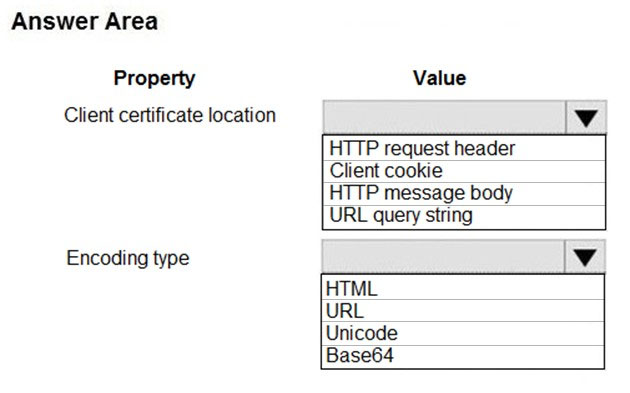

- [ ] Ubicación del certificado de cliente: Cookie del cliente. Tipo de codificación: URL.
- [ ] Ubicación del certificado de cliente: Cuerpo del mensaje HTTP. Tipo de codificación: Base64.
- [ ] Ubicación del certificado de cliente: Encabezado de solicitud HTTP. Tipo de codificación: Unicode.
- [x] Ubicación del certificado de cliente: Encabezado de solicitud HTTP. Tipo de codificación: Base64.

**[⬆ Volver arriba](#table-of-contents)**

### Estás desarrollando Docker/Go usando Azure App Service Web App for Containers. Planeas ejecutar el contenedor en un App Service en Linux. Identificas una imagen de contenedor Docker para usar. Ninguno de tus grupos de recursos actuales se encuentra en una ubicación que admita Linux. Debes minimizar el número de grupos de recursos requeridos. Necesitas crear la aplicación y realizar una implementación inicial. ¿Qué tres comandos de Azure CLI deberías usar para desarrollar la solución?

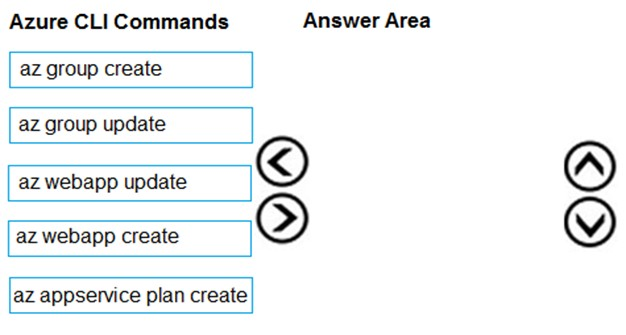

- [ ] Cuadro 1: `az webapp create`. Cuadro 2: `az appservice plan create`. Cuadro 3: `az group create`.
- [ ] Cuadro 1: `az appservice plan create`. Cuadro 2: `az group create`. Cuadro 3: `az group update`.
- [x] Cuadro 1: `az group create`. Cuadro 2: `az appservice plan create`. Cuadro 3: `az webapp create`.
- [ ] Cuadro 1: `az appservice plan create`. Cuadro 2: `az webapp create`. Cuadro 3: `az webapp update`.

**[⬆ Volver arriba](#table-of-contents)**

<a id="fourth-coffee-has-an-aspnet-core-web-app-that-runs-in-docker-the-app-is-mapped-to-the-wwwfourthcoffeecom-domain-fourth-coffee-is-migrating-this-application-to-azure-you-need-to-provision-an-app-service-web-app-to-host-this-docker-image-and-map-the-custom-domain-to-the-app-service-web-app-a-resource-group-named-fourthcoffeepublicwebresourcegroup-has-been-created-in-the-westus-region-that-contains-an-app-service-plan-named-appservicelinuxdockerplan-which-order-should-the-cli-commands-be-used-to-develop-the-solution"></a>
### Fourth Coffee tiene una web app ASP.NET Core que se ejecuta en Docker. La app está asignada al dominio `www.fourthcoffee.com`. Fourth Coffee está migrando esta aplicación a Azure. Necesitas aprovisionar una App Service Web App para hospedar esta imagen de Docker y asignar el dominio personalizado a la web app de App Service. Se ha creado un grupo de recursos llamado `FourthCoffeePublicWebResourceGroup` en la región WestUS que contiene un App Service Plan llamado `AppServiceLinuxDockerPlan`. ¿En qué orden deberían usarse los comandos de CLI para desarrollar la solución?

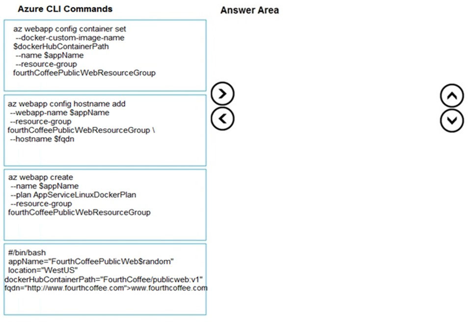

- [x] Cuadro 1: `#/bin/bash appName='FourthCoffeePublicWeb$random' location='WestUS' dockerHubContainerPath='FourthCoffee/publicweb:v1' fqdn='http://www.fourthcoffee.com'>www.fourthcoffee.com`. Cuadro 2: `az webapp create --name $appName --plan AppServiceLinuxDockerPlan --resource-group fourthCoffeePublicWebResourceGroup`. Cuadro 3: `az webapp config container set --docker-custom-image-name $dockerHubContainerPath --name $appName --resource-group fourthCoffeePublicWebResourceGroup`. Cuadro 4: `az webapp config hostname add --webapp-name $appName --resource-group fourthCoffeePublicWebResourceGroup --hostname $fqdn`.
- [ ] Cuadro 1: `#/bin/bash appName='FourthCoffeePublicWeb$random' location='WestUS' dockerHubContainerPath='FourthCoffee/publicweb:v1' fqdn='http://www.fourthcoffee.com'>www.fourthcoffee.com`. Cuadro 2: `az webapp create --name $appName --plan AppServiceLinuxDockerPlan --resource-group fourthCoffeePublicWebResourceGroup`. Cuadro 3: `az webapp config hostname add --webapp-name $appName --resource-group fourthCoffeePublicWebResourceGroup --hostname $fqdn`. Cuadro 4: `az webapp config container set --docker-custom-image-name $dockerHubContainerPath --name $appName --resource-group fourthCoffeePublicWebResourceGroup`.
- [ ] Cuadro 1: `az webapp config container set --docker-custom-image-name $dockerHubContainerPath --name $appName --resource-group fourthCoffeePublicWebResourceGroup`. Cuadro 2: `az webapp create --name $appName --plan AppServiceLinuxDockerPlan --resource-group fourthCoffeePublicWebResourceGroup`. Cuadro 3: `az webapp config hostname add --webapp-name $appName --resource-group fourthCoffeePublicWebResourceGroup --hostname $fqdn`. Cuadro 4: `#/bin/bash appName='FourthCoffeePublicWeb$random' location='WestUS' dockerHubContainerPath='FourthCoffee/publicweb:v1' fqdn='http://www.fourthcoffee.com'>www.fourthcoffee.com`.
- [ ] Cuadro 1: `az webapp config hostname add --webapp-name $appName --resource-group fourthCoffeePublicWebResourceGroup --hostname $fqdn`. Cuadro 2: `az webapp create --name $appName --plan AppServiceLinuxDockerPlan --resource-group fourthCoffeePublicWebResourceGroup`. Cuadro 3: `#/bin/bash appName='FourthCoffeePublicWeb$random' location='WestUS' dockerHubContainerPath='FourthCoffee/publicweb:v1' fqdn='http://www.fourthcoffee.com'>www.fourthcoffee.com`. Cuadro 4: `az webapp config container set --docker-custom-image-name $dockerHubContainerPath --name $appName --resource-group fourthCoffeePublicWebResourceGroup`.

**[⬆ Volver arriba](#table-of-contents)**

<a id="you-are-developing-a-serverless-java-application-on-azure-you-create-a-new-azure-key-vault-to-work-with-secrets-from-a-new-azure-functions-application-the-application-must-meet-the-following-requirements-reference-the-azure-key-vault-without-requiring-any-changes-to-the-java-code-dynamically-add-and-remove-instances-of-the-azure-functions-host-based-on-the-number-of-incoming-application-events-ensure-that-instances-are-perpetually-warm-to-avoid-any-cold-starts-connect-to-a-vnet-authentication-to-the-azure-key-vault-instance-must-be-removed-if-the-azure-function-application-is-deleted-you-need-to-grant-the-azure-functions-application-access-to-the-azure-key-vault-which-three-actions-should-you-perform-in-sequence"></a>
### Estás desarrollando una aplicación Java sin servidor en Azure. Creas un nuevo Azure Key Vault para trabajar con secretos de una nueva aplicación de Azure Functions. La aplicación debe cumplir los siguientes requisitos: Referenciar Azure Key Vault sin requerir cambios en el código Java. Agregar y quitar dinámicamente instancias del host de Azure Functions según el número de eventos de la aplicación entrantes. Asegurar que las instancias permanezcan siempre calientes para evitar arranques en frío. Conectarse a una VNet. La autenticación a la instancia de Azure Key Vault debe eliminarse si se elimina la aplicación de Azure Functions. Necesitas conceder a la aplicación de Azure Functions acceso a Azure Key Vault. ¿Qué tres acciones debes realizar en secuencia?

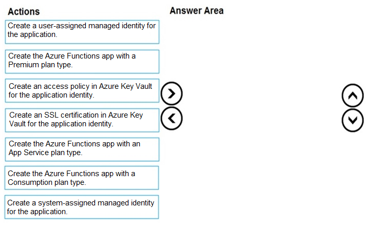

- [ ] Cuadro 1: Crear la app de Azure Functions con un plan de tipo Consumption. Cuadro 2: Crear una directiva de acceso en Azure Key Vault para la identidad de la aplicación. Cuadro 3: Crear una identidad administrada asignada por el usuario para la aplicación.
- [x] Cuadro 1: Crear la app de Azure Functions con un plan de tipo Premium. Cuadro 2: Crear una identidad administrada asignada por el sistema para la aplicación. Cuadro 3: Crear una directiva de acceso en Azure Key Vault para la identidad de la aplicación.
- [ ] Cuadro 1: Crear la app de Azure Functions con un plan de tipo Consumption. Cuadro 2: Crear una identidad administrada asignada por el usuario para la aplicación. Cuadro 3: Crear una directiva de acceso en Azure Key Vault para la identidad de la aplicación.
- [ ] Cuadro 1: Crear la app de Azure Functions con un plan de tipo Premium. Cuadro 2: Crear una identidad administrada asignada por el usuario para la aplicación. Cuadro 3: Crear una directiva de acceso en Azure Key Vault para la identidad de la aplicación.

**[⬆ Volver arriba](#table-of-contents)**

### Desarrollas un sitio web. Planeas hospedar el sitio web en Azure. Esperas que el sitio experimente altos volúmenes de tráfico después de publicarse. Debes asegurarte de que el sitio permanezca disponible y responsivo mientras minimizas el costo. Necesitas implementar el sitio web. ¿Qué debes hacer?

- [ ] Implementar el sitio web en una máquina virtual. Configurar la máquina virtual para escalar automáticamente cuando la carga de CPU sea alta.
- [ ] Implementar el sitio web en un App Service que utiliza el nivel de servicio compartido. Configurar el plan de App Service para escalar automáticamente cuando la carga de CPU sea alta.
- [ ] Implementar el sitio web en una máquina virtual. Configurar un Scale Set para aumentar el número de instancias de la máquina virtual cuando la carga de CPU sea alta.
- [x] Implementar el sitio web en un App Service que utiliza el nivel de servicio Standard. Configurar el plan de App Service para escalar automáticamente cuando la carga de CPU sea alta.

**[⬆ Volver arriba](#table-of-contents)**

### Una empresa desarrolla una web app Java. El código de la web app está alojado en un repositorio de GitHub ubicado en `https://github.com/Contoso/webapp`. La web app debe evaluarse antes de pasarse a producción. Debes implementar la versión inicial del código en una ranura de implementación llamada `staging`. Necesitas crear la web app e implementar el código. ¿Cómo debes completar los comandos?

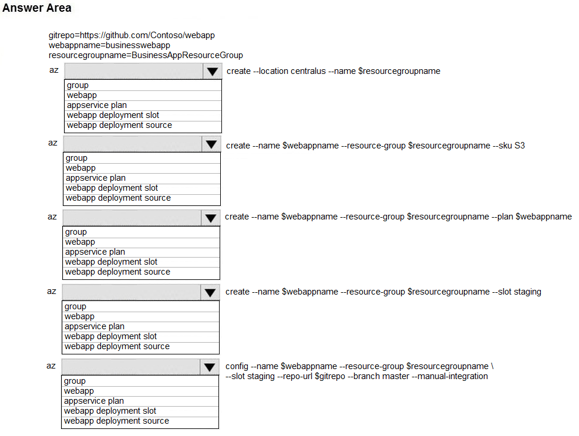

- [x] Cuadro 1: `group`. Cuadro 2: `appservice plan`. Cuadro 3: `webapp`. Cuadro 4: `webapp deployment slot`. Cuadro 5: `webapp deployment source`.
- [ ] Cuadro 1: `appservice plan`. Cuadro 2: `group`. Cuadro 3: `webapp`. Cuadro 4: `webapp deployment slot`. Cuadro 5: `webapp deployment source`.
- [ ] Cuadro 1: `webapp`. Cuadro 2: `group`. Cuadro 3: `webapp deployment source`. Cuadro 4: `webapp deployment slot`. Cuadro 5: `appservice plan`.
- [ ] Cuadro 1: `webapp`. Cuadro 2: `group`. Cuadro 3: `webapp deployment source`. Cuadro 4: `webapp deployment slot`. Cuadro 5: `appservice plan`.

**[⬆ Volver arriba](#table-of-contents)**

### Tienes un servicio web que se usa para pagar entregas de comida. El servicio web usa Azure Cosmos DB como almacén de datos. Planeas agregar una nueva función que permite a los usuarios establecer un monto de propina. La nueva función requiere que una propiedad llamada tip en el documento de Cosmos DB esté presente y contenga un valor numérico. Hay muchos sitios web y apps móviles existentes que no se actualizarán para establecer la propiedad tip por algún tiempo. ¿Cómo debes completar el disparador?

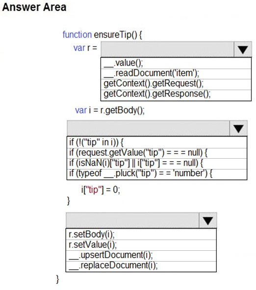

- [ ] Cuadro 1: `__value();`. Cuadro 2: `if (request.getValue('tip') === null) {`. Cuadro 3: `__.upsertDocument(i);`.
- [ ] Cuadro 1: `__readDocument()('item');`. Cuadro 2: `if (!('tip' in i)) {`. Cuadro 3: `__.replaceDocument(i);`.
- [x] Cuadro 1: `getContext().getRequest();`. Cuadro 2: `if (!('tip' in i)) {`. Cuadro 3: `r.setBody(i);`.
- [ ] Cuadro 1: `getContext().getRequest();`. Cuadro 2: `if (isNaN(i)['tip'] || i['tip'] === null) {`. Cuadro 3: `r.setValue(i);`.

**[⬆ Volver arriba](#table-of-contents)**

### Desarrollas una Azure Function app con disparador HTTP para procesar datos de blobs de Azure Storage. La app se activa usando un enlace de salida en el blob. La app sigue agotando el tiempo de espera después de cuatro minutos. La app debe procesar los datos del blob. Necesitas asegurarte de que la app no agote el tiempo de espera y procese los datos del blob. Solución: Usar el patrón asíncrono de Durable Function para procesar los datos del blob. ¿La solución cumple el objetivo?

- [x] Sí.
- [ ] No.

**[⬆ Volver arriba](#table-of-contents)**

### Desarrollas una Azure Function app con disparador HTTP para procesar datos de blobs de Azure Storage. La app se activa usando un enlace de salida en el blob. La app sigue agotando el tiempo de espera después de cuatro minutos. La app debe procesar los datos del blob. Necesitas asegurarte de que la app no agote el tiempo de espera y procese los datos del blob. Solución: Enviar el payload del disparador HTTP a una cola de Azure Service Bus para que lo procese una función con disparador de cola y devolver una respuesta HTTP de éxito inmediata. ¿La solución cumple el objetivo?

- [x] Sí.
- [ ] No.

**[⬆ Volver arriba](#table-of-contents)**

### Desarrollas una Azure Function app con disparador HTTP para procesar datos de blobs de Azure Storage. La app se activa usando un enlace de salida en el blob. La app sigue agotando el tiempo de espera después de cuatro minutos. La app debe procesar los datos del blob. Necesitas asegurarte de que la app no agote el tiempo de espera y procese los datos del blob. Solución: Configurar la app para usar un plan de hospedaje de App Service y habilitar la opción Always On. ¿La solución cumple el objetivo?

- [ ] Sí.
- [x] No.

**[⬆ Volver arriba](#table-of-contents)**

<a id="you-develop-a-software-as-a-service-saas-offering-to-manage-photographs-users-upload-photos-to-a-web-service-which-then-stores-the-photos-in-azure-storage-blob-storage-the-storage-account-type-is-general-purpose-v2-when-photos-are-uploaded-they-must-be-processed-to-produce-and-save-a-mobile-friendly-version-of-the-image-the-process-to-produce-a-mobile-friendly-version-of-the-image-must-start-in-less-than-one-minute-you-need-to-design-the-process-that-starts-the-photo-processing-solution-move-photo-processing-to-an-azure-function-triggered-from-the-blob-upload-does-the-solution-meet-the-goal"></a>
### Desarrollas una oferta de software como servicio (SaaS) para administrar fotografías. Los usuarios cargan fotos a un servicio web que luego almacena las fotos en Azure Storage Blob. El tipo de cuenta de almacenamiento es de propósito general v2. Cuando se cargan las fotos, deben procesarse para producir y guardar una versión apta para móviles de la imagen. El proceso para producir una versión apta para móviles debe iniciarse en menos de un minuto. Necesitas diseñar el proceso que inicia el procesamiento de fotos. Solución: Mover el procesamiento de fotos a una Azure Function desencadenada por la carga del blob. ¿La solución cumple el objetivo?

- [x] Sí.
- [ ] No.

**[⬆ Volver arriba](#table-of-contents)**

### Estás desarrollando una aplicación que usa Azure Blob Storage. La aplicación debe leer los registros de transacciones de todos los cambios que ocurren en los blobs y en los metadatos de blobs en la cuenta de almacenamiento con fines de auditoría. Los cambios deben estar en el orden en que ocurrieron, incluir solo operaciones de crear, actualizar, eliminar y copiar, y conservarse por razones de cumplimiento. Necesitas procesar los registros de transacciones de forma asíncrona. ¿Qué debes hacer?

- [ ] Procesar todos los eventos de Azure Blob Storage usando Azure Event Grid con una suscripción de Azure Function App.
- [x] Habilitar el feed de cambios en la cuenta de almacenamiento y procesar todos los cambios de los eventos disponibles.
- [ ] Procesar todos los registros de Azure Storage Analytics para eventos de blobs exitosos.
- [ ] Usar la API de Azure Monitor HTTP Data Collector y analizar el cuerpo de la solicitud para eventos de blobs exitosos.

**[⬆ Volver arriba](#table-of-contents)**

<a id="you-plan-to-create-a-docker-image-that-runs-an-aspnet-core-application-named-contosoapp-you-have-a-setup-script-named-setupscriptps1-and-a-series-of-application-files-including-contosoappdll-you-need-to-create-a-dockerfile-document-that-meets-the-following-requirements-call-setupscriptsps1-when-the-container-is-built-run-contosoappdll-when-the-container-starts-the-dockerfile-document-must-be-created-in-the-same-folder-where-contosoappdll-and-setupscriptps1-are-stored-which-five-commands-should-you-use-to-develop-the-solution"></a>
### Planeas crear una imagen Docker que ejecuta una aplicación ASP.NET Core llamada `ContosoApp`. Tienes un script de configuración llamado `setupScript.ps1` y una serie de archivos de aplicación que incluyen `ContosoApp.dll`. Necesitas crear un documento Dockerfile que cumpla los siguientes requisitos: Ejecutar setupScript.ps1 cuando se crea el contenedor. Ejecutar `ContosoApp.dll` cuando se inicia el contenedor. El documento Dockerfile debe crearse en la misma carpeta donde se almacenan `ContosoApp.dll` y `setupScript.ps1`. ¿Qué cinco comandos debes usar para desarrollar la solución?

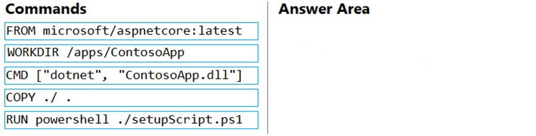

- [ ] Cuadro 1: `CMD ['dotnet', 'ContosoApp.dll']`. Cuadro 2: `FROM microsoft/aspnetcore:latest`. Cuadro 3: `RUN powershell ./setupScript.ps1`. Cuadro 4: `WORKDIR /apps/ContosoApp`. Cuadro 5: `COPY ./ .`.
- [ ] Cuadro 1: `COPY ./ .`. Cuadro 2: `RUN powershell ./setupScript.ps1`. Cuadro 3: `FROM microsoft/aspnetcore:latest`. Cuadro 4: `CMD ['dotnet', 'ContosoApp.dll']`. Cuadro 5: `WORKDIR /apps/ContosoApp`.
- [ ] Cuadro 1: `RUN powershell ./setupScript.ps1`. Cuadro 2: `CMD ['dotnet', 'ContosoApp.dll']`. Cuadro 3: `FROM microsoft/aspnetcore:latest`. Cuadro 4: `WORKDIR /apps/ContosoApp`. Cuadro 5: `COPY ./ .`.
- [x] Cuadro 1: `FROM microsoft/aspnetcore:latest`. Cuadro 2: `WORKDIR /apps/ContosoApp`. Cuadro 3: `COPY ./ .`. Cuadro 4: `RUN powershell ./setupScript.ps1`. Cuadro 5: `CMD ['dotnet', 'ContosoApp.dll']`.

**[⬆ Volver arriba](#table-of-contents)**

### Estás desarrollando una Azure Function App que procesa imágenes que se cargan en un contenedor de Azure Blob. Las imágenes deben procesarse lo más rápido posible después de cargarse y la solución debe minimizar la latencia. Creas código para procesar imágenes cuando se activa la Function App. Necesitas configurar la Function App. ¿Qué debes hacer?

- [ ] Usar un plan de App Service. Configure la Function App para usar un disparador de entrada de Azure Blob Storage.
- [ ] Usar un plan de consumo. Configure la Function App para usar un disparador de Azure Blob Storage.
- [ ] Usar un plan de consumo. Configurar la Function App para usar un disparador de temporizador.
- [x] Usar un plan de App Service. Configure la Function App para usar un disparador de Azure Blob Storage.
- [ ] Usar un plan de consumo. Configure la Function App para usar un disparador de entrada de Azure Blob Storage.

**[⬆ Volver arriba](#table-of-contents)**

### Estás configurando un nuevo entorno de desarrollo para una aplicación Java. El entorno requiere un Virtual Machine Scale Set (VMSS), varias cuentas de almacenamiento y componentes de red. El VMSS no debe crearse hasta que las cuentas de almacenamiento se hayan creado correctamente y se haya configurado un balanceador de carga y una red virtual asociada. ¿Cómo debes completar la plantilla de Azure Resource Manager?

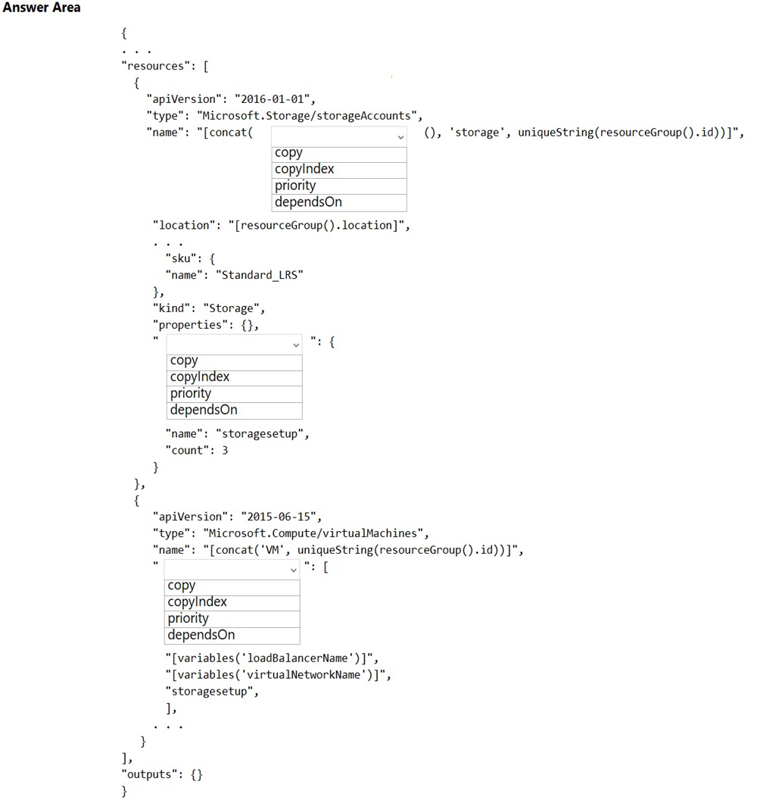

- [x] Cuadro 1: `copyIndex`. Cuadro 2: `copy`. Cuadro 3: `dependsOn`.
- [ ] Cuadro 1: `copy`. Cuadro 2: `copyIndex`. Cuadro 3: `dependsOn`.
- [ ] Cuadro 1: `priority`. Cuadro 2: `dependsOn`. Cuadro 3: `copyIndex`.
- [ ] Cuadro 1: `priority`. Cuadro 2: `copyIndex`. Cuadro 3: `dependsOn`.

**[⬆ Volver arriba](#table-of-contents)**

### Estás desarrollando una Azure Function App usando Visual Studio. La app procesará pedidos ingresados por una Azure Web App. La web app coloca la información de los pedidos en Azure Queue Storage. Necesitas revisar el código de la Azure Function App que se muestra abajo. Pregunta 1: El código registrará la hora en que el pedido se procesó desde la cola.

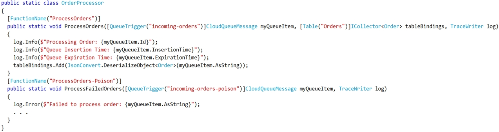

- [ ] Sí.
- [x] No.

**[⬆ Volver arriba](#table-of-contents)**

### Estás desarrollando una Azure Function App usando Visual Studio. La app procesará pedidos ingresados por una Azure Web App. La web app coloca la información de los pedidos en Azure Queue Storage. Necesitas revisar el código de la Azure Function App que se muestra abajo. Pregunta 2: Cuando falla la función ProcessOrders, la función reintentará hasta cinco veces para un pedido dado, incluido el primer intento.

- [x] Sí.
- [ ] No.

**[⬆ Volver arriba](#table-of-contents)**

### Estás desarrollando una Azure Function App usando Visual Studio. La app procesará pedidos ingresados por una Azure Web App. La web app coloca la información de los pedidos en Azure Queue Storage. Necesitas revisar el código de la Azure Function App que se muestra abajo. Pregunta 3: Cuando hay varios pedidos en la cola, se recibirá un lote de pedidos desde la cola y la función ProcessOrders ejecutará varias instancias de forma concurrente para procesar los pedidos.

- [x] Sí.
- [ ] No.

**[⬆ Volver arriba](#table-of-contents)**

### Estás desarrollando una Azure Function App usando Visual Studio. La app procesará pedidos ingresados por una Azure Web App. La web app coloca la información de los pedidos en Azure Queue Storage. Necesitas revisar el código de la Azure Function App que se muestra abajo. Pregunta 4: La función ProcessOrders enviará el pedido a una tabla Orders en Azure Table Storage.

- [x] Sí.
- [ ] No.

**[⬆ Volver arriba](#table-of-contents)**

<a id="you-are-developing-a-solution-for-a-hospital-to-support-the-following-use-cases-the-most-recent-patient-status-details-must-be-retrieved-even-if-multiple-users-in-different-locations-have-updated-the-patient-record-patient-health-monitoring-data-retrieved-must-be-the-current-version-or-the-prior-version-after-a-patient-is-discharged-and-all-charges-have-been-assessed-the-patient-billing-record-contains-the-final-charges-you-provision-a-cosmos-db-nosql-database-and-set-the-default-consistency-level-for-the-database-account-to-strong-you-set-the-value-for-indexing-mode-to-consistent-you-need-to-minimize-latency-and-any-impact-to-the-availability-of-the-solution-you-must-override-the-default-consistency-level-at-the-query-level-to-meet-the-required-consistency-guarantees-for-the-scenarios-which-consistency-levels-should-you-implement"></a>
### Estás desarrollando una solución para un hospital para admitir los siguientes casos de uso: Los detalles más recientes del estado del paciente deben recuperarse incluso si varios usuarios en diferentes ubicaciones han actualizado el registro del paciente. Los datos de monitoreo de salud del paciente recuperados deben ser la versión actual o la versión anterior. Después de que un paciente es dado de alta y se han evaluado todos los cargos, el registro de facturación del paciente contiene los cargos finales. Aprovisionas una base de datos NoSQL de Cosmos DB y estableces el nivel de consistencia predeterminado de la cuenta de base de datos en Strong. Estableces el valor de Indexing Mode en Consistent. Necesitas minimizar la latencia y cualquier impacto en la disponibilidad de la solución. Debes invalidar el nivel de consistencia predeterminado en el nivel de consulta para cumplir las garantías de consistencia requeridas para los escenarios. ¿Qué niveles de consistencia debes implementar?

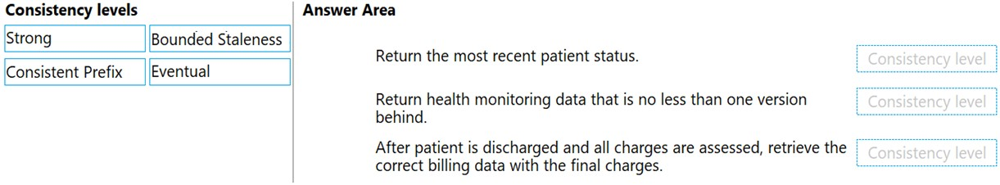

- [ ] Cuadro 1: Strong. Cuadro 2: Consistent Prefix. Cuadro 3: Eventual.
- [ ] Cuadro 1: Eventual. Cuadro 2: Strong. Cuadro 3: Bounded Staleness.
- [ ] Cuadro 1: Consistent Prefix. Cuadro 2: Bounded Staleness. Cuadro 3: Eventual.
- [x] Cuadro 1: Strong. Cuadro 2: Bounded Staleness. Cuadro 3: Eventual.

**[⬆ Volver arriba](#table-of-contents)**

<a id="you-are-configuring-a-development-environment-for-your-team-you-deploy-the-latest-visual-studio-image-from-the-azure-marketplace-to-your-azure-subscription-the-development-environment-requires-several-software-development-kits-sdks-and-third-party-components-to-support-application-development-across-the-organization-you-install-and-customize-the-deployed-virtual-machine-vm-for-your-development-team-the-customized-vm-must-be-saved-to-allow-provisioning-of-a-new-team-member-development-environment-you-need-to-save-the-customized-vm-for-future-provisioning-which-tools-or-services-should-you-use"></a>
### Estás configurando un entorno de desarrollo para tu equipo. Implementas la imagen más reciente de Visual Studio desde Azure Marketplace en tu suscripción de Azure. El entorno de desarrollo requiere varios kits de desarrollo de software (SDK) y componentes de terceros para admitir el desarrollo de aplicaciones en toda la organización. Instalas y personalizas la máquina virtual (VM) implementada para tu equipo de desarrollo. La VM personalizada debe guardarse para permitir el aprovisionamiento del entorno de desarrollo de un nuevo miembro del equipo. Necesitas guardar la VM personalizada para futuros aprovisionamientos. ¿Qué herramientas o servicios debes usar?

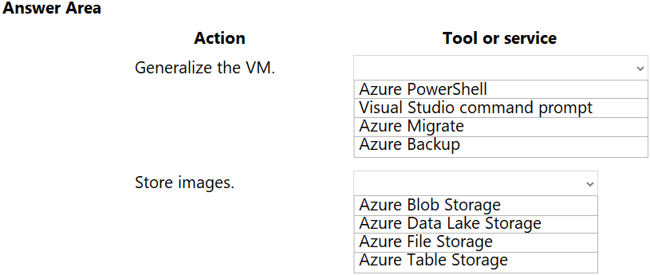

- [ ] Generalizar la VM: símbolo del sistema de Visual Studio. Almacenar imágenes: Azure Data Lake Storage.
- [x] Generalizar la VM: Azure PowerShell. Almacenar imágenes: Azure Blob Storage.
- [ ] Generalizar la VM: símbolo del sistema de Visual Studio. Almacenar imágenes: Azure File Storage.
- [ ] Generalizar la máquina virtual: Azure PowerShell. Almacenar imágenes: Azure File Storage.

**[⬆ Volver arriba](#table-of-contents)**

### Estás preparando la implementación de un sitio web en una Azure Web App desde un repositorio de GitHub. El sitio web incluye contenido estático generado por un script. Planeas usar la característica de implementación continua de Azure Web App. Necesitas ejecutar el script de generación de contenido estático antes de que el sitio web empiece a servir tráfico. ¿Cuáles son dos posibles formas de lograrlo?

- [ ] Agregar la ruta a la herramienta de generación de contenido estático a la configuración `WEBSITE_RUN_FROM_PACKAGE` en el archivo `host.json`.
- [x] Agregar un destino `PreBuild` en el archivo de proyecto `csproj` del sitio web que ejecute el script de generación de contenido estático.
- [ ] Crear un archivo llamado `run.cmd` en la carpeta `/run` que invoque un script que genere el contenido estático e implemente el sitio web.
- [x] Crear un archivo llamado `.deployment` en la raíz del repositorio que invoque un script que genere el contenido estático e implemente el sitio web.

**[⬆ Volver arriba](#table-of-contents)**

### Estás desarrollando una aplicación para usar Azure Blob Storage. Has configurado Azure Blob Storage para incluir change feeds. Debe crearse una copia de tu cuenta de almacenamiento en otra región. Los datos deben copiarse de la cuenta de almacenamiento actual a la nueva cuenta de almacenamiento directamente entre los servidores de almacenamiento. Necesitas crear una copia de la cuenta de almacenamiento en otra región y copiar los datos. ¿En qué orden debes realizar las acciones?

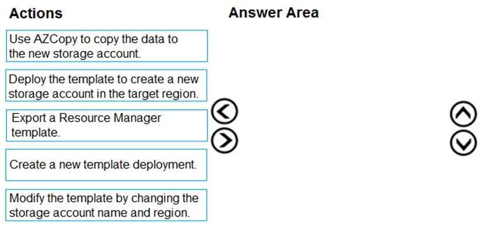

- [ ] Cuadro 1: Crear una nueva implementación de plantilla. Cuadro 2: Exportar una plantilla de Resource Manager. Cuadro 3: Modificar la plantilla cambiando el nombre de la cuenta de almacenamiento y la región. Cuadro 4: Implementar la plantilla para crear una nueva cuenta de almacenamiento en la región de destino. Cuadro 5: Usar `AZCopy` para copiar los datos a la nueva cuenta de almacenamiento.
- [ ] Cuadro 1: Usar `AZCopy` para copiar los datos a la nueva cuenta de almacenamiento. Cuadro 2: Crear una nueva implementación de plantilla. Cuadro 3: Modificar la plantilla cambiando el nombre de la cuenta de almacenamiento y la región. Cuadro 4: Implementar la plantilla para crear una nueva cuenta de almacenamiento en la región de destino. Cuadro 5: Exportar una plantilla de Resource Manager.
- [x] Cuadro 1: Exportar una plantilla de Resource Manager. Cuadro 2: Crear una nueva implementación de plantilla. Cuadro 3: Modificar la plantilla cambiando el nombre de la cuenta de almacenamiento y la región. Cuadro 4: Implementar la plantilla para crear una nueva cuenta de almacenamiento en la región de destino. Cuadro 5: Usar `AZCopy` para copiar los datos a la nueva cuenta de almacenamiento.
- [ ] Cuadro 1: Usar `AZCopy` para copiar los datos a la nueva cuenta de almacenamiento. Cuadro 2: Crear una nueva implementación de plantilla. Cuadro 3: Modificar la plantilla cambiando el nombre de la cuenta de almacenamiento y la región. Cuadro 4: Implementar la plantilla para crear una nueva cuenta de almacenamiento en la región de destino. Cuadro 5: Exportar una plantilla de Resource Manager.

**[⬆ Volver arriba](#table-of-contents)**

### Estás preparando la implementación de una aplicación basada en máquinas virtuales (VM) de Azure. Las VM que ejecutan la aplicación tienen los siguientes requisitos: Cuando se aprovisiona una VM, el firewall debe configurarse automáticamente antes de que pueda acceder a recursos de Azure. Los servicios de soporte deben instalarse usando un script de Azure PowerShell que está almacenado en Azure Storage. Necesitas asegurarte de que se cumplan los requisitos. ¿Qué características debes usar?

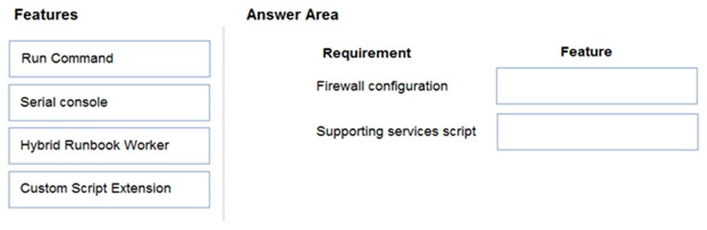

- [ ] Configuración del firewall: Run Command. Script de servicios de soporte: Hybrid Runbook Worker.
- [ ] Configuración del firewall: Custom Script Extension. Script de servicios de soporte: Serial console.
- [x] Configuración del firewall: Run Command. Script de servicios de soporte: Custom Script Extension.
- [ ] Configuración del firewall: Hybrid Runbook Worker. Script de servicios de soporte: Custom Script Extension.

**[⬆ Volver arriba](#table-of-contents)**

### Una empresa está desarrollando una web app Node.js. El código de la web app está alojado en un repositorio de GitHub ubicado en `https://github.com/TailSpinToys/webapp`. La web app debe revisarse antes de pasar a producción. Debes implementar la versión inicial del código en una ranura de implementación llamada `review`. Necesitas crear la web app e implementar el código. ¿Cómo debes completar los comandos?

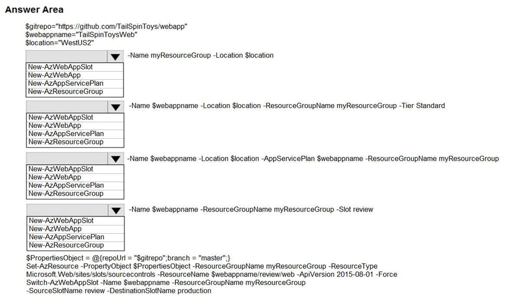

- [ ] Cuadro 1: `New-AzWebAppSlot`. Cuadro 2: `New-AzWebApp`. Cuadro 3: `New-AzAppServicePlan`. Cuadro 4: `New-AzResourceGroup`.
- [x] Cuadro 1: `New-AzResourceGroup`. Cuadro 2: `New-AzAppServicePlan`. Cuadro 3: `New-AzWebApp`. Cuadro 4: `New-AzWebAppSlot`.
- [ ] Cuadro 1: `New-AzWebAppSlot`. Cuadro 2: `New-AzAppServicePlan`. Cuadro 3: `New-AzWebApp`. Cuadro 4: `New-AzResourceGroup`.
- [ ] Cuadro 1: `New-AzResourceGroup`. Cuadro 2: `New-AzAppServicePlan`. Cuadro 3: `New-AzWebAppSlot`. Cuadro 4: `New-AzWebApp`.

**[⬆ Volver arriba](#table-of-contents)**

### Estás desarrollando una aplicación que necesita acceso a una máquina virtual (VM) de Azure. El ciclo de vida de acceso de la aplicación debe estar asociado con la instancia del servicio de la VM. Necesitas habilitar la identidad administrada para la VM. ¿Cómo debes completar el segmento de PowerShell?

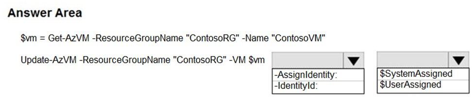

- [ ] Cuadro 1: `-AssignIdentity:`. Cuadro 2: `$SystemAssigned`.
- [ ] Cuadro 1: `-AssignIdentity:`. Cuadro 2: `$UserAssigned`.
- [x] Cuadro 1: `-IdentityId:` (nota: la captura tiene un error, debería ser `-IdentityType:` en la lista desplegable). Cuadro 2: `$SystemAssigned`.
- [ ] Cuadro 1: `-IdentityId:` (nota: la captura tiene un error, debería ser `-IdentityType:` en la lista desplegable). Cuadro 2: `$UserAssigned`.

**[⬆ Volver arriba](#table-of-contents)**

<a id="you-develop-a-software-as-a-service-saas-offering-to-manage-photographs-users-upload-photos-to-a-web-service-which-then-stores-the-photos-in-azure-storage-blob-storage-the-storage-account-type-is-general-purpose-v2-when-photos-are-uploaded-they-must-be-processed-to-produce-and-save-a-mobile-friendly-version-of-the-image-the-process-to-produce-a-mobile-friendly-version-of-the-image-must-start-in-less-than-one-minute-you-need-to-design-the-process-that-starts-the-photo-processing-solution-create-an-azure-function-app-that-uses-the-consumption-hosting-model-and-that-is-triggered-from-the-blob-upload-does-the-solution-meet-the-goal"></a>
### Desarrollas una oferta de software como servicio (SaaS) para administrar fotografías. Los usuarios cargan fotos a un servicio web que luego almacena las fotos en Azure Storage Blob. El tipo de cuenta de almacenamiento es de propósito general v2. Cuando se cargan las fotos, deben procesarse para producir y guardar una versión apta para móviles de la imagen. El proceso para producir una versión apta para móviles de la imagen debe iniciarse en menos de un minuto. Necesitas diseñar el proceso que inicia el procesamiento de fotos. Solución: Crear una Azure Function app que use el modelo de hospedaje Consumption y que se active con la carga del blob. ¿La solución cumple el objetivo?

- [ ] Sí.
- [x] No.

**[⬆ Volver arriba](#table-of-contents)**

<a id="you-develop-and-deploy-an-azure-app-service-api-app-to-a-windows-hosted-deployment-slot-named-development-you-create-additional-deployment-slots-named-testing-and-production-you-enable-auto-swap-on-the-production-deployment-slot-you-need-to-ensure-that-scripts-run-and-resources-are-available-before-a-swap-operation-occurs-solution-update-the-app-with-a-method-named-statuscheck-to-run-the-scripts-update-the-app-settings-for-the-app-set-the-website_swap_warmup_ping_path-and-website_swap_warmup_ping_statuses-with-a-path-to-the-new-method-and-appropriate-response-codes-does-the-solution-meet-the-goal"></a>
### Desarrollas e implementas una app de API de Azure App Service en una ranura de implementación hospedada en Windows llamada `Development`. Creas ranuras adicionales llamadas `Testing` y `Production`. Habilitas el auto swap en la ranura de implementación `Production`. Necesitas asegurarte de que los scripts se ejecuten y los recursos estén disponibles antes de que ocurra una operación de intercambio. Solución: Actualizar la app con un método llamado `statuscheck` para ejecutar los scripts. Actualizar la configuración de la app. Establecer `WEBSITE_SWAP_WARMUP_PING_PATH` y `WEBSITE_SWAP_WARMUP_PING_STATUSES` con una ruta al nuevo método y códigos de respuesta apropiados. ¿La solución cumple el objetivo?

- [x] Sí.
- [ ] No.

**[⬆ Volver arriba](#table-of-contents)**

### Creas el siguiente script de PowerShell. Pregunta 1: Se crea una alerta de registro que envía un correo cuando el porcentaje de CPU supera el 60 por ciento durante cinco minutos.

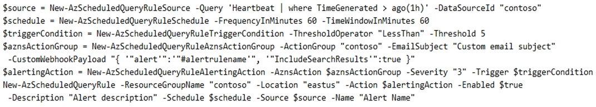

- [ ] Sí.
- [x] No.

**[⬆ Volver arriba](#table-of-contents)**

### Creas el siguiente script de PowerShell. Pregunta 2: Se crea una alerta de registro que envía un correo cuando el número de latidos de máquina en la última hora es menor que cinco.

- [x] Sí.
- [ ] No.

**[⬆ Volver arriba](#table-of-contents)**

### Creas el siguiente script de PowerShell. Pregunta 3: La alerta de registro está programada para ejecutarse cada dos horas.

- [ ] Sí.
- [x] No.

**[⬆ Volver arriba](#table-of-contents)**

### Estás desarrollando una Azure Function app. La app debe cumplir los siguientes requisitos: Permitir que los desarrolladores escriban las funciones usando el lenguaje Rust. Conectarse de forma declarativa a una cuenta de Azure Blob Storage. Necesitas implementar la app. ¿Qué características de la Azure Function app debes usar?

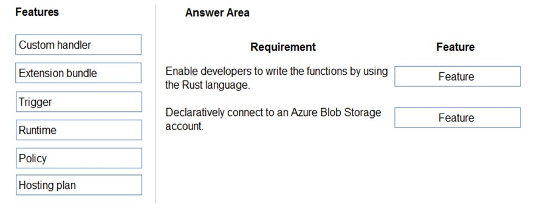

- [ ] Permitir que los desarrolladores escriban las funciones usando el lenguaje Rust: Plan de hospedaje. Conectarse de forma declarativa a una cuenta de Azure Blog Storage: Custom handler.
- [ ] Permitir que los desarrolladores escriban las funciones usando el lenguaje Rust: Runtime. Conectarse de forma declarativa a una cuenta de Azure Blog Storage: Policy.
- [ ] Permitir que los desarrolladores escriban las funciones usando el lenguaje Rust: Custom handler. Conectarse de forma declarativa a una cuenta de Azure Blog Storage: Trigger.
- [x] Permitir que los desarrolladores escriban las funciones usando el lenguaje Rust: Custom handler. Conectarse de forma declarativa a una cuenta de Azure Blog Storage: Extension bundle.

**[⬆ Volver arriba](#table-of-contents)**

### Estás desarrollando una aplicación web ASP.NET Core. Planeas implementar la aplicación en Azure Web App for Containers. La aplicación necesita almacenar datos de diagnóstico en tiempo de ejecución que deben persistirse entre reinicios de la aplicación. Tienes el siguiente código. Necesitas configurar la configuración de la aplicación para que los datos de diagnóstico se almacenen según lo requerido. ¿Cómo debes configurar la configuración de la web app?

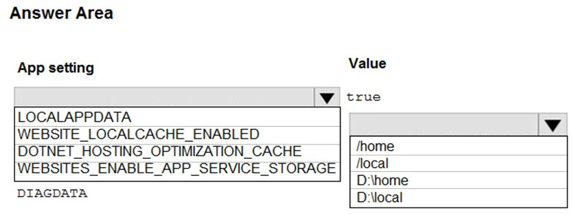

- [x] Configuración de la app: `WEBSITES_ENABLE_APP_SERVICE_STORAGE`. Valor: `/home`.
- [ ] Configuración de la app: `WEBSITES_ENABLE_APP_SERVICE_STORAGE`. Valor: `/local`.
- [ ] Configuración de la app: `LOCALAPPDATA`. Valor: `D:\home`.
- [ ] Configuración de la app: `DOTNET_HOSTING_OPTIMIZATION_CACHE`. Valor: `D:\home`.

**[⬆ Volver arriba](#table-of-contents)**

### Estás desarrollando una web app que está protegida por Azure Web Application Firewall (WAF). Todo el tráfico hacia la web app se enruta a través de una instancia de Azure Application Gateway que se usa por varias web apps. La dirección de la web app es `contoso.azurewebsites.net`. Todo el tráfico debe estar protegido con SSL. La instancia de Azure Application Gateway se usa por varias web apps. Necesitas configurar Azure Application Gateway para la web app. ¿Qué dos acciones debes realizar?

- [x] En la configuración HTTP de Azure Application Gateway, active la opción Usar para servicio de aplicaciones.
- [ ] Convierta la aplicación web para que se ejecute en un entorno de App Service de Azure (ASE).
- [ ] Agregar un certificado de autenticación para `contoso.azurewebsites.net` al Azure Application Gateway.
- [x] En la configuración HTTP de Azure Application Gateway, establecer el valor de la opción `Override` backend path en `contoso22.azurewebsites.net`.

**[⬆ Volver arriba](#table-of-contents)**

<a id="you-develop-a-software-as-a-service-saas-offering-to-manage-photographs-users-upload-photos-to-a-web-service-which-then-stores-the-photos-in-azure-storage-blob-storage-the-storage-account-type-is-general-purpose-v2-when-photos-are-uploaded-they-must-be-processed-to-produce-and-save-a-mobile-friendly-version-of-the-image-the-process-to-produce-a-mobile-friendly-version-of-the-image-must-start-in-less-than-one-minute-you-need-to-design-the-process-that-starts-the-photo-processing-solution-use-the-azure-blob-storage-change-feed-to-trigger-photo-processing-does-the-solution-meet-the-goal"></a>
### Desarrollas una oferta de software como servicio (SaaS) para administrar fotografías. Los usuarios cargan fotos a un servicio web que luego almacena las fotos en Azure Storage Blob. El tipo de cuenta de almacenamiento es de propósito general v2. Cuando se cargan las fotos, deben procesarse para producir y guardar una versión apta para móviles de la imagen. El proceso para producir una versión apta para móviles de la imagen debe iniciarse en menos de un minuto. Necesitas diseñar el proceso que inicia el procesamiento de fotos. Solución: Usar el change feed de Azure Blob Storage para activar el procesamiento de fotos. ¿La solución cumple el objetivo?

- [ ] Sí.
- [x] No.

**[⬆ Volver arriba](#table-of-contents)**

<a id="a-company-develops-a-series-of-mobile-games-all-games-use-a-single-leaderboard-service-you-have-the-following-requirements-code-must-be-scalable-and-allow-for-growth-each-record-must-consist-of-a-playerid-gameid-score-and-time-played-when-users-reach-a-new-high-score-the-system-will-save-the-new-score-using-the-savescore-function-below-each-game-is-assigned-an-id-based-on-the-series-title-you-plan-to-store-customer-information-in-azure-cosmos-db-the-following-data-already-exists-in-the-database-you-develop-the-following-code-to-save-scores-in-the-data-store-line-numbers-are-included-for-reference-only-you-develop-the-following-code-to-query-the-database-line-numbers-are-included-for-reference-only-question-1-savescore-will-work-with-cosmos-db"></a>
### Una empresa desarrolla una serie de juegos móviles. Todos los juegos usan un único servicio de tabla de clasificación. Tienes los siguientes requisitos: El código debe ser escalable y permitir el crecimiento. Cada registro debe constar de playerId, gameId, score y time played. Cuando los usuarios alcanzan un nuevo puntaje máximo, el sistema guardará el nuevo puntaje usando la función SaveScore que se muestra a continuación. A cada juego se le asigna un Id basado en el título de la serie. Planeas almacenar la información de clientes en Azure Cosmos DB. Los siguientes datos ya existen en la base de datos: Desarrollas el siguiente código para guardar puntuaciones en el almacén de datos. (Los números de línea se incluyen solo como referencia). Desarrollas el siguiente código para consultar la base de datos. (Los números de línea se incluyen solo como referencia). Pregunta 1: SaveScore funcionará con Cosmos DB.

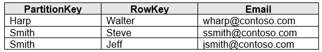
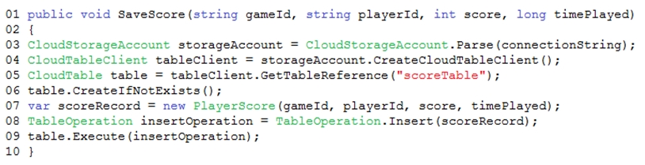
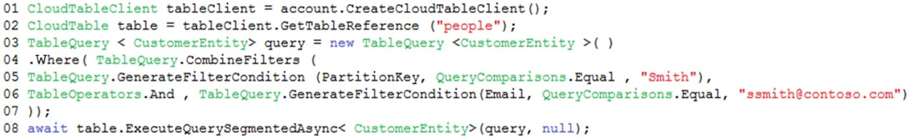

- [x] Sí.
- [ ] No.

**[⬆ Volver arriba](#table-of-contents)**

<a id="a-company-develops-a-series-of-mobile-games-all-games-use-a-single-leaderboard-service-you-have-the-following-requirements-code-must-be-scalable-and-allow-for-growth-each-record-must-consist-of-a-playerid-gameid-score-and-time-played-when-users-reach-a-new-high-score-the-system-will-save-the-new-score-using-the-savescore-function-below-each-game-is-assigned-an-id-based-on-the-series-title-you-plan-to-store-customer-information-in-azure-cosmos-db-the-following-data-already-exists-in-the-database-you-develop-the-following-code-to-save-scores-in-the-data-store-line-numbers-are-included-for-reference-only-you-develop-the-following-code-to-query-the-database-line-numbers-are-included-for-reference-only-question-2-savescore-will-update-and-replace-a-record-if-one-already-exists-with-the-same-playerid-and-gameid"></a>
### Una empresa desarrolla una serie de juegos móviles. Todos los juegos usan un único servicio de tabla de clasificación. Tienes los siguientes requisitos: El código debe ser escalable y permitir el crecimiento. Cada registro debe constar de playerId, gameId, score y time played. Cuando los usuarios alcanzan un nuevo puntaje máximo, el sistema guardará el nuevo puntaje usando la función SaveScore que se muestra a continuación. A cada juego se le asigna un Id basado en el título de la serie. Planeas almacenar la información de clientes en Azure Cosmos DB. Los siguientes datos ya existen en la base de datos: Desarrollas el siguiente código para guardar puntuaciones en el almacén de datos. (Los números de línea se incluyen solo como referencia). Desarrollas el siguiente código para consultar la base de datos. (Los números de línea se incluyen solo como referencia). Pregunta 2: SaveScore actualizará y reemplazará un registro si ya existe uno con el mismo playerId y gameId.

- [ ] Sí.
- [x] No.

**[⬆ Volver arriba](#table-of-contents)**

<a id="a-company-develops-a-series-of-mobile-games-all-games-use-a-single-leaderboard-service-you-have-the-following-requirements-code-must-be-scalable-and-allow-for-growth-each-record-must-consist-of-a-playerid-gameid-score-and-time-played-when-users-reach-a-new-high-score-the-system-will-save-the-new-score-using-the-savescore-function-below-each-game-is-assigned-an-id-based-on-the-series-title-you-plan-to-store-customer-information-in-azure-cosmos-db-the-following-data-already-exists-in-the-database-you-develop-the-following-code-to-save-scores-in-the-data-store-line-numbers-are-included-for-reference-only-you-develop-the-following-code-to-query-the-database-line-numbers-are-included-for-reference-only-question-3-leader-board-data-for-the-game-will-be-automatically-partitioned-using-gameid"></a>
### Una empresa desarrolla una serie de juegos móviles. Todos los juegos usan un único servicio de tabla de clasificación. Tienes los siguientes requisitos: El código debe ser escalable y permitir el crecimiento. Cada registro debe constar de playerId, gameId, score y time played. Cuando los usuarios alcanzan un nuevo puntaje máximo, el sistema guardará el nuevo puntaje usando la función SaveScore que se muestra a continuación. A cada juego se le asigna un Id basado en el título de la serie. Planeas almacenar la información de clientes en Azure Cosmos DB. Los siguientes datos ya existen en la base de datos: Desarrollas el siguiente código para guardar puntuaciones en el almacén de datos. (Los números de línea se incluyen solo como referencia). Desarrollas el siguiente código para consultar la base de datos. (Los números de línea se incluyen solo como referencia). Pregunta 3: Los datos de la tabla de clasificación del juego se particionarán automáticamente usando gameId.

- [ ] Sí.
- [x] No.

**[⬆ Volver arriba](#table-of-contents)**

<a id="a-company-develops-a-series-of-mobile-games-all-games-use-a-single-leaderboard-service-you-have-the-following-requirements-code-must-be-scalable-and-allow-for-growth-each-record-must-consist-of-a-playerid-gameid-score-and-time-played-when-users-reach-a-new-high-score-the-system-will-save-the-new-score-using-the-savescore-function-below-each-game-is-assigned-an-id-based-on-the-series-title-you-plan-to-store-customer-information-in-azure-cosmos-db-the-following-data-already-exists-in-the-database-you-develop-the-following-code-to-save-scores-in-the-data-store-line-numbers-are-included-for-reference-only-you-develop-the-following-code-to-query-the-database-line-numbers-are-included-for-reference-only-question-4-savescore-will-store-the-values-for-the-gameid-and-playerid-parameters-in-the-database"></a>
### Una empresa desarrolla una serie de juegos móviles. Todos los juegos usan un único servicio de tabla de clasificación. Tienes los siguientes requisitos: El código debe ser escalable y permitir el crecimiento. Cada registro debe constar de playerId, gameId, score y time played. Cuando los usuarios alcanzan un nuevo puntaje máximo, el sistema guardará el nuevo puntaje usando la función SaveScore que se muestra a continuación. A cada juego se le asigna un Id basado en el título de la serie. Planeas almacenar la información de clientes en Azure Cosmos DB. Los siguientes datos ya existen en la base de datos: Desarrollas el siguiente código para guardar puntuaciones en el almacén de datos. (Los números de línea se incluyen solo como referencia). Desarrollas el siguiente código para consultar la base de datos. (Los números de línea se incluyen solo como referencia). Pregunta 4: SaveScore almacenará los valores de los parámetros gameId y playerId en la base de datos.

- [x] Sí.
- [ ] No.

**[⬆ Volver arriba](#table-of-contents)**

### Estás desarrollando una solución que usa la biblioteca cliente de Azure Storage para .NET. Tienes el siguiente código: (Los números de línea se incluyen solo como referencia.). Pregunta 1: El código crea un arrendamiento infinito.

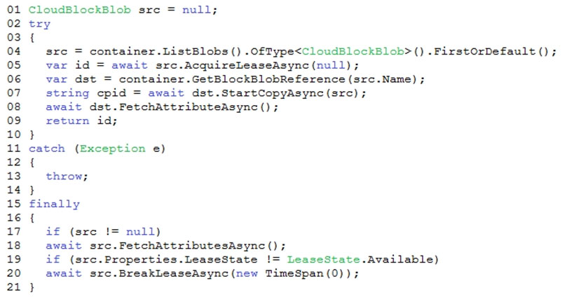

- [x] Sí.
- [ ] No.

**[⬆ Volver arriba](#table-of-contents)**

### Estás desarrollando una solución que usa la biblioteca cliente de Azure Storage para .NET. Tienes el siguiente código: (Los números de línea se incluyen solo como referencia.). Pregunta 2: El código en la línea 06 siempre crea un blob nuevo.

- [ ] Sí.
- [x] No.

**[⬆ Volver arriba](#table-of-contents)**

### Estás desarrollando una solución que usa la biblioteca cliente de Azure Storage para .NET. Tienes el siguiente código: (Los números de línea se incluyen solo como referencia.). Pregunta 3: El bloque finally libera el arrendamiento.

- [x] Sí.
- [ ] No.

**[⬆ Volver arriba](#table-of-contents)**

### Estás creando un sitio web que usa Azure Blob Storage para almacenamiento de datos. Configuras el ciclo de vida de Azure Blob Storage para mover todos los blobs al nivel de archivo después de 30 días. Los clientes han solicitado un acuerdo de nivel de servicio (SLA) para ver datos con más de 30 días. Necesitas documentar el SLA mínimo para la recuperación de datos. ¿Qué SLA debes usar?

- [ ] Al menos dos días.
- [x] Entre una y 15 horas.
- [ ] Al menos un día.
- [ ] Entre cero y 60 minutos.

**[⬆ Volver arriba](#table-of-contents)**

<a id="you-are-developing-a-ticket-reservation-system-for-an-airline-the-storage-solution-for-the-application-must-meet-the-following-requirements-ensure-at-least-9999-availability-and-provide-low-latency-accept-reservations-even-when-localized-network-outages-or-other-unforeseen-failures-occur-process-reservations-in-the-exact-sequence-as-reservations-are-submitted-to-minimize-overbooking-or-selling-the-same-seat-to-multiple-travelers-allow-simultaneous-and-out-of-order-reservations-with-a-maximum-five-second-tolerance-window-you-provision-a-resource-group-named-airlineresourcegroup-in-the-azure-south-central-us-region-you-need-to-provision-a-sql-api-cosmos-db-account-to-support-the-app-how-should-you-complete-the-azure-cli-commands"></a>
### Estás desarrollando un sistema de reserva de boletos para una aerolínea. La solución de almacenamiento para la aplicación debe cumplir los siguientes requisitos: Garantizar al menos 99.99% de disponibilidad y proporcionar baja latencia. Aceptar reservas incluso cuando ocurran interrupciones de red localizadas u otras fallas imprevistas. Procesar las reservas en la secuencia exacta en que se envían para minimizar la sobreventa o la venta del mismo asiento a múltiples viajeros. Permitir reservas simultáneas y fuera de orden con una ventana de tolerancia máxima de cinco segundos. Aprovisionas un grupo de recursos llamado `airlineResourceGroup` en la región Azure South-Central US. Necesitas aprovisionar una cuenta de Cosmos DB con SQL API para soportar la aplicación. ¿Cómo debes completar los comandos de Azure CLI?

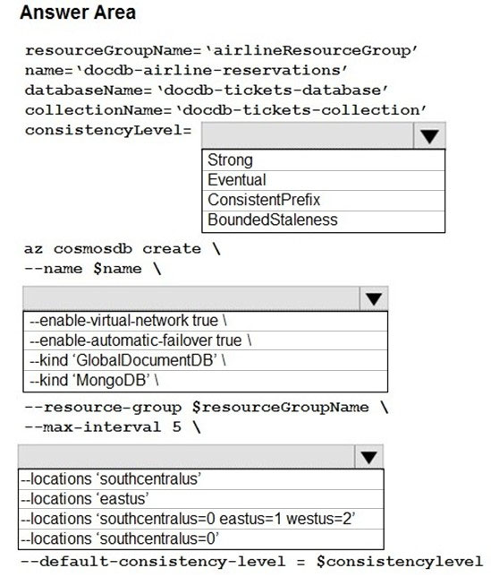

- [x] Cuadro 1: `BoundedStaleness`. Cuadro 2: `--enable-automatic-failover true \`. Cuadro 3: `--locations 'southcentralplus=0 eastus=1 westus=2'`.
- [ ] Cuadro 1: `Strong`. Cuadro 2: `--enable-automatic-failover true \`. Cuadro 3: `--locations 'southcentralplus=0 eastus=1 westus=2'`.
- [ ] Cuadro 1: `BoundedStaleness`. Cuadro 2: `--enable-automatic-failover true \`. Cuadro 3: `--locations 'southcentralus'`.
- [ ] Cuadro 1: `Strong`. Cuadro 2: `--kind 'MongoDB' \`. Cuadro 3: `--locations 'southcentralus'`.

**[⬆ Volver arriba](#table-of-contents)**

<a id="you-are-preparing-to-deploy-a-python-website-to-an-azure-web-app-using-a-container-the-solution-will-use-multiple-containers-in-the-same-container-group-the-dockerfile-that-builds-the-container-is-as-follows-you-build-a-container-by-using-the-following-command-the-azure-container-registry-instance-named-images-is-a-private-registry-the-user-name-and-password-for-the-registry-is-admin-the-web-app-must-always-run-the-same-version-of-the-website-regardless-of-future-builds-you-need-to-create-an-azure-web-app-to-run-the-website-how-should-you-complete-the-commands"></a>
### Te estás preparando para implementar un sitio web Python en una Azure Web App usando un contenedor. La solución usará múltiples contenedores en el mismo grupo de contenedores. El Dockerfile que construye el contenedor es el siguiente. Construyes un contenedor usando el siguiente comando. La instancia de Azure Container Registry llamada `images` es un registro privado. El nombre de usuario y la contraseña del registro es `admin`. La Web App debe ejecutar siempre la misma versión del sitio web independientemente de futuras compilaciones. Necesitas crear una Azure Web App para ejecutar el sitio web. ¿Cómo debes completar los comandos?

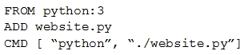

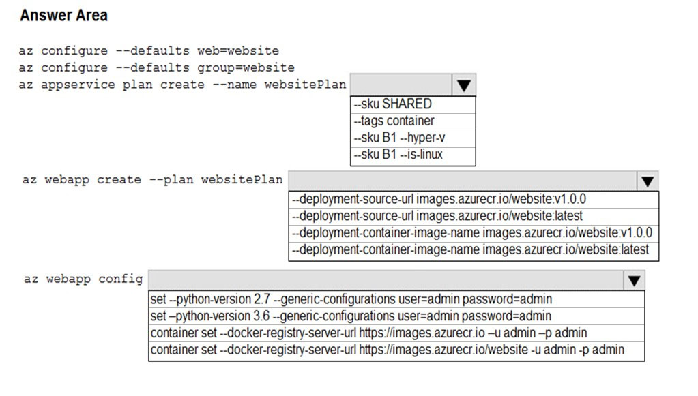

- [ ] Cuadro 1: `--sku B1 --hyper-v`. Cuadro 2: `--deployment-source-url images.azurecr.io/website:1.0.0`. Cuadro 3: `container set --docker-registry-server-url https://images.azurecr.io -u admin -p admin`.
- [x] Cuadro 1: `--sku B1 --is-linux`. Cuadro 2: `--deployment-container-image-name images.azurecr.io/website:v1.0.0`. Cuadro 3: `container set --docker-registry-server-url https://images.azurecr.io -u admin -p admin`.
- [ ] Cuadro 1: `--tags container`. Cuadro 2: `--deployment-source-url images.azurecr.io/website:latest`. Cuadro 3: `set --python-version 2.7 --generic-configurations user=admin password=admin`.
- [ ] Cuadro 1: `--sku SHARED`. Cuadro 2: `--deployment-container-image-name images.azurecr.io/website:latest`. Cuadro 3: `set --python-version 3.6 --generic-configurations user=admin password=admin`.

**[⬆ Volver arriba](#table-of-contents)**

### Estás desarrollando un Azure App Service back-end que escala en función del número de mensajes contenidos en una cola de Service Bus. Ya existe una regla para escalar horizontalmente el App Service cuando la longitud promedio de la cola de mensajes no procesados y válidos es mayor que 1000. Necesitas agregar una nueva regla que reduzca continuamente la escala del App Service mientras la condición de escalado horizontal no se cumpla. ¿Cómo debes configurar la regla de escalado?

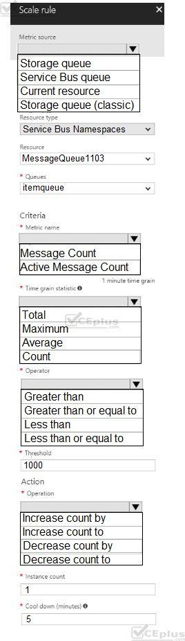

- [x] Fuente de métrica: cola de Service Bus. Nombre de la métrica: Recuento de mensajes activos. Estadística del tren de tiempo: Promedio. Operador: Menor o igual que. Operación: Disminuir el conteo en.
- [ ] Fuente de métrica: cola de Service Bus. Nombre de la métrica: Recuento de mensajes activos. Estadística del tren del tiempo: recuento. Operador: Menor o igual que. Operación: Disminuir el conteo en.
- [ ] Fuente de métrica: cola de almacenamiento. Nombre de la métrica: Recuento de mensajes activos. Estadística del tren del tiempo: recuento. Operador: Menos que. Operación: Disminuir el conteo a.
- [ ] Fuente de métrica: cola de Service Bus. Nombre de la métrica: Recuento de mensajes. Estadística del tren de tiempo: Promedio. Operador: Mayor que. Operación: Disminuir el conteo a.

**[⬆ Volver arriba](#table-of-contents)**

### Tienes una aplicación que usa Azure Blob Storage. Necesitas actualizar los metadatos de los blobs. ¿Qué tres métodos debes usar para desarrollar la solución?

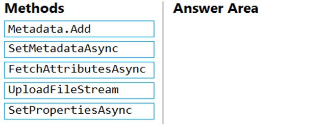

- [ ] Cuadro 1: `Metadata.Add`. Cuadro 2: `SetMetadataAsync`. Cuadro 3: `SetPropertiesAsync`.
- [ ] Cuadro 1: `Metadata.Add`. Cuadro 2: `SetMetadataAsync`. Cuadro 3: `UploadFileStream`.
- [ ] Cuadro 1: `Metadata.Add`. Cuadro 2: `FetchAttributesAsync`. Cuadro 3: `SetPropertiesAsync`.
- [x] Cuadro 1: `FetchAttributesAsync`. Cuadro 2: `Metadata.Add`. Cuadro 3: `SetMetadataAsync`.

**[⬆ Volver arriba](#table-of-contents)**

<a id="you-are-developing-an-azure-solution-to-collect-point-of-sale-pos-device-data-from-2000-stores-located-throughout-the-world-a-single-device-can-produce-2-megabytes-mb-of-data-every-24-hours-each-store-location-has-one-to-five-devices-that-send-data-you-must-store-the-device-data-in-azure-blob-storage-device-data-must-be-correlated-based-on-a-device-identifier-additional-stores-are-expected-to-open-in-the-future-you-need-to-implement-a-solution-to-receive-the-device-data-solution-provision-an-azure-event-grid-configure-the-machine-identifier-as-the-partition-key-and-enable-capture-does-the-solution-meet-the-goal"></a>
### Estás desarrollando una solución de Azure para recopilar datos de dispositivos de punto de venta (POS) de 2,000 tiendas ubicadas en todo el mundo. Un solo dispositivo puede producir 2 megabytes (MB) de datos cada 24 horas. Cada ubicación de tienda tiene de uno a cinco dispositivos que envían datos. Debes almacenar los datos del dispositivo en Azure Blob Storage. Los datos del dispositivo deben correlacionarse en función de un identificador de dispositivo. Se espera que se abran tiendas adicionales en el futuro. Necesitas implementar una solución para recibir los datos del dispositivo. Solución: Aprovisionar un Azure Event Grid. Configurar el identificador de máquina como clave de partición y habilitar la captura. ¿La solución cumple con el objetivo?

- [ ] Sí.
- [x] No.

**[⬆ Volver arriba](#table-of-contents)**

### Desarrollas soluciones de Azure. Una aplicación .NET necesita recibir un mensaje cada vez que una máquina virtual de Azure termina de procesar datos. Los mensajes NO deben persistir después de ser procesados por la aplicación receptora. Necesitas implementar el objeto .NET que recibirá los mensajes. ¿Qué objeto debes usar?

- [x] `QueueClient`.
- [ ] `SubscriptionClient`.
- [ ] `TopicClient`.
- [ ] `CloudQueueClient`.

**[⬆ Volver arriba](#table-of-contents)**

### Estás manteniendo una aplicación existente que usa una cuenta de almacenamiento Azure Blob GPv1 Premium. Los datos con más de tres meses rara vez se usan. Los datos con menos de tres meses deben estar disponibles inmediatamente. Los datos con más de un año deben guardarse pero no necesitan estar disponibles inmediatamente. Necesitas configurar la cuenta para soportar una regla de administración del ciclo de vida que mueva los datos de blob al almacenamiento de archivo para los datos no modificados en el último año. ¿Qué tres acciones debes realizar en secuencia?

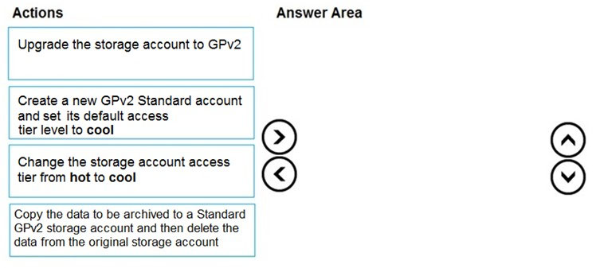

- [ ] Cuadro 1: actualice la cuenta de almacenamiento a GPv2. Cuadro 2: Copie los datos que se archivarán en una cuenta de almacenamiento GPv2 estándar y luego elimine los datos de la cuenta de almacenamiento original. Cuadro 3: Cambie el nivel de acceso a la cuenta de almacenamiento de activo a frío.
- [x] Cuadro 1: actualice la cuenta de almacenamiento a GPv2. Cuadro 2: cree una nueva cuenta GPv2 Standard y establezca su nivel de acceso predeterminado en cool. Cuadro 3: Copie los datos que se archivarán en una cuenta de almacenamiento GPv2 estándar y luego elimine los datos de la cuenta de almacenamiento original.
- [ ] Cuadro 1: actualice la cuenta de almacenamiento a GPv2. Cuadro 2: Copie los datos que se archivarán en una cuenta de almacenamiento GPv2 estándar y luego elimine los datos de la cuenta de almacenamiento original. Cuadro 3: Cree una nueva cuenta GPv2 Standard y establezca su nivel de acceso predeterminado en cool.
- [ ] Cuadro 1: cree una nueva cuenta GPv2 Standard y establezca su nivel de acceso predeterminado en cool. Cuadro 2: Copie los datos que se archivarán en una cuenta de almacenamiento GPv2 estándar y luego elimine los datos de la cuenta de almacenamiento original. Cuadro 3: actualice la cuenta de almacenamiento a GPv2.

**[⬆ Volver arriba](#table-of-contents)**

### Desarrollas soluciones de Azure. Debes conectarte a una base de datos No-SQL distribuida globalmente usando la API .NET. Necesitas crear un objeto para configurar y ejecutar solicitudes en la base de datos. ¿Qué segmento de código debes usar?

- [ ] `new Container(EndpointUri, PrimaryKey);`.
- [ ] `new Database(EndpointUri, PrimaryKey);`.
- [x] `new CosmosClient(EndpointUri, PrimaryKey);`.

**[⬆ Volver arriba](#table-of-contents)**

### Tienes una cuenta de almacenamiento de Azure existente que almacena grandes volúmenes de datos en múltiples contenedores. Necesitas copiar todos los datos de la cuenta de almacenamiento existente a una nueva cuenta de almacenamiento. El proceso de copia debe cumplir los siguientes requisitos: Automatizar el movimiento de datos. Minimizar la entrada del usuario requerida para realizar la operación. Asegurar que el proceso de movimiento de datos sea recuperable. ¿Qué debes usar?

- [x] `AzCopy`.
- [ ] Explorador de almacenamiento de Azure.
- [ ] Azure portal.
- [ ] Biblioteca cliente de almacenamiento .NET.

**[⬆ Volver arriba](#table-of-contents)**

### Estás desarrollando un servicio web que se ejecutará en máquinas virtuales de Azure que usan Azure Storage. Configuras todas las máquinas virtuales para usar identidades administradas. Tienes los siguientes requisitos: No se permiten mecanismos de autenticación basados en secretos para acceder a una cuenta de Azure Storage. Debe usar solo los puntos de conexión de Azure Instance Metadata Service. Necesitas escribir código para recuperar un token de acceso para acceder a Azure Storage.

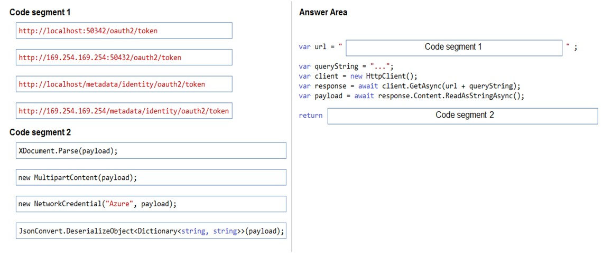

- [ ] Code segment 1: `http://localhost::50342/oauth2/token`. Code segment 2: `new MultipartContent(payload);`.
- [ ] Code segment 1: `http://localhost/metadata/identity/oauth2/token`. Code segment 2: `JsonConvert.DeserializeObject<Dictionary<string, string>>(payload);`.
- [ ] Code segment 1: `http://169.254.169.254:50432/metadata/identity/oauth2/token`. Code segment 2: `new NetworkCredential('Azure', payload);`.
- [x] Code segment 1: `http://169.254.169.254:50432/metadata/identity/oauth2/token`. Code segment 2: `JsonConvert.DeserializeObject<Dictionary<string, string>>(payload);`.

**[⬆ Volver arriba](#table-of-contents)**

### Estás desarrollando una nueva página para un sitio web que usa Azure Cosmos DB para almacenamiento de datos. La característica usa documentos que tienen el siguiente formato. Debes mostrar datos para la nueva página en un orden específico. Creas la siguiente consulta para la página. Necesitas configurar una política de Cosmos DB para soportar la consulta. ¿Cómo debes configurar la política?

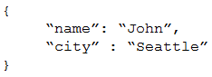
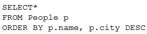
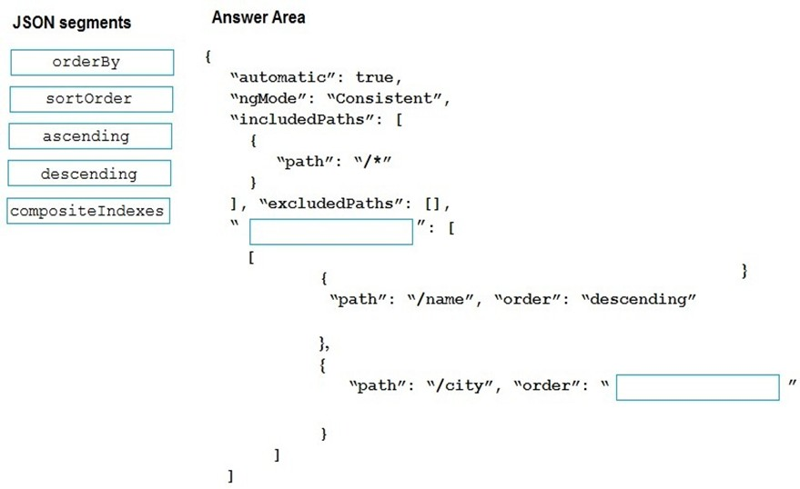

- [ ] Cuadro 1: `orderBy`. Cuadro 2: `compositeIndexes`.
- [x] Cuadro 1: `compositeIndexes`. Cuadro 2: `descending`.
- [ ] Cuadro 1: `compositeIndexes`. Cuadro 2: `ascending`.
- [ ] Cuadro 1: `ascending`. Cuadro 2: `descending`.

**[⬆ Volver arriba](#table-of-contents)**

<a id="you-are-building-a-traffic-monitoring-system-that-monitors-traffic-along-six-highways-the-system-produces-time-series-analysis-based-reports-for-each-highway-data-from-traffic-sensors-are-stored-in-azure-event-hub-traffic-data-is-consumed-by-four-departments-each-department-has-an-azure-web-app-that-displays-the-time-series-based-reports-and-contains-a-webjob-that-processes-the-incoming-data-from-event-hub-all-web-apps-run-on-app-service-plans-with-three-instances-data-throughput-must-be-maximized-latency-must-be-minimized-you-need-to-implement-the-azure-event-hub-which-settings-should-you-use"></a>
### Estás construyendo un sistema de monitoreo de tráfico que supervisa el tráfico en seis autopistas. El sistema produce informes basados en análisis de series temporales para cada autopista. Los datos de los sensores de tráfico se almacenan en Azure Event Hub. Los datos de tráfico son consumidos por cuatro departamentos. Cada departamento tiene una Azure Web App que muestra los informes basados en series temporales y contiene un WebJob que procesa los datos entrantes de Event Hub. Todas las Web Apps se ejecutan en App Service Plans con tres instancias. El rendimiento de datos debe maximizarse. La latencia debe minimizarse. Necesitas implementar el Azure Event Hub. ¿Qué configuración debes usar?

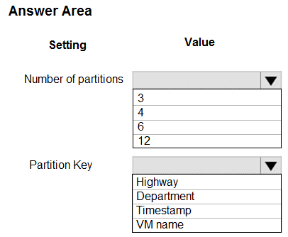

- [x] Número de particiones: 6. Clave de partición: Carretera.
- [ ] Número de particiones: 12. Clave de partición: nombre de VM.
- [ ] Número de particiones: 12. Clave de partición: Carretera.
- [ ] Número de particiones: 6 Clave de partición: Departamento.

**[⬆ Volver arriba](#table-of-contents)**

### Estás desarrollando una solución de microservicios. Planeas implementar la solución en un clúster multinodo de Azure Kubernetes Service (AKS). Necesitas implementar una solución que incluya las siguientes características: capacidades de proxy inverso, enrutamiento de tráfico configurable, terminación TLS con un certificado personalizado. ¿Qué componentes debes usar?

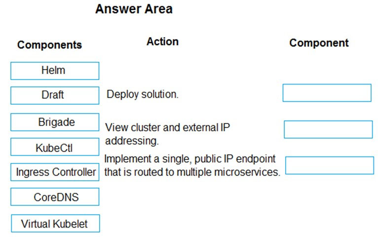

- [ ] Implementar solución: `Draft`. Ver clúster y direccionamiento externo: `CoreDNS`. Implemente un único punto final de IP público que se enruta a múltiples microservicios: `Vrtual Kubelet`.
- [ ] Implementar solución: `Helm`. Ver clúster y direccionamiento externo: `Brigade`. Implemente un único punto final de IP público que se enruta a múltiples microservicios: `KubeCtl`.
- [x] Implementar solución: `Helm`. Ver clúster y direccionamiento externo: `KubeCtl`. Implemente un único punto final de IP público que se enruta a múltiples microservicios: `Ingress Controller`.
- [ ] Implementar solución: `Ingress Controller`. Ver clúster y direccionamiento externo: `Helm`. Implemente un único punto final de IP público que se enruta a múltiples microservicios: `Brigade`.

**[⬆ Volver arriba](#table-of-contents)**

### Estás implementando un sistema de procesamiento de pedidos. Una aplicación de punto de venta publica pedidos en temas de una cola de Azure Service Bus. La propiedad Label del tema incluye los siguientes datos. El sistema tiene los siguientes requisitos para las suscripciones. Necesitas implementar filtrado y maximizar el rendimiento mientras evalúas los filtros. ¿Qué tipos de filtro debes implementar?

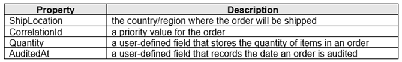
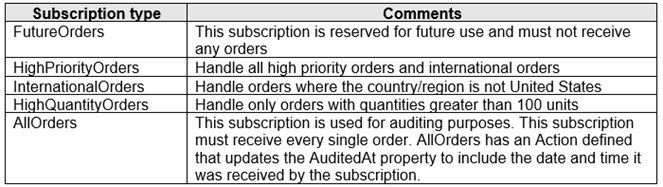
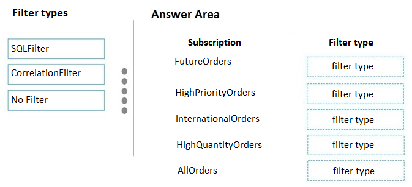

- [x] Cuadro 1: `SQLFilter`. Cuadro 2: `CorrelationFilter`. Cuadro 3: `SQLFilter`. Cuadro 4: `SQLFilter`. Cuadro 5: Sin filtro.
- [ ] Cuadro 1: `CorrelationFilter`. Cuadro 2: `SQLFilter`. Cuadro 3: Sin filtro. Cuadro 4: `CorrelationFilter`. Cuadro 5: `SQLFilter`.
- [ ] Cuadro 1: Sin filtro. Cuadro 2: `CorrelationFilter`. Cuadro 3: `SQLFilter`. Cuadro 4: `SQLFilter`. Cuadro 5: Sin filtro.
- [ ] Cuadro 1: Sin filtro. Cuadro 2: `SQLFilter`. Cuadro 3: `SQLFilter`. Cuadro 4: `CorrelationFilter`. Cuadro 5: `CorrelationFilter`.

**[⬆ Volver arriba](#table-of-contents)**

### Tu empresa tiene varios sitios web que usan una imagen del logotipo de la empresa. Usas Azure Content Delivery Network (CDN) para almacenar la imagen estática. Necesitas determinar el proceso correcto de cómo la CDN y el servidor Point of Presence (POP) distribuirán la imagen y listar los elementos en el orden correcto. ¿En qué orden ocurren las acciones?

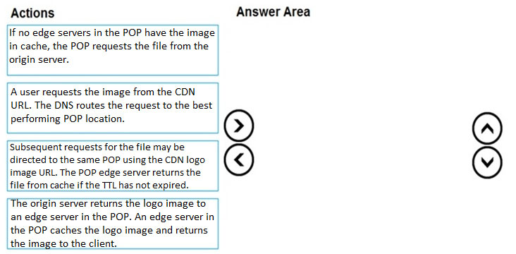

- [ ] Cuadro 1: Si ningún servidor perimetral en el POP tiene la imagen en caché, el POP solicita el archivo al servidor de origen. Casilla 2: Las solicitudes posteriores del archivo pueden dirigirse al mismo POP utilizando la URL de la imagen del logotipo de CDN. El servidor perimetral POP devuelve el archivo de la caché si el TTL no ha caducado. Cuadro 3: El servidor de origen devuelve la imagen del logotipo a un servidor perimetral en el POP. Un servidor perimetral en el POP almacena en caché la imagen del logotipo y la devuelve al cliente. Cuadro 4: Un usuario solicita la imagen desde la URL del CDN. El DNS enruta la solicitud a la ubicación POP con mejor rendimiento.
- [x] Cuadro 1: un usuario solicita la imagen desde la URL de CDN. El DNS enruta la solicitud a la ubicación POP con mejor rendimiento. Cuadro 2: Si ningún servidor perimetral en el POP tiene la imagen en caché, el POP solicita el archivo al servidor de origen. Cuadro 3: El servidor de origen devuelve la imagen del logotipo a un servidor perimetral en el POP. Un servidor perimetral en el POP almacena en caché la imagen del logotipo y la devuelve al cliente. Casilla 4: Las solicitudes posteriores del archivo pueden dirigirse al mismo POP utilizando la URL de la imagen del logotipo de CDN. El servidor perimetral POP devuelve el archivo de la caché si el TTL no ha caducado.
- [ ] Casilla 1: Las solicitudes posteriores del archivo pueden dirigirse al mismo POP utilizando la URL de la imagen del logotipo de CDN. El servidor perimetral POP devuelve el archivo de la caché si el TTL no ha caducado. Cuadro 2: Un usuario solicita la imagen desde la URL de CDN. El DNS enruta la solicitud a la ubicación POP con mejor rendimiento. Cuadro 3: Si ningún servidor perimetral en el POP tiene la imagen en caché, el POP solicita el archivo al servidor de origen. Cuadro 4: El servidor de origen devuelve la imagen del logotipo a un servidor perimetral en el POP. Un servidor perimetral en el POP almacena en caché la imagen del logotipo y la devuelve al cliente.
- [ ] Cuadro 1: El servidor de origen devuelve la imagen del logotipo a un servidor perimetral en el POP. Un servidor perimetral en el POP almacena en caché la imagen del logotipo y la devuelve al cliente. Cuadro 2: Un usuario solicita la imagen desde la URL de CDN. El DNS enruta la solicitud a la ubicación POP con mejor rendimiento. Casilla 3: Las solicitudes posteriores del archivo se pueden dirigir al mismo POP utilizando la URL de la imagen del logotipo de CDN. El servidor perimetral POP devuelve el archivo de la caché si el TTL no ha caducado. Cuadro 4: Si ningún servidor perimetral en el POP tiene la imagen en caché, el POP solicita el archivo al servidor de origen.

**[⬆ Volver arriba](#table-of-contents)**

### Estás desarrollando una solución de Azure Cosmos DB usando Azure Cosmos DB SQL API. Los datos incluyen millones de documentos. Cada documento puede contener cientos de propiedades. Las propiedades de los documentos no contienen valores distintos para particionar. Azure Cosmos DB debe escalar contenedores individuales en la base de datos para satisfacer las necesidades de rendimiento de la aplicación distribuyendo la carga de trabajo uniformemente entre todas las particiones con el tiempo. Necesitas seleccionar una clave de partición. ¿Qué dos claves de partición puedes usar?

- [ ] Un valor de propiedad único que no aparece con frecuencia en los documentos.
- [ ] Valor que contiene el nombre de la colección.
- [ ] Un valor de propiedad único que aparece con frecuencia en los documentos.
- [x] Una concatenación de varios valores de propiedad con un sufijo aleatorio añadido.
- [x] Un sufijo hash añadido al valor de una propiedad.

**[⬆ Volver arriba](#table-of-contents)**

<a id="you-are-developing-an-azure-hosted-e-commerce-web-application-the-application-will-use-azure-cosmos-db-to-store-sales-orders-you-are-using-the-latest-sdk-to-manage-the-sales-orders-in-the-database-you-create-a-new-azure-cosmos-db-instance-you-include-a-valid-endpoint-and-valid-authorization-key-to-an-appsettingsjson-file-in-the-code-project-you-are-evaluating-the-following-application-code-line-number-are-included-for-reference-only-question-1-a-database-named-salesorders-is-created-the-database-will-include-two-containers"></a>
### Estás desarrollando una aplicación web de comercio electrónico alojada en Azure. La aplicación usará Azure Cosmos DB para almacenar órdenes de venta. Estás usando el SDK más reciente para administrar las órdenes de venta en la base de datos. Creas una nueva instancia de Azure Cosmos DB. Incluyes un punto de conexión válido y una clave de autorización válida en un archivo `appSettings.json` en el proyecto de código. Estás evaluando el siguiente código de aplicación: (Los números de línea se incluyen solo como referencia.). Pregunta 1: Se crea una base de datos llamada `SalesOrders`. La base de datos incluirá dos contenedores.

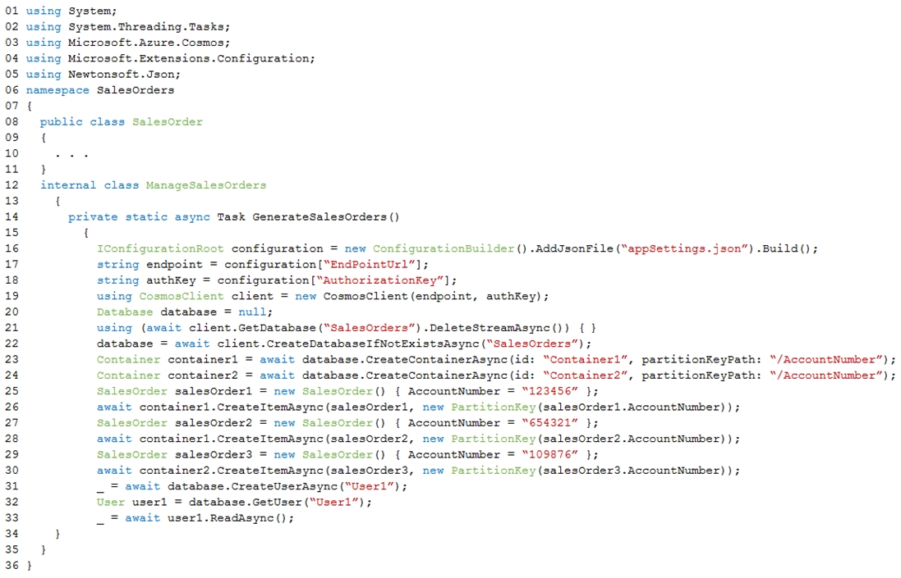

- [x] Sí.
- [ ] No.

**[⬆ Volver arriba](#table-of-contents)**

### Estás desarrollando una aplicación web de comercio electrónico alojada en Azure. La aplicación usará Azure Cosmos DB para almacenar órdenes de venta. Estás usando el SDK más reciente para administrar las órdenes de venta en la base de datos. Creas una nueva instancia de Azure Cosmos DB. Incluyes un punto de conexión válido y una clave de autorización válida en un archivo `appSettings.json` en el proyecto de código. Estás evaluando el siguiente código de aplicación: (Los números de línea se incluyen solo como referencia.). Pregunta 2: `Container1` contendrá dos elementos.

- [x] Sí.
- [ ] No.

**[⬆ Volver arriba](#table-of-contents)**

### Estás desarrollando una aplicación web de comercio electrónico alojada en Azure. La aplicación usará Azure Cosmos DB para almacenar órdenes de venta. Estás usando el SDK más reciente para administrar las órdenes de venta en la base de datos. Creas una nueva instancia de Azure Cosmos DB. Incluyes un punto de conexión válido y una clave de autorización válida en un archivo `appSettings.json` en el proyecto de código. Estás evaluando el siguiente código de aplicación: (Los números de línea se incluyen solo como referencia.). Pregunta 3: `Container2` contendrá un elemento.

- [x] Sí.
- [ ] No.

**[⬆ Volver arriba](#table-of-contents)**

### Desarrollas una solución de Azure que usa Cosmos DB. El contenedor actual de Cosmos DB debe replicarse y debe usar una clave de partición optimizada para consultas. Necesitas implementar una solución de procesador de fuente de cambios. ¿Qué componentes del procesador de fuente de cambios debes usar?

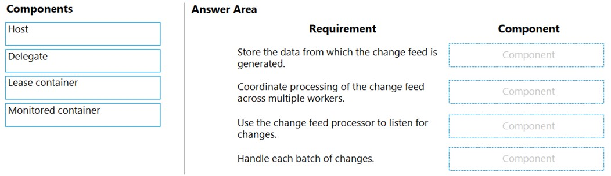

- [ ] Almacene los datos a partir de los cuales se genera la fuente de cambios: Host. Coordine el procesamiento de la fuente de cambios entre varios trabajadores: Delegar. Utilice el procesador de fuente de cambios para escuchar los cambios: Contenedor de arrendamiento. Manejar cada lote de cambios: Contenedor monitoreado.
- [ ] Almacene los datos a partir de los cuales se genera el feed de cambios: Contenedor de arrendamiento. Coordine el procesamiento de la fuente de cambios entre varios trabajadores: Anfitrión. Utilice el procesador de fuentes de cambios para escuchar los cambios: Delegar. Manejar cada lote de cambios: Contenedor monitoreado.
- [ ] Almacene los datos a partir de los cuales se genera el feed de cambios: Delegar. Coordine el procesamiento de la fuente de cambios entre varios trabajadores: contenedor monitoreado. Utilice el procesador de fuente de cambios para escuchar los cambios: Contenedor de arrendamiento. Manejar cada lote de cambios: Anfitrión.
- [x] Almacene los datos a partir de los cuales se genera el feed de cambios: Contenedor monitoreado. Coordine el procesamiento de la fuente de cambios entre varios trabajadores: Contenedor de arrendamiento. Utilice el procesador de fuente de cambios para escuchar los cambios: Anfitrión. Manejar cada lote de cambios: Delegar.

**[⬆ Volver arriba](#table-of-contents)**

### Desarrollas una aplicación web. Necesitas registrar la aplicación con un inquilino activo de Microsoft Entra ID. ¿Qué tres acciones debes realizar en secuencia?

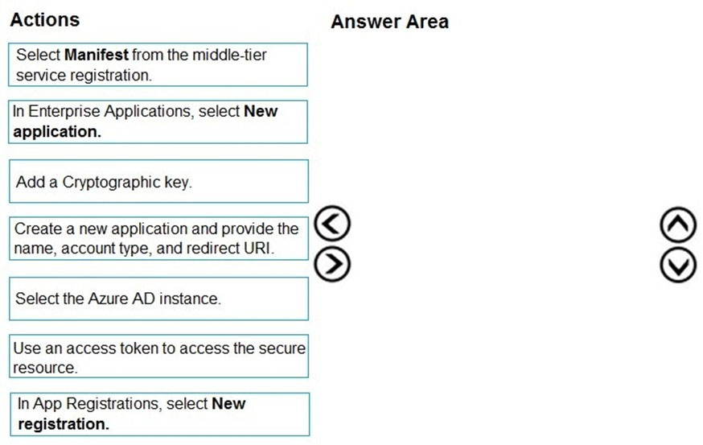

- [ ] Cuadro 1: seleccione Manifiesto en el registro del servicio de nivel medio. Cuadro 2: Agregar una clave criptográfica. Cuadro 3: en Registros de aplicaciones, seleccione Nuevo registro.
- [ ] Cuadro 1: en Registros de aplicaciones, seleccione Nuevo registro. Cuadro 2: seleccione la instancia de Microsoft Entra ID (en la imagen todavía se muestra como Azure AD). Cuadro 3: seleccione Manifiesto en el registro del servicio de nivel medio.
- [x] Cuadro 1: en Registros de aplicaciones, seleccione Nuevo registro. Cuadro 2: seleccione la instancia de Microsoft Entra ID (en la imagen todavía se muestra como Azure AD). Cuadro 3: cree una nueva aplicación y proporcione el nombre, el tipo de cuenta y el URI de redireccionamiento.
- [ ] Cuadro 1: en Aplicaciones empresariales, seleccione Nueva aplicación. Cuadro 2: en Registros de aplicaciones, seleccione Nuevo registro. Cuadro 3: seleccione la instancia de Microsoft Entra ID (en la imagen todavía se muestra como Azure AD).

**[⬆ Volver arriba](#table-of-contents)**

### Tienes una nueva suscripción de Azure. Estás desarrollando un sitio web interno para que los empleados vean datos confidenciales. El sitio web usa Microsoft Entra ID para autenticación. Necesitas implementar autenticación multifactor para el sitio web. ¿Qué dos acciones debes realizar?

- [ ] Configure el sitio web para utilizar Microsoft Entra ID B2C.
- [x] MFA Habilitado por la política de acceso condicional.
- [x] En Microsoft Entra ID, cree una nueva política de acceso condicional.
- [ ] Actualice a Microsoft Entra ID Premium.
- [ ] En Microsoft Entra ID, habilite el proxy de la aplicación.
- [ ] En el acceso condicional de Microsoft Entra ID, habilite la política de referencia.

**[⬆ Volver arriba](#table-of-contents)**

<a id="you-are-developing-a-java-application-that-uses-cassandra-to-store-key-and-value-data-you-plan-to-use-a-new-azure-cosmos-db-resource-and-the-cassandra-api-in-the-application-you-create-an-microsoft-entra-id-group-named-cosmos-db-creators-to-enable-provisioning-of-azure-cosmos-accounts-databases-and-containers-the-microsoft-entra-id-group-must-not-be-able-to-access-the-keys-that-are-required-to-access-the-data-you-need-to-restrict-access-to-the-microsoft-entra-id-group-which-role-based-access-control-should-you-use"></a>
### Estás desarrollando una aplicación Java que usa Cassandra para almacenar datos de clave y valor. Planeas usar un nuevo recurso de Azure Cosmos DB y la API de Cassandra en la aplicación. Creas un grupo de Microsoft Entra ID llamado Cosmos DB Creators para habilitar el aprovisionamiento de cuentas, bases de datos y contenedores de Azure Cosmos. El grupo de Microsoft Entra ID no debe poder acceder a las claves requeridas para acceder a los datos. Necesitas restringir el acceso al grupo de Microsoft Entra ID. ¿Qué control de acceso basado en roles debes usar?

- [ ] Colaborador de cuentas de DocumentDB.
- [ ] Operador de respaldo de Cosmos.
- [x] Operador de Cosmos DB.
- [ ] Lector de cuentas Cosmos DB.

**[⬆ Volver arriba](#table-of-contents)**

<a id="you-are-developing-a-website-that-will-run-as-an-azure-web-app-users-will-authenticate-by-using-their-microsoft-entra-id-credentials-you-plan-to-assign-users-one-of-the-following-permission-levels-for-the-website-admin-normal-and-reader-a-users-microsoft-entra-id-group-membership-must-be-used-to-determine-the-permission-level-you-need-to-configure-authorization-solution-configure-the-azure-web-app-for-the-website-to-allow-only-authenticated-requests-and-require-microsoft-entra-id-log-on-does-the-solution-meet-the-goal"></a>
### Estás desarrollando un sitio web que se ejecutará como una Azure Web App. Los usuarios se autenticarán usando sus credenciales de Microsoft Entra ID. Planeas asignar a los usuarios uno de los siguientes niveles de permiso para el sitio web: `admin`, `normal` y `reader`. La pertenencia a grupos de Microsoft Entra ID del usuario debe usarse para determinar el nivel de permiso. Necesitas configurar la autorización. Solución: Configurar la Azure Web App para el sitio web para permitir solo solicitudes autenticadas y requerir el inicio de sesión con Microsoft Entra ID. ¿La solución cumple con el objetivo?

- [ ] Sí.
- [x] No.

**[⬆ Volver arriba](#table-of-contents)**

<a id="you-are-developing-a-website-that-will-run-as-an-azure-web-app-users-will-authenticate-by-using-their-microsoft-entra-id-credentials-you-plan-to-assign-users-one-of-the-following-permission-levels-for-the-website-admin-normal-and-reader-a-users-microsoft-entra-id-group-membership-must-be-used-to-determine-the-permission-level-you-need-to-configure-authorization-solution-create-a-new-microsoft-entra-id-application-in-the-applications-manifest-set-value-of-the-groupmembershipclaims-option-to-all-in-the-website-use-the-value-of-the-groups-claim-from-the-jwt-for-the-user-to-determine-permissions-does-the-solution-meet-the-goal"></a>
### Estás desarrollando un sitio web que se ejecutará como una Azure Web App. Los usuarios se autenticarán usando sus credenciales de Microsoft Entra ID. Planeas asignar a los usuarios uno de los siguientes niveles de permiso para el sitio web: `admin`, `normal` y `reader`. La pertenencia a grupos de Microsoft Entra ID del usuario debe usarse para determinar el nivel de permiso. Necesitas configurar la autorización. Solución: Crear una nueva aplicación de Microsoft Entra ID. En el manifiesto de la aplicación, establecer el valor de la opción `groupMembershipClaims` en All. En el sitio web, usar el valor de la reclamación de grupos del JWT del usuario para determinar los permisos. ¿La solución cumple con el objetivo?

- [x] Sí.
- [ ] No.

**[⬆ Volver arriba](#table-of-contents)**

<a id="you-are-developing-a-website-that-will-run-as-an-azure-web-app-users-will-authenticate-by-using-their-microsoft-entra-id-credentials-you-plan-to-assign-users-one-of-the-following-permission-levels-for-the-website-admin-normal-and-reader-a-users-microsoft-entra-id-group-membership-must-be-used-to-determine-the-permission-level-you-need-to-configure-authorization-solution-create-a-new-microsoft-entra-id-application-in-the-applications-manifest-define-application-roles-that-match-the-required-permission-levels-for-the-application-assign-the-appropriate-microsoft-entra-id-group-to-each-role-in-the-website-use-the-value-of-the-roles-claim-from-the-jwt-for-the-user-to-determine-permissions-does-the-solution-meet-the-goal"></a>
### Estás desarrollando un sitio web que se ejecutará como una Azure Web App. Los usuarios se autenticarán usando sus credenciales de Microsoft Entra ID. Planeas asignar a los usuarios uno de los siguientes niveles de permiso para el sitio web: `admin`, `normal` y `reader`. La pertenencia a grupos de Microsoft Entra ID del usuario debe usarse para determinar el nivel de permiso. Necesitas configurar la autorización. Solución: Crear una nueva aplicación de Microsoft Entra ID. En el manifiesto de la aplicación, definir roles de aplicación que coincidan con los niveles de permiso requeridos para la aplicación. Asignar el grupo apropiado de Microsoft Entra ID a cada rol. En el sitio web, usar el valor de la reclamación de roles del JWT del usuario para determinar los permisos. ¿La solución cumple con el objetivo?

- [ ] Sí.
- [x] No.

**[⬆ Volver arriba](#table-of-contents)**

### Estás desarrollando una aplicación para transferir datos de forma segura entre sistemas de archivos locales y Azure Blob Storage. La aplicación almacena claves, secretos y certificados en Azure Key Vault. La aplicación usa las API de Azure Key Vault. La aplicación debe permitir la recuperación de una eliminación accidental del almacén de claves o los objetos del almacén de claves. Los objetos del almacén de claves deben retenerse durante 90 días después de la eliminación. Necesitas proteger el almacén de claves y los objetos del almacén de claves. ¿Qué característica de Azure Key Vault debes usar?

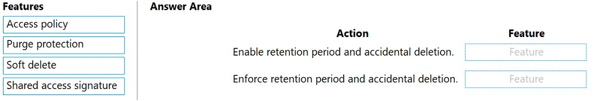

- [x] Habilitar período de retención y eliminación accidental: eliminación temporal. Hacer cumplir el período de retención y eliminación accidental: protección de purga.
- [ ] Habilitar periodo de retención y eliminación accidental: Política de acceso. Aplicar período de retención y eliminación accidental: eliminación temporal.
- [ ] Habilitar período de retención y eliminación accidental: Firma de acceso compartido. Hacer cumplir el período de retención y eliminación accidental: protección pura.
- [ ] Habilitar período de retención y eliminación accidental: eliminación temporal. Aplicar período de retención y eliminación accidental: Firma de acceso compartido.

**[⬆ Volver arriba](#table-of-contents)**

### Proporcionas un servicio web administrado de Azure API Management a los clientes. El servicio web back-end implementa HTTP Strict Transport Security (HSTS). Cada solicitud al servicio back-end debe incluir un encabezado de autorización HTTP válido. Necesitas configurar la instancia de Azure API Management con una política de autenticación. ¿Qué dos políticas puedes usar?

- [x] Basic Authentication.
- [ ] Digest Authentication.
- [x] Certificate Authentication.
- [ ] Otorgamiento de credenciales de cliente de OAuth.

**[⬆ Volver arriba](#table-of-contents)**

<a id="you-are-developing-an-aspnet-core-website-that-can-be-used-to-manage-photographs-which-are-stored-in-azure-blob-storage-containers-users-of-the-website-authenticate-by-using-their-microsoft-entra-id-credentials-you-implement-role-based-access-control-rbac-role-permissions-on-the-containers-that-store-photographs-you-assign-users-to-rbac-roles-you-need-to-configure-the-websites-microsoft-entra-id-application-so-that-users-permissions-can-be-used-with-the-azure-blob-containers-how-should-you-configure-the-application"></a>
### Estás desarrollando un sitio web ASP.NET Core que se puede usar para administrar fotografías almacenadas en contenedores de Azure Blob Storage. Los usuarios del sitio web se autentican usando sus credenciales de Microsoft Entra ID. Implementas permisos de roles de control de acceso basado en roles (RBAC) en los contenedores que almacenan fotografías. Asignas usuarios a roles RBAC. Necesitas configurar la aplicación de Microsoft Entra ID del sitio web para que los permisos de los usuarios se puedan usar con los contenedores de Azure Blob. ¿Cómo debes configurar la aplicación?

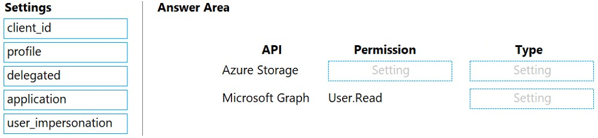

- [ ] Permiso de almacenamiento de Azure: `client_id`. Tipo de almacenamiento de Azure: `application`. Tipo de gráfico de Microsoft: `user_impersonation`.
- [ ] Permiso de almacenamiento de Azure: `client_id`. Tipo de almacenamiento de Azure: `profile`. Tipo de gráfico de Microsoft: `application`.
- [x] Permiso de almacenamiento de Azure: `user_impersonation`. Tipo de almacenamiento de Azure: `delegated`. Tipo de gráfico de Microsoft: `delegated`.
- [ ] Permiso de almacenamiento de Azure: `user_impersonation`. Tipo de almacenamiento de Azure: `delegated`. Tipo de gráfico de Microsoft: `profile`.

**[⬆ Volver arriba](#table-of-contents)**

### Estás desarrollando una aplicación ASP.NET Core que incluye feature flags administrados por Azure App Configuration. Creas un almacén de Azure App Configuration llamado `AppFeatureFlagStore` que contiene un feature flag llamado `Export`. Necesitas actualizar la aplicación para cumplir los siguientes requisitos: Usar la característica `Export` en la aplicación sin requerir un reinicio de la aplicación. Validar usuarios antes de que se les permita acceder a recursos seguros. Permitir que los usuarios accedan a recursos seguros. ¿Cómo debes completar el segmento de código?

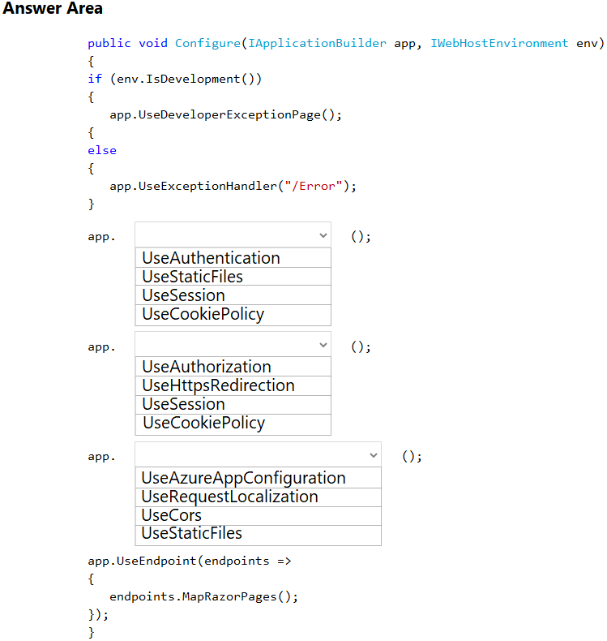

- [ ] Cuadro 1: `UseSession`. Cuadro 2: `UseCookiePolicy`. Cuadro 3: `UseStaticFiles`.
- [ ] Cuadro 1: `UseAuthentication`. Cuadro 2: `UseAuthorization`. Cuadro 3: `UseStaticFiles`.
- [ ] Cuadro 1: `UseCookiePolicy`. Cuadro 2: `UseHttpsRedirection`. Cuadro 3: `UseCors`.
- [x] Cuadro 1: `UseAuthentication`. Cuadro 2: `UseAuthorization`. Cuadro 3: `UseAzureAppConfiguration`.

**[⬆ Volver arriba](#table-of-contents)**

### Tienes una aplicación que incluye una Azure Web App y varias Azure Function Apps. Los secretos de la aplicación, incluidas las cadenas de conexión y los certificados, se almacenan en Azure Key Vault. Los secretos no deben almacenarse en la aplicación ni en el entorno de ejecución de la aplicación. Los cambios en Microsoft Entra ID deben minimizarse. Necesitas diseñar el enfoque para cargar los secretos de la aplicación. ¿Qué debes hacer?

- [ ] Cree una única identidad administrada asignada por el usuario con permiso para acceder a Key Vault y configure cada App Service para usar esa identidad administrada.
- [ ] Cree una única entidad principal de servicio de ID de Microsoft Entra con permiso para acceder a Key Vault y use un secreto de cliente desde App Services para acceder a Key Vault.
- [x] Cree una identidad administrada asignada por el sistema en cada App Service con permiso para acceder a Key Vault.
- [ ] Cree una entidad principal de servicio de ID de Microsoft. Ingrese con permisos para acceder a Key Vault para cada App Service y use un certificado desde App Services para acceder a Key Vault.

**[⬆ Volver arriba](#table-of-contents)**

<a id="you-are-developing-a-medical-records-document-management-website-the-website-is-used-to-store-scanned-copies-of-patient-intake-forms-if-the-stored-intake-forms-are-downloaded-from-storage-by-a-third-party-the-contents-of-the-forms-must-not-be-compromised-you-need-to-store-the-intake-forms-according-to-the-requirements-solution-1-create-an-azure-key-vault-key-named-skey-2-encrypt-the-intake-forms-using-the-public-key-portion-of-skey-3-store-the-encrypted-data-in-azure-blob-storage-does-the-solution-meet-the-goal"></a>
### Estás desarrollando un sitio web de gestión de documentos de registros médicos. El sitio web se usa para almacenar copias escaneadas de formularios de admisión de pacientes. Si los formularios de admisión almacenados son descargados del almacenamiento por un tercero, el contenido de los formularios no debe verse comprometido. Necesitas almacenar los formularios de admisión según los requisitos. Solución: 1. Crear una clave de Azure Key Vault llamada `skey`. 2. Cifrar los formularios de admisión usando la porción de clave pública de `skey`. 3. Almacenar los datos cifrados en Azure Blob Storage. ¿La solución cumple con el objetivo?

- [x] Sí.
- [ ] No.

**[⬆ Volver arriba](#table-of-contents)**

### Estás desarrollando un sitio web de gestión de documentos de registros médicos. El sitio web se usa para almacenar copias escaneadas de formularios de admisión de pacientes. Si los formularios de admisión almacenados son descargados del almacenamiento por un tercero, el contenido de los formularios no debe verse comprometido. Necesitas almacenar los formularios de admisión según los requisitos. Solución: 1. Crear una base de datos de Azure Cosmos DB con Storage Service Encryption habilitado. 2. Almacenar los formularios de admisión en la base de datos de Azure Cosmos DB. ¿La solución cumple con el objetivo?

- [ ] Sí.
- [x] No.

**[⬆ Volver arriba](#table-of-contents)**

### Estás desarrollando un sitio web de gestión de documentos de registros médicos. El sitio web se usa para almacenar copias escaneadas de formularios de admisión de pacientes. Si los formularios de admisión almacenados son descargados del almacenamiento por un tercero, el contenido de los formularios no debe verse comprometido. Necesitas almacenar los formularios de admisión según los requisitos. Solución: Almacenar los formularios de admisión como secretos de Azure Key Vault. ¿La solución cumple con el objetivo?

- [ ] Sí.
- [x] No.

**[⬆ Volver arriba](#table-of-contents)**

### Planeas implementar una nueva aplicación en una máquina virtual (VM) Linux alojada en Azure. Toda la VM debe estar protegida en reposo usando tecnología de cifrado estándar de la industria para cumplir con los requisitos de seguridad y cumplimiento de la organización. Necesitas configurar Azure Disk Encryption para la VM. ¿Cómo debes completar los comandos de Azure CLI?

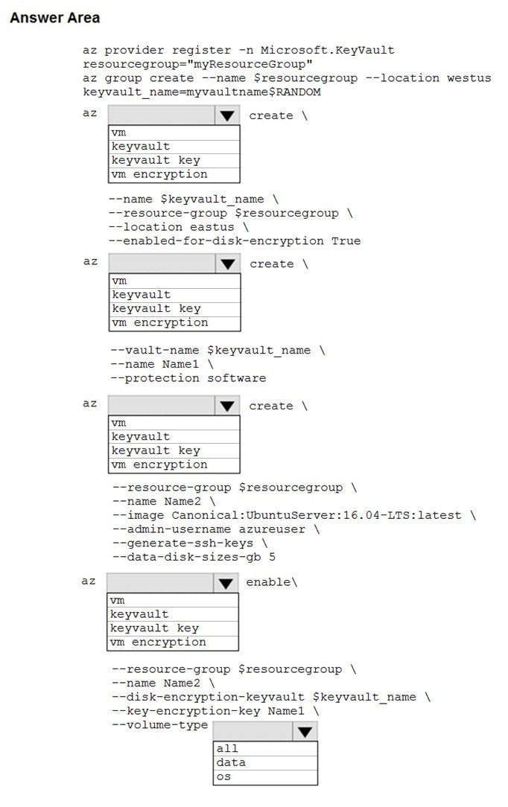

- [x] Cuadro 1: `keyvault`. Cuadro 2: `keyvault key`. Cuadro 3: `vm`. Cuadro 4: `vm encryption`. Cuadro 5: `all`.
- [ ] Cuadro 1: `vm`. Cuadro 2: `vm encryption`. Cuadro 3: `keyvault key`. Cuadro 4: `keyvault`. Cuadro 5: `data`.
- [ ] Cuadro 1: `vm encryption`. Cuadro 2: `vm`. Cuadro 3: `keyvault`. Cuadro 4: `keyvault key`. Cuadro 5: `all`.
- [ ] Cuadro 1: `keyvault key`. Cuadro 2: `keyvault`. Cuadro 3: `vm encryption`. Cuadro 4: `vm`. Cuadro 5: `os`.

**[⬆ Volver arriba](#table-of-contents)**

### Tu empresa está desarrollando una API de Azure alojada en Azure. Necesitas implementar autenticación para que la API de Azure acceda a otros recursos de Azure. Tienes los siguientes requisitos: Todas las llamadas a la API deben estar autenticadas. Los llamadores de la API no deben enviar credenciales a la API. ¿Qué mecanismo de autenticación debes usar?

- [ ] Basic.
- [ ] Anonymous.
- [x] Managed identity.
- [ ] Client certificate.

**[⬆ Volver arriba](#table-of-contents)**

### Estás usando Azure Front Door Service. Esperas que los archivos entrantes se compriman usando compresión Brotli. Descubres que los archivos XML entrantes no se comprimen. Los archivos tienen un tamaño de 9 megabytes (MB). Necesitas determinar la causa raíz del problema. Pregunta 1: El tipo MIME del archivo es compatible con el servicio.

- [ ] Sí.
- [x] No.

**[⬆ Volver arriba](#table-of-contents)**

### Estás usando Azure Front Door Service. Esperas que los archivos entrantes se compriman usando compresión Brotli. Descubres que los archivos XML entrantes no se comprimen. Los archivos tienen un tamaño de 9 megabytes (MB). Necesitas determinar la causa raíz del problema. Pregunta 2: Los nodos perimetrales deben purgarse de todos los activos en caché.

- [x] Sí.
- [ ] No.

**[⬆ Volver arriba](#table-of-contents)**

### Estás usando Azure Front Door Service. Esperas que los archivos entrantes se compriman usando compresión Brotli. Descubres que los archivos XML entrantes no se comprimen. Los archivos tienen un tamaño de 9 megabytes (MB). Necesitas determinar la causa raíz del problema. Pregunta 3: El tipo de compresión es compatible.

- [x] Sí.
- [ ] No.

**[⬆ Volver arriba](#table-of-contents)**

### Estás desarrollando una aplicación. Tienes una cuenta de usuario de Azure que tiene acceso a dos suscripciones. Necesitas recuperar un secreto de clave de cuenta de almacenamiento de Azure Key Vault. ¿En qué orden debes organizar los comandos de PowerShell para desarrollar la solución?

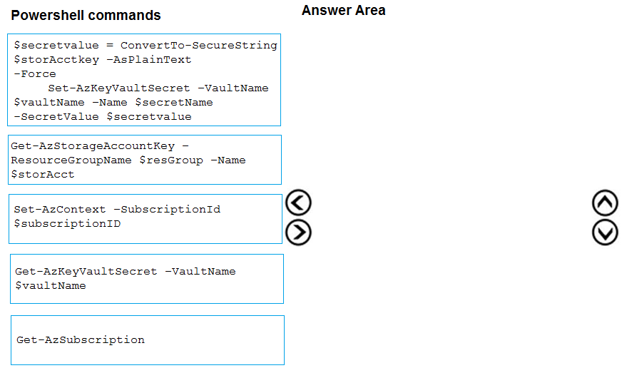

- [ ] Cuadro 1: `Get-AzSubscription`. Cuadro 2: `Set-AzContext -SubscriptionId $subscriptionID`. Cuadro 3: `Get-AzStorageAccountKey -ResourceGroupName $resGroup -Name $storAcct`. Cuadro 4: `Get-AzKeyVaultSecret -VaultName $vaultName`. Cuadro 5: `$secretvalue = ConvertTo-SecureString $storAcctkey -AsPlainText -Force Set-AzKeyVaultSecret -VaultName $vaultName -Name $secretName -SecretValue $secretvalue`.
- [ ] Cuadro 1: `Set-AzContext -SubscriptionId $subscriptionID`. Cuadro 2: `Get-AzStorageAccountKey -ResourceGroupName $resGroup -Name $storAcct`. Cuadro 3: `Get-AzKeyVaultSecret -VaultName $vaultName`. Cuadro 4: `$secretvalue = ConvertTo-SecureString $storAcctkey -AsPlainText -Force Set-AzKeyVaultSecret -VaultName $vaultName -Name $secretName -SecretValue $secretvalue`. Cuadro 5: `Get-AzSubscription`.
- [x] Cuadro 1: `Get-AzSubscription`. Cuadro 2: `Set-AzContext -SubscriptionId $subscriptionID`. Cuadro 3: `Get-AzStorageAccountKey -ResourceGroupName $resGroup -Name $storAcct`. Cuadro 4: `$secretvalue = ConvertTo-SecureString $storAcctkey -AsPlainText -Force Set-AzKeyVaultSecret -VaultName $vaultName -Name $secretName -SecretValue $secretvalue`. Cuadro 5: `Get-AzKeyVaultSecret -VaultName $vaultName`.
- [ ] Cuadro 1: `Get-AzKeyVaultSecret -VaultName $vaultName`. Cuadro 2: `Get-AzSubscription`. Cuadro 3: `Set-AzContext -SubscriptionId $subscriptionID`. Cuadro 4: `Get-AzStorageAccountKey -ResourceGroupName $resGroup -Name $storAcct`. Cuadro 5: `$secretvalue = ConvertTo-SecureString $storAcctkey -AsPlainText -Force Set-AzKeyVaultSecret -VaultName $vaultName -Name $secretName -SecretValue $secretvalue`.

**[⬆ Volver arriba](#table-of-contents)**

### Desarrollas soluciones de Azure. Debes otorgar acceso a una máquina virtual (VM) a grupos de recursos específicos en Azure Resource Manager. Necesitas obtener un token de acceso de Azure Resource Manager. Solución: Usar un certificado `X.509` para autenticar la VM con Azure Resource Manager. ¿La solución cumple con el objetivo?

- [ ] Sí.
- [x] No.

**[⬆ Volver arriba](#table-of-contents)**

### Desarrollas soluciones de Azure. Debes otorgar acceso a una máquina virtual (VM) a grupos de recursos específicos en Azure Resource Manager. Necesitas obtener un token de acceso de Azure Resource Manager. Solución: Usar el rol de control de acceso basado en roles (RBAC) `Reader` para autenticar la VM con Azure Resource Manager. ¿La solución cumple con el objetivo?

- [ ] Sí.
- [x] No.

**[⬆ Volver arriba](#table-of-contents)**

### Estás construyendo un sitio web que se usa para reseñar restaurantes. El sitio web usará una Azure CDN para mejorar el rendimiento y agregar funcionalidad a las solicitudes. Construyes e implementas una aplicación móvil para iPhones de Apple. Cada vez que un usuario accede al sitio web desde un iPhone, el usuario debe ser redirigido a la App Store. Necesitas implementar una regla de Azure CDN que asegure que los usuarios de iPhone sean redirigidos a la App Store. ¿Cómo debes completar la plantilla de Azure Resource Manager?

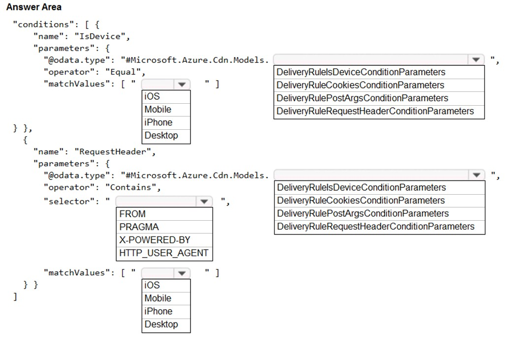

- [ ] Cuadro 1: `iOS`. Cuadro 2: `DeliveryRulelsDeviceConditionParameters`. Cuadro 3: `HTTP_USER_AGENT`. Cuadro 4: `DeliveryRuleRequestHeaderConditionParameters`. Cuadro 5: `iOS`.
- [x] Cuadro 1: `Mobile`. Cuadro 2: `DeliveryRulelsDeviceConditionParameters`. Cuadro 3: `HTTP_USER_AGENT`. Cuadro 4: `DeliveryRuleRequestHeaderConditionParameters`. Cuadro 5: `iPhone`.
- [ ] Cuadro 1: `Desktop`. Cuadro 2: `DeliveryRuleCookiesConditionParameters`. Cuadro 3: `PRAGMA`. Cuadro 4: `DeliveryRulelsDeviceConditionParameters`. Cuadro 5: `Desktop`.
- [ ] Cuadro 1: `iOS`. Cuadro 2: `DeliveryRulelsDeviceConditionParameters`. Cuadro 3: `FROM`. Cuadro 4: `DeliveryRulePostArgsConditionParameters`. Cuadro 5: `Mobile`.

**[⬆ Volver arriba](#table-of-contents)**

<a id="you-are-developing-a-website-that-will-run-as-an-azure-web-app-users-will-authenticate-by-using-their-microsoft-entra-id-credentials-you-plan-to-assign-users-one-of-the-following-permission-levels-for-the-website-admin-normal-and-reader-a-users-microsoft-entra-id-group-membership-must-be-used-to-determine-the-permission-level-you-need-to-configure-authorization-solution-configure-and-use-integrated-windows-authentication-in-the-website-in-the-website-query-microsoft-graph-api-to-load-the-group-to-which-the-user-is-a-member-does-the-solution-meet-the-goal"></a>
### Estás desarrollando un sitio web que se ejecutará como una Azure Web App. Los usuarios se autenticarán usando sus credenciales de Microsoft Entra ID. Planeas asignar a los usuarios uno de los siguientes niveles de permiso para el sitio web: `admin`, `normal` y `reader`. La pertenencia a grupos de Microsoft Entra ID del usuario debe usarse para determinar el nivel de permiso. Necesitas configurar la autorización. Solución: Configurar y usar Autenticación Integrada de Windows en el sitio web. En el sitio web, consultar la API de Microsoft Graph para cargar el grupo al que pertenece el usuario. ¿La solución cumple con el objetivo?

- [ ] Sí.
- [x] No.

**[⬆ Volver arriba](#table-of-contents)**

### Desarrollas soluciones de Azure. Debes otorgar acceso a una máquina virtual (VM) a grupos de recursos específicos en Azure Resource Manager. Necesitas obtener un token de acceso de Azure Resource Manager. Solución: Ejecutar el cmdlet `Invoke-RestMethod` para realizar una solicitud al punto de conexión de identidad administrada local para recursos de Azure. ¿La solución cumple con el objetivo?

- [x] Sí.
- [ ] No.

**[⬆ Volver arriba](#table-of-contents)**

<a id="your-companys-azure-subscription-includes-an-azure-log-analytics-workspace-your-company-has-a-hundred-on-premises-servers-that-run-either-windows-server-2012-r2-or-windows-server-2016-and-is-linked-to-the-azure-log-analytics-workspace-the-azure-log-analytics-workspace-is-set-up-to-gather-performance-counters-associated-with-security-from-these-linked-servers-you-must-configure-alerts-based-on-the-information-gathered-by-the-azure-log-analytics-workspace-you-have-to-make-sure-that-alert-rules-allow-for-dimensions-and-that-alert-creation-time-should-be-kept-to-a-minimum-furthermore-a-single-alert-notification-must-be-created-when-the-alert-is-created-and-when-the-alert-is-resolved-you-need-to-make-use-of-the-necessary-signal-type-when-creating-the-alert-rules-which-of-the-following-is-the-option-you-should-use"></a>
### La suscripción de Azure de tu empresa incluye un workspace de Azure Log Analytics. Tu empresa tiene cien servidores locales que ejecutan Windows Server 2012 R2 o Windows Server 2016, y están vinculados al workspace de Azure Log Analytics. El workspace de Azure Log Analytics está configurado para recopilar contadores de rendimiento asociados con la seguridad de estos servidores vinculados. Debes configurar alertas basadas en la información recopilada por el workspace de Azure Log Analytics. Debes asegurarte de que las reglas de alerta permitan dimensiones y que el tiempo de creación de alertas se mantenga al mínimo. Además, se debe crear una única notificación de alerta cuando se cree la alerta y cuando se resuelva la alerta. Necesitas usar el tipo de señal necesario al crear las reglas de alerta. ¿Cuál de las siguientes opciones debes usar?

- [ ] El tipo de señal del registro de actividad.
- [ ] El tipo de señal del registro de aplicación.
- [x] El tipo de señal métrica.
- [ ] El tipo de señal del registro de auditoría.

**[⬆ Volver arriba](#table-of-contents)**

### Estás desarrollando una aplicación .NET Core MVC que permite a los clientes investigar proveedores independientes de alojamiento vacacional. Quieres implementar Azure Search para permitir que la aplicación busque en el índice usando varios criterios para localizar documentos relacionados con alojamiento. Quieres que la aplicación permita a los clientes buscar en el índice usando expresiones regulares. ¿Qué debes hacer?

- [ ] Configure la propiedad `SearchMode` de la clase `SearchParameters`.
- [x] Configure la propiedad `QueryType` de la clase `SearchParameters`.
- [ ] Configure la propiedad `Facets` de la clase `SearchParameters`.
- [ ] Configure la propiedad `Filter` de la clase `SearchParameters`.

**[⬆ Volver arriba](#table-of-contents)**

### Eres desarrollador en tu empresa. Necesitas actualizar las definiciones de una Logic App existente. ¿Qué debes usar?

- [ ] El paquete de integración empresarial (EIP).
- [x] La vista de código de la aplicación lógica.
- [ ] Las conexiones API.
- [ ] El diseñador de aplicaciones lógicas.

**[⬆ Volver arriba](#table-of-contents)**

### El clúster usa Azure Monitor para contenedores para monitorear el clúster. La aplicación tiene sesiones persistentes habilitadas en el controlador de ingreso. Algunos clientes reportan una gran cantidad de errores en la aplicación en las últimas 24 horas. Necesitas determinar en qué máquinas virtuales (VM) están ocurriendo los errores. ¿Cómo debes completar la consulta de Azure Monitor?

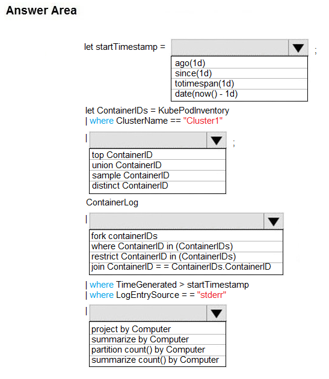

- [x] Cuadro 1: `ago(1d)`. Cuadro 2: `distinct ContainerID`. Cuadro 3: `where ContainerID in (ContainerIDs)`. Cuadro 4: `summarize count() by Computer`.
- [ ] Cuadro 1: `date(now() - 1d)`. Cuadro 2: `sample ContainerID`. Cuadro 3: `where ContainerID in (ContainerIDs)`. Cuadro 4: `partition count() by Computer`.
- [ ] Cuadro 1: `ago(1d)`. Cuadro 2: `distinct ContainerID`. Cuadro 3: `join ContainerID = = ContainerIDs.ContainerID`. Cuadro 4: `summarize by Computer`.
- [ ] Cuadro 1: `totimespan(1d)`. Cuadro 2: `top ContainerID`. Cuadro 3: `fork containerIDs`. Cuadro 4: `project by Computer`.

**[⬆ Volver arriba](#table-of-contents)**

### Planeas implementar una web app en App Service en Linux. Creas un plan de App Service. Creas y envías una imagen Docker personalizada que contiene la web app a Azure Container Registry. Necesitas acceder a los registros de consola generados desde dentro del contenedor en tiempo real. ¿Cómo debes completar el comando de Azure CLI?

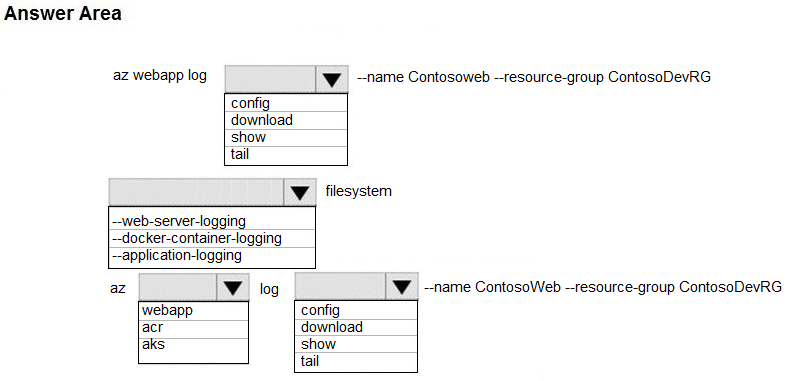

- [x] Cuadro 1: `config`. Cuadro 2: `--docker-container-logging`. Cuadro 3: `webapp`. Cuadro 4: `tail`.
- [ ] Cuadro 1: `tail`. Cuadro 2: `--web-server-logging`. Cuadro 3: `aks` Cuadro 4: `show` .
- [ ] Cuadro 1: `show`. Cuadro 2: `--web-server-logging`. Cuadro 3: `acr`. Cuadro 4: `config`.
- [ ] Cuadro 1: `config`. Cuadro 2: `--application-logging`. Cuadro 3: `webapp`. Cuadro 4: `show`.

**[⬆ Volver arriba](#table-of-contents)**

<a id="a-web-service-provides-customer-summary-information-for-e-commerce-partners-the-web-service-is-implemented-as-an-azure-function-app-with-an-http-trigger-access-to-the-api-is-provided-by-an-azure-api-management-instance-the-api-management-instance-is-configured-in-consumption-plan-mode-all-api-calls-are-authenticated-by-using-oauth-api-calls-must-be-cached-customers-must-not-be-able-to-view-cached-data-for-other-customers-you-need-to-configure-api-management-policies-for-caching-how-should-you-complete-the-policy-statement"></a>
### Desarrollas una aplicación que permite a los usuarios subir fotos y videos a Azure Storage. La aplicación usa una llamada a la API REST de almacenamiento para subir los medios a una cuenta de Blob Storage llamada `Account1`. Tienes contenedores de Blob Storage llamados `Container1` y `Container2`. La carga de videos ocurre de forma irregular. Necesitas copiar blobs específicos de `Container1` a `Container2` cuando se sube un nuevo video. ¿Qué debes hacer?

- [ ] Copie blobs en `Container2` mediante la operación Put Blob de la API REST de Blob Service.
- [x] Cree un tema de Event Grid que use el cmdlet `Start-AzureStorageBlobCopy`.
- [ ] Utilice `AzCopy` con el modificador Instantánea para copiar blobs en `Container2`.
- [ ] Descargue el blob en una máquina virtual y luego cárguelo en `Container2`.

**[⬆ Volver arriba](#table-of-contents)**

### Un servicio web proporciona información resumida de clientes para socios de comercio electrónico. El servicio web se implementa como una Azure Function App con un desencadenador HTTP. El acceso a la API se proporciona mediante una instancia de Azure API Management. La instancia de API Management está configurada en modo de plan de consumo. Todas las llamadas a la API se autentican usando OAuth. Las llamadas a la API deben almacenarse en caché. Los clientes no deben poder ver datos en caché de otros clientes. Necesitas configurar políticas de API Management para el almacenamiento en caché. ¿Cómo debes completar la declaración de política?

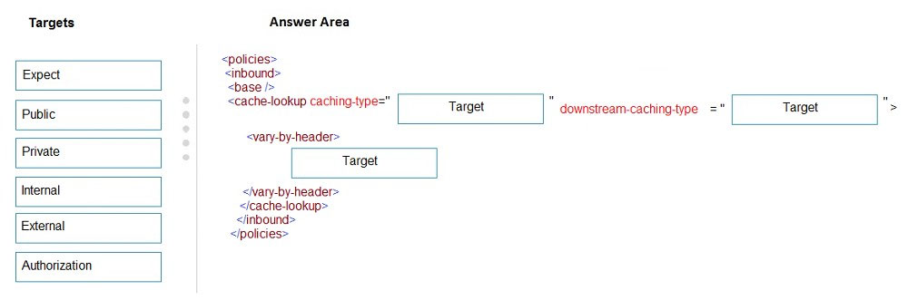

- [ ] tipo de almacenamiento en caché: `Internal` . tipo de almacenamiento en caché descendente: `Private` . variar por encabezado: `Authorization`.
- [ ] tipo de almacenamiento en caché: `Public` . tipo de almacenamiento en caché descendente: `Expect` . variar por encabezado: `Private`.
- [ ] tipo de almacenamiento en caché: `Internal` . tipo de almacenamiento en caché descendente: `External` . variar por encabezado: `Authorization`.
- [x] tipo de almacenamiento en caché: `External` . tipo de almacenamiento en caché descendente: `Private` . variar por encabezado: `Authorization`.

**[⬆ Volver arriba](#table-of-contents)**

<a id="contoso-ltd-provides-an-api-to-customers-by-using-azure-api-management-apim-the-api-authorizes-users-with-a-jwt-token-you-must-implement-response-caching-for-the-apim-gateway-the-caching-mechanism-must-detect-the-user-id-of-the-client-that-accesses-data-for-a-given-location-and-cache-the-response-for-that-user-id-you-need-to-add-the-following-policies-to-the-policies-file-a-set-variable-policy-to-store-the-detected-user-identity-a-cache-lookup-value-policy-a-cache-store-value-policy-a-find-and-replace-policy-to-update-the-response-body-with-the-user-profile-information-to-which-policy-section-should-you-add-the-policies"></a>
### Estás desarrollando un sitio web ASP.NET Core que usa Azure FrontDoor. El sitio web se usa para construir conjuntos de datos meteorológicos personalizados para investigadores. Los conjuntos de datos son descargados por los usuarios como archivos de valores separados por comas (CSV). Los datos se actualizan cada 10 horas. Archivos específicos deben purgarse de la caché de FrontDoor basándose en los valores del encabezado de respuesta. Necesitas purgar activos individuales de la caché de Front Door. ¿Qué tipo de purga de caché debes usar?

- [x] `single path`.
- [ ] `wildcard`.
- [ ] `root domain`.

**[⬆ Volver arriba](#table-of-contents)**

### Contoso, Ltd. proporciona una API a los clientes usando Azure API Management (APIM). La API autoriza a los usuarios con un token JWT. Debes implementar almacenamiento en caché de respuestas para la puerta de enlace de APIM. El mecanismo de almacenamiento en caché debe detectar el ID de usuario del cliente que accede a los datos de una ubicación dada y almacenar en caché la respuesta para ese ID de usuario. Necesitas agregar las siguientes políticas al archivo de políticas: una política set-variable para almacenar la identidad de usuario detectada, una política cache-lookup-value, una política cache-store-value, una política find-and-replace para actualizar el cuerpo de la respuesta con la información del perfil de usuario. ¿A qué sección de política debes agregar las políticas?

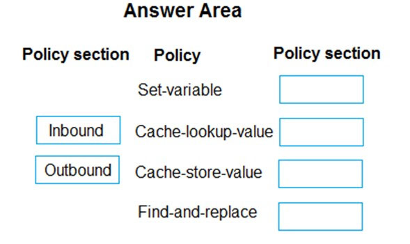

- [x] Variable de conjunto: entrante. Valor de búsqueda de caché: entrante. Valor del almacén de caché: saliente. Buscar y reemplazar: saliente.
- [ ] Variable de conjunto: Saliente. Valor de búsqueda de caché: entrante. Valor del almacén de caché: saliente. Buscar y reemplazar: entrante.
- [ ] Variable de conjunto: entrante. Valor de búsqueda de caché: saliente. Valor del almacén de caché: entrante. Buscar y reemplazar: saliente.
- [ ] Variable de conjunto: Saliente. Valor de búsqueda de caché: saliente. Valor del almacén de caché: entrante. Buscar y reemplazar: entrante.

**[⬆ Volver arriba](#table-of-contents)**

<a id="you-develop-and-deploy-an-azure-logic-app-that-calls-an-azure-function-app-the-azure-function-app-includes-an-openapi-swagger-definition-and-uses-an-azure-blob-storage-account-all-resources-are-secured-by-using-microsoft-entra-id-the-logic-app-must-use-azure-monitor-logs-to-record-and-store-information-about-runtime-data-and-events-the-logs-must-be-stored-in-the-azure-blob-storage-account-you-need-to-set-up-azure-monitor-logs-and-collect-diagnostics-data-for-the-azure-logic-app-which-three-actions-should-you-perform-in-sequence"></a>
### Estás desarrollando una aplicación para recuperar información de perfil de usuario. La aplicación usará el SDK de Microsoft Graph. La aplicación debe recuperar información de perfil de usuario usando una llamada a la API de Microsoft Graph. Necesitas llamar a la API de Microsoft Graph desde la aplicación. ¿En qué orden debes realizar las acciones?

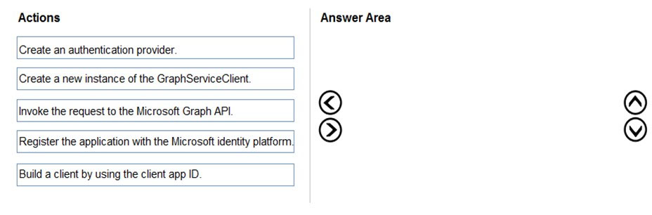

- [x] Casilla 1: Registre la aplicación en la plataforma de identidad de Microsoft. Cuadro 2: Cree un cliente utilizando el ID de la aplicación del cliente. Cuadro 3: Cree un proveedor de autenticación. Cuadro 4: Cree una nueva instancia de GraphServiceClient. Cuadro 5: Invocar la solicitud a la API de Microsoft Graph.
- [ ] Cuadro 1: Invoque la solicitud a la API de Microsoft Graph. Cuadro 2: Cree un proveedor de autenticación. Casilla 3: Registre la aplicación en la plataforma de identidad de Microsoft. Cuadro 4: Cree un cliente utilizando el ID de la aplicación del cliente. Cuadro 5: Cree una nueva instancia de GraphServiceClient.
- [ ] Cuadro 1: cree un cliente utilizando el ID de la aplicación del cliente. Casilla 2: Registre la aplicación en la plataforma de identidad de Microsoft. Cuadro 3: Cree un proveedor de autenticación. Cuadro 4: Cree una nueva instancia de GraphServiceClient. Cuadro 5: Invocar la solicitud a la API de Microsoft Graph.
- [ ] Casilla 1: Registre la aplicación en la plataforma de identidad de Microsoft. Cuadro 2: Cree un cliente utilizando el ID de la aplicación del cliente. Cuadro 3: Invocar la solicitud a la API de Microsoft Graph. Cuadro 4: Cree una nueva instancia de GraphServiceClient. Cuadro 5: Cree un proveedor de autenticación. API gráfica.

**[⬆ Volver arriba](#table-of-contents)**

### Desarrollas e implementas una Azure Logic App que llama a una Azure Function App. La Azure Function App incluye una definición OpenAPI (Swagger) y usa una cuenta de Azure Blob Storage. Todos los recursos están protegidos usando Microsoft Entra ID. La Logic App debe usar registros de Azure Monitor para registrar y almacenar información sobre datos y eventos de tiempo de ejecución. Los registros deben almacenarse en la cuenta de Azure Blob Storage. Necesitas configurar los registros de Azure Monitor y recopilar datos de diagnóstico para la Azure Logic App. ¿Qué tres acciones debes realizar en secuencia?

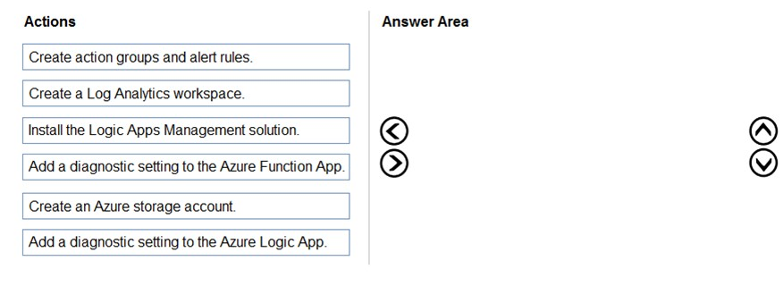

- [x] Cuadro 1: Crear un área de trabajo de Log Analytics. Cuadro 2: Instale la solución Logic Apps Management. Cuadro 3: Agregar una configuración de diagnóstico a la aplicación Azure Logic.
- [ ] Cuadro 1: Instalar la solución Logic Apps Management. Cuadro 2: Agregar una configuración de diagnóstico a la aplicación de funciones de Azure. Cuadro 3: Crear grupos de acciones y reglas de alerta.
- [ ] Cuadro 1: Agregar una configuración de diagnóstico a la aplicación de funciones de Azure. Cuadro 2: Crear un área de trabajo de Log Analytics. Cuadro 3: Crear grupos de acciones y reglas de alerta.
- [ ] Cuadro 1: Crear un área de trabajo de Log Analytics. Cuadro 2: Crear grupos de acciones y reglas de alerta. Cuadro 3: Agregar una configuración de diagnóstico a la aplicación de funciones de Azure.

**[⬆ Volver arriba](#table-of-contents)**

### Desarrollas una aplicación. Planeas hospedar la aplicación en un conjunto de máquinas virtuales (VM) en Azure. Necesitas configurar Azure Monitor para recopilar registros de la aplicación. ¿Qué cuatro acciones debes realizar en secuencia?

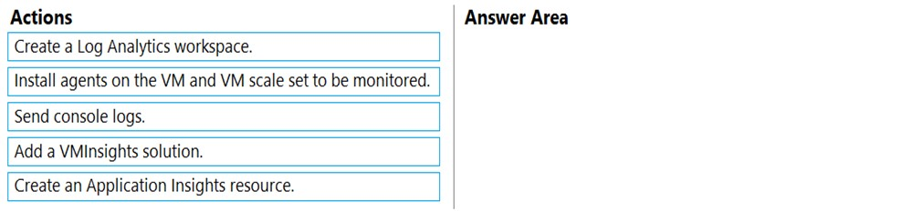

- [x] Cuadro 1: Crear un área de trabajo de Log Analytics. Cuadro 2: Agregar una solución VMInsights. Cuadro 3: Instale agentes en la VM y el conjunto de escalado de VM que se van a monitorear. Cuadro 4: Crear un recurso de Application Insights.
- [ ] Cuadro 1: Agregar una solución VMInsights. Cuadro 2: Crear un área de trabajo de Log Analytics. Cuadro 3: AInstale agentes en la máquina virtual y el conjunto de escala de máquina virtual que se va a monitorear. Cuadro 4: Crear un recurso de Application Insights.
- [ ] Cuadro 1: Crear un recurso de Application Insights. Cuadro 2: Agregar una solución VMInsights. Cuadro 3: AInstale agentes en la máquina virtual y el conjunto de escala de máquina virtual que se va a monitorear. Cuadro 4: Crear un área de trabajo de Log Analytics.
- [ ] Cuadro 1: Crear un área de trabajo de Log Analytics. Cuadro 2: Agregar una solución VMInsights. Cuadro 3: Crear un recurso de Application Insights. Cuadro 4: Instale agentes en la VM y el conjunto de escalado de VM que se van a monitorear.

**[⬆ Volver arriba](#table-of-contents)**

### Tienes una aplicación que proporciona datos de pronóstico meteorológico a socios externos. Usas Azure API Management para publicar API. Debes cambiar el comportamiento de la API para cumplir los siguientes requisitos: Soportar parámetros de entrada alternativos. Eliminar texto de formato de las respuestas. Proporcionar contexto adicional a los servicios back-end. ¿Qué tipos de políticas debes implementar?

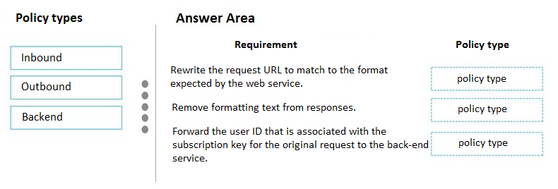

- [x] Vuelva a escribir la URL de solicitud para que coincida con el formato esperado por el servicio web: entrante. Eliminar texto de formato de las respuestas: Saliente. Reenvíe el ID de usuario asociado con la clave de suscripción para la solicitud original al servicio back-end: Entrante.
- [ ] Vuelva a escribir la URL de solicitud para que coincida con el formato esperado por el servicio web: entrante. Eliminar texto de formato de las respuestas: Saliente. Reenvíe el ID de usuario asociado con la clave de suscripción para la solicitud original al servicio backend: Backend.
- [ ] Vuelva a escribir la URL de solicitud para que coincida con el formato esperado por el servicio web: entrante. Eliminar texto de formato de las respuestas: Backend. Reenvíe el ID de usuario asociado con la clave de suscripción para la solicitud original al servicio back-end: Entrante.
- [ ] Vuelva a escribir la URL de solicitud para que coincida con el formato esperado por el servicio web: Backend. Eliminar texto de formato de las respuestas: Backend. Reenvíe el ID de usuario asociado con la clave de suscripción para la solicitud original al servicio back-end: Entrante.

**[⬆ Volver arriba](#table-of-contents)**

### Tu empresa está desarrollando una API de Azure. Necesitas implementar autenticación para la API de Azure. Tienes los siguientes requisitos: Todas las llamadas a la API deben ser seguras. Los llamadores de la API no deben enviar credenciales a la API. ¿Qué mecanismo de autenticación debes usar?

- [ ] Basic.
- [ ] Anonymous.
- [x] Managed identity.
- [ ] Client certificate.

**[⬆ Volver arriba](#table-of-contents)**

### Eres desarrollador de una empresa SaaS que ofrece muchos servicios web. Todos los servicios web de la empresa deben cumplir los siguientes requisitos: Usar API Management para acceder a los servicios, usar OpenID Connect para autenticación, prevenir el uso anónimo. Una auditoría de seguridad reciente descubrió que varios servicios web pueden llamarse sin autenticación. ¿Qué política de API Management debes implementar?

- [ ] `jsonp`.
- [ ] `authentication-certificate`.
- [ ] `check-header`.
- [x] `validate-jwt`.

**[⬆ Volver arriba](#table-of-contents)**

### Estás desarrollando una API REST de Azure App Service. La API debe ser llamada por una Azure App Service Web App. La API debe recuperar y actualizar información de perfil de usuario almacenada en Microsoft Entra ID. Necesitas configurar la API para realizar las actualizaciones. ¿Qué dos herramientas debes usar?

- [x] API de Microsoft Graph.
- [ ] Biblioteca de autenticación de Microsoft (MSAL).
- [x] Gestión de API de Azure.
- [ ] Microsoft Defender para la nube.
- [ ] SDK de Microsoft Azure Key Vault.

**[⬆ Volver arriba](#table-of-contents)**

### Desarrollas una API REST. Implementas un token SAS de delegación de usuario para comunicarte con Azure Blob Storage. El token se ve comprometido. Necesitas revocar el token. ¿Cuáles son dos formas posibles de lograr este objetivo?

- [x] Revocar la clave de delegación.
- [x] Elimine la política de acceso almacenada.
- [ ] Regenerar la clave de cuenta.
- [ ] Elimine la asignación de roles para el principio de seguridad.

**[⬆ Volver arriba](#table-of-contents)**

### Estás desarrollando una aplicación alojada en Azure que debe usar una clave de módulo de seguridad de hardware (HSM) local. La clave debe transferirse a tu Azure Key Vault existente usando el proceso Bring Your Own Key (BYOK). Necesitas transferir la clave de forma segura a Azure Key Vault. ¿Qué cuatro acciones debes realizar en secuencia?

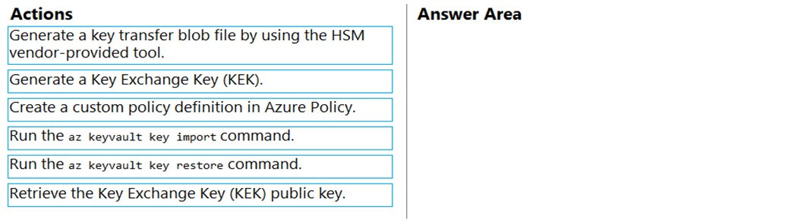

- [ ] Cuadro 1: Cree una definición de política personalizada en Azure Policy. Cuadro 2: Generar una clave de intercambio de claves (KEK). Cuadro 3: Recuperar la clave pública de clave de intercambio de claves (KEK). Cuadro 4: Ejecute el comando `az keyvault key import`.
- [ ] Cuadro 1: Cree una definición de política personalizada en Azure Policy. Cuadro 2: Recuperar la clave pública de clave de intercambio de claves (KEK). Cuadro 3: Genere un archivo blob de transferencia de claves mediante la herramienta HSM `vendor-provided`. Cuadro 4: Ejecute el comando `az keyvault key import`.
- [ ] Cuadro 1: Generar una clave de intercambio de claves (KEK). Cuadro 2: Recuperar la clave pública de clave de intercambio de claves (KEK). Cuadro 3: Genere un archivo blob de transferencia de claves mediante la herramienta HSM `vendor-provided`. Cuadro 4: Ejecute el comando `az keyvault key restore`.
- [x] Cuadro 1: Generar una clave de intercambio de claves (KEK). Cuadro 2: Recuperar la clave pública de clave de intercambio de claves (KEK). Cuadro 3: Genere un archivo blob de transferencia de claves mediante la herramienta HSM `vendor-provided`. Cuadro 4: Ejecute el comando `az keyvault key import`.

**[⬆ Volver arriba](#table-of-contents)**

### Desarrollas e implementas una Azure Logic App que llama a una Azure Function App. La Azure Function App incluye una definición OpenAPI (Swagger) y usa una cuenta de Azure Blob Storage. Todos los recursos están protegidos usando Microsoft Entra ID. La Azure Logic App debe acceder de forma segura a la cuenta de Azure Blob Storage. Los recursos de Microsoft Entra ID deben permanecer si se elimina la Azure Logic App. Necesitas proteger la Azure Logic App. ¿Qué debes hacer?

- [x] Cree una identidad administrada asignada por el usuario y asigne controles de acceso basados ​​en roles.
- [ ] Cree una función personalizada de Microsoft Entra ID y asígnela a la cuenta de Azure Blob Storage.
- [ ] Cree una Azure Key Vault y emita un certificado de cliente.
- [ ] Cree una identidad administrada asignada por el sistema y emita un certificado de cliente.
- [ ] Cree una función personalizada de Microsoft Entra ID y asigne controles de acceso basados ​​en funciones.

**[⬆ Volver arriba](#table-of-contents)**

### Administras varias Logic Apps existentes. Necesitas cambiar definiciones, agregar nueva lógica y optimizar estas aplicaciones de forma regular. ¿Qué debes usar?

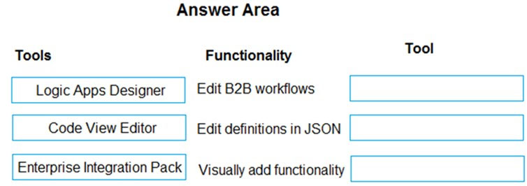

- [x] Editar flujos de trabajo B2B: paquete de integración empresarial. Editar definiciones en JSON: Editor de vista de código. Agregue funcionalidad visualmente: Diseñador de aplicaciones lógicas.
- [ ] Editar flujos de trabajo B2B: Diseñador de aplicaciones lógicas. Editar definiciones en JSON: Enterprise Integration Pack. Agregue funcionalidad visualmente: Editor de vista de código.
- [ ] Editar flujos de trabajo B2B: Editor de vista de código. Editar definiciones en JSON: Logic Apps Designer. Agregue funcionalidad visualmente: Paquete de integración empresarial.
- [ ] Editar flujos de trabajo B2B: paquete de integración empresarial. Editar definiciones en JSON: Editor de vista de código. Agregue funcionalidad visualmente: Editor de vista de código.

**[⬆ Volver arriba](#table-of-contents)**

### Estás desarrollando una solución que usará una base de datos Azure Cosmos DB multi-particionada. Planeas usar el SDK más reciente de Azure Cosmos DB para el desarrollo. La solución debe cumplir los siguientes requisitos: Enviar operaciones de inserción y actualización a una cuenta de Azure Blob Storage. Procesar cambios en todas las particiones inmediatamente. Permitir la paralelización del procesamiento de cambios. Necesitas procesar las operaciones de Azure Cosmos DB. ¿Cuáles son dos formas posibles de lograr este objetivo?

- [ ] Cree una API de Azure App Service e implemente el estimador de fuente de cambios del SDK. Escale la API mediante varias instancias de Azure App Service.
- [ ] Cree un trabajo en segundo plano en un servicio Azure Kubernetes e implemente la característica de fuente de cambios del SDK.
- [x] Cree una función de Azure para usar un desencadenador para Azure Cosmos DB. Configure el disparador para conectarse al contenedor.
- [x] Cree una función de Azure que use un objeto FeedIterator que procese la fuente de cambios mediante el modelo de extracción en el contenedor. Utilice un objeto FeedRange para paralelizar el procesamiento de la fuente de cambios en varias funciones.

**[⬆ Volver arriba](#table-of-contents)**

### Estás desarrollando una aplicación que usa Azure Storage Queues. Tienes el siguiente código. Pregunta 1: El código configura la duración del bloqueo para la cola.

- [ ] Sí.
- [x] No.

**[⬆ Volver arriba](#table-of-contents)**

### Estás desarrollando una aplicación que usa Azure Storage Queues. Tienes el siguiente código. Pregunta 2: El último mensaje leído permanece en la cola después de que se ejecuta el código.

- [x] Sí.
- [ ] No.

**[⬆ Volver arriba](#table-of-contents)**

<a id="you-develop-software-solutions-for-a-mobile-delivery-service-you-are-developing-a-mobile-app-that-users-can-use-to-order-from-a-restaurant-in-their-area-the-app-uses-the-following-workflow-1-a-driver-selects-the-restaurants-for-which-they-will-deliver-orders-2-orders-are-sent-to-all-available-drivers-in-an-area-3-only-orders-for-the-selected-restaurants-will-appear-for-the-driver-4-the-first-driver-to-accept-an-order-removes-it-from-the-list-of-available-orders-you-need-to-implement-an-azure-service-bus-solution-which-three-actions-should-you-perform-in-sequence"></a>
### Estás desarrollando una aplicación que usa Azure Storage Queues. Tienes el siguiente código. Pregunta 3: La cola de almacenamiento permanece en la cuenta de almacenamiento después de que se ejecuta el código.

- [x] Sí.
- [ ] No.

**[⬆ Volver arriba](#table-of-contents)**

### Desarrollas soluciones de software para un servicio de entrega móvil. Estás desarrollando una aplicación móvil que los usuarios pueden usar para ordenar de un restaurante en su área. La aplicación usa el siguiente flujo de trabajo: 1. Un conductor selecciona los restaurantes para los que entregará pedidos. 2. Los pedidos se envían a todos los conductores disponibles en un área. 3. Solo los pedidos de los restaurantes seleccionados aparecerán para el conductor. 4. El primer conductor en aceptar un pedido lo elimina de la lista de pedidos disponibles. Necesitas implementar una solución de Azure Service Bus. ¿Qué tres acciones debes realizar en secuencia?

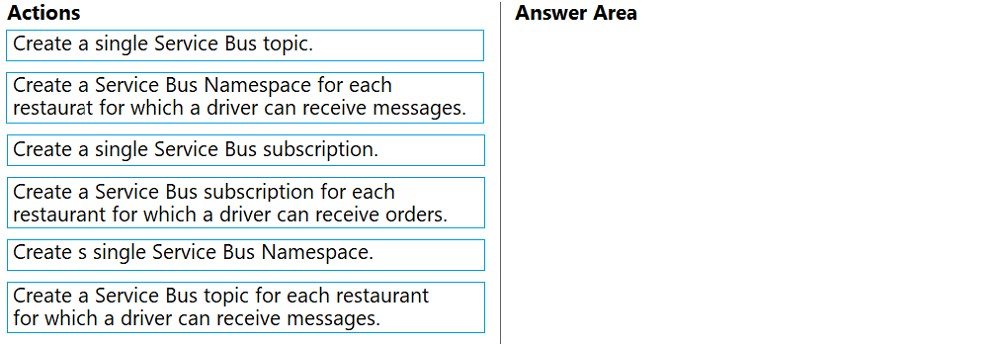

- [x] Cuadro 1: Cree un único espacio de nombres de Service Bus. Cuadro 2: Cree un único tema de Service Bus. Cuadro 3: Cree una suscripción a Service Bus para cada restaurante para el cual un conductor pueda recibir pedidos.
- [ ] Cuadro 1: Cree una suscripción a Service Bus para cada restaurante para el cual un conductor pueda recibir pedidos. Cuadro 2: Cree un tema de Service Bus para cada restaurante. Cuadro 3: Cree un espacio de nombres de Service Bus para cada uno.
- [ ] Cuadro 1: Cree un único tema de Service Bus. Cuadro 2: Cree una suscripción a Service Bus para cada restaurante para el cual un conductor pueda recibir pedidos. Cuadro 3: Cree un único tema de Service Bus.
- [ ] Cuadro 1: Cree un único tema de Service Bus. Cuadro 2: Cree un espacio de nombres de Service Bus para cada restaurante para el cual un conductor pueda recibir mensajes. Cuadro 3: Cree un espacio de nombres de Service Bus para cada uno.

**[⬆ Volver arriba](#table-of-contents)**

### Desarrollas una aplicación de contenido de noticias y blog para dispositivos Windows. Una notificación debe llegar al dispositivo del usuario cuando hay un nuevo artículo disponible para ver. Necesitas implementar notificaciones push. ¿Cómo debes completar el segmento de código?

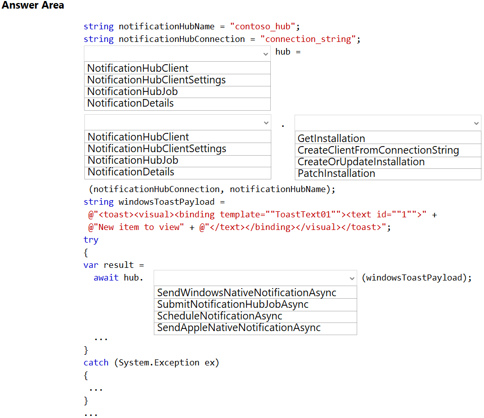

- [x] Cuadro 1: `NotificationHubClient`. Cuadro 2: `NotificationHubClient`. Cuadro 3: `CreateClientFromConnectionString`. Cuadro 4: `SendWindowsNativeNotificationAsync`.
- [ ] Cuadro 1: `NotificationHubJob`. Cuadro 2: `NotificationHubJob`. Cuadro 3: `PatchInstallation`. Cuadro 4: `SendWindowsNativeNotificationAsync`.
- [ ] Cuadro 1: `NotificationHubClientSettings`. Cuadro 2: `NotificationHubClientSettings`. Cuadro 3: `CreateOrUpdatelnstallation`. Cuadro 4: `ScheduleNotificationAsync`.
- [ ] Cuadro 1: `NotificationHubClientSettings`. Cuadro 2: `NotificationDetails`. Cuadro 3: `CreateOrUpdatelnstallation`. Cuadro 4: `SendWindowsNativeNotificationAsync`.

**[⬆ Volver arriba](#table-of-contents)**

### Estás desarrollando una solución de mensajería de Azure. Necesitas asegurar que la solución cumpla los siguientes requisitos: Proporcionar soporte transaccional. Proporcionar detección de duplicados. Almacenar los mensajes por un período de tiempo ilimitado. ¿Qué dos tecnologías cumplirán con los requisitos?

- [x] Tema del bus de servicio de Azure.
- [x] Cola de bus de servicio de Azure.
- [ ] Cola de almacenamiento de Azure.
- [ ] Centro de eventos de Azure.

**[⬆ Volver arriba](#table-of-contents)**

### Desarrollas una solución de gateway para una API de noticias pública. El back end de la API de noticias está implementado como un servicio RESTful y alojado en una instancia de Azure App Service. Necesitas configurar la autenticación de back-end para la instancia del servicio de API Management. ¿Qué tipo de destino y credencial de gateway debes usar?

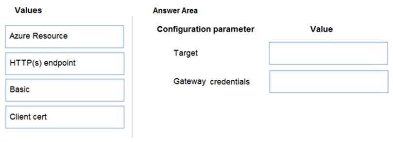

- [ ] Destino: recurso de Azure. Credenciales de puerta de enlace: certificado de cliente.
- [ ] Objetivo: certificado de cliente. Credenciales de puerta de enlace: Básicas.
- [ ] Destino: recurso de Azure. Credenciales de puerta de enlace: Básicas.
- [x] Destino: punto final HTTP(s). Credenciales de puerta de enlace: certificado de cliente.

**[⬆ Volver arriba](#table-of-contents)**

### Está creando una aplicación que usa Event Grid para conectarse con otros servicios. Los datos de eventos de su aplicación se enviarán a una función serverless que verifica el cumplimiento. Esta función es mantenida por su empresa. Escribe una nueva suscripción de eventos en el ámbito de su recurso. El evento debe invalidarse después de un período de tiempo específico. Necesita configurar Event Grid. ¿Qué debe hacer?

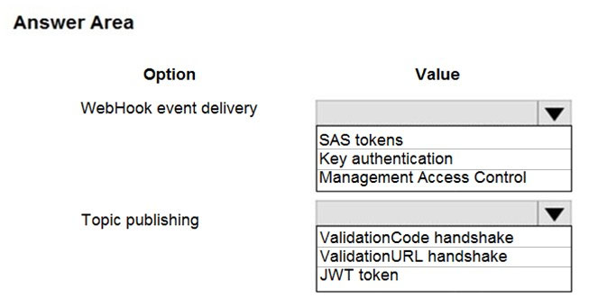

- [x] Entrega de eventos WebHook: tokens SAS. Publicación de temas: handshake ValidationCode.
- [ ] Entrega de eventos WebHook: autenticación por clave. Publicación de temas: handshake ValidationCode.
- [ ] Entrega de eventos WebHook: Management Access Control. Publicación de temas: handshake ValidationURL.
- [ ] Entrega de eventos WebHook: tokens SAS. Publicación de temas: handshake ValidationURL.

**[⬆ Volver arriba](#table-of-contents)**

### Está trabajando para Contoso, Ltd. Define un objeto de API Policy utilizando el siguiente marcado XML. Pregunta 1: El segmento XML pertenece a la sección `<inbound>` de la política.

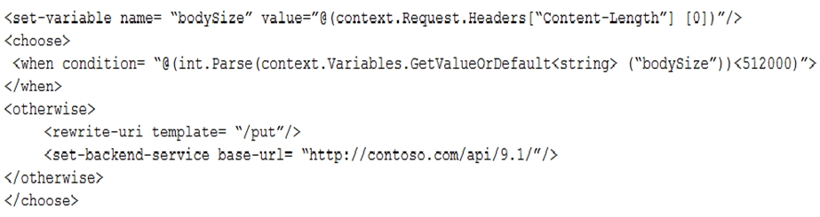

- [x] Sí.
- [ ] No.

**[⬆ Volver arriba](#table-of-contents)**

### Está trabajando para Contoso, Ltd. Define un objeto de API Policy utilizando el siguiente marcado XML. Pregunta 2: Si el tamaño del cuerpo es >256k, ocurrirá un error.

- [ ] Sí.
- [x] No.

**[⬆ Volver arriba](#table-of-contents)**

### Está trabajando para Contoso, Ltd. Define un objeto de API Policy utilizando el siguiente marcado XML. Pregunta 3: Si la solicitud es `http://contoso.com/api/9.2/`, la política retendrá la versión más alta.

- [ ] Sí.
- [x] No.

**[⬆ Volver arriba](#table-of-contents)**

### Desarrolla una solución de gateway para una API de noticias pública. El back end de la API de noticias está implementado como un servicio RESTful y utiliza una especificación OpenAPI. Necesita asegurarse de poder acceder a la API de noticias mediante una instancia del servicio Azure API Management. ¿Qué comando de Azure PowerShell debe ejecutar?

- [x] `Import-AzureRmApiManagementApi -Context $ApiMgmtContext -SpecificationFormat 'Swagger' -SpecificationPath $SwaggerPath -Path $Path`.
- [ ] `New-AzureRmApiManagementBackend -Context $ApiMgmtContext-Url $Url -Protocol http`.
- [ ] `New-AzureRmApiManagement -ResourceGroupName $ResourceGroup -Name $Name 'Location $Location -Organization $Org -AdminEmail $AdminEmail`.
- [ ] `New-AzureRmApiManagementBackendProxy -Url $ApiUrl`.

**[⬆ Volver arriba](#table-of-contents)**

### Está desarrollando una función de Azure que se conecta a una instancia de Azure SQL Database. La función se desencadena mediante una cola de Azure Storage. Recibe informes de numerosas System.InvalidOperationExceptions con el siguiente mensaje: 'Timeout expired. The timeout period elapsed prior to obtaining a connection from the pool. This may have occurred because all pooled connections were in use and max pool size was reached.' Necesita prevenir la excepción. ¿Qué debe hacer?

- [ ] En el archivo `host.json`, disminuir el valor de la opción `batchSize`.
- [ ] Convertir el desencadenador a Azure Event Hub.
- [x] Convertir la Azure Function al plan Premium.
- [ ] En el archivo `function.json`, cambiar el valor de la opción type a `queueScaling`.

**[⬆ Volver arriba](#table-of-contents)**

### Está desarrollando un servicio web REST. Los clientes accederán al servicio mediante una instancia de Azure API Management. El servicio web no maneja correctamente los conflictos. En lugar de devolver un código de estado HTTP 409, el servicio devuelve un código de estado 500. El cuerpo del mensaje de estado contiene solo la palabra conflict. Necesita asegurarse de que los conflictos produzcan la respuesta correcta. ¿Cómo debe completar la política?

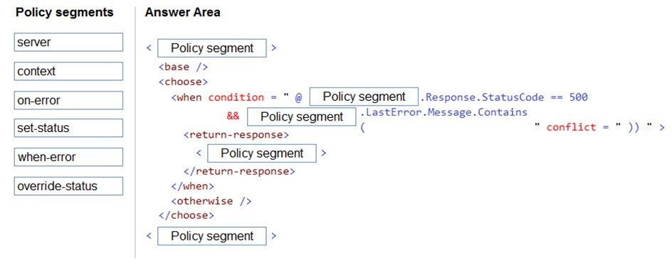

- [x] Cuadro 1: `on-error`. Cuadro 2: `context`. Cuadro 3: `context`. Cuadro 4: `set-status`. Cuadro 5: `on-error`.
- [ ] Cuadro 1: `when-error`. Cuadro 2: `context`. Cuadro 3: `server`. Cuadro 4: `override-status`. Cuadro 5: `on-error`.
- [ ] Cuadro 1: `when-error`. Cuadro 2: `context`. Cuadro 3: `context`. Cuadro 4: `set-status`. Cuadro 5: `on-error`.
- [ ] Cuadro 1: `on-error`. Cuadro 2: `context`. Cuadro 3: `server`. Cuadro 4: `override-status`. Cuadro 5: `on-error`.

**[⬆ Volver arriba](#table-of-contents)**

### Es desarrollador de una empresa de Software como Servicio (SaaS). Desarrolla soluciones que proporcionan la capacidad de enviar notificaciones mediante Azure Notification Hubs. Necesita crear código de ejemplo que los clientes puedan usar como referencia para enviar notificaciones sin formato (raw) a dispositivos Windows Push Notification Services (WNS). El código de ejemplo no debe usar paquetes externos. ¿Cómo debe completar el segmento de código?

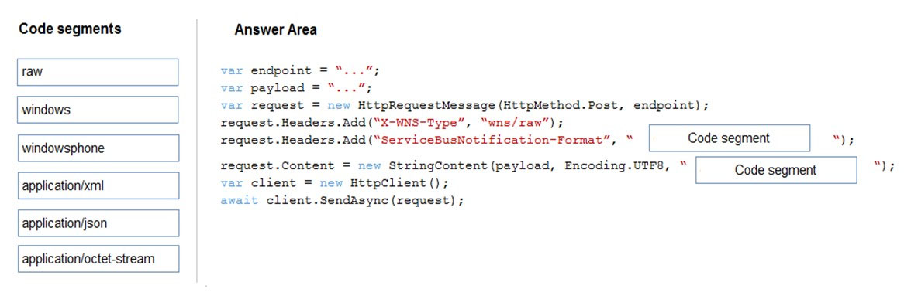

- [x] Cuadro 1: `windows`. Cuadro 2: `application/octet-stream`.
- [ ] Cuadro 1: `windowsphone`. Cuadro 2: `raw`.
- [ ] Cuadro 1: `windows`. Cuadro 2: `application/json`.
- [ ] Cuadro 1: `windowsphone`. Cuadro 2: `application/xml`.

**[⬆ Volver arriba](#table-of-contents)**

<a id="you-are-developing-an-azure-solution-to-collect-inventory-data-from-thousands-of-stores-located-around-the-world-each-store-location-will-send-the-inventory-data-hourly-to-an-azure-blob-storage-account-for-processing-the-solution-must-meet-the-following-requirements-begin-processing-when-data-is-saved-to-azure-blob-storage-filter-data-based-on-store-location-information-trigger-an-azure-logic-app-to-process-the-data-for-output-to-azure-cosmos-db-enable-high-availability-and-geographic-distribution-allow-24-hours-for-retries-implement-an-exponential-back-off-data-processing-you-need-to-configure-the-solution-what-should-you-implement"></a>
### Desarrolla e implementa una aplicación web ASP.NET en Azure App Service. Usa la telemetría de Application Insights para monitorear la aplicación. Debe probar la aplicación para asegurarse de que esté disponible y responda desde varios puntos del mundo a intervalos regulares. Si la aplicación no responde, debe enviar una alerta al personal de soporte. Necesita configurar una prueba para la aplicación web. ¿Qué dos tipos de prueba puede usar?

- [ ] Integration.
- [x] TrackAvailablity.
- [x] URL ping.
- [ ] Unit.
- [ ] Load.

**[⬆ Volver arriba](#table-of-contents)**

<a id="determine-whether-the-solution-meets-the-stated-goals-you-are-developing-and-deploying-several-aspnet-web-applications-to-azure-app-service-you-plan-to-save-session-state-information-and-html-output-you-must-use-a-storage-mechanism-with-the-following-requirements-share-session-state-across-all-aspnet-web-applications-support-controlled-concurrent-access-to-the-same-session-state-data-for-multiple-readers-and-a-single-writer-save-full-http-responses-for-concurrent-requests-you-need-to-store-the-information-proposed-solution-enable-application-request-routing-arr-does-the-solution-meet-the-goal"></a>
### Está desarrollando una solución de Azure para recopilar datos de inventario de miles de tiendas ubicadas en todo el mundo. Cada ubicación de tienda enviará los datos de inventario cada hora a una cuenta de Azure Blob Storage para su procesamiento. La solución debe cumplir con los siguientes requisitos: Comenzar el procesamiento cuando los datos se guarden en Azure Blob Storage. Filtrar datos según la información de ubicación de la tienda. Desencadenar una Azure Logic App para procesar los datos y enviarlos a Azure Cosmos DB. Habilitar alta disponibilidad y distribución geográfica. Permitir 24 horas para reintentos. Implementar un procesamiento de datos con retroceso exponencial. Necesita configurar la solución. ¿Qué debe implementar?

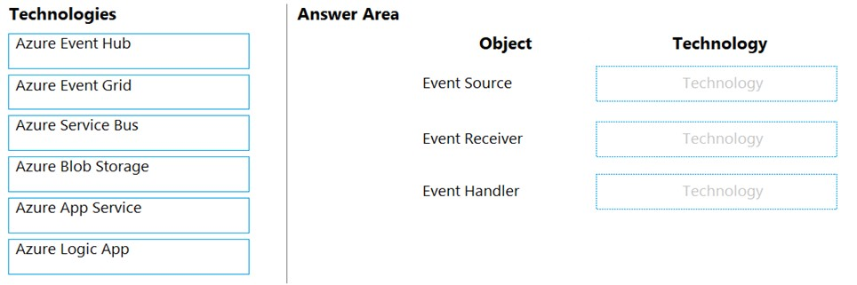

- [ ] Origen del evento: Azure Event Grid. Receptor del evento: Aplicación Azure Logic. Controlador del evento: Azure Service Bus.
- [ ] Origen del evento: Azure Service Bus. Receptor del evento: Azure App Service. Controlador del evento: Azure Blob Storage.
- [ ] Origen del evento: Azure Event Grid. Receptor del evento: Azure Service Bus. Controlador del evento: Azure Blob Storage.
- [x] Origen del evento: Azure Blob Storage. Receptor del evento: Azure Event Grid. Controlador del evento: Aplicación Azure Logic.

**[⬆ Volver arriba](#table-of-contents)**

<a id="determine-whether-the-solution-meets-the-stated-goals-you-are-developing-and-deploying-several-aspnet-web-applications-to-azure-app-service-you-plan-to-save-session-state-information-and-html-output-you-must-use-a-storage-mechanism-with-the-following-requirements-share-session-state-across-all-aspnet-web-applications-support-controlled-concurrent-access-to-the-same-session-state-data-for-multiple-readers-and-a-single-writer-save-full-http-responses-for-concurrent-requests-you-need-to-store-the-information-proposed-solution-deploy-and-configure-an-azure-database-for-postgresql-update-the-web-applications-does-the-solution-meet-the-goal"></a>
### Determine si la solución cumple con los objetivos establecidos. Está desarrollando e implementando varias aplicaciones web ASP.NET en Azure App Service. Planea guardar información del estado de sesión y salida HTML. Debe usar un mecanismo de almacenamiento con los siguientes requisitos: Compartir el estado de sesión entre todas las aplicaciones web ASP.NET. Soportar acceso concurrente controlado a los mismos datos de estado de sesión para múltiples lectores y un solo escritor. Guardar respuestas HTTP completas para solicitudes concurrentes. Necesita almacenar la información. Solución propuesta: Habilitar Application Request Routing (ARR). ¿La solución cumple con el objetivo?

- [ ] Sí.
- [x] No.

**[⬆ Volver arriba](#table-of-contents)**

<a id="determine-whether-the-solution-meets-the-stated-goals-you-are-developing-and-deploying-several-aspnet-web-applications-to-azure-app-service-you-plan-to-save-session-state-information-and-html-output-you-must-use-a-storage-mechanism-with-the-following-requirements-share-session-state-across-all-aspnet-web-applications-support-controlled-concurrent-access-to-the-same-session-state-data-for-multiple-readers-and-a-single-writer-save-full-http-responses-for-concurrent-requests-you-need-to-store-the-information-proposed-solution-deploy-and-configure-azure-cache-for-redis-update-the-web-applications-does-the-solution-meet-the-goal"></a>
### Determine si la solución cumple con los objetivos establecidos. Está desarrollando e implementando varias aplicaciones web ASP.NET en Azure App Service. Planea guardar información del estado de sesión y salida HTML. Debe usar un mecanismo de almacenamiento con los siguientes requisitos: Compartir el estado de sesión entre todas las aplicaciones web ASP.NET. Soportar acceso concurrente controlado a los mismos datos de estado de sesión para múltiples lectores y un solo escritor. Guardar respuestas HTTP completas para solicitudes concurrentes. Necesita almacenar la información. Solución propuesta: Implementar y configurar una Azure Database for PostgreSQL. Actualizar las aplicaciones web. ¿La solución cumple con el objetivo?

- [ ] Sí.
- [x] No.

**[⬆ Volver arriba](#table-of-contents)**

### Determine si la solución cumple con los objetivos establecidos. Está desarrollando e implementando varias aplicaciones web ASP.NET en Azure App Service. Planea guardar información del estado de sesión y salida HTML. Debe usar un mecanismo de almacenamiento con los siguientes requisitos: Compartir el estado de sesión entre todas las aplicaciones web ASP.NET. Soportar acceso concurrente controlado a los mismos datos de estado de sesión para múltiples lectores y un solo escritor. Guardar respuestas HTTP completas para solicitudes concurrentes. Necesita almacenar la información. Solución propuesta: Implementar y configurar Azure Cache for Redis. Actualizar las aplicaciones web. ¿La solución cumple con el objetivo?

- [x] Sí.
- [ ] No.

**[⬆ Volver arriba](#table-of-contents)**

### Una empresa está desarrollando una plataforma de juegos. Los usuarios pueden unirse a equipos para jugar en línea y ver tablas de clasificación que incluyen estadísticas de jugadores. La solución incluye una entidad llamada `Team`. Planea implementar una instancia de Azure Redis Cache para mejorar la eficiencia de las operaciones de datos para entidades que rara vez cambian. Necesita invalidar la caché cuando los datos del equipo cambien. ¿Cómo debe completar el código?

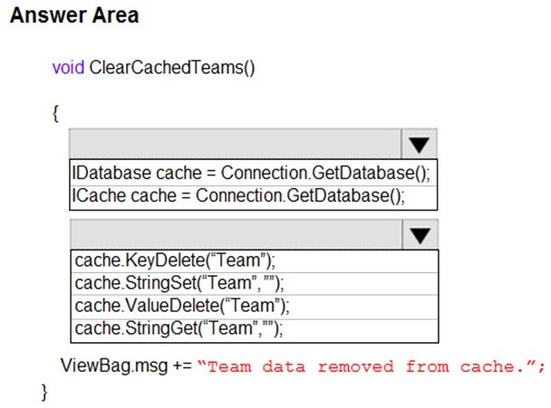

- [ ] Cuadro 1: `IDatabase cache = Connection.GetDatabase();`. Cuadro 2: `cache.StringSet('Team', '');`.
- [x] Cuadro 1: `IDatabase cache = Connection.GetDatabase();`. Cuadro 2: `cache KeyDelete('Team');`.
- [ ] Cuadro 1: `ICache cache = Connection.GetDatabase();`. Cuadro 2: `cache KeyDelete('Team');`.
- [ ] Cuadro 1: `ICache cache = Connection.GetDatabase();`. Cuadro 2: `cache StringGet('Team', '');`.

**[⬆ Volver arriba](#table-of-contents)**

<a id="you-are-creating-a-hazard-notification-system-that-has-a-single-signaling-server-which-triggers-audio-and-visual-alarms-to-start-and-stop-you-implement-azure-service-bus-to-publish-alarms-each-alarm-controller-uses-azure-service-bus-to-receive-alarm-signals-as-part-of-a-transaction-alarm-events-must-be-recorded-for-audit-purposes-each-transaction-record-must-include-information-about-the-alarm-type-that-was-activated-you-need-to-implement-a-reply-trail-auditing-solution-which-two-actions-should-you-perform"></a>
### Una empresa tiene múltiples almacenes. Cada almacén contiene dispositivos IoT de temperatura que entregan datos de temperatura a una cola de Azure Service Bus. Necesita enviar alertas por correo electrónico a los supervisores de las instalaciones de inmediato si la temperatura en un almacén sube o baja de los umbrales de temperatura especificados. ¿Qué cinco acciones debe realizar en secuencia?

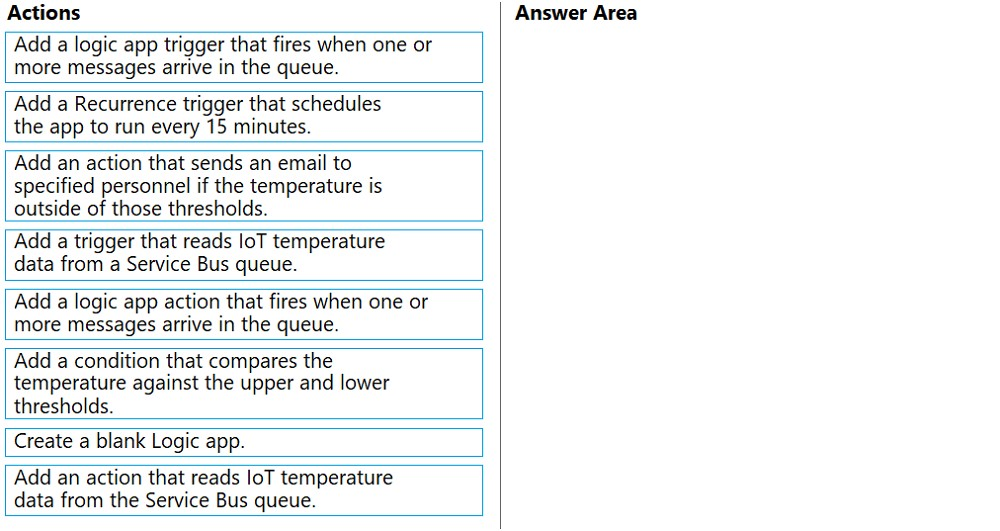

- [x] Cuadro 1: Crear una aplicación lógica en blanco. Cuadro 2: Agregar un desencadenador de Logic App que se activa cuando uno o más mensajes llegan a la cola. Cuadro 3: Agregar una acción que lea los datos de temperatura IoT de la cola de Service Bus. Cuadro 4: Agregar una condición que compare la temperatura con los umbrales superior e inferior. Cuadro 5: Agregar una acción que envíe un correo electrónico al personal especificado si la temperatura está fuera de esos umbrales.
- [ ] Cuadro 1: Agregar un desencadenador que lee datos de temperatura IoT de una cola de Service Bus. Cuadro 2: Agregar una condición que compare la temperatura con los umbrales superior e inferior. Cuadro 3: Agregar una acción de Logic App que se activa cuando uno o más mensajes llegan a la cola. Cuadro 4: Crear una aplicación lógica en blanco. Cuadro 5: Agregar una acción que envíe un correo electrónico al personal especificado si la temperatura está fuera de esos umbrales.
- [ ] Cuadro 1: Agregar una condición que compare la temperatura con los umbrales superior e inferior. Casilla 2: Saliente. Cuadro 3: Agregar un desencadenador de recurrencia que programa la aplicación para ejecutarse cada 15 minutos. Cuadro 4: Agregar un desencadenador que lee datos de temperatura IoT de una cola de Service Bus. Cuadro 5: Crear una aplicación lógica en blanco.
- [ ] Cuadro 1: Crear una aplicación lógica en blanco. Cuadro 2: Agregar una acción de Logic App que se activa cuando uno o más mensajes llegan a la cola. Cuadro 3: Agregar una condición que compare la temperatura con los umbrales superior e inferior. Cuadro 4: Agregar una acción que lea los datos de temperatura IoT de la cola de Service Bus. Cuadro 5: Agregar una condición que compare la temperatura con los umbrales superior e inferior.

**[⬆ Volver arriba](#table-of-contents)**

<a id="you-are-developing-applications-for-a-company-you-plan-to-host-the-applications-on-azure-app-services-the-company-has-the-following-requirements-every-five-minutes-verify-that-the-websites-are-responsive-verify-that-the-websites-respond-within-a-specified-time-threshold-dependent-requests-such-as-images-and-javascript-files-must-load-properly-generate-alerts-if-a-website-is-experiencing-issues-if-a-website-fails-to-load-the-system-must-attempt-to-reload-the-site-three-more-times-you-need-to-implement-this-process-with-the-least-amount-of-effort-what-should-you-do"></a>
### Está creando un sistema de notificación de peligros que tiene un solo servidor de señalización que activa alarmas de audio y visuales para iniciar y detener. Implementa Azure Service Bus para publicar alarmas. Cada controlador de alarma usa Azure Service Bus para recibir señales de alarma como parte de una transacción. Los eventos de alarma deben registrarse con fines de auditoría. Cada registro de transacción debe incluir información sobre el tipo de alarma que se activó. Necesita implementar una solución de auditoría de rastro de respuestas. ¿Qué dos acciones debe realizar?

- [x] Asignar el valor de la propiedad `SessionID` del mensaje de peligro a la propiedad `ReplyToSessionId`.
- [ ] Asignar el valor de la propiedad `MessageId` del mensaje de peligro a la propiedad `DevileryCount`.
- [ ] Asignar el valor de la propiedad `SessionID` del mensaje de peligro a la propiedad `SequenceNumber`.
- [x] Asignar el valor de la propiedad `MessageId` del mensaje de peligro a la propiedad `CorrelationId`.
- [ ] Asignar el valor de la propiedad `SequenceNumber` del mensaje de peligro a la propiedad `DeliveryCount`.
- [ ] Asignar el valor de la propiedad `MessageId` del mensaje de peligro a la propiedad `SequenceNumber`.

**[⬆ Volver arriba](#table-of-contents)**

### Está desarrollando aplicaciones para una empresa. Planea alojar las aplicaciones en Azure App Services. La empresa tiene los siguientes requisitos: Cada cinco minutos verificar que los sitios web respondan. Verificar que los sitios web respondan dentro de un umbral de tiempo especificado. Las solicitudes dependientes como imágenes y archivos JavaScript deben cargarse correctamente. Generar alertas si un sitio web está experimentando problemas. Si un sitio web no se carga, el sistema debe intentar recargar el sitio tres veces más. Necesita implementar este proceso con el menor esfuerzo posible. ¿Qué debe hacer?

- [ ] Crear una prueba web de Selenium y configurarla para que se ejecute desde su estación de trabajo como una tarea programada.
- [x] Configurar una prueba de ping URL para consultar la página de inicio.
- [ ] Crear una función de Azure para consultar la página de inicio.
- [ ] Crear una prueba web de múltiples pasos para consultar la página de inicio.
- [ ] Crear una prueba de disponibilidad de seguimiento personalizado para consultar la página de inicio.

**[⬆ Volver arriba](#table-of-contents)**

### Desarrolla y agrega varias funciones a una Azure Function App que usa el host del runtime más reciente. Las funciones contienen varios endpoints de API REST protegidos mediante SSL. La Azure Function App se ejecuta en un plan de Consumo. Debe enviar una alerta cuando cualquiera de los endpoints de función no esté disponible o responda demasiado lento. Necesita monitorear la disponibilidad y la capacidad de respuesta de las funciones. ¿Qué debe hacer?

- [ ] Crear una prueba de ping URL.
- [x] Crear una función desencadenada por temporizador que llame a `TrackAvailability()` y envíe los resultados a Application Insights.
- [ ] Crear una función desencadenada por temporizador que llame a `GetMetric('Request Size')` y envíe los resultados a Application Insights.
- [ ] Agregue una nueva configuración de diagnóstico a la aplicación de funciones de Azure. Habilitar las opciones `FunctionAppLogs` y Enviar a Log Analytics.

**[⬆ Volver arriba](#table-of-contents)**

<a id="you-are-developing-an-azure-service-application-that-processes-queue-data-when-it-receives-a-message-from-a-mobile-application-messages-may-not-be-sent-to-the-service-consistently-you-have-the-following-requirements-queue-size-must-not-grow-larger-than-80-gigabytes-gb-use-first-in-first-out-fifo-ordering-of-messages-minimize-azure-costs-you-need-to-implement-the-messaging-solution-solution-use-the-net-api-to-add-a-message-to-an-azure-service-bus-queue-from-the-mobile-application-create-an-azure-function-app-that-uses-an-azure-service-bus-queue-trigger-does-the-solution-meet-the-goal"></a>
### Está desarrollando una solución de comercio electrónico que utiliza una arquitectura de microservicios. Necesita diseñar un plano de comunicación para comunicar mensajes transaccionales entre varias partes de la solución. Los mensajes deben comunicarse en orden primero en entrar, primero en salir (FIFO). ¿Qué debe usar?

- [ ] Cola de almacenamiento de Azure.
- [ ] Centro de eventos de Azure.
- [x] Autobús de servicio de Azure.
- [ ] Cuadrícula de eventos de Azure.

**[⬆ Volver arriba](#table-of-contents)**

<a id="you-are-developing-an-azure-solution-to-collect-point-of-sale-pos-device-data-from-2000-stores-located-throughout-the-world-a-single-device-can-produce-2-megabytes-mb-of-data-every-24-hours-each-store-location-has-one-to-five-devices-that-send-data-you-must-store-the-device-data-in-azure-blob-storage-device-data-must-be-correlated-based-on-a-device-identifier-additional-stores-are-expected-to-open-in-the-future-you-need-to-implement-a-solution-to-receive-the-device-data-solution-provision-an-azure-notification-hub-register-all-devices-with-the-hub-does-the-solution-meet-the-goal"></a>
### Está desarrollando una aplicación de Azure Service que procesa datos de cola cuando recibe un mensaje de una aplicación móvil. Los mensajes pueden no enviarse al servicio de manera consistente. Tiene los siguientes requisitos: El tamaño de la cola no debe crecer más de 80 gigabytes (GB). Usar orden de mensajes primero en entrar, primero en salir (FIFO). Minimizar los costos de Azure. Necesita implementar la solución de mensajería. Solución: Usar la API .Net para agregar un mensaje a una cola de Azure Service Bus desde la aplicación móvil. Crear una Azure Function App que use un desencadenador de cola de Azure Service Bus. ¿La solución cumple con el objetivo?

- [x] Sí.
- [ ] No.

**[⬆ Volver arriba](#table-of-contents)**

<a id="you-are-developing-an-azure-solution-to-collect-point-of-sale-pos-device-data-from-2000-stores-located-throughout-the-world-a-single-device-can-produce-2-megabytes-mb-of-data-every-24-hours-each-store-location-has-one-to-five-devices-that-send-data-you-must-store-the-device-data-in-azure-blob-storage-device-data-must-be-correlated-based-on-a-device-identifier-additional-stores-are-expected-to-open-in-the-future-you-need-to-implement-a-solution-to-receive-the-device-data-solution-provision-an-azure-service-bus-configure-a-topic-to-receive-the-device-data-by-using-a-correlation-filter-does-the-solution-meet-the-goal"></a>
### Está desarrollando una solución de Azure para recopilar datos de dispositivos de punto de venta (POS) de 2,000 tiendas ubicadas en todo el mundo. Un solo dispositivo puede producir 2 megabytes (MB) de datos cada 24 horas. Cada ubicación de tienda tiene de uno a cinco dispositivos que envían datos. Debe almacenar los datos del dispositivo en Azure Blob Storage. Los datos del dispositivo deben correlacionarse según un identificador de dispositivo. Se espera que se abran tiendas adicionales en el futuro. Necesita implementar una solución para recibir los datos del dispositivo. Solución: Aprovisionar un Azure Notification Hub. Registrar todos los dispositivos con el hub. ¿La solución cumple con el objetivo?

- [ ] Sí.
- [x] No.

**[⬆ Volver arriba](#table-of-contents)**

<a id="you-are-developing-an-azure-solution-to-collect-point-of-sale-pos-device-data-from-2000-stores-located-throughout-the-world-a-single-device-can-produce-2-megabytes-mb-of-data-every-24-hours-each-store-location-has-one-to-five-devices-that-send-data-you-must-store-the-device-data-in-azure-blob-storage-device-data-must-be-correlated-based-on-a-device-identifier-additional-stores-are-expected-to-open-in-the-future-you-need-to-implement-a-solution-to-receive-the-device-data-solution-provision-an-azure-event-grid-configure-event-filtering-to-evaluate-the-device-identifier-does-the-solution-meet-the-goal"></a>
### Está desarrollando una solución de Azure para recopilar datos de dispositivos de punto de venta (POS) de 2,000 tiendas ubicadas en todo el mundo. Un solo dispositivo puede producir 2 megabytes (MB) de datos cada 24 horas. Cada ubicación de tienda tiene de uno a cinco dispositivos que envían datos. Debe almacenar los datos del dispositivo en Azure Blob Storage. Los datos del dispositivo deben correlacionarse según un identificador de dispositivo. Se espera que se abran tiendas adicionales en el futuro. Necesita implementar una solución para recibir los datos del dispositivo. Solución: Aprovisionar un Azure Service Bus. Configurar un tema para recibir los datos del dispositivo mediante un filtro de correlación. ¿La solución cumple con el objetivo?

- [x] Sí.
- [ ] No.

**[⬆ Volver arriba](#table-of-contents)**

<a id="you-are-developing-an-azure-service-application-that-processes-queue-data-when-it-receives-a-message-from-a-mobile-application-messages-may-not-be-sent-to-the-service-consistently-you-have-the-following-requirements-queue-size-must-not-grow-larger-than-80-gigabytes-gb-use-first-in-first-out-fifo-ordering-of-messages-minimize-azure-costs-you-need-to-implement-the-messaging-solution-solution-use-the-net-api-to-add-a-message-to-an-azure-storage-queue-from-the-mobile-application-create-an-azure-function-app-that-uses-an-azure-storage-queue-trigger-does-the-solution-meet-the-goal"></a>
### Está desarrollando una solución de Azure para recopilar datos de dispositivos de punto de venta (POS) de 2,000 tiendas ubicadas en todo el mundo. Un solo dispositivo puede producir 2 megabytes (MB) de datos cada 24 horas. Cada ubicación de tienda tiene de uno a cinco dispositivos que envían datos. Debe almacenar los datos del dispositivo en Azure Blob Storage. Los datos del dispositivo deben correlacionarse según un identificador de dispositivo. Se espera que se abran tiendas adicionales en el futuro. Necesita implementar una solución para recibir los datos del dispositivo. Solución: Aprovisionar un Azure Event Grid. Configurar el filtrado de eventos para evaluar el identificador del dispositivo. ¿La solución cumple con el objetivo?

- [ ] Sí.
- [x] No.

**[⬆ Volver arriba](#table-of-contents)**

<a id="you-are-developing-an-azure-service-application-that-processes-queue-data-when-it-receives-a-message-from-a-mobile-application-messages-may-not-be-sent-to-the-service-consistently-you-have-the-following-requirements-queue-size-must-not-grow-larger-than-80-gigabytes-gb-use-first-in-first-out-fifo-ordering-of-messages-minimize-azure-costs-you-need-to-implement-the-messaging-solution-solution-use-the-net-api-to-add-a-message-to-an-azure-storage-queue-from-the-mobile-application-create-an-azure-vm-that-is-triggered-from-azure-storage-queue-events-does-the-solution-meet-the-goal"></a>
### Está desarrollando una aplicación de Azure Service que procesa datos de cola cuando recibe un mensaje de una aplicación móvil. Los mensajes pueden no enviarse al servicio de manera consistente. Tiene los siguientes requisitos: El tamaño de la cola no debe crecer más de 80 gigabytes (GB). Usar orden de mensajes primero en entrar, primero en salir (FIFO). Minimizar los costos de Azure. Necesita implementar la solución de mensajería. Solución: Usar la API .Net para agregar un mensaje a una Azure Storage Queue desde la aplicación móvil. Crear una Azure Function App que use un desencadenador de Azure Storage Queue. ¿La solución cumple con el objetivo?

- [ ] Sí.
- [x] No.

**[⬆ Volver arriba](#table-of-contents)**

### Está desarrollando una aplicación de Azure Service que procesa datos de cola cuando recibe un mensaje de una aplicación móvil. Los mensajes pueden no enviarse al servicio de manera consistente. Tiene los siguientes requisitos: El tamaño de la cola no debe crecer más de 80 gigabytes (GB). Usar orden de mensajes primero en entrar, primero en salir (FIFO). Minimizar los costos de Azure. Necesita implementar la solución de mensajería. Solución: Usar la API .Net para agregar un mensaje a una Azure Storage Queue desde la aplicación móvil. Crear una Azure VM que se desencadene desde eventos de Azure Storage Queue. ¿La solución cumple con el objetivo?

- [ ] Sí.
- [x] No.

**[⬆ Volver arriba](#table-of-contents)**

<a id="a-company-is-implementing-a-publish-subscribe-pubsub-messaging-component-by-using-azure-service-bus-you-are-developing-the-first-subscription-application-in-the-azure-portal-you-see-that-messages-are-being-sent-to-the-subscription-for-each-topic-you-create-and-initialize-a-subscription-client-object-by-supplying-the-correct-details-but-the-subscription-application-is-still-not-consuming-the-messages-you-need-to-ensure-that-the-subscription-client-processes-all-messages-which-code-segment-should-you-use"></a>
### Está desarrollando una solución que usará servicios de mensajería de Azure. Necesita asegurarse de que la solución use un modelo de publicación-suscripción y elimine la necesidad de sondeo constante. ¿Cuáles son dos formas posibles de lograr el objetivo?

- [x] Autobús de servicio.
- [ ] Event Hub.
- [x] Cuadrícula de eventos.
- [ ] Queue.

**[⬆ Volver arriba](#table-of-contents)**

<a id="you-are-developing-an-azure-solution-to-collect-point-of-sale-pos-device-data-from-2000-stores-located-throughout-the-world-a-single-device-can-produce-2-megabytes-mb-of-data-every-24-hours-each-store-location-has-one-to-five-devices-that-send-data-you-must-store-the-device-data-in-azure-blob-storage-device-data-must-be-correlated-based-on-a-device-identifier-additional-stores-are-expected-to-open-in-the-future-you-need-to-implement-a-solution-to-receive-the-device-data-solution-provision-an-azure-event-hub-configure-the-machine-identifier-as-the-partition-key-and-enable-capture-does-the-solution-meet-the-goal"></a>
### Una empresa está implementando un componente de mensajería de publicación-suscripción (Pub/Sub) utilizando Azure Service Bus. Está desarrollando la primera aplicación de suscripción. En el portal de Azure ve que se están enviando mensajes a la suscripción para cada tema. Crea e inicializa un objeto de cliente de suscripción proporcionando los detalles correctos, pero la aplicación de suscripción aún no consume los mensajes. Necesita asegurarse de que el cliente de suscripción procese todos los mensajes. ¿Qué segmento de código debe usar?

- [ ] `await subscriptionClient.AddRuleAsync(new RuleDescription(RuleDescription.DefaultRuleName, new TrueFilter()));`.
- [ ] `subscriptionClient = new SubscriptionClient(ServiceBusConnectionString, TopicName, SubscriptionName);`.
- [ ] `await subscriptionClient.CloseAsync();`.
- [x] `subscriptionClient.RegisterMessageHandler(ProcessMessagesAsync, messageHandlerOptions);`.

**[⬆ Volver arriba](#table-of-contents)**

### Está desarrollando una solución de Azure para recopilar datos de dispositivos de punto de venta (POS) de 2,000 tiendas ubicadas en todo el mundo. Un solo dispositivo puede producir 2 megabytes (MB) de datos cada 24 horas. Cada ubicación de tienda tiene de uno a cinco dispositivos que envían datos. Debe almacenar los datos del dispositivo en Azure Blob Storage. Los datos del dispositivo deben correlacionarse según un identificador de dispositivo. Se espera que se abran tiendas adicionales en el futuro. Necesita implementar una solución para recibir los datos del dispositivo. Solución: Aprovisionar un Azure Event Hub. Configurar el identificador de máquina como la clave de partición y habilitar la captura. ¿La solución cumple con el objetivo?

- [x] Sí.
- [ ] No.

**[⬆ Volver arriba](#table-of-contents)**

### Una empresa está desarrollando una solución que permite a los refrigeradores inteligentes enviar información de temperatura a una ubicación central. La solución debe recibir y almacenar mensajes hasta que puedan ser procesados. Crea una instancia de Azure Service Bus proporcionando un nombre, nivel de precios, suscripción, grupo de recursos y ubicación. Necesita completar la configuración. ¿Qué comando de Azure CLI o PowerShell debe ejecutar?

- [ ] `az group create --name fridge-rg --location fridge-loc`.
- [ ] `New-AzureRmServiceBusNamespace -ResourceGroupName fridge-rg -NamespaceName fridge-ns -Location fridge-loc`.
- [x] `New-AzureRmServiceBusQueue -ResourceGroupName fridge-rg -NamespaceName fridge-ns -Name fridge-q -EnablePartitioning $False`.
- [ ] `az servicebus namespace create --resource-group fridge-rg --name fridge-rg --location fridge-loc`.

**[⬆ Volver arriba](#table-of-contents)**

### Su empresa tiene una suscripción de Azure que incluye una cuenta de almacenamiento, un grupo de recursos, un contenedor de blobs y un recurso compartido de archivos. Un compañero administrador llamado `Jon Ross` usó una plantilla de Azure Resource Manager para implementar una máquina virtual y una cuenta de Azure Storage. Necesita identificar la plantilla de Azure Resource Manager que Jon Ross usó. Solución: Accede a la hoja `Container`. ¿La solución cumple con el objetivo?

- [ ] Sí.
- [x] No.

**[⬆ Volver arriba](#table-of-contents)**

### Su empresa tiene una suscripción de Azure que incluye una cuenta de almacenamiento, un grupo de recursos, un contenedor de blobs y un recurso compartido de archivos. Un compañero administrador llamado `Jon Ross` usó una plantilla de Azure Resource Manager para implementar una máquina virtual y una cuenta de Azure Storage. Necesita identificar la plantilla de Azure Resource Manager que Jon Ross usó. Solución: Accede a la hoja `Virtual Machine`. ¿La solución cumple con el objetivo?

- [ ] Sí.
- [x] No.

**[⬆ Volver arriba](#table-of-contents)**

<a id="you-are-developing-a-web-app-named-mywebapp1-mywebapp1-uses-the-address-myapp1azurewebsitesnet-you-protect-mywebapp1-by-implementing-an-azure-web-application-firewall-waf-the-traffic-to-mywebapp1-is-routed-through-an-azure-application-gateway-instance-that-is-also-used-by-other-web-apps-you-want-to-secure-all-traffic-to-mywebapp1-by-using-ssl-solution-you-open-the-azure-application-gateways-http-setting-and-set-the-override-backend-path-option-to-mywebapp1azurewebsitesnet-you-then-enable-the-use-for-app-service-option-does-this-meet-the-goal"></a>
### Su empresa tiene una suscripción de Azure que incluye una cuenta de almacenamiento, un grupo de recursos, un contenedor de blobs y un recurso compartido de archivos. Un compañero administrador llamado `Jon Ross` usó una plantilla de Azure Resource Manager para implementar una máquina virtual y una cuenta de Azure Storage. Necesita identificar la plantilla de Azure Resource Manager que Jon Ross usó. Solución: Accede a la hoja `Resource Group`. ¿La solución cumple con el objetivo?

- [x] Sí.
- [ ] No.

**[⬆ Volver arriba](#table-of-contents)**

### Está desarrollando una aplicación web llamada `mywebapp1`. `Mywebapp1` usa la dirección `myapp1.azurewebsites.net`. Protege `mywebapp1` implementando un Azure Web Application Firewall (WAF). El tráfico hacia `mywebapp1` se enruta a través de una instancia de Azure Application Gateway que también es utilizada por otras aplicaciones web. Desea proteger todo el tráfico hacia `mywebapp1` usando SSL. Solución: Abre la configuración HTTP del Azure Application Gateway y establece la opción `Override` backend path en `mywebapp1.azurewebsites.net`. Luego habilita la opción Use for App service. ¿Esto cumple con el objetivo?

- [x] Sí.
- [ ] No.

**[⬆ Volver arriba](#table-of-contents)**

<a id="you-are-developing-a-web-app-named-mywebapp1-mywebapp1-uses-the-address-myapp1azurewebsitesnet-you-protect-mywebapp1-by-implementing-an-azure-web-application-firewall-waf-the-traffic-to-mywebapp1-is-routed-through-an-azure-application-gateway-instance-that-is-also-used-by-other-web-apps-you-want-to-secure-all-traffic-to-mywebapp1-by-using-ssl-solution-you-open-the-azure-application-gateways-http-setting-and-set-the-override-backend-path-option-to-mywebapp1azurewebsitesnet-you-then-add-an-authentication-certificate-for-mywebapp1azurewebsitesnet-does-this-meet-the-goal"></a>
### Está desarrollando una aplicación web llamada `mywebapp1`. `Mywebapp1` usa la dirección `myapp1.azurewebsites.net`. Protege `mywebapp1` implementando un Azure Web Application Firewall (WAF). El tráfico hacia `mywebapp1` se enruta a través de una instancia de Azure Application Gateway que también es utilizada por otras aplicaciones web. Desea proteger todo el tráfico hacia `mywebapp1` usando SSL. Solución: Configura `mywebapp1` para que se ejecute en un Azure App Service Environment (ASE). ¿Esto cumple con el objetivo?

- [ ] Sí.
- [x] No.

**[⬆ Volver arriba](#table-of-contents)**

### Está desarrollando una aplicación web llamada `mywebapp1`. `Mywebapp1` usa la dirección `myapp1.azurewebsites.net`. Protege `mywebapp1` implementando un Azure Web Application Firewall (WAF). El tráfico hacia `mywebapp1` se enruta a través de una instancia de Azure Application Gateway que también es utilizada por otras aplicaciones web. Desea proteger todo el tráfico hacia `mywebapp1` usando SSL. Solución: Abre la configuración HTTP del Azure Application Gateway y establece la opción `Override` backend path en `mywebapp1.azurewebsites.net`. Luego agrega un certificado de autenticación para `mywebapp1.azurewebsites.net`. ¿Esto cumple con el objetivo?

- [ ] Sí.
- [x] No.

**[⬆ Volver arriba](#table-of-contents)**

### Su empresa tiene una aplicación web llamada `WebApp1`. Usa el SDK de WebJobs para diseñar una tarea en segundo plano desencadenada de App Service que invoca automáticamente una función en el código cada vez que se reciben nuevos datos en una cola. Está preparando la configuración del servicio que procesa un elemento de datos de la cola. ¿Cuál de los siguientes es el servicio que debe usar?

- [ ] Logic Apps.
- [x] WebJobs.
- [ ] Flow.
- [ ] Functions.

**[⬆ Volver arriba](#table-of-contents)**

### Su empresa tiene una suscripción de Azure. Necesita implementar varias máquinas virtuales de Azure en la suscripción mediante plantillas de Azure Resource Manager (ARM). Las máquinas virtuales se incluirán en un solo conjunto de disponibilidad. Necesita asegurarse de que la plantilla ARM permita que la mayor cantidad posible de máquinas virtuales permanezcan accesibles en caso de fallo de fabric o mantenimiento. ¿Cuál es el valor que debe configurar para la propiedad `platformFaultDomainCount`?

- [ ] 10.
- [ ] 30.
- [ ] Min Value.
- [x] Max Value.

**[⬆ Volver arriba](#table-of-contents)**

### Tiene dos hosts Hyper-V llamados `Host1` y `Host2`. Host1 tiene una máquina virtual de Azure llamada `VM1` que fue implementada usando una plantilla personalizada de Azure Resource Manager. Necesita mover `VM1` a `Host2`. ¿Qué debe hacer?

- [ ] Desde la hoja `Update management`, hacer clic en `Enable`.
- [ ] Desde la hoja `Overview`, mover `VM1` a una suscripción diferente.
- [x] Desde la hoja `Redeploy`, hacer clic en `Redeploy`.
- [ ] Desde la hoja `Profile`, modificar la ubicación de uso.

**[⬆ Volver arriba](#table-of-contents)**

### Su empresa tiene un clúster de Azure Kubernetes Service (AKS) que administra desde un dispositivo unido a Microsoft Entra ID. El clúster está ubicado en un grupo de recursos. Los desarrolladores han creado una aplicación llamada `MyApp`. `MyApp` fue empaquetada en una imagen de contenedor. Necesita implementar el archivo de manifiesto YAML para la aplicación. Solución: Instala la Azure CLI en el dispositivo y ejecuta el comando `kubectl apply -f myapp.yaml`. ¿Esto cumple con el objetivo?

- [x] Sí.
- [ ] No.

**[⬆ Volver arriba](#table-of-contents)**

### Su empresa tiene un clúster de Azure Kubernetes Service (AKS) que administra desde un dispositivo unido a Microsoft Entra ID. El clúster está ubicado en un grupo de recursos. Los desarrolladores han creado una aplicación llamada `MyApp`. `MyApp` fue empaquetada en una imagen de contenedor. Necesita implementar el archivo de manifiesto YAML para la aplicación. Solución: Instala el cliente docker en el dispositivo y ejecuta el comando `docker run -it microsoft/azure-cli:0.10.17`. ¿Esto cumple con el objetivo?

- [ ] Sí.
- [x] No.

**[⬆ Volver arriba](#table-of-contents)**

### Su empresa tiene una suscripción de Azure. Necesita implementar varias máquinas virtuales de Azure en la suscripción mediante plantillas de Azure Resource Manager (ARM). Las máquinas virtuales se incluirán en un solo conjunto de disponibilidad. Necesita asegurarse de que la plantilla ARM permita que la mayor cantidad posible de máquinas virtuales permanezcan accesibles en caso de fallo de fabric o mantenimiento. ¿Cuál es el valor que debe configurar para la propiedad `platformUpdateDomainCount`?

- [ ] 10.
- [x] 20.
- [ ] 30.
- [ ] 40.

**[⬆ Volver arriba](#table-of-contents)**

### Está diseñando un Azure WebJob que se ejecutará en las mismas instancias que una aplicación web. Desea usar un tipo de WebJob adecuado. El tipo de WebJob también debe permitir la opción de restringir el WebJob a una sola instancia. Solución: Configura el uso del tipo de WebJob Triggered (desencadenado). ¿La solución cumple con el objetivo?

- [ ] Sí.
- [x] No.

**[⬆ Volver arriba](#table-of-contents)**

### Está diseñando un Azure WebJob que se ejecutará en las mismas instancias que una aplicación web. Desea usar un tipo de WebJob adecuado. El tipo de WebJob también debe permitir la opción de restringir el WebJob a una sola instancia. Solución: Configura el uso del tipo de WebJob Continuous (continuo). ¿La solución cumple con el objetivo?

- [x] Sí.
- [ ] No.

**[⬆ Volver arriba](#table-of-contents)**

### Su empresa tiene una implementación local de MongoDB y una cuenta de Azure Cosmos DB que utiliza la API de MongoDB. Necesita diseñar una estrategia para migrar MongoDB a la cuenta de Azure Cosmos DB. Incluye la herramienta [Data Management Gateway] en su estrategia de migración.

- [ ] No se requiere cambio.
- [x] `mongorestore`.
- [ ] Explorador de almacenamiento de Azure.
- [ ] `AzCopy`.

**[⬆ Volver arriba](#table-of-contents)**

### Está desarrollando una aplicación que procesa eventos de Azure Blob Storage. Su aplicación tiene los siguientes requisitos: Procesar registros de transacciones de forma asincrónica para los cambios que ocurran en los blobs y los metadatos del blob. Procesar los cambios en el orden en que ocurrieron. Retener los cambios por razones de cumplimiento. Solución: Usa Azure Event Grid con una Azure Function App como suscriptor. ¿La solución cumple con el objetivo?

- [x] Sí.
- [ ] No.

**[⬆ Volver arriba](#table-of-contents)**

### Está desarrollando una aplicación que procesa eventos de Azure Blob Storage. Su aplicación tiene los siguientes requisitos: Procesar registros de transacciones de forma asincrónica para los cambios que ocurran en los blobs y los metadatos del blob. Procesar los cambios en el orden en que ocurrieron. Retener los cambios por razones de cumplimiento. Solución: Usa la API de Azure Monitor HTTP Data Collector. ¿La solución cumple con el objetivo?

- [ ] Sí.
- [x] No.

**[⬆ Volver arriba](#table-of-contents)**

### Está desarrollando una aplicación móvil que usa una instancia de Azure SQL Database llamada `Weyland`. La base de datos contiene una tabla llamada `Customers` que tiene un campo llamado `email_address`. Desea implementar el enmascaramiento dinámico de datos para ocultar los datos en el campo `email_address`. Solución: Ejecuta la siguiente instrucción Transact-SQL: `ALTER TABLE [dbo].[Weyland].[Customers] ALTER COLUMN [email_address] ADD MASKED WITH (FUNCTION = 'email()')`. ¿La solución cumple con el objetivo?

- [x] Sí.
- [ ] No.

**[⬆ Volver arriba](#table-of-contents)**

### Está desarrollando una aplicación móvil que usa una instancia de Azure SQL Database llamada `Weyland`. La base de datos contiene una tabla llamada `Customers` que tiene un campo llamado `email_address`. Desea implementar el enmascaramiento dinámico de datos para ocultar los datos en el campo `email_address`. Solución: Ejecuta el cmdlet de PowerShell `Set-AzSqlDatabaseDataMaskingPolicy -DatabaseName 'Weyland'`. ¿La solución cumple con el objetivo?

- [ ] Sí.
- [x] No.

**[⬆ Volver arriba](#table-of-contents)**

### Está desarrollando una aplicación móvil que usa una instancia de Azure SQL Database llamada `Weyland`. La base de datos contiene una tabla llamada `Customers` que tiene un campo llamado `email_address`. Desea implementar el enmascaramiento dinámico de datos para ocultar los datos en el campo `email_address`. Solución: Ejecuta el cmdlet de PowerShell `Set-AzSqlDatabaseDataMaskingRule -DatabaseName 'Weyland' -SchemaName 'dbo' -TableName 'Customers' -ColumnName 'email_address' -MaskingFunction 'email'`. ¿La solución cumple con el objetivo?

- [x] Sí.
- [ ] No.

**[⬆ Volver arriba](#table-of-contents)**

### Está desarrollando una aplicación web de comercio electrónico. Desea usar Azure Key Vault para asegurarse de que los inicios de sesión en la aplicación web estén protegidos mediante la autenticación de Azure App Service y Microsoft Entra ID. ¿Qué debe hacer en la aplicación web de comercio electrónico?

- [ ] Ejecutar el comando `az keyvault secret`.
- [ ] Habilitar Microsoft Entra ID Connect.
- [x] Habilitar Identidad de Servicio Gestionado (MSI).
- [ ] Crear un service principal de Microsoft Entra ID.

**[⬆ Volver arriba](#table-of-contents)**

### Está desarrollando una aplicación web que usa Microsoft Entra ID para autenticación. Desea configurar la aplicación web para usar autenticación multifactor. ¿Qué debe hacer?

- [ ] Habilitar la autenticación de aplicación móvil.
- [ ] En el acceso condicional de Microsoft Entra ID, habilitar la política base.
- [x] En Microsoft Entra ID, crear una política de acceso condicional.
- [ ] Instalar el servidor de Azure Multi-Factor Authentication.

**[⬆ Volver arriba](#table-of-contents)**

### Está creando un Azure Key Vault usando PowerShell. Los objetos eliminados del key vault deben conservarse durante un período establecido de 90 días. ¿Cuáles de los siguientes dos parámetros deben usarse en conjunto para cumplir con el requisito? (Elija dos.)

- [ ] `EnabledForDeployment`.
- [x] `EnablePurgeProtection`.
- [ ] `EnabledForTemplateDeployment`.
- [x] `EnableSoftDelete`.

**[⬆ Volver arriba](#table-of-contents)**

### Su empresa tiene un entorno de Microsoft Entra ID. Los usuarios ocasionalmente se conectan a Microsoft Entra ID a través de Internet. Necesita asegurarse de que los usuarios que se conecten a Microsoft Entra ID a través de Internet usando una dirección IP no identificada, reciban automáticamente la instrucción de cambiar sus contraseñas. Solución: Configura el uso de Azure Key Vault. ¿La solución cumple con el objetivo?

- [ ] Sí.
- [x] No.

**[⬆ Volver arriba](#table-of-contents)**

### Su empresa tiene un entorno de Microsoft Entra ID. Los usuarios ocasionalmente se conectan a Microsoft Entra ID a través de Internet. Necesita asegurarse de que los usuarios que se conecten a Microsoft Entra ID a través de Internet usando una dirección IP no identificada, reciban automáticamente la instrucción de cambiar sus contraseñas. Solución: Configura el uso de Microsoft Entra ID Identity Protection. ¿La solución cumple con el objetivo?

- [x] Sí.
- [ ] No.

**[⬆ Volver arriba](#table-of-contents)**

### Su empresa tiene un entorno de Microsoft Entra ID. Los usuarios ocasionalmente se conectan a Microsoft Entra ID a través de Internet. Necesita asegurarse de que los usuarios que se conecten a Microsoft Entra ID a través de Internet usando una dirección IP no identificada, reciban automáticamente la instrucción de cambiar sus contraseñas. Solución: Configura el uso de Microsoft Entra ID Privileged Identity Management. ¿La solución cumple con el objetivo?

- [ ] Sí.
- [x] No.

**[⬆ Volver arriba](#table-of-contents)**

### Administra una base de datos de Azure SQL que permite la autenticación de Microsoft Entra ID. Necesita asegurarse de que los desarrolladores de bases de datos puedan conectarse a la base de datos SQL a través de Microsoft SQL Server Management Studio (SSMS). También necesita asegurarse de que los desarrolladores usen su cuenta local de Microsoft Entra ID para la autenticación. Su estrategia debe permitir que las solicitudes de autenticación se mantengan al mínimo. ¿Cuál de los siguientes debe implementar?

- [ ] Token de Microsoft Entra ID.
- [ ] Autenticación multifactor de Azure.
- [x] Autenticación integrada de Microsoft Entra ID.
- [ ] Tokens de software OATH.

**[⬆ Volver arriba](#table-of-contents)**

### Está desarrollando una aplicación para transferir datos entre servidores de archivos locales y Azure Blob Storage. La aplicación almacena claves, secretos y certificados en Azure Key Vault y utiliza las API de Azure Key Vault. Desea configurar la aplicación para permitir la recuperación de una eliminación accidental del key vault o de los objetos del key vault durante 90 días después de la eliminación. ¿Qué debe hacer?

- [ ] Ejecutar el cmdlet `Add-AzKeyVaultKey`.
- [x] Ejecutar la CLI `az keyvault update --enable-soft-delete true --enable-purge-protection true`.
- [ ] Implementar puntos de conexión de servicio de red virtual para Azure Key Vault.
- [ ] Ejecutar la CLI `az keyvault update --enable-soft-delete false`.

**[⬆ Volver arriba](#table-of-contents)**

### Está configurando una aplicación web que entrega video en streaming a los usuarios. La aplicación utiliza integración e implementación continuas. Necesita asegurarse de que la aplicación tenga alta disponibilidad y que la experiencia de streaming de los usuarios sea constante. También desea configurar la aplicación para almacenar datos en una ubicación geográfica más cercana al usuario. Solución: Incluye el uso de Azure Redis Cache en su diseño. ¿La solución cumple con el objetivo?

- [ ] Sí.
- [x] No.

**[⬆ Volver arriba](#table-of-contents)**

### Está configurando una aplicación web que entrega video en streaming a los usuarios. La aplicación utiliza integración e implementación continuas. Necesita asegurarse de que la aplicación tenga alta disponibilidad y que la experiencia de streaming de los usuarios sea constante. También desea configurar la aplicación para almacenar datos en una ubicación geográfica más cercana al usuario. Solución: Incluye el uso de una Azure Content Delivery Network (CDN) en su diseño. ¿La solución cumple con el objetivo?

- [x] Sí.
- [ ] No.

**[⬆ Volver arriba](#table-of-contents)**

### Está configurando una aplicación web que entrega video en streaming a los usuarios. La aplicación utiliza integración e implementación continuas. Necesita asegurarse de que la aplicación tenga alta disponibilidad y que la experiencia de streaming de los usuarios sea constante. También desea configurar la aplicación para almacenar datos en una ubicación geográfica más cercana al usuario. Solución: Incluye el uso de una Storage Area Network (SAN) en su diseño. ¿La solución cumple con el objetivo?

- [ ] Sí.
- [x] No.

**[⬆ Volver arriba](#table-of-contents)**

### Desarrolla una aplicación web en un plan de App Service de nivel D1. Nota que los tiempos de carga de página aumentan durante los períodos de tráfico máximo. Desea implementar el escalado automático cuando la carga de CPU esté por encima del 80 por ciento. Su solución debe minimizar los costos. ¿Qué debe hacer primero?

- [ ] Habilitar el autoescalado en la aplicación web.
- [ ] Cambiar al plan de App Service de nivel Premium.
- [x] Cambiar al plan de App Service de nivel Estándar.
- [ ] Cambiar al plan de consumo de Azure App Services.

**[⬆ Volver arriba](#table-of-contents)**

### Está desarrollando una solución para una API pública. El back end de la API está alojado en una instancia de Azure App Service. Ha implementado un servicio RESTful para el back end de la API. Debe configurar la autenticación del back end para la instancia del servicio API Management. Solución: Configura credenciales de gateway Basic para el recurso de Azure. ¿La solución cumple con el objetivo?

- [ ] Sí.
- [x] No.

**[⬆ Volver arriba](#table-of-contents)**

### Está desarrollando una solución para una API pública. El back end de la API está alojado en una instancia de Azure App Service. Ha implementado un servicio RESTful para el back end de la API. Debe configurar la autenticación del back end para la instancia del servicio API Management. Solución: Configura credenciales de gateway Client cert para el endpoint HTTP(s). ¿La solución cumple con el objetivo?

- [ ] Sí.
- [x] No.

**[⬆ Volver arriba](#table-of-contents)**

### Está desarrollando una solución para una API pública. El back end de la API está alojado en una instancia de Azure App Service. Ha implementado un servicio RESTful para el back end de la API. Debe configurar la autenticación del back end para la instancia del servicio API Management. Solución: Configura credenciales de gateway Basic para el endpoint HTTP(s). ¿La solución cumple con el objetivo?

- [ ] Sí.
- [x] No.

**[⬆ Volver arriba](#table-of-contents)**

### Está desarrollando una solución para una API pública. El back end de la API está alojado en una instancia de Azure App Service. Ha implementado un servicio RESTful para el back end de la API. Debe configurar la autenticación del back end para la instancia del servicio API Management. Solución: Configura credenciales de gateway Client cert para el recurso de Azure. ¿La solución cumple con el objetivo?

- [x] Sí.
- [ ] No.

**[⬆ Volver arriba](#table-of-contents)**

### Está desarrollando una aplicación .NET Core MVC que permite a los clientes investigar proveedores de alojamiento vacacional independientes. Desea implementar Azure Search para permitir que la aplicación busque en el índice utilizando varios criterios para localizar documentos relacionados con lugares de alojamiento. Desea que la aplicación liste los lugares de alojamiento vacacional que estén dentro de un rango de precio específico y dentro de una distancia especificada a un aeropuerto. ¿Qué debe hacer?

- [ ] Configurar la propiedad `SearchMode` de la clase `SearchParameters`.
- [ ] Configurar la propiedad `QueryType` de la clase `SearchParameters`.
- [ ] Configurar la propiedad `Facets` de la clase `SearchParameters`.
- [x] Configurar la propiedad `Filter` de la clase `SearchParameters`.

**[⬆ Volver arriba](#table-of-contents)**

<a id="you-are-developing-an-application-that-applies-a-set-of-governance-policies-for-internal-and-external-services-as-well-as-for-applications-you-develop-a-stateful-aspnet-core-21-web-application-named-policyapp-and-deploy-it-to-an-azure-app-service-web-app-the-policyapp-reacts-to-events-from-azure-event-grid-and-performs-policy-actions-based-on-those-events-you-have-the-following-requirements-authentication-events-must-be-used-to-monitor-users-when-they-sign-in-and-sign-out-all-authentication-events-must-be-processed-by-policyapp-sign-outs-must-be-processed-as-fast-as-possible-what-should-you-do"></a>
### Es desarrollador en su empresa. Necesita editar los flujos de trabajo de una Logic App existente. ¿Qué debe usar?

- [ ] El Enterprise Integration Pack (EIP).
- [ ] La vista de código de Logic App.
- [ ] Las API Connections.
- [x] El Logic Apps Designer.

**[⬆ Volver arriba](#table-of-contents)**

<a id="you-are-a-developer-for-contoso-ltd-the-company-has-a-social-networking-website-that-is-developed-as-a-single-page-application-spa-the-main-web-application-for-the-social-networking-website-loads-user-uploaded-content-from-blob-storage-you-are-developing-a-solution-to-monitor-uploaded-data-for-inappropriate-content-the-following-process-occurs-when-users-upload-content-by-using-the-spa-messages-are-sent-to-contentuploadservice-content-is-processed-by-contentanalysisservice-after-processing-is-complete-the-content-is-posted-to-the-social-network-or-a-rejection-message-is-posted-in-its-place-the-contentanalysisservice-is-deployed-with-azure-container-instances-from-a-private-azure-container-registry-named-contosoimages-the-solution-will-use-eight-cpu-cores-microsoft-entra-id-contoso-ltd-uses-microsoft-entra-id-for-both-internal-and-guest-accounts-requirements-contentanalysisservice---the-companys-data-science-group-built-contentanalysisservice-which-accepts-user-generated-content-as-a-string-and-returns-a-probable-value-for-inappropriate-content-any-values-over-a-specific-threshold-must-be-reviewed-by-an-employee-of-contoso-ltd-you-must-create-an-azure-function-named-checkusercontent-to-perform-the-content-checks-costs-you-must-minimize-costs-for-all-azure-services-manual-review-to-review-content-the-user-must-authenticate-to-the-website-portion-of-the-contentanalysisservice-using-their-microsoft-entra-id-credentials-the-website-is-built-using-react-and-all-pages-and-api-endpoints-require-authentication-in-order-to-review-content-a-user-must-be-part-of-a-contentreviewer-role-all-completed-reviews-must-include-the-reviewers-email-address-for-auditing-purposes-high-availability-all-services-must-run-in-multiple-regions-the-failure-of-any-service-in-a-region-must-not-impact-overall-application-availability-monitoring-an-alert-must-be-raised-if-the-contentuploadservice-uses-more-than-80-percent-of-available-cpu-cores-security-you-have-the-following-security-requirements-any-web-service-accessible-over-the-internet-must-be-protected-from-cross-site-scripting-attacks-all-websites-and-services-must-use-ssl-from-a-valid-root-certificate-authority-azure-storage-access-keys-must-only-be-stored-in-memory-and-must-be-available-only-to-the-service-all-internal-services-must-only-be-accessible-from-internal-virtual-networks-vnets-all-parts-of-the-system-must-support-inbound-and-outbound-traffic-restrictions-all-service-calls-must-be-authenticated-by-using-microsoft-entra-id-user-agreements-when-a-user-submits-content-they-must-agree-to-a-user-agreement-the-agreement-allows-employees-of-contoso-ltd-to-review-content-store-cookies-on-user-devices-and-track-users-ip-addresses-information-regarding-agreements-is-used-by-multiple-divisions-within-contoso-ltd-user-responses-must-not-be-lost-and-must-be-available-to-all-parties-regardless-of-individual-service-uptime-the-volume-of-agreements-is-expected-to-be-in-the-millions-per-hour-validation-testing-when-a-new-version-of-the-contentanalysisservice-is-available-the-previous-seven-days-of-content-must-be-processed-with-the-new-version-to-verify-that-the-new-version-does-not-significantly-deviate-from-the-old-version-issues-users-of-the-contentuploadservice-report-that-they-occasionally-see-http-502-responses-on-specific-pages-code---contentuploadservice---applicationmanifest-you-need-to-add-code-at-line-am09-to-ensure-that-users-can-review-content-using-contentanalysisservice-how-should-you-complete-the-code"></a>
### Está desarrollando una aplicación que aplica un conjunto de políticas de gobernanza para servicios internos y externos, así como para aplicaciones. Desarrolla una aplicación web ASP.NET Core 2.1 con estado llamada `PolicyApp` y la implementa en una Azure App Service Web App. `PolicyApp` reacciona a eventos de Azure Event Grid y realiza acciones de política basadas en esos eventos. Tiene los siguientes requisitos: Los eventos de autenticación deben usarse para monitorear a los usuarios cuando inician y cierran sesión. Todos los eventos de autenticación deben ser procesados por `PolicyApp`. Los cierres de sesión deben procesarse lo más rápido posible. ¿Qué debe hacer?

- [ ] Cree una nueva suscripción de Azure Event Grid para todos los eventos de autenticación. Usar la suscripción para procesar eventos de cierre de sesión.
- [ ] Cree un controlador de Azure Event Grid separado para eventos de inicio y cierre de sesión.
- [ ] Cree temas y suscripciones de Azure Event Grid separados para eventos de inicio y cierre de sesión.
- [x] Agregar un prefijo de sujeto a los eventos de cierre de sesión. Cree una suscripción de Azure Event Grid. Configurar la suscripción para usar el filtro sujetoBeginsWith.

**[⬆ Volver arriba](#table-of-contents)**

<a id="you-are-a-developer-for-contoso-ltd-the-company-has-a-social-networking-website-that-is-developed-as-a-single-page-application-spa-the-main-web-application-for-the-social-networking-website-loads-user-uploaded-content-from-blob-storage-you-are-developing-a-solution-to-monitor-uploaded-data-for-inappropriate-content-the-following-process-occurs-when-users-upload-content-by-using-the-spa-messages-are-sent-to-contentuploadservice-content-is-processed-by-contentanalysisservice-after-processing-is-complete-the-content-is-posted-to-the-social-network-or-a-rejection-message-is-posted-in-its-place-the-contentanalysisservice-is-deployed-with-azure-container-instances-from-a-private-azure-container-registry-named-contosoimages-the-solution-will-use-eight-cpu-cores-microsoft-entra-id-contoso-ltd-uses-microsoft-entra-id-for-both-internal-and-guest-accounts-requirements-contentanalysisservice---the-companys-data-science-group-built-contentanalysisservice-which-accepts-user-generated-content-as-a-string-and-returns-a-probable-value-for-inappropriate-content-any-values-over-a-specific-threshold-must-be-reviewed-by-an-employee-of-contoso-ltd-you-must-create-an-azure-function-named-checkusercontent-to-perform-the-content-checks-costs-you-must-minimize-costs-for-all-azure-services-manual-review-to-review-content-the-user-must-authenticate-to-the-website-portion-of-the-contentanalysisservice-using-their-microsoft-entra-id-credentials-the-website-is-built-using-react-and-all-pages-and-api-endpoints-require-authentication-in-order-to-review-content-a-user-must-be-part-of-a-contentreviewer-role-all-completed-reviews-must-include-the-reviewers-email-address-for-auditing-purposes-high-availability-all-services-must-run-in-multiple-regions-the-failure-of-any-service-in-a-region-must-not-impact-overall-application-availability-monitoring-an-alert-must-be-raised-if-the-contentuploadservice-uses-more-than-80-percent-of-available-cpu-cores-security-you-have-the-following-security-requirements-any-web-service-accessible-over-the-internet-must-be-protected-from-cross-site-scripting-attacks-all-websites-and-services-must-use-ssl-from-a-valid-root-certificate-authority-azure-storage-access-keys-must-only-be-stored-in-memory-and-must-be-available-only-to-the-service-all-internal-services-must-only-be-accessible-from-internal-virtual-networks-vnets-all-parts-of-the-system-must-support-inbound-and-outbound-traffic-restrictions-all-service-calls-must-be-authenticated-by-using-microsoft-entra-id-user-agreements-when-a-user-submits-content-they-must-agree-to-a-user-agreement-the-agreement-allows-employees-of-contoso-ltd-to-review-content-store-cookies-on-user-devices-and-track-users-ip-addresses-information-regarding-agreements-is-used-by-multiple-divisions-within-contoso-ltd-user-responses-must-not-be-lost-and-must-be-available-to-all-parties-regardless-of-individual-service-uptime-the-volume-of-agreements-is-expected-to-be-in-the-millions-per-hour-validation-testing-when-a-new-version-of-the-contentanalysisservice-is-available-the-previous-seven-days-of-content-must-be-processed-with-the-new-version-to-verify-that-the-new-version-does-not-significantly-deviate-from-the-old-version-issues-users-of-the-contentuploadservice-report-that-they-occasionally-see-http-502-responses-on-specific-pages-code---contentuploadservice---applicationmanifest-you-need-to-add-code-at-line-am10-of-the-application-manifest-to-ensure-that-the-requirement-for-manually-reviewing-content-can-be-met-how-should-you-complete-the-code"></a>
### Es desarrollador de Contoso, Ltd. La empresa tiene un sitio web de red social desarrollado como una Single Page Application (SPA). La aplicación web principal del sitio web de red social carga contenido subido por usuarios desde blob storage. Está desarrollando una solución para monitorear los datos subidos en busca de contenido inapropiado. El siguiente proceso ocurre cuando los usuarios suben contenido usando la SPA: Los mensajes se envían a `ContentUploadService`. El contenido es procesado por `ContentAnalysisService`. Después de que se completa el procesamiento, el contenido se publica en la red social o se publica un mensaje de rechazo en su lugar. El `ContentAnalysisService` se implementa con Azure Container Instances desde un Azure Container Registry privado llamado `contosoimages`. La solución usará ocho núcleos de CPU. Microsoft Entra ID: Contoso, Ltd. usa Microsoft Entra ID tanto para cuentas internas como de invitados. Requisitos: `ContentAnalysisService` - El grupo de ciencia de datos de la empresa construyó `ContentAnalysisService` que acepta contenido generado por el usuario como una cadena y devuelve un valor probable de contenido inapropiado. Cualquier valor por encima de un umbral específico debe ser revisado por un empleado de Contoso, Ltd. Debe crear una Azure Function llamada `CheckUserContent` para realizar las verificaciones de contenido. Costos: Debe minimizar los costos de todos los servicios de Azure. Revisión manual: Para revisar contenido, el usuario debe autenticarse en la parte del sitio web del `ContentAnalysisService` usando sus credenciales de Microsoft Entra ID. El sitio web está construido con React y todas las páginas y endpoints de API requieren autenticación. Para revisar contenido, un usuario debe ser parte del rol ContentReviewer. Todas las revisiones completadas deben incluir la dirección de correo electrónico del revisor con fines de auditoría. Alta disponibilidad: Todos los servicios deben ejecutarse en múltiples regiones. La falla de cualquier servicio en una región no debe impactar la disponibilidad general de la aplicación. Monitoreo: Se debe generar una alerta si el `ContentUploadService` usa más del 80 por ciento de los núcleos de CPU disponibles. Seguridad: Tiene los siguientes requisitos de seguridad: Cualquier servicio web accesible a través de Internet debe estar protegido contra ataques de cross-site scripting. Todos los sitios web y servicios deben usar SSL de una autoridad certificadora raíz válida. Las claves de acceso de Azure Storage solo deben almacenarse en memoria y estar disponibles solo para el servicio. Todos los servicios internos solo deben ser accesibles desde Virtual Networks (VNets) internas. Todas las partes del sistema deben soportar restricciones de tráfico entrante y saliente. Todas las llamadas de servicio deben autenticarse usando Microsoft Entra ID. Acuerdos de usuario: Cuando un usuario envía contenido, debe aceptar un acuerdo de usuario. El acuerdo permite a los empleados de Contoso, Ltd. revisar contenido, almacenar cookies en dispositivos de usuario y rastrear direcciones IP de usuarios. La información sobre los acuerdos es utilizada por múltiples divisiones dentro de Contoso, Ltd. Las respuestas de los usuarios no deben perderse y deben estar disponibles para todas las partes independientemente del tiempo de actividad de cada servicio. Se espera que el volumen de acuerdos sea de millones por hora. Pruebas de validación: Cuando una nueva versión del `ContentAnalysisService` está disponible, el contenido de los siete días anteriores debe procesarse con la nueva versión para verificar que la nueva versión no se desvíe significativamente de la versión anterior. Problemas: Los usuarios del `ContentUploadService` informan que ocasionalmente ven respuestas HTTP `502` en páginas específicas. Código - `ContentUploadService` - `ApplicationManifest`. Necesita agregar código en la línea AM09 para asegurar que los usuarios puedan revisar contenido usando `ContentAnalysisService`. ¿Cómo debe completar el código?

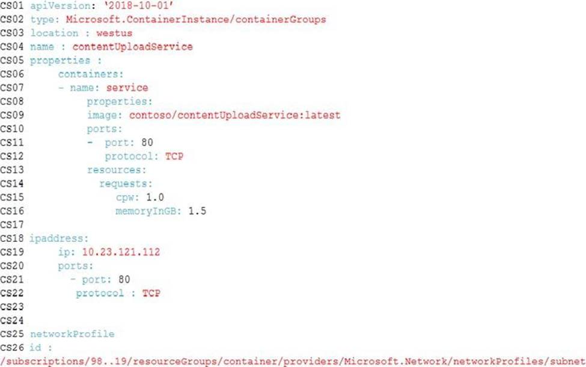
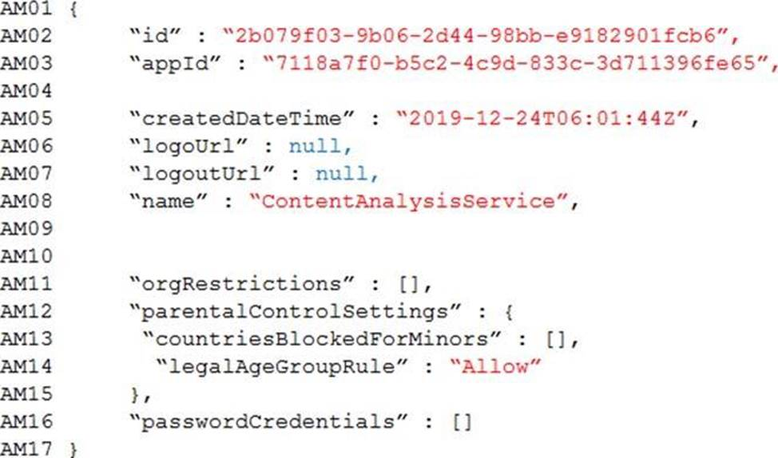
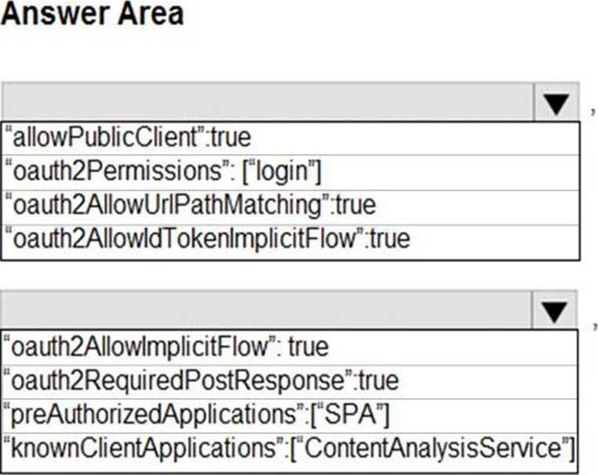

- [ ] Cuadro 1: `"oauth2Permissions": ["login"]`. Cuadro 2: `"oauth2AllowImplicitFlow": true`.
- [x] Cuadro 1: `"oauth2AllowIdTokenImplicitFlow": true`. Cuadro 2: `"oauth2AllowImplicitFlow": true`.
- [ ] Cuadro 1: `"allowPublicClient": true`. Cuadro 2: `"knownClientApplications": ["ContentAnalysisService"]`.
- [ ] Cuadro 1: `"oauth2Permissions": ["login"]`. Cuadro 2: `"preAuthorizedApplications": ["SPA"]`.

**[⬆ Volver arriba](#table-of-contents)**

<a id="you-are-a-developer-for-contoso-ltd-the-company-has-a-social-networking-website-that-is-developed-as-a-single-page-application-spa-the-main-web-application-for-the-social-networking-website-loads-user-uploaded-content-from-blob-storage-you-are-developing-a-solution-to-monitor-uploaded-data-for-inappropriate-content-the-following-process-occurs-when-users-upload-content-by-using-the-spa-messages-are-sent-to-contentuploadservice-content-is-processed-by-contentanalysisservice-after-processing-is-complete-the-content-is-posted-to-the-social-network-or-a-rejection-message-is-posted-in-its-place-the-contentanalysisservice-is-deployed-with-azure-container-instances-from-a-private-azure-container-registry-named-contosoimages-the-solution-will-use-eight-cpu-cores-microsoft-entra-id-contoso-ltd-uses-microsoft-entra-id-for-both-internal-and-guest-accounts-requirements-contentanalysisservice---the-companys-data-science-group-built-contentanalysisservice-which-accepts-user-generated-content-as-a-string-and-returns-a-probable-value-for-inappropriate-content-any-values-over-a-specific-threshold-must-be-reviewed-by-an-employee-of-contoso-ltd-you-must-create-an-azure-function-named-checkusercontent-to-perform-the-content-checks-costs-you-must-minimize-costs-for-all-azure-services-manual-review-to-review-content-the-user-must-authenticate-to-the-website-portion-of-the-contentanalysisservice-using-their-microsoft-entra-id-credentials-the-website-is-built-using-react-and-all-pages-and-api-endpoints-require-authentication-in-order-to-review-content-a-user-must-be-part-of-a-contentreviewer-role-all-completed-reviews-must-include-the-reviewers-email-address-for-auditing-purposes-high-availability-all-services-must-run-in-multiple-regions-the-failure-of-any-service-in-a-region-must-not-impact-overall-application-availability-monitoring-an-alert-must-be-raised-if-the-contentuploadservice-uses-more-than-80-percent-of-available-cpu-cores-security-you-have-the-following-security-requirements-any-web-service-accessible-over-the-internet-must-be-protected-from-cross-site-scripting-attacks-all-websites-and-services-must-use-ssl-from-a-valid-root-certificate-authority-azure-storage-access-keys-must-only-be-stored-in-memory-and-must-be-available-only-to-the-service-all-internal-services-must-only-be-accessible-from-internal-virtual-networks-vnets-all-parts-of-the-system-must-support-inbound-and-outbound-traffic-restrictions-all-service-calls-must-be-authenticated-by-using-microsoft-entra-id-user-agreements-when-a-user-submits-content-they-must-agree-to-a-user-agreement-the-agreement-allows-employees-of-contoso-ltd-to-review-content-store-cookies-on-user-devices-and-track-users-ip-addresses-information-regarding-agreements-is-used-by-multiple-divisions-within-contoso-ltd-user-responses-must-not-be-lost-and-must-be-available-to-all-parties-regardless-of-individual-service-uptime-the-volume-of-agreements-is-expected-to-be-in-the-millions-per-hour-validation-testing-when-a-new-version-of-the-contentanalysisservice-is-available-the-previous-seven-days-of-content-must-be-processed-with-the-new-version-to-verify-that-the-new-version-does-not-significantly-deviate-from-the-old-version-issues-users-of-the-contentuploadservice-report-that-they-occasionally-see-http-502-responses-on-specific-pages-code---contentuploadservice---applicationmanifest-you-need-to-ensure-that-network-security-policies-are-met-how-should-you-configure-network-security"></a>
### Es desarrollador de Contoso, Ltd. [Mismo escenario de Contoso]. Necesita agregar código en la línea AM10 del manifiesto de la aplicación para asegurar que se pueda cumplir el requisito de revisión manual de contenido. ¿Cómo debe completar el código?

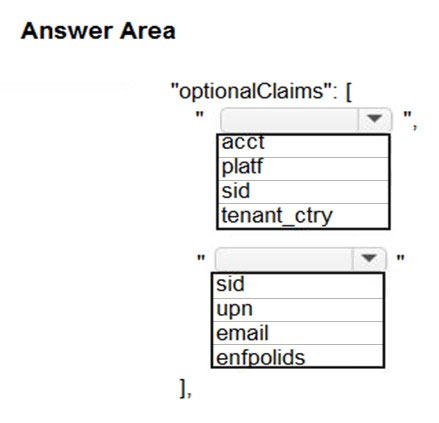

- [x] Cuadro 1: `sid`. Cuadro 2: `email`.
- [ ] Cuadro 1: `platf`. Cuadro 2: `sid`.
- [ ] Cuadro 1: `tenant_ctry`. Cuadro 2: `upn`.
- [ ] Cuadro 1: `sid`. Cuadro 2: `enfpolids`.

**[⬆ Volver arriba](#table-of-contents)**

<a id="you-are-building-a-website-to-access-project-data-related-to-teams-within-your-organization-the-website-does-not-allow-anonymous-access-authentication-is-performed-using-an-microsoft-entra-id-app-named-internal-the-website-has-the-following-authentication-requirements-microsoft-entra-id-users-must-be-able-to-login-to-the-website-personalization-of-the-website-must-be-based-on-membership-in-microsoft-entra-id-groups-you-need-to-configure-the-applications-manifest-to-meet-the-authentication-requirements-how-should-you-configure-the-manifest"></a>
### Es desarrollador de Contoso, Ltd. [Mismo escenario de Contoso]. Necesita asegurarse de que se cumplan las políticas de seguridad de red. ¿Cómo debe configurar la seguridad de red?

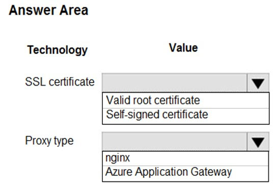

- [ ] Certificado SSL: Certificado autofirmado. Tipo de proxy: nginx.
- [ ] Certificado SSL: Certificado autofirmado. Tipo de proxy: Azure Application Gateway.
- [ ] Certificado SSL: Certificado raíz válido. Tipo de proxy: nginx.
- [x] Certificado SSL: Certificado raíz válido. Tipo de proxy: Azure Application Gateway.

**[⬆ Volver arriba](#table-of-contents)**

### Está creando un sitio web para acceder a datos de proyectos relacionados con equipos dentro de su organización. El sitio web no permite acceso anónimo. La autenticación se realiza usando una aplicación de Microsoft Entra ID llamada internal. El sitio web tiene los siguientes requisitos de autenticación: Los usuarios de Microsoft Entra ID deben poder iniciar sesión en el sitio web. La personalización del sitio web debe basarse en la membresía en grupos de Microsoft Entra ID. Necesita configurar el manifiesto de la aplicación para cumplir con los requisitos de autenticación. ¿Cómo debe configurar el manifiesto?

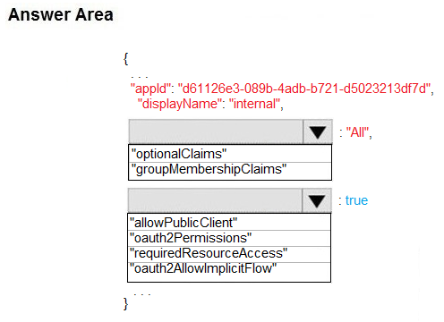

- [ ] Cuadro 1: `"optionalClaims"`. Cuadro 2: `"allowPublicClient"`.
- [ ] Cuadro 1: `"optionalClaims"`. Cuadro 2: `"requiredResourceAccess"`.
- [ ] Cuadro 1: `"groupMembershipClaims"`. Cuadro 2: `"oauth2Permissions"`.
- [x] Cuadro 1: `"groupMembershipClaims"`. Cuadro 2: `"oauth2AllowimplicitFlow"`.

**[⬆ Volver arriba](#table-of-contents)**

<a id="you-are-developing-a-web-application-that-makes-calls-to-the-microsoft-graph-api-you-register-the-application-in-the-azure-portal-and-upload-a-valid-x509-certificate-you-create-an-appsettingsjson-file-containing-the-certificate-name-client-identifier-for-the-application-and-the-tenant-identifier-of-the-microsoft-entra-id-you-create-a-method-named-readcertificate-to-return-the-x509-certificate-by-name-you-need-to-implement-code-that-acquires-a-token-by-using-the-certificate-how-should-you-complete-the-code-segment"></a>
### Está desarrollando una solución de Azure. Necesita desarrollar código para acceder a un secreto almacenado en Azure Key Vault. ¿Cómo debe completar el segmento de código?

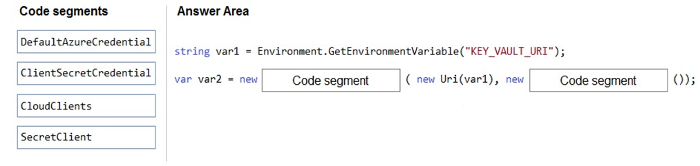

- [ ] Cuadro 1: `DefaultAzureCredential`. Cuadro 2: `ClientSecretCredential`.
- [ ] Cuadro 1: `CloudClients`. Cuadro 2: `ClientSecretCredential`.
- [ ] Cuadro 1: `ClientSecretCredential`. Cuadro 2: `SecretClient`.
- [x] Cuadro 1: `SecretClient`. Cuadro 2: `DefaultAzureCredential`.

**[⬆ Volver arriba](#table-of-contents)**

### Está desarrollando una aplicación web que realiza llamadas a la API de Microsoft Graph. Registra la aplicación en el portal de Azure y carga un certificado `X509` válido. Crea un archivo appsettings.json que contiene el nombre del certificado, el identificador de cliente de la aplicación y el identificador de tenant de Microsoft Entra ID. Crea un método llamado `ReadCertificate` para devolver el certificado `X509` por nombre. Necesita implementar código que adquiera un token usando el certificado. ¿Cómo debe completar el segmento de código?

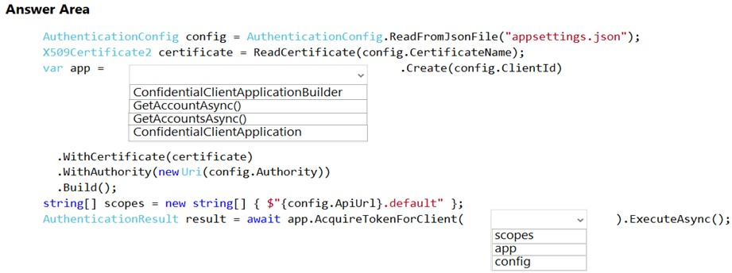

- [ ] Cuadro 1: `ConfidentialClientApplicationBuilder`. Cuadro 2: `app`.
- [x] Cuadro 1: `ConfidentialClientApplicationBuilder`. Cuadro 2: `scopes`.
- [ ] Cuadro 1: `GetAccountAsync()`. Cuadro 2: `scopes`.
- [ ] Cuadro 1: `ConfidentialClientApplication`. Cuadro 2: `config`.

**[⬆ Volver arriba](#table-of-contents)**

<a id="you-are-developing-an-azure-app-service-hosted-aspnet-core-web-app-to-deliver-video-on-demand-streaming-media-you-enable-an-azure-content-delivery-network-cdn-standard-for-the-web-endpoint-customer-videos-are-downloaded-from-the-web-app-by-using-the-following-example-url-httpwwwcontosocomcontentmp4quality1-all-media-content-must-expire-from-the-cache-after-one-hour-customer-videos-with-varying-quality-must-be-delivered-to-the-closest-regional-point-of-presence-pop-node-you-need-to-configure-azure-cdn-caching-rules-which-options-should-you-use"></a>
### Está desarrollando un servicio web ASP.NET Core Web API. El servicio web usa Azure Application Insights para toda la telemetría y el seguimiento de dependencias. El servicio web lee y escribe datos en una base de datos que no es Microsoft SQL Server. Necesita asegurarse de que el seguimiento de dependencias funcione para las llamadas a la base de datos de terceros. ¿Qué dos propiedades de telemetría de dependencias debe usar?

- [ ] `Telemetry.Context.Cloud.RoleInstance`.
- [x] `Telemetry.Id`.
- [ ] `Telemetry.Name`.
- [x] `Telemetry.Context.Operation.Id`.
- [ ] `Telemetry.Context.Session.Id`.

**[⬆ Volver arriba](#table-of-contents)**

### Está desarrollando una aplicación web ASP.NET Core alojada en Azure App Service para entregar streaming de video bajo demanda. Habilita un Azure Content Delivery Network (CDN) Standard para el endpoint web. Los videos de los clientes se descargan de la aplicación web usando la siguiente URL de ejemplo: `http://www.contoso.com/content.mp4?quality=1`. Todo el contenido multimedia debe expirar de la caché después de una hora. Los videos de los clientes con calidad variable deben entregarse al nodo de punto de presencia (POP) regional más cercano. Necesita configurar las reglas de caché de Azure CDN. ¿Qué opciones debe usar?

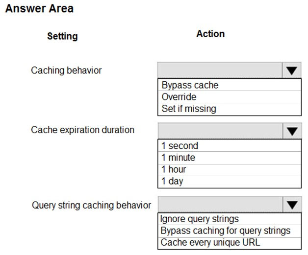

- [x] Comportamiento de caché: Override. Duración de expiración de caché: 1 hora. Comportamiento de caché de cadena de consulta: Cache every unique URL.
- [ ] Comportamiento de caché: Bypass cache. Duración de expiración de caché: 1 día. Comportamiento de caché de cadena de consulta: Bypass caching for query strings.
- [ ] Comportamiento de caché: Set if missing. Duración de expiración de caché: 1 segundo. Comportamiento de caché de cadena de consulta: Ignore query strings.
- [ ] Comportamiento de caché: Override. Duración de expiración de caché: 1 hora. Comportamiento de caché de cadena de consulta: Ignore query strings.

**[⬆ Volver arriba](#table-of-contents)**

### Desarrolla una aplicación web que usa un plan de App Service de nivel D1 mediante la característica Web Apps de Microsoft Azure App Service. Los picos de tráfico han causado aumentos en los tiempos de carga de página. Necesita asegurarse de que la aplicación web escale automáticamente cuando la carga de CPU sea del 85 por ciento aproximadamente y minimizar los costos. ¿Qué cuatro acciones debe realizar en secuencia?

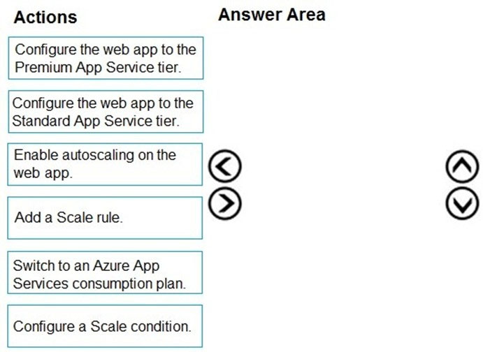

- [x] Cuadro 1: Configurar la aplicación web al nivel Standard de App Service. Cuadro 2: Habilitar el autoescalado en la aplicación web. Cuadro 3: Agregar una regla de escalada. Cuadro 4: Configurar una condición de escalada.
- [ ] Cuadro 1: Habilitar el autoescalado en la aplicación web. Cuadro 2: Agregar una regla de escalada. Cuadro 3: Configurar una condición de escalada. Cuadro 4: Cambiar a un plan de consumo de Azure App Services.
- [ ] Cuadro 1: Configurar la aplicación web al nivel Standard de App Service. Cuadro 2: Habilitar el autoescalado en la aplicación web. Cuadro 3: Configurar una condición de escalada. Cuadro 4: Cliente Secreto.
- [ ] Cuadro 1: Cambiar a un plan de consumo de Azure App Services. Cuadro 2: Configurar la aplicación web al nivel Premium de App Service. Cuadro 3: Habilitar el autoescalado en la aplicación web. Cuadro 4: Configurar una condición de escalada.

**[⬆ Volver arriba](#table-of-contents)**

<a id="you-have-an-azure-web-app-that-uses-cosmos-db-as-a-data-store-you-create-a-cosmosdb-container-by-running-the-following-powershell-script-resourcegroupname--testresourcegroup-accountname--testcosmosaccount-databasename--testdatabase-containername--testcontainer-partitionkeypath--employeeid-autoscalemaxthroughput--5000-new-azcosmosdbsqlcontainer----resourcegroupname-resourcegroupname--accountname-accountname--databasename-databasename--name-containername--partitionkeykind-hash--partitionkeypath-partitionkeypath--autoscalemaxthroughput-autoscalemaxthroughput-you-create-the-following-queries-that-target-the-container-select--from-c-where-cemployeeid--12345-select--from-c-where-cuserid--12345-question-1-the-minimum-throughput-for-the-container-is-400-rus"></a>
### Una empresa hace copias de seguridad de todos los datos de fabricación en Azure Blob Storage. Los administradores mueven los blobs del almacenamiento en caliente al nivel de almacenamiento de archivo cada mes. Debe mover automáticamente los blobs al nivel Archive después de que no hayan sido modificados en 180 días. La ruta de cualquier elemento que no esté archivado debe colocarse en una cola existente. Esta operación debe realizarse automáticamente una vez al mes. Establece el valor de TierAgeInDays en -180. ¿Cómo debe configurar la Logic App?

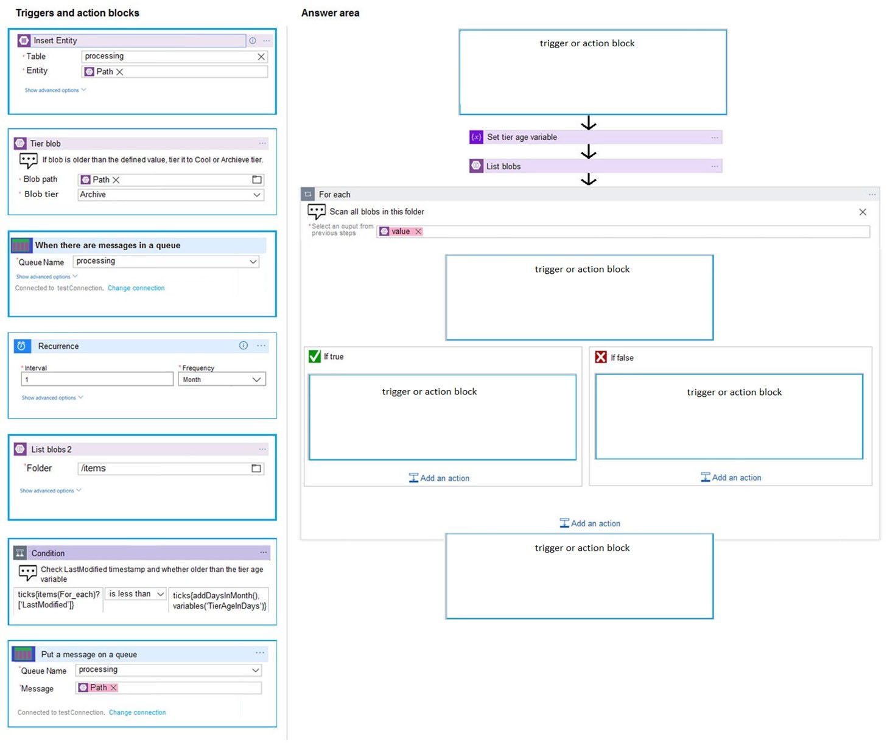

- [ ] Cuadro 1: poner un mensaje en una cola. Cuadro 2: Recurrencia. Cuadro 3: Condición. Cuadro 4: Cuando hay mensajes en una cola. Cuadro 5: Lista de manchas 2.
- [ ] Cuadro 1: Recurrencia. Cuadro 2: Condición. Cuadro 3: Cuando hay mensajes en una cola. Cuadro 4: Blob de nivel. Cuadro 5: Lista de manchas 2.
- [ ] Cuadro 1: Recurrencia. Cuadro 2: Condición. Cuadro 3: Poner un mensaje en una cola. Cuadro 4: Cuando hay mensajes en una cola. Cuadro 5: Blob de nivel.
- [x] Cuadro 1: Recurrencia. Cuadro 2: Condición. Cuadro 3: Poner un mensaje en una cola. Cuadro 4: Blob de nivel. Cuadro 5: Lista de manchas 2.

**[⬆ Volver arriba](#table-of-contents)**

<a id="you-have-an-azure-web-app-that-uses-cosmos-db-as-a-data-store-you-create-a-cosmosdb-container-by-running-the-following-powershell-script-resourcegroupname--testresourcegroup-accountname--testcosmosaccount-databasename--testdatabase-containername--testcontainer-partitionkeypath--employeeid-autoscalemaxthroughput--5000-new-azcosmosdbsqlcontainer----resourcegroupname-resourcegroupname--accountname-accountname--databasename-databasename--name-containername--partitionkeykind-hash--partitionkeypath-partitionkeypath--autoscalemaxthroughput-autoscalemaxthroughput-you-create-the-following-queries-that-target-the-container-select--from-c-where-cemployeeid--12345-select--from-c-where-cuserid--12345-question-2-the-first-query-statement-is-an-in-partition-query"></a>
### Tiene una aplicación web de Azure que usa Cosmos DB como almacén de datos. Crea un contenedor de CosmosDB ejecutando el siguiente script de PowerShell: `$resourceGroupName = 'testResourceGroup' $accountName = 'testCosmosAccount' $databaseName = 'testDatabase' $containerName = 'testContainer' $partitionKeyPath = '/EmployeeId' $autoscaleMaxThroughput = 5000 New-AzCosmosDBSqlContainer - -ResourceGroupName $resourceGroupName -AccountName $accountName -DatabaseName $databaseName -Name $containerName -PartitionKeyKind Hash -PartitionKeyPath $partitionKeyPath -AutoscaleMaxThroughput $autoscaleMaxThroughput`. Crea las siguientes consultas que apuntan al contenedor: `SELECT * FROM c WHERE c.EmployeeId > '12345' SELECT * FROM c WHERE c.UserID = '12345'`. ¿Es el rendimiento mínimo para el contenedor 400 R/Us?

- [ ] Sí.
- [x] No.

**[⬆ Volver arriba](#table-of-contents)**

<a id="you-have-an-azure-web-app-that-uses-cosmos-db-as-a-data-store-you-create-a-cosmosdb-container-by-running-the-following-powershell-script-resourcegroupname--testresourcegroup-accountname--testcosmosaccount-databasename--testdatabase-containername--testcontainer-partitionkeypath--employeeid-autoscalemaxthroughput--5000-new-azcosmosdbsqlcontainer----resourcegroupname-resourcegroupname--accountname-accountname--databasename-databasename--name-containername--partitionkeykind-hash--partitionkeypath-partitionkeypath--autoscalemaxthroughput-autoscalemaxthroughput-you-create-the-following-queries-that-target-the-container-select--from-c-where-cemployeeid--12345-select--from-c-where-cuserid--12345-question-3-the-second-query-statement-is-a-cross-partition-query"></a>
### Tiene una aplicación web de Azure que usa Cosmos DB como almacén de datos. [Mismo script de PowerShell]. Crea las siguientes consultas: `SELECT * FROM c WHERE c.EmployeeId > '12345' SELECT * FROM c WHERE c.UserID = '12345'`. ¿Es la primera instrucción de consulta una consulta dentro de la partición (in-partition)?

- [ ] Sí.
- [x] No.

**[⬆ Volver arriba](#table-of-contents)**

### Tiene una aplicación web de Azure que usa Cosmos DB como almacén de datos. [Mismo script de PowerShell]. Crea las siguientes consultas: `SELECT * FROM c WHERE c.EmployeeId > '12345' SELECT * FROM c WHERE c.UserID = '12345'`. ¿Es la segunda instrucción de consulta una consulta entre particiones (cross-partition)?

- [x] Sí.
- [ ] No.

**[⬆ Volver arriba](#table-of-contents)**

### Su tenant de Microsoft Entra ID tiene una suscripción de Azure vinculada. Su desarrollador ha creado una aplicación móvil que obtiene tokens de acceso de Microsoft Entra ID usando el tipo de concesión implícita OAuth 2. La aplicación móvil debe registrarse en Microsoft Entra ID. Requiere [un URI de redirección] del desarrollador para fines de registro.

- [x] No se requiere cambio.
- [ ] un secreto.
- [ ] una sugerencia de inicio de sesión.
- [ ] un ID de cliente.

**[⬆ Volver arriba](#table-of-contents)**

<a id="you-are-developing-an-application-that-uses-a-premium-block-blob-storage-account-you-are-optimizing-costs-by-automating-azure-blob-storage-access-tiers-you-apply-the-following-policy-rules-to-the-storage-account-you-must-determine-the-implications-of-applying-the-rules-to-the-data-line-numbers-are-included-for-reference-only-question-1-block-blobs-prefixed-with-container1salesorders-or-container2inventory-which-have-not-been-modified-in-over-60-days-are-moved-to-cool-storage-blobs-that-have-not-been-modified-in-120-days-are-moved-to-the-archive-tier"></a>
### Desarrolla una aplicación ASP.NET Core MVC. Configura la aplicación para rastrear páginas web y eventos personalizados. Necesita identificar tendencias en el uso de la aplicación. ¿Qué características de análisis de uso de Azure Application Insights debe usar?

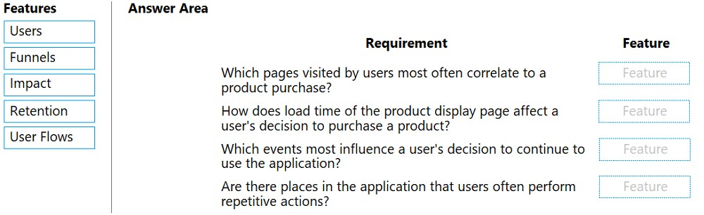

- [x] Cuadro 1: Embudos. Cuadro 2: Impacto. Cuadro 3: Retención. Cuadro 4: Flujos de usuarios.
- [ ] Cuadro 1: Impacto. Cuadro 2: Embudos. Cuadro 3: Retención. Cuadro 4: Flujos de usuarios.
- [ ] Cuadro 1: Usuarios. Cuadro 2: Impacto. Cuadro 3: Retención. Cuadro 4: Flujos de usuarios.
- [ ] Cuadro 1: Impacto. Cuadro 2: Usuarios. Cuadro 3: Flujos de usuarios. Cuadro 4: Embudos.

**[⬆ Volver arriba](#table-of-contents)**

### Está desarrollando una aplicación que usa una cuenta de almacenamiento premium de block blob. Está optimizando costos automatizando los niveles de acceso de Azure Blob Storage. Aplica las siguientes reglas de política a la cuenta de almacenamiento. Debe determinar las implicaciones de aplicar las reglas a los datos. (Los números de línea se incluyen solo como referencia.) Pregunta 1: Los block blobs con prefijo container1/salesorders o container2/inventory que no han sido modificados en más de 60 días se mueven al almacenamiento en frío. Los blobs que no han sido modificados en 120 días se mueven al nivel archive.

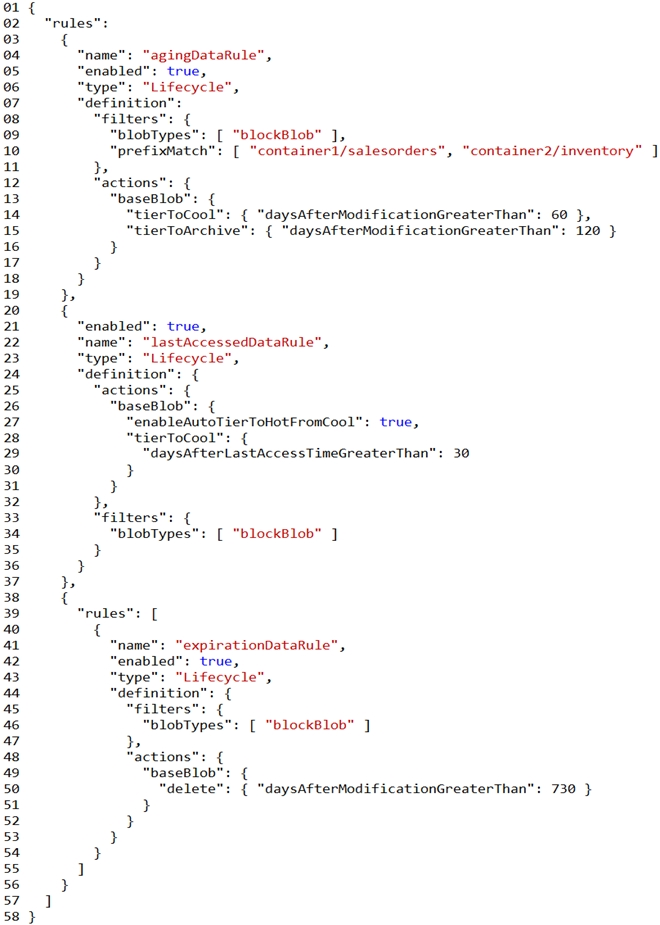

- [x] Sí.
- [ ] No.

**[⬆ Volver arriba](#table-of-contents)**

### Está desarrollando una aplicación que usa una cuenta de almacenamiento premium de block blob. Está optimizando costos automatizando los niveles de acceso de Azure Blob Storage. [Mismas reglas de política]. Pregunta 2: Los blobs se mueven al almacenamiento en frío si no se han accedido durante 30 días.

- [x] Sí.
- [ ] No.

**[⬆ Volver arriba](#table-of-contents)**

### Está desarrollando una aplicación que usa una cuenta de almacenamiento premium de block blob. [Mismas reglas de política]. Pregunta 3: Los blobs se moverán automáticamente del nivel frío de vuelta al caliente si se accede a ellos nuevamente después de haber sido movidos al nivel frío.

- [x] Sí.
- [ ] No.

**[⬆ Volver arriba](#table-of-contents)**

<a id="you-are-a-developer-for-contoso-ltd-the-company-has-a-social-networking-website-that-is-developed-as-a-single-page-application-spa-the-main-web-application-for-the-social-networking-website-loads-user-uploaded-content-from-blob-storage-you-are-developing-a-solution-to-monitor-uploaded-data-for-inappropriate-content-the-following-process-occurs-when-users-upload-content-by-using-the-spa-messages-are-sent-to-contentuploadservice-content-is-processed-by-contentanalysisservice-after-processing-is-complete-the-content-is-posted-to-the-social-network-or-a-rejection-message-is-posted-in-its-place-the-contentanalysisservice-is-deployed-with-azure-container-instances-from-a-private-azure-container-registry-named-contosoimages-the-solution-will-use-eight-cpu-cores-microsoft-entra-id-contoso-ltd-uses-microsoft-entra-id-for-both-internal-and-guest-accounts-requirements-contentanalysisservice---the-companys-data-science-group-built-contentanalysisservice-which-accepts-user-generated-content-as-a-string-and-returns-a-probable-value-for-inappropriate-content-any-values-over-a-specific-threshold-must-be-reviewed-by-an-employee-of-contoso-ltd-you-must-create-an-azure-function-named-checkusercontent-to-perform-the-content-checks-costs-you-must-minimize-costs-for-all-azure-services-manual-review-to-review-content-the-user-must-authenticate-to-the-website-portion-of-the-contentanalysisservice-using-their-microsoft-entra-id-credentials-the-website-is-built-using-react-and-all-pages-and-api-endpoints-require-authentication-in-order-to-review-content-a-user-must-be-part-of-a-contentreviewer-role-all-completed-reviews-must-include-the-reviewers-email-address-for-auditing-purposes-high-availability-all-services-must-run-in-multiple-regions-the-failure-of-any-service-in-a-region-must-not-impact-overall-application-availability-monitoring-an-alert-must-be-raised-if-the-contentuploadservice-uses-more-than-80-percent-of-available-cpu-cores-security-you-have-the-following-security-requirements-any-web-service-accessible-over-the-internet-must-be-protected-from-cross-site-scripting-attacks-all-websites-and-services-must-use-ssl-from-a-valid-root-certificate-authority-azure-storage-access-keys-must-only-be-stored-in-memory-and-must-be-available-only-to-the-service-all-internal-services-must-only-be-accessible-from-internal-virtual-networks-vnets-all-parts-of-the-system-must-support-inbound-and-outbound-traffic-restrictions-all-service-calls-must-be-authenticated-by-using-microsoft-entra-id-user-agreements-when-a-user-submits-content-they-must-agree-to-a-user-agreement-the-agreement-allows-employees-of-contoso-ltd-to-review-content-store-cookies-on-user-devices-and-track-users-ip-addresses-information-regarding-agreements-is-used-by-multiple-divisions-within-contoso-ltd-user-responses-must-not-be-lost-and-must-be-available-to-all-parties-regardless-of-individual-service-uptime-the-volume-of-agreements-is-expected-to-be-in-the-millions-per-hour-validation-testing-when-a-new-version-of-the-contentanalysisservice-is-available-the-previous-seven-days-of-content-must-be-processed-with-the-new-version-to-verify-that-the-new-version-does-not-significantly-deviate-from-the-old-version-issues-users-of-the-contentuploadservice-report-that-they-occasionally-see-http-502-responses-on-specific-pages-code---contentuploadservice---applicationmanifest-you-need-to-store-the-user-agreements-where-should-you-store-the-agreement-after-it-is-completed"></a>
### Está desarrollando una aplicación que usa una cuenta de almacenamiento premium de block blob. [Mismas reglas de política]. Pregunta 4: Todos los block blobs con más de 730 días serán eliminados.

- [ ] Sí.
- [x] No.

**[⬆ Volver arriba](#table-of-contents)**

<a id="you-are-a-developer-for-contoso-ltd-the-company-has-a-social-networking-website-that-is-developed-as-a-single-page-application-spa-the-main-web-application-for-the-social-networking-website-loads-user-uploaded-content-from-blob-storage-you-are-developing-a-solution-to-monitor-uploaded-data-for-inappropriate-content-the-following-process-occurs-when-users-upload-content-by-using-the-spa-messages-are-sent-to-contentuploadservice-content-is-processed-by-contentanalysisservice-after-processing-is-complete-the-content-is-posted-to-the-social-network-or-a-rejection-message-is-posted-in-its-place-the-contentanalysisservice-is-deployed-with-azure-container-instances-from-a-private-azure-container-registry-named-contosoimages-the-solution-will-use-eight-cpu-cores-microsoft-entra-id-contoso-ltd-uses-microsoft-entra-id-for-both-internal-and-guest-accounts-requirements-contentanalysisservice---the-companys-data-science-group-built-contentanalysisservice-which-accepts-user-generated-content-as-a-string-and-returns-a-probable-value-for-inappropriate-content-any-values-over-a-specific-threshold-must-be-reviewed-by-an-employee-of-contoso-ltd-you-must-create-an-azure-function-named-checkusercontent-to-perform-the-content-checks-costs-you-must-minimize-costs-for-all-azure-services-manual-review-to-review-content-the-user-must-authenticate-to-the-website-portion-of-the-contentanalysisservice-using-their-microsoft-entra-id-credentials-the-website-is-built-using-react-and-all-pages-and-api-endpoints-require-authentication-in-order-to-review-content-a-user-must-be-part-of-a-contentreviewer-role-all-completed-reviews-must-include-the-reviewers-email-address-for-auditing-purposes-high-availability-all-services-must-run-in-multiple-regions-the-failure-of-any-service-in-a-region-must-not-impact-overall-application-availability-monitoring-an-alert-must-be-raised-if-the-contentuploadservice-uses-more-than-80-percent-of-available-cpu-cores-security-you-have-the-following-security-requirements-any-web-service-accessible-over-the-internet-must-be-protected-from-cross-site-scripting-attacks-all-websites-and-services-must-use-ssl-from-a-valid-root-certificate-authority-azure-storage-access-keys-must-only-be-stored-in-memory-and-must-be-available-only-to-the-service-all-internal-services-must-only-be-accessible-from-internal-virtual-networks-vnets-all-parts-of-the-system-must-support-inbound-and-outbound-traffic-restrictions-all-service-calls-must-be-authenticated-by-using-microsoft-entra-id-user-agreements-when-a-user-submits-content-they-must-agree-to-a-user-agreement-the-agreement-allows-employees-of-contoso-ltd-to-review-content-store-cookies-on-user-devices-and-track-users-ip-addresses-information-regarding-agreements-is-used-by-multiple-divisions-within-contoso-ltd-user-responses-must-not-be-lost-and-must-be-available-to-all-parties-regardless-of-individual-service-uptime-the-volume-of-agreements-is-expected-to-be-in-the-millions-per-hour-validation-testing-when-a-new-version-of-the-contentanalysisservice-is-available-the-previous-seven-days-of-content-must-be-processed-with-the-new-version-to-verify-that-the-new-version-does-not-significantly-deviate-from-the-old-version-issues-users-of-the-contentuploadservice-report-that-they-occasionally-see-http-502-responses-on-specific-pages-code---contentuploadservice---applicationmanifest-you-need-to-monitor-contentuploadservice-according-to-the-requirements-which-command-should-you-use"></a>
### Es desarrollador de Contoso, Ltd. [Mismo escenario de Contoso]. Necesita almacenar los acuerdos de usuario. ¿Dónde debe almacenar el acuerdo después de que se complete?

- [ ] Cola de almacenamiento de Azure.
- [x] Centro de eventos de Azure.
- [ ] Tema de Bus de servicio de Azure.
- [ ] Tema de Azure Event Grid.

**[⬆ Volver arriba](#table-of-contents)**

<a id="you-are-a-developer-for-contoso-ltd-the-company-has-a-social-networking-website-that-is-developed-as-a-single-page-application-spa-the-main-web-application-for-the-social-networking-website-loads-user-uploaded-content-from-blob-storage-you-are-developing-a-solution-to-monitor-uploaded-data-for-inappropriate-content-the-following-process-occurs-when-users-upload-content-by-using-the-spa-messages-are-sent-to-contentuploadservice-content-is-processed-by-contentanalysisservice-after-processing-is-complete-the-content-is-posted-to-the-social-network-or-a-rejection-message-is-posted-in-its-place-the-contentanalysisservice-is-deployed-with-azure-container-instances-from-a-private-azure-container-registry-named-contosoimages-the-solution-will-use-eight-cpu-cores-microsoft-entra-id-contoso-ltd-uses-microsoft-entra-id-for-both-internal-and-guest-accounts-requirements-contentanalysisservice---the-companys-data-science-group-built-contentanalysisservice-which-accepts-user-generated-content-as-a-string-and-returns-a-probable-value-for-inappropriate-content-any-values-over-a-specific-threshold-must-be-reviewed-by-an-employee-of-contoso-ltd-you-must-create-an-azure-function-named-checkusercontent-to-perform-the-content-checks-costs-you-must-minimize-costs-for-all-azure-services-manual-review-to-review-content-the-user-must-authenticate-to-the-website-portion-of-the-contentanalysisservice-using-their-microsoft-entra-id-credentials-the-website-is-built-using-react-and-all-pages-and-api-endpoints-require-authentication-in-order-to-review-content-a-user-must-be-part-of-a-contentreviewer-role-all-completed-reviews-must-include-the-reviewers-email-address-for-auditing-purposes-high-availability-all-services-must-run-in-multiple-regions-the-failure-of-any-service-in-a-region-must-not-impact-overall-application-availability-monitoring-an-alert-must-be-raised-if-the-contentuploadservice-uses-more-than-80-percent-of-available-cpu-cores-security-you-have-the-following-security-requirements-any-web-service-accessible-over-the-internet-must-be-protected-from-cross-site-scripting-attacks-all-websites-and-services-must-use-ssl-from-a-valid-root-certificate-authority-azure-storage-access-keys-must-only-be-stored-in-memory-and-must-be-available-only-to-the-service-all-internal-services-must-only-be-accessible-from-internal-virtual-networks-vnets-all-parts-of-the-system-must-support-inbound-and-outbound-traffic-restrictions-all-service-calls-must-be-authenticated-by-using-microsoft-entra-id-user-agreements-when-a-user-submits-content-they-must-agree-to-a-user-agreement-the-agreement-allows-employees-of-contoso-ltd-to-review-content-store-cookies-on-user-devices-and-track-users-ip-addresses-information-regarding-agreements-is-used-by-multiple-divisions-within-contoso-ltd-user-responses-must-not-be-lost-and-must-be-available-to-all-parties-regardless-of-individual-service-uptime-the-volume-of-agreements-is-expected-to-be-in-the-millions-per-hour-validation-testing-when-a-new-version-of-the-contentanalysisservice-is-available-the-previous-seven-days-of-content-must-be-processed-with-the-new-version-to-verify-that-the-new-version-does-not-significantly-deviate-from-the-old-version-issues-users-of-the-contentuploadservice-report-that-they-occasionally-see-http-502-responses-on-specific-pages-code---contentuploadservice---applicationmanifest-you-need-to-investigate-the-http-server-log-output-to-resolve-the-issue-with-the-contentuploadservice-which-command-should-you-use-first"></a>
### Es desarrollador de Contoso, Ltd. [Mismo escenario de Contoso]. Necesita monitorear `ContentUploadService` según los requisitos. ¿Qué comando debe usar?

- [ ] `az monitor metrics alert create Cn alert Cg … - -scopes … - -condition "avg Percentage CPU > 8"`.
- [ ] `az monitor metrics alert create Cn alert Cg … - -scopes … - -condition "avg Percentage CPU > 800"`.
- [x] `az monitor metrics alert create Cn alert Cg … - -scopes … - -condition "CPU Usage > 800"`.
- [ ] `az monitor metrics alert create Cn alert Cg … - -scopes … - -condition "CPU Usage > 8"`.

**[⬆ Volver arriba](#table-of-contents)**

<a id="you-are-a-developer-for-contoso-ltd-the-company-has-a-social-networking-website-that-is-developed-as-a-single-page-application-spa-the-main-web-application-for-the-social-networking-website-loads-user-uploaded-content-from-blob-storage-you-are-developing-a-solution-to-monitor-uploaded-data-for-inappropriate-content-the-following-process-occurs-when-users-upload-content-by-using-the-spa-messages-are-sent-to-contentuploadservice-content-is-processed-by-contentanalysisservice-after-processing-is-complete-the-content-is-posted-to-the-social-network-or-a-rejection-message-is-posted-in-its-place-the-contentanalysisservice-is-deployed-with-azure-container-instances-from-a-private-azure-container-registry-named-contosoimages-the-solution-will-use-eight-cpu-cores-microsoft-entra-id-contoso-ltd-uses-microsoft-entra-id-for-both-internal-and-guest-accounts-requirements-contentanalysisservice---the-companys-data-science-group-built-contentanalysisservice-which-accepts-user-generated-content-as-a-string-and-returns-a-probable-value-for-inappropriate-content-any-values-over-a-specific-threshold-must-be-reviewed-by-an-employee-of-contoso-ltd-you-must-create-an-azure-function-named-checkusercontent-to-perform-the-content-checks-costs-you-must-minimize-costs-for-all-azure-services-manual-review-to-review-content-the-user-must-authenticate-to-the-website-portion-of-the-contentanalysisservice-using-their-microsoft-entra-id-credentials-the-website-is-built-using-react-and-all-pages-and-api-endpoints-require-authentication-in-order-to-review-content-a-user-must-be-part-of-a-contentreviewer-role-all-completed-reviews-must-include-the-reviewers-email-address-for-auditing-purposes-high-availability-all-services-must-run-in-multiple-regions-the-failure-of-any-service-in-a-region-must-not-impact-overall-application-availability-monitoring-an-alert-must-be-raised-if-the-contentuploadservice-uses-more-than-80-percent-of-available-cpu-cores-security-you-have-the-following-security-requirements-any-web-service-accessible-over-the-internet-must-be-protected-from-cross-site-scripting-attacks-all-websites-and-services-must-use-ssl-from-a-valid-root-certificate-authority-azure-storage-access-keys-must-only-be-stored-in-memory-and-must-be-available-only-to-the-service-all-internal-services-must-only-be-accessible-from-internal-virtual-networks-vnets-all-parts-of-the-system-must-support-inbound-and-outbound-traffic-restrictions-all-service-calls-must-be-authenticated-by-using-microsoft-entra-id-user-agreements-when-a-user-submits-content-they-must-agree-to-a-user-agreement-the-agreement-allows-employees-of-contoso-ltd-to-review-content-store-cookies-on-user-devices-and-track-users-ip-addresses-information-regarding-agreements-is-used-by-multiple-divisions-within-contoso-ltd-user-responses-must-not-be-lost-and-must-be-available-to-all-parties-regardless-of-individual-service-uptime-the-volume-of-agreements-is-expected-to-be-in-the-millions-per-hour-validation-testing-when-a-new-version-of-the-contentanalysisservice-is-available-the-previous-seven-days-of-content-must-be-processed-with-the-new-version-to-verify-that-the-new-version-does-not-significantly-deviate-from-the-old-version-issues-users-of-the-contentuploadservice-report-that-they-occasionally-see-http-502-responses-on-specific-pages-code---contentuploadservice---applicationmanifest-you-need-to-implement-the-bindings-for-the-checkusercontent-function-how-should-you-complete-the-code-segment"></a>
### Es desarrollador de Contoso, Ltd. [Mismo escenario de Contoso]. Necesita investigar la salida del registro del servidor HTTP para resolver el problema con `ContentUploadService`. ¿Qué comando debe usar primero?

- [ ] `az webapp log`.
- [ ] `az ams live-output`.
- [ ] `az monitor activity-log`.
- [x] `az container attach`.

**[⬆ Volver arriba](#table-of-contents)**

<a id="you-are-a-developer-for-contoso-ltd-the-company-has-a-social-networking-website-that-is-developed-as-a-single-page-application-spa-the-main-web-application-for-the-social-networking-website-loads-user-uploaded-content-from-blob-storage-you-are-developing-a-solution-to-monitor-uploaded-data-for-inappropriate-content-the-following-process-occurs-when-users-upload-content-by-using-the-spa-messages-are-sent-to-contentuploadservice-content-is-processed-by-contentanalysisservice-after-processing-is-complete-the-content-is-posted-to-the-social-network-or-a-rejection-message-is-posted-in-its-place-the-contentanalysisservice-is-deployed-with-azure-container-instances-from-a-private-azure-container-registry-named-contosoimages-the-solution-will-use-eight-cpu-cores-microsoft-entra-id-contoso-ltd-uses-microsoft-entra-id-for-both-internal-and-guest-accounts-requirements-contentanalysisservice---the-companys-data-science-group-built-contentanalysisservice-which-accepts-user-generated-content-as-a-string-and-returns-a-probable-value-for-inappropriate-content-any-values-over-a-specific-threshold-must-be-reviewed-by-an-employee-of-contoso-ltd-you-must-create-an-azure-function-named-checkusercontent-to-perform-the-content-checks-costs-you-must-minimize-costs-for-all-azure-services-manual-review-to-review-content-the-user-must-authenticate-to-the-website-portion-of-the-contentanalysisservice-using-their-microsoft-entra-id-credentials-the-website-is-built-using-react-and-all-pages-and-api-endpoints-require-authentication-in-order-to-review-content-a-user-must-be-part-of-a-contentreviewer-role-all-completed-reviews-must-include-the-reviewers-email-address-for-auditing-purposes-high-availability-all-services-must-run-in-multiple-regions-the-failure-of-any-service-in-a-region-must-not-impact-overall-application-availability-monitoring-an-alert-must-be-raised-if-the-contentuploadservice-uses-more-than-80-percent-of-available-cpu-cores-security-you-have-the-following-security-requirements-any-web-service-accessible-over-the-internet-must-be-protected-from-cross-site-scripting-attacks-all-websites-and-services-must-use-ssl-from-a-valid-root-certificate-authority-azure-storage-access-keys-must-only-be-stored-in-memory-and-must-be-available-only-to-the-service-all-internal-services-must-only-be-accessible-from-internal-virtual-networks-vnets-all-parts-of-the-system-must-support-inbound-and-outbound-traffic-restrictions-all-service-calls-must-be-authenticated-by-using-microsoft-entra-id-user-agreements-when-a-user-submits-content-they-must-agree-to-a-user-agreement-the-agreement-allows-employees-of-contoso-ltd-to-review-content-store-cookies-on-user-devices-and-track-users-ip-addresses-information-regarding-agreements-is-used-by-multiple-divisions-within-contoso-ltd-user-responses-must-not-be-lost-and-must-be-available-to-all-parties-regardless-of-individual-service-uptime-the-volume-of-agreements-is-expected-to-be-in-the-millions-per-hour-validation-testing-when-a-new-version-of-the-contentanalysisservice-is-available-the-previous-seven-days-of-content-must-be-processed-with-the-new-version-to-verify-that-the-new-version-does-not-significantly-deviate-from-the-old-version-issues-users-of-the-contentuploadservice-report-that-they-occasionally-see-http-502-responses-on-specific-pages-code---contentuploadservice---applicationmanifest-you-need-to-add-markup-at-line-am04-to-implement-the-contentreview-role-how-should-you-complete-the-markup"></a>
### Es desarrollador de Contoso, Ltd. [Mismo escenario de Contoso]. Necesita implementar los bindings para la función `CheckUserContent`. ¿Cómo debe completar el segmento de código?

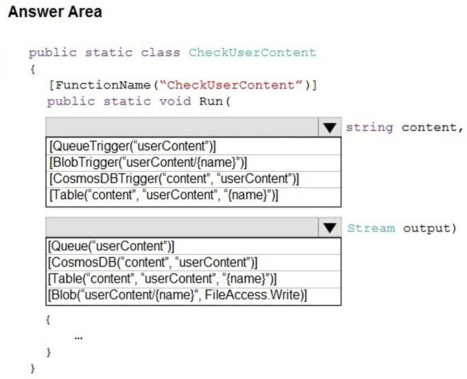

- [ ] Cuadro 1: [CosmosDBTrigger("contenido", "contenido de usuario")]. Cuadro 2: [Tabla ("contenido", "contenido de usuario", "{nombre}")].
- [ ] Cuadro 1: [CosmosDBTrigger("contenido", "contenido de usuario")]. Cuadro 2: [Cola ("contenido de usuario")].
- [ ] Cuadro 1: [BlobTrigger("userContent/{name}")]. Cuadro 2: [Blob("userContent/{name}", FileAccess.Write)].
- [x] Cuadro 1: [QueueTrigger("userContent")]. Cuadro 2: [Blob("userContent/{name}", FileAccess.Write)].

**[⬆ Volver arriba](#table-of-contents)**

<a id="you-are-a-developer-for-contoso-ltd-the-company-has-a-social-networking-website-that-is-developed-as-a-single-page-application-spa-the-main-web-application-for-the-social-networking-website-loads-user-uploaded-content-from-blob-storage-you-are-developing-a-solution-to-monitor-uploaded-data-for-inappropriate-content-the-following-process-occurs-when-users-upload-content-by-using-the-spa-messages-are-sent-to-contentuploadservice-content-is-processed-by-contentanalysisservice-after-processing-is-complete-the-content-is-posted-to-the-social-network-or-a-rejection-message-is-posted-in-its-place-the-contentanalysisservice-is-deployed-with-azure-container-instances-from-a-private-azure-container-registry-named-contosoimages-the-solution-will-use-eight-cpu-cores-microsoft-entra-id-contoso-ltd-uses-microsoft-entra-id-for-both-internal-and-guest-accounts-requirements-contentanalysisservice---the-companys-data-science-group-built-contentanalysisservice-which-accepts-user-generated-content-as-a-string-and-returns-a-probable-value-for-inappropriate-content-any-values-over-a-specific-threshold-must-be-reviewed-by-an-employee-of-contoso-ltd-you-must-create-an-azure-function-named-checkusercontent-to-perform-the-content-checks-costs-you-must-minimize-costs-for-all-azure-services-manual-review-to-review-content-the-user-must-authenticate-to-the-website-portion-of-the-contentanalysisservice-using-their-microsoft-entra-id-credentials-the-website-is-built-using-react-and-all-pages-and-api-endpoints-require-authentication-in-order-to-review-content-a-user-must-be-part-of-a-contentreviewer-role-all-completed-reviews-must-include-the-reviewers-email-address-for-auditing-purposes-high-availability-all-services-must-run-in-multiple-regions-the-failure-of-any-service-in-a-region-must-not-impact-overall-application-availability-monitoring-an-alert-must-be-raised-if-the-contentuploadservice-uses-more-than-80-percent-of-available-cpu-cores-security-you-have-the-following-security-requirements-any-web-service-accessible-over-the-internet-must-be-protected-from-cross-site-scripting-attacks-all-websites-and-services-must-use-ssl-from-a-valid-root-certificate-authority-azure-storage-access-keys-must-only-be-stored-in-memory-and-must-be-available-only-to-the-service-all-internal-services-must-only-be-accessible-from-internal-virtual-networks-vnets-all-parts-of-the-system-must-support-inbound-and-outbound-traffic-restrictions-all-service-calls-must-be-authenticated-by-using-microsoft-entra-id-user-agreements-when-a-user-submits-content-they-must-agree-to-a-user-agreement-the-agreement-allows-employees-of-contoso-ltd-to-review-content-store-cookies-on-user-devices-and-track-users-ip-addresses-information-regarding-agreements-is-used-by-multiple-divisions-within-contoso-ltd-user-responses-must-not-be-lost-and-must-be-available-to-all-parties-regardless-of-individual-service-uptime-the-volume-of-agreements-is-expected-to-be-in-the-millions-per-hour-validation-testing-when-a-new-version-of-the-contentanalysisservice-is-available-the-previous-seven-days-of-content-must-be-processed-with-the-new-version-to-verify-that-the-new-version-does-not-significantly-deviate-from-the-old-version-issues-users-of-the-contentuploadservice-report-that-they-occasionally-see-http-502-responses-on-specific-pages-code---contentuploadservice---applicationmanifest-you-need-to-add-yaml-markup-at-line-cs17-to-ensure-that-the-contentuploadservice-can-access-azure-storage-access-keys-how-should-you-complete-the-yaml-markup"></a>
### Es desarrollador de Contoso, Ltd. [Mismo escenario de Contoso]. Necesita agregar markup en la línea AM04 para implementar el rol `ContentReview`. ¿Cómo debe completar el markup?

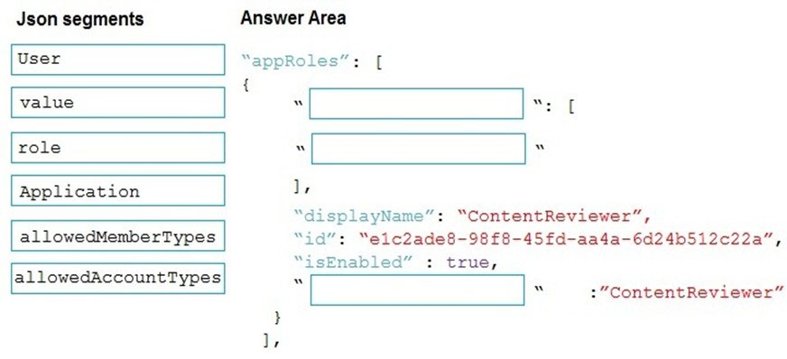

- [ ] Cuadro 1: `allowedAccountTypes`. Cuadro 2: `User`. Cuadro 3: `value`.
- [ ] Cuadro 1: `role`. Cuadro 2: `User`. Cuadro 3: `value`.
- [x] Cuadro 1: `allowedMemberTypes`. Cuadro 2: `User`. Cuadro 3: `value`.
- [ ] Cuadro 1: `allowedMemberTypes`. Cuadro 2: `value`. Cuadro 3: `User`.

**[⬆ Volver arriba](#table-of-contents)**

<a id="you-are-a-developer-for-contoso-ltd-the-company-has-a-social-networking-website-that-is-developed-as-a-single-page-application-spa-the-main-web-application-for-the-social-networking-website-loads-user-uploaded-content-from-blob-storage-you-are-developing-a-solution-to-monitor-uploaded-data-for-inappropriate-content-the-following-process-occurs-when-users-upload-content-by-using-the-spa-messages-are-sent-to-contentuploadservice-content-is-processed-by-contentanalysisservice-after-processing-is-complete-the-content-is-posted-to-the-social-network-or-a-rejection-message-is-posted-in-its-place-the-contentanalysisservice-is-deployed-with-azure-container-instances-from-a-private-azure-container-registry-named-contosoimages-the-solution-will-use-eight-cpu-cores-microsoft-entra-id-contoso-ltd-uses-microsoft-entra-id-for-both-internal-and-guest-accounts-requirements-contentanalysisservice---the-companys-data-science-group-built-contentanalysisservice-which-accepts-user-generated-content-as-a-string-and-returns-a-probable-value-for-inappropriate-content-any-values-over-a-specific-threshold-must-be-reviewed-by-an-employee-of-contoso-ltd-you-must-create-an-azure-function-named-checkusercontent-to-perform-the-content-checks-costs-you-must-minimize-costs-for-all-azure-services-manual-review-to-review-content-the-user-must-authenticate-to-the-website-portion-of-the-contentanalysisservice-using-their-microsoft-entra-id-credentials-the-website-is-built-using-react-and-all-pages-and-api-endpoints-require-authentication-in-order-to-review-content-a-user-must-be-part-of-a-contentreviewer-role-all-completed-reviews-must-include-the-reviewers-email-address-for-auditing-purposes-high-availability-all-services-must-run-in-multiple-regions-the-failure-of-any-service-in-a-region-must-not-impact-overall-application-availability-monitoring-an-alert-must-be-raised-if-the-contentuploadservice-uses-more-than-80-percent-of-available-cpu-cores-security-you-have-the-following-security-requirements-any-web-service-accessible-over-the-internet-must-be-protected-from-cross-site-scripting-attacks-all-websites-and-services-must-use-ssl-from-a-valid-root-certificate-authority-azure-storage-access-keys-must-only-be-stored-in-memory-and-must-be-available-only-to-the-service-all-internal-services-must-only-be-accessible-from-internal-virtual-networks-vnets-all-parts-of-the-system-must-support-inbound-and-outbound-traffic-restrictions-all-service-calls-must-be-authenticated-by-using-microsoft-entra-id-user-agreements-when-a-user-submits-content-they-must-agree-to-a-user-agreement-the-agreement-allows-employees-of-contoso-ltd-to-review-content-store-cookies-on-user-devices-and-track-users-ip-addresses-information-regarding-agreements-is-used-by-multiple-divisions-within-contoso-ltd-user-responses-must-not-be-lost-and-must-be-available-to-all-parties-regardless-of-individual-service-uptime-the-volume-of-agreements-is-expected-to-be-in-the-millions-per-hour-validation-testing-when-a-new-version-of-the-contentanalysisservice-is-available-the-previous-seven-days-of-content-must-be-processed-with-the-new-version-to-verify-that-the-new-version-does-not-significantly-deviate-from-the-old-version-issues-users-of-the-contentuploadservice-report-that-they-occasionally-see-http-502-responses-on-specific-pages-code---contentuploadservice---applicationmanifest-you-need-to-deploy-the-checkusercontent-azure-function-the-solution-must-meet-the-security-and-cost-requirements-which-hosting-model-should-you-use"></a>
### Es desarrollador de Contoso, Ltd. [Mismo escenario de Contoso]. Necesita agregar markup YAML en la línea CS17 para asegurar que `ContentUploadService` pueda acceder a las claves de acceso de Azure Storage. ¿Cómo debe completar el markup YAML?

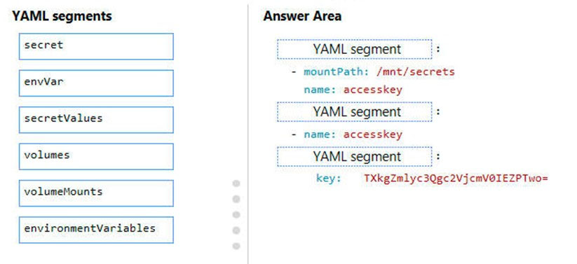

- [ ] Cuadro 1: `volumes`. Cuadro 2: `volumeMounts`. Cuadro 3: `secret`.
- [x] Cuadro 1: `volumeMounts`. Cuadro 2: `volumes`. Cuadro 3: `secret`.
- [ ] Cuadro 1: `envVar`. Cuadro 2: `secretValues`. Cuadro 3: `environmentVariables`.
- [ ] Cuadro 1: `secret`. Cuadro 2: `environmentVariables`. Cuadro 3: `secretValues`.

**[⬆ Volver arriba](#table-of-contents)**

<a id="you-are-a-developer-for-contoso-ltd-the-company-has-a-social-networking-website-that-is-developed-as-a-single-page-application-spa-the-main-web-application-for-the-social-networking-website-loads-user-uploaded-content-from-blob-storage-you-are-developing-a-solution-to-monitor-uploaded-data-for-inappropriate-content-the-following-process-occurs-when-users-upload-content-by-using-the-spa-messages-are-sent-to-contentuploadservice-content-is-processed-by-contentanalysisservice-after-processing-is-complete-the-content-is-posted-to-the-social-network-or-a-rejection-message-is-posted-in-its-place-the-contentanalysisservice-is-deployed-with-azure-container-instances-from-a-private-azure-container-registry-named-contosoimages-the-solution-will-use-eight-cpu-cores-microsoft-entra-id-contoso-ltd-uses-microsoft-entra-id-for-both-internal-and-guest-accounts-requirements-contentanalysisservice---the-companys-data-science-group-built-contentanalysisservice-which-accepts-user-generated-content-as-a-string-and-returns-a-probable-value-for-inappropriate-content-any-values-over-a-specific-threshold-must-be-reviewed-by-an-employee-of-contoso-ltd-you-must-create-an-azure-function-named-checkusercontent-to-perform-the-content-checks-costs-you-must-minimize-costs-for-all-azure-services-manual-review-to-review-content-the-user-must-authenticate-to-the-website-portion-of-the-contentanalysisservice-using-their-microsoft-entra-id-credentials-the-website-is-built-using-react-and-all-pages-and-api-endpoints-require-authentication-in-order-to-review-content-a-user-must-be-part-of-a-contentreviewer-role-all-completed-reviews-must-include-the-reviewers-email-address-for-auditing-purposes-high-availability-all-services-must-run-in-multiple-regions-the-failure-of-any-service-in-a-region-must-not-impact-overall-application-availability-monitoring-an-alert-must-be-raised-if-the-contentuploadservice-uses-more-than-80-percent-of-available-cpu-cores-security-you-have-the-following-security-requirements-any-web-service-accessible-over-the-internet-must-be-protected-from-cross-site-scripting-attacks-all-websites-and-services-must-use-ssl-from-a-valid-root-certificate-authority-azure-storage-access-keys-must-only-be-stored-in-memory-and-must-be-available-only-to-the-service-all-internal-services-must-only-be-accessible-from-internal-virtual-networks-vnets-all-parts-of-the-system-must-support-inbound-and-outbound-traffic-restrictions-all-service-calls-must-be-authenticated-by-using-microsoft-entra-id-user-agreements-when-a-user-submits-content-they-must-agree-to-a-user-agreement-the-agreement-allows-employees-of-contoso-ltd-to-review-content-store-cookies-on-user-devices-and-track-users-ip-addresses-information-regarding-agreements-is-used-by-multiple-divisions-within-contoso-ltd-user-responses-must-not-be-lost-and-must-be-available-to-all-parties-regardless-of-individual-service-uptime-the-volume-of-agreements-is-expected-to-be-in-the-millions-per-hour-validation-testing-when-a-new-version-of-the-contentanalysisservice-is-available-the-previous-seven-days-of-content-must-be-processed-with-the-new-version-to-verify-that-the-new-version-does-not-significantly-deviate-from-the-old-version-issues-users-of-the-contentuploadservice-report-that-they-occasionally-see-http-502-responses-on-specific-pages-code---contentuploadservice---applicationmanifest-you-need-to-ensure-that-validation-testing-is-triggered-per-the-requirements-how-should-you-complete-the-code-segment"></a>
### Es desarrollador de Contoso, Ltd. [Mismo escenario de Contoso]. Necesita implementar la Azure Function `CheckUserContent`. La solución debe cumplir con los requisitos de seguridad y costos. ¿Qué modelo de hospedaje debe usar?

- [ ] Plan Premium.
- [x] Plan de servicio de aplicaciones.
- [ ] Plan de consumo.

**[⬆ Volver arriba](#table-of-contents)**

<a id="you-are-a-developer-for-contoso-ltd-the-company-has-a-social-networking-website-that-is-developed-as-a-single-page-application-spa-the-main-web-application-for-the-social-networking-website-loads-user-uploaded-content-from-blob-storage-you-are-developing-a-solution-to-monitor-uploaded-data-for-inappropriate-content-the-following-process-occurs-when-users-upload-content-by-using-the-spa-messages-are-sent-to-contentuploadservice-content-is-processed-by-contentanalysisservice-after-processing-is-complete-the-content-is-posted-to-the-social-network-or-a-rejection-message-is-posted-in-its-place-the-contentanalysisservice-is-deployed-with-azure-container-instances-from-a-private-azure-container-registry-named-contosoimages-the-solution-will-use-eight-cpu-cores-microsoft-entra-id-contoso-ltd-uses-microsoft-entra-id-for-both-internal-and-guest-accounts-requirements-contentanalysisservice---the-companys-data-science-group-built-contentanalysisservice-which-accepts-user-generated-content-as-a-string-and-returns-a-probable-value-for-inappropriate-content-any-values-over-a-specific-threshold-must-be-reviewed-by-an-employee-of-contoso-ltd-you-must-create-an-azure-function-named-checkusercontent-to-perform-the-content-checks-costs-you-must-minimize-costs-for-all-azure-services-manual-review-to-review-content-the-user-must-authenticate-to-the-website-portion-of-the-contentanalysisservice-using-their-microsoft-entra-id-credentials-the-website-is-built-using-react-and-all-pages-and-api-endpoints-require-authentication-in-order-to-review-content-a-user-must-be-part-of-a-contentreviewer-role-all-completed-reviews-must-include-the-reviewers-email-address-for-auditing-purposes-high-availability-all-services-must-run-in-multiple-regions-the-failure-of-any-service-in-a-region-must-not-impact-overall-application-availability-monitoring-an-alert-must-be-raised-if-the-contentuploadservice-uses-more-than-80-percent-of-available-cpu-cores-security-you-have-the-following-security-requirements-any-web-service-accessible-over-the-internet-must-be-protected-from-cross-site-scripting-attacks-all-websites-and-services-must-use-ssl-from-a-valid-root-certificate-authority-azure-storage-access-keys-must-only-be-stored-in-memory-and-must-be-available-only-to-the-service-all-internal-services-must-only-be-accessible-from-internal-virtual-networks-vnets-all-parts-of-the-system-must-support-inbound-and-outbound-traffic-restrictions-all-service-calls-must-be-authenticated-by-using-microsoft-entra-id-user-agreements-when-a-user-submits-content-they-must-agree-to-a-user-agreement-the-agreement-allows-employees-of-contoso-ltd-to-review-content-store-cookies-on-user-devices-and-track-users-ip-addresses-information-regarding-agreements-is-used-by-multiple-divisions-within-contoso-ltd-user-responses-must-not-be-lost-and-must-be-available-to-all-parties-regardless-of-individual-service-uptime-the-volume-of-agreements-is-expected-to-be-in-the-millions-per-hour-validation-testing-when-a-new-version-of-the-contentanalysisservice-is-available-the-previous-seven-days-of-content-must-be-processed-with-the-new-version-to-verify-that-the-new-version-does-not-significantly-deviate-from-the-old-version-issues-users-of-the-contentuploadservice-report-that-they-occasionally-see-http-502-responses-on-specific-pages-code---contentuploadservice---applicationmanifest-you-need-to-configure-the-contentuploadservice-deployment-which-two-actions-should-you-perform"></a>
### Es desarrollador de Contoso, Ltd. [Mismo escenario de Contoso]. Necesita asegurarse de que las pruebas de validación se activen según los requisitos. ¿Cómo debe completar el segmento de código?

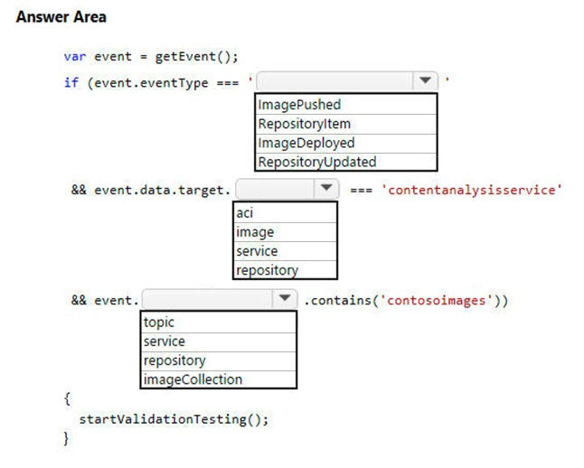

- [x] Cuadro 1: `ImagePushed`. Cuadro 2: `repository`. Cuadro 3: `topic`.
- [ ] Cuadro 1: `ImageDeployed`. Cuadro 2: `service`. Cuadro 3: `imageCollection`.
- [ ] Cuadro 1: `RepositoryUpdated`. Cuadro 2: `service`. Cuadro 3: `imageCollection`.
- [ ] Cuadro 1: `RepositoryItem`. Cuadro 2: `aci`. Cuadro 3: `topic`.

**[⬆ Volver arriba](#table-of-contents)**

### Es desarrollador de Contoso, Ltd. [Mismo escenario de Contoso]. Necesita configurar la implementación de `ContentUploadService`. ¿Qué dos acciones debe realizar?

- [x] Agregar el siguiente markup a la línea CS23: `type: Private`.
- [ ] Agregar el siguiente markup a la línea CS24: `osType: Windows`.
- [x] Agregar el siguiente markup a la línea CS24: `osType: Linux`.
- [ ] Agregar el siguiente markup a la línea CS23: `type: Public`.

**[⬆ Volver arriba](#table-of-contents)**
