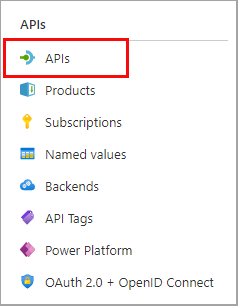

---
lab:
  topic: Azure API Management
  title: Importar y configurar una API con Azure API Management
  description: Aprenda cómo importar, publicar y probar una API que cumple con la especificación OpenAPI.
  duration: 20 minutes
  level: 300
  islab: true
  primarytopics:
    - Azure
    - Azure API Management
---

# Importar y configurar una API con Azure API Management

En este ejercicio, creará una instancia de Azure API Management, importará una API backend de especificación OpenAPI, configurará los ajustes de la API, incluida la URL del servicio web y los requisitos de suscripción, y probará las operaciones de la API para verificar que funcionen correctamente.

Tareas realizadas en este ejercicio:

* Crear una instancia de Azure API Management (APIM)
* Importar una API
* Configurar los ajustes del backend
* Probar la API

Este ejercicio tarda aproximadamente **20** minutos en completarse.

## Crear una instancia de API Management

En esta sección del ejercicio creará un grupo de recursos y una cuenta de Azure Storage. También registrará el endpoint y la clave de acceso para la cuenta.

1. En su navegador web, vaya al portal de Azure [https://portal.azure.com](https://portal.azure.com); inicie sesión con sus credenciales de Azure si se le solicita.

1. Use el botón **[\>_]** a la derecha de la barra de búsqueda en la parte superior de la página para crear un nuevo cloud shell en el portal de Azure, seleccionando un entorno ***Bash***. El cloud shell proporciona una interfaz de línea de comandos en un panel en la parte inferior del portal de Azure. Si se le solicita seleccionar una cuenta de almacenamiento para guardar sus archivos, seleccione **No se requiere cuenta de almacenamiento**, su suscripción y luego seleccione **Aplicar**.

    > **Nota**: Si ha creado previamente un cloud shell que usa un entorno *PowerShell*, cámbielo a ***Bash***.

1. Cree un grupo de recursos para los recursos necesarios para este ejercicio. Reemplace **myResourceGroup** con el nombre que desee usar para el grupo de recursos. Puede reemplazar **eastus2** con una región más cercana a usted si es necesario. Si ya tiene un grupo de recursos que desea usar, continúe con el siguiente paso.

    ```azurecli
    az group create --location eastus2 --name myResourceGroup
    ```

1. Cree algunas variables para que las usen los comandos de la CLI, esto reduce la cantidad de escritura. Reemplace **<myLocation>** con el valor que eligió antes. El nombre de APIM debe ser un nombre globalmente único, y el siguiente script genera una cadena aleatoria. Reemplace **<myEmail>** con una dirección de correo electrónico a la que pueda acceder. Reemplace **<myResourceGroup>** con el valor que eligió antes.

    ```bash
    myApiName=import-apim-$RANDOM
    myLocation=<myLocation>
    myEmail=<myEmail>
    myResourceGroup=<myResourceGroup>
    ```

1. Cree una instancia de APIM. El comando **az apim create** se usa para crear la instancia.

    ```bash
    az apim create -n $myApiName \
        --location $myLocation \
        --publisher-email $myEmail  \
        --resource-group $myResourceGroup \
        --publisher-name Import-API-Exercise \
        --sku-name Consumption
    ```
    > **Nota:** La operación debería completarse en unos cinco minutos.

## Importar una API de backend

Esta sección muestra cómo importar y publicar una API de backend con especificación OpenAPI.

1. En el portal de Azure, busque y seleccione **Servicios de API Management** (API Management services).

1. En la pantalla de **Servicios de API Management**, seleccione la instancia de API Management que creó.

1. En el panel de navegación de **Servicio de API management**, seleccione **> APIs** y luego seleccione **APIs**.

    

1. Seleccione **OpenAPI** en la sección **Crear a partir de la definición** (Create from definition), y cambie el interruptor **Básico/Completo** (Basic/Full) a **Completo** (Full) en la ventana emergente que aparece.

    Utilice los valores de la siguiente tabla para completar el formulario. Puede dejar cualquier campo no mencionado con su valor predeterminado.

    | Configuración | Valor | Descripción |
    |--|--|--|
    | **Especificación de OpenAPI** | `https://petstore.swagger.io/v2/swagger.json` | Referencia al servicio que implementa la API, las solicitudes se reenvían a esta dirección. La mayor parte de la información necesaria en el formulario se completa automáticamente después de ingresar este valor. |
    | **Esquema de URL** | Asegúrese de que **HTTPS** esté seleccionado. | Define el nivel de seguridad del protocolo HTTP aceptado por la API. |

1. Seleccione **Crear** (Create).

## Probar la API

Ahora que la API ha sido importada y configurada, es hora de probarla.

1. Seleccione **Prueba** (Test) en la barra de menú. Esto mostrará todas las operaciones disponibles en la API.

1. Busque y seleccione la operación **Find Pets by status**.

1. En la sección **Parámetros de plantilla** (Template parameters), ingrese `available` como el valor en el campo **status**.

1. Seleccione **Enviar** (Send). Es posible que deba desplazarse hacia abajo en la página para ver la respuesta HTTP.

    El backend responde con **200 OK** y algunos datos.

1. Si desea probar diferentes resultados, puede ingresar un estado diferente en la sección **Parámetros de plantilla**. Ingrese `pending` o `sold` como el valor, y luego seleccione **Enviar** para ver los nuevos resultados.

## Limpiar recursos

Ahora que ha terminado el ejercicio, debe eliminar los recursos de la nube que creó para evitar el uso innecesario de recursos.

1. En su navegador web, vaya al portal de Azure [https://portal.azure.com](https://portal.azure.com); inicie sesión con sus credenciales de Azure si se le solicita.
1. Vaya al grupo de recursos que creó y vea el contenido de los recursos usados en este ejercicio.
1. En la barra de herramientas, seleccione **Eliminar grupo de recursos**.
1. Ingrese el nombre del grupo de recursos y confirme que desea eliminarlo.

> **PRECAUCIÓN:** Al eliminar un grupo de recursos se eliminan todos los recursos que contiene. Si eligió un grupo de recursos existente para este ejercicio, cualquier recurso existente fuera del alcance de este ejercicio también se eliminá.
