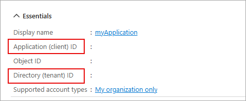
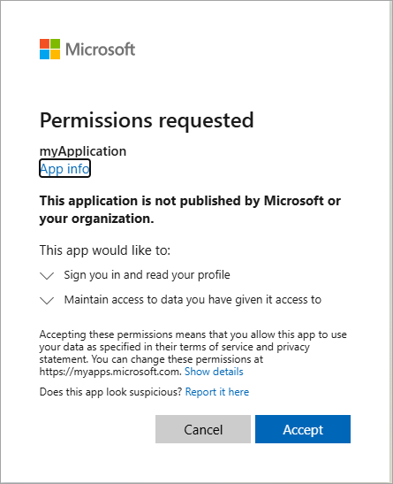

---
lab:
  topic: Autenticación y autorización de Azure
  title: Recuperar información de perfil de usuario con el SDK de Microsoft Graph
  description: Aprenda cómo recuperar información de perfil de usuario de Microsoft Graph.
  duration: 15 minutes
  level: 400
  islab: true
  primarytopics:
    - Microsoft Graph
---

# Recuperar información de perfil de usuario con el SDK de Microsoft Graph

En este ejercicio, creará una aplicación .NET para autenticarse con Microsoft Entra ID y solicitar un token de acceso, luego llamará a la API de Microsoft Graph para recuperar y mostrar la información de su perfil de usuario. Aprenderá cómo configurar permisos e interactuar con Microsoft Graph desde su aplicación.

Tareas realizadas en este ejercicio:

* Registrar una aplicación en la plataforma de identidad de Microsoft
* Crear una aplicación de consola .NET que implemente la autenticación interactiva y utilice la clase **GraphServiceClient** para recuperar información del perfil del usuario.

Este ejercicio tarda aproximadamente **15** minutos en completarse.

## Antes de comenzar

Para completar el ejercicio, necesita:

* Una suscripción de Azure. Si aún no tiene una, puede [registrarse para obtener una](https://azure.microsoft.com/).

* [Visual Studio Code](https://code.visualstudio.com/) en una de las [plataformas soportadas](https://code.visualstudio.com/docs/supporting/requirements#_platforms).

* [.NET 8](https://dotnet.microsoft.com/en-us/download/dotnet/8.0) o superior.

* [C# Dev Kit](https://marketplace.visualstudio.com/items?itemName=ms-dotnettools.csdevkit) para Visual Studio Code.

## Registrar una nueva aplicación

1. En su navegador web, vaya al portal de Azure [https://portal.azure.com](https://portal.azure.com); inicie sesión con sus credenciales de Azure si se le solicita.

1. En el portal, busque y seleccione **Registros de aplicaciones** (App registrations).

1. Seleccione **+ Nuevo registro** (New registration), y cuando aparezca la página **Registrar una aplicación**, ingrese la información de registro de su aplicación:

    | Campo | Valor |
    |--|--|
    | **Nombre** | Ingrese `myGraphApplication`  |
    | **Tipos de cuenta compatibles** | Seleccione **Solo las cuentas de este directorio organizativo** |
    | **URI de redirección (opcional)** | Seleccione **Cliente público/nativo (móvil y escritorio)** e ingrese `http://localhost` en el cuadro de la derecha. |

1. Seleccione **Registrar** (Register). Microsoft Entra ID asigna un ID de aplicación (cliente) único a su aplicación, y se le dirigirá a la página de **Información general** (Overview) de su aplicación.

1. En la sección **Esenciales** de la página de **Información general**, registre el **ID de aplicación (cliente)** y el **ID de directorio (inquilino)**. La información es necesaria para la aplicación.

    

## Crear una aplicación de consola .NET para enviar y recibir mensajes

Ahora que los recursos necesarios están implementados en Azure, el siguiente paso es configurar la aplicación de consola. Los siguientes pasos se realizan en su entorno local.

1. Cree una carpeta llamada **graphapp**, o un nombre de su elección, para el proyecto.

1. Inicie **Visual Studio Code**, seleccione **Archivo > Abrir carpeta...** y seleccione la carpeta del proyecto.

1. Seleccione **Ver > Terminal** para abrir un terminal.

1. Ejecute el siguiente comando en el terminal de VS Code para crear la aplicación de consola .NET.

    ```
    dotnet new console
    ```

1. Ejecute los siguientes comandos para agregar los paquetes **Azure.Identity**, **Microsoft.Graph** y **dotenv.net** al proyecto.

    ```
    dotnet add package Azure.Identity
    dotnet add package Microsoft.Graph
    dotnet add package dotenv.net
    ```

### Configurar la aplicación de consola

En esta sección creará, y editará, un archivo **.env** para guardar los secretos que registró anteriormente.

1. Seleccione **Archivo > Nuevo archivo...** y cree un archivo llamado *.env* en la carpeta del proyecto.

1. Abra el archivo **.env** y agregue el siguiente código. Reemplace **YOUR_CLIENT_ID** y **YOUR_TENANT_ID** con los valores que registró anteriormente.

    ```
    CLIENT_ID="YOUR_CLIENT_ID"
    TENANT_ID="YOUR_TENANT_ID"
    ```

1. Presione **ctrl+s** para guardar el archivo.

### Agregar el código inicial para el proyecto

1. Abra el archivo *Program.cs* y reemplace cualquier contenido existente con el siguiente código. Asegúrese de revisar los comentarios en el código.

    ```csharp
    using Microsoft.Graph;
    using Azure.Identity;
    using dotenv.net;
    
    // Cargar variables de entorno desde el archivo .env (si está presente)
    DotEnv.Load();
    var envVars = DotEnv.Read();
    
    // Leer valores de registro de la aplicación de Azure AD desde el entorno
    string clientId = envVars["CLIENT_ID"];
    string tenantId = envVars["TENANT_ID"];
    
    // Validar que las variables de entorno requeridas estén establecidas
    if (string.IsNullOrEmpty(clientId) || string.IsNullOrEmpty(tenantId))
    {
        Console.WriteLine("Por favor, establezca las variables de entorno CLIENT_ID y TENANT_ID.");
        return;
    }
    
    // AÑADIR CÓDIGO PARA DEFINIR EL ÁMBITO Y CONFIGURAR LA AUTENTICACIÓN
    
    
    
    // AÑADIR CÓDIGO PARA CREAR EL CLIENTE DE GRAPH Y RECUPERAR EL PERFIL DE USUARIO
    
    
    ```

1. Presione **ctrl+s** para guardar sus cambios.

### Agregar código para completar la aplicación

1. Busque el comentario **// AÑADIR CÓDIGO PARA DEFINIR EL ÁMBITO Y CONFIGURAR LA AUTENTICACIÓN** y agregue el siguiente código directamente después del comentario. Asegúrese de revisar los comentarios en el código.

    ```csharp
    // Definir los ámbitos de permisos de Microsoft Graph requeridos por esta aplicación
    var scopes = new[] { "User.Read" };
    
    // Configurar la autenticación interactiva en el navegador para el usuario
    var options = new InteractiveBrowserCredentialOptions
    {
        ClientId = clientId, // ID de cliente de la aplicación Azure AD
        TenantId = tenantId, // ID de inquilino de Azure AD
        RedirectUri = new Uri("http://localhost") // URI de redirección para el flujo de autenticación
    };
    var credential = new InteractiveBrowserCredential(options);
    ```

1. Busque el comentario **// AÑADIR CÓDIGO PARA CREAR EL CLIENTE DE GRAPH Y RECUPERAR EL PERFIL DE USUARIO** y agregue el siguiente código directamente después del comentario. Asegúrese de revisar los comentarios en el código.

    ```csharp
    // Crear un cliente de Microsoft Graph usando la credencial
    var graphClient = new GraphServiceClient(credential);
    
    // Recuperar y mostrar la información del perfil del usuario
    Console.WriteLine("Recuperando perfil de usuario...");
    await GetUserProfile(graphClient);
    
    // Función para obtener e imprimir el perfil del usuario que ha iniciado sesión
    async Task GetUserProfile(GraphServiceClient graphClient)
    {
        try
        {
            // Llamar al endpoint /me de Microsoft Graph para obtener información del usuario
            var me = await graphClient.Me.GetAsync();
            Console.WriteLine($"Nombre a mostrar: {me?.DisplayName}");
            Console.WriteLine($"Nombre principal: {me?.UserPrincipalName}");
            Console.WriteLine($"ID de usuario: {me?.Id}");
        }
        catch (Exception ex)
        {
            // Imprimir cualquier error encontrado durante la llamada
            Console.WriteLine($"Error al recuperar el perfil: {ex.Message}");
        }
    }
    ```

1. Presione **ctrl+s** para guardar el archivo.

## Ejecutar la aplicación

Ahora que la aplicación está completa es hora de ejecutarla.

1. Inicie la aplicación ejecutando el siguiente comando:

    ```
    dotnet run
    ```

1. La aplicación abre el navegador predeterminado pidiéndole que seleccione la cuenta con la que desea autenticarse. Si hay varias cuentas listadas, seleccione la asociada con el inquilino usado en la aplicación.

1. Si esta es la primera vez que se autentica en la aplicación registrada, recibirá una notificación de **Permisos solicitados** pidiéndole que apruebe que la aplicación inicie su sesión y lea su perfil, y mantenga el acceso a los datos a los que le ha dado acceso. Seleccione **Aceptar**.

    

1. Debería ver resultados similares al siguiente ejemplo en la consola.

    ```
    Recuperando perfil de usuario...
    Nombre a mostrar: <Nombre para mostrar de su cuenta>
    Nombre principal: <Su nombre principal>
    ID de usuario: 9f5...
    ```

1. Inicie la aplicación por segunda vez y observe que ya no recibe la notificación de **Permisos solicitados**. El permiso que otorgó anteriormente fue almacenado en caché.

## Limpiar recursos

Ahora que ha terminado el ejercicio, debe eliminar los recursos de la nube que creó para evitar el uso innecesario de recursos.

1. En su navegador web, vaya al portal de Azure [https://portal.azure.com](https://portal.azure.com); inicie sesión con sus credenciales de Azure si se le solicita.
1. Vaya al grupo de recursos que creó y vea el contenido de los recursos usados en este ejercicio.
1. En la barra de herramientas, seleccione **Eliminar grupo de recursos**.
1. Ingrese el nombre del grupo de recursos y confirme que desea eliminarlo.

> **PRECAUCIÓN:** Al eliminar un grupo de recursos se eliminan todos los recursos que contiene. Si eligió un grupo de recursos existente para este ejercicio, cualquier recurso existente fuera del alcance de este ejercicio también se eliminará.
