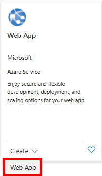

---
lab:
  topic: Azure App Service
  title: Implementar una aplicación en contenedores en Azure App Service
  description: Aprenda cómo implementar una aplicación en contenedores en Azure App Service.
  duration: 15 minutes
  level: 200
  islab: true
  primarytopics:
    - Azure
    - Azure App Service
---
# Implementar una aplicación en contenedores en Azure App Service

En este ejercicio, creará una aplicación web de Azure App Service configurada para ejecutar una aplicación en contenedores especificando una imagen de contenedor de Microsoft Container Registry. Aprenderá cómo configurar los ajustes del contenedor, implementar la aplicación y verificar que la aplicación en contenedores se ejecute correctamente en Azure App Service.

Tareas realizadas en este ejercicio:

* Crear un recurso de Azure App Service e implementar una aplicación en contenedores
* Ver los resultados
* Limpiar recursos

Este ejercicio tarda aproximadamente **15** minutos en completarse.

## Crear un recurso de aplicación web

1. En su navegador web, vaya al portal de Azure [https://portal.azure.com](https://portal.azure.com); inicie sesión con sus credenciales de Azure si se le solicita.
2. Seleccione **+ Crear un recurso** ubicado en el encabezado **Servicios de Azure** cerca de la parte superior de la página de inicio.
3. En la barra de búsqueda **Buscar en el Marketplace**, ingrese *web app* y presione **Enter** para comenzar la búsqueda.
4. En el mosaico de Web App, seleccione el menú desplegable **Crear** y luego seleccione **Web App**.

   

   Al seleccionar **Crear** se abrirá una plantilla con algunas pestañas para completar con información sobre su implementación. Los siguientes pasos lo guían sobre qué cambios hacer en las pestañas relevantes.
5. Complete la pestaña **Conceptos básicos** (Basics) con la información de la siguiente tabla:

   | Configuración                               | Acción                                                                                                                                                                                                                         |
   | -------------------------------------------- | ------------------------------------------------------------------------------------------------------------------------------------------------------------------------------------------------------------------------------- |
   | **Suscripción**                       | Conserve el valor predeterminado.                                                                                                                                                                                               |
   | **Grupo de recursos**                  | Seleccione Crear nuevo, ingrese `rg-WebApp` y luego seleccione Aceptar. También puede seleccionar un grupo de recursos existente si lo prefiere.                                                                             |
   | **Nombre**                             | Ingrese un nombre único, por ejemplo**tus-iniciales-containerwebapp**. Reemplace *tus-iniciales* con sus iniciales o algún otro valor. El nombre debe ser único, por lo que es posible que requiera algunos cambios. |
   | Control deslizante debajo de**Nombre** | Seleccione el control deslizante para desactivarlo. Este control deslizante solo aparece en algunas configuraciones de Azure.                                                                                                   |
   | **Publicar**                           | Seleccione la opción**Contenedor** (Container).                                                                                                                                                                          |
   | **Sistema operativo**                  | Asegúrese de que**Linux** esté seleccionado.                                                                                                                                                                            |
   | **Región**                            | Conserve la selección predeterminada o elija una región cercana a usted.                                                                                                                                                      |
   | **Plan de Linux**                      | Conserve la selección predeterminada.                                                                                                                                                                                          |
   | **Plan de precios**                    | Seleccione el menú desplegable y elija el plan**Gratis F1** (Free F1).                                                                                                                                                   |
6. Seleccione, o navegue a, la pestaña **Contenedor** (Container) e ingrese la información de la siguiente tabla:

   | Configuración                         | Acción                                                                           |
   | -------------------------------------- | --------------------------------------------------------------------------------- |
   | **Soporte de sidecar**           | El control deslizante debe estar en la posición**desactivado** (off).      |
   | **Origen de la imagen**          | Seleccione**Otros registros de contenedores** (Other container registries). |
   | **Tipo de acceso**               | Conserve la selección predeterminada**Público** (Public).                 |
   | **URL del servidor de registro** | Ingrese `mcr.microsoft.com/k8se`.                                               |
   | **Imagen y etiqueta**            | Ingrese `quickstart:latest`.                                                    |
   | **Comando de inicio**            | Déjelo en blanco.                                                                |
7. Seleccione la pestaña **Revisar y crear** (Review + create).
8. Revise las selecciones que hizo y luego seleccione el botón **Crear** (Create).

La implementación puede tardar unos minutos en completarse. Cuando haya terminado, seleccione el botón **Ir al recurso** (Go to resource).

Ahora que su implementación ha finalizado, es hora de ver la aplicación web. Seleccione el enlace a su aplicación web ubicado junto al campo **Dominio predeterminado** en la sección **Esenciales**. El enlace abrirá el sitio en una nueva pestaña.

> **Nota:** Puede tardar unos minutos para que la aplicación en contenedores implementada se ejecute y se muestre en la nueva pestaña.

## Limpiar recursos

Ahora que ha terminado el ejercicio, debe eliminar los recursos de la nube que creó para evitar el uso innecesario de recursos.

1. En su navegador web, vaya al portal de Azure [https://portal.azure.com](https://portal.azure.com); inicie sesión con sus credenciales de Azure si se le solicita.
2. Vaya al grupo de recursos que creó y vea el contenido de los recursos usados en este ejercicio.
3. En la barra de herramientas, seleccione **Eliminar grupo de recursos**.
4. Ingrese el nombre del grupo de recursos y confirme que desea eliminarlo.

> **PRECAUCIÓN:** Al eliminar un grupo de recursos se eliminan todos los recursos que contiene. Si eligió un grupo de recursos existente para este ejercicio, cualquier recurso existente fuera del alcance de este ejercicio también se eliminará.


## 📚 Explicación Teórica: Lo que hicimos en el Lab de Azure

Basándome en el lab y el cheatsheet, aquí te explico la teoría de lo que implementaste:

---

## **1. EL CONTEXTO: Azure App Service**

El lab que hiciste pertenece al **dominio AZ-204: "Desarrollo de Soluciones de Proceso"** (25-30% del examen). Dentro de este dominio está **Azure App Service**, que es una plataforma PaaS (Platform as a Service) para hospedar aplicaciones web.

### **¿Por qué App Service?**

- **Abstracción de infraestructura:** No administras servidores, VMs ni Docker hosts manualmente
- **Escalado automático:** Puede crecer/reducirse según demanda
- **Multi-lenguaje:** .NET, Node, Python, Java, etc.
- **Integración con Azure:** Acceso fácil a Bases de Datos, Storage, Key Vault, etc.

---

## **2. LOS CONCEPTOS QUE IMPLEMENTASTE**

### **A) Plan de App Service: FREE (F1)**

En el lab elegiste el **plan Gratis F1**. Según el cheatsheet:

| Aspecto                    | F1 (Gratis)                          |
| -------------------------- | ------------------------------------ |
| **Escalado**         | Una sola instancia fija              |
| **Autoscale**        | NO soporta                           |
| **Deployment Slots** | NO disponible                        |
| **Caso de uso**      | Desarrollo, prototipado, aprendizaje |

**Implicación práctica:** Tu app siempre corre en 1 máquina. Si el tráfico aumenta, no se pueden agregar instancias automáticamente — la app simplemente se ralentiza.

---

### **B) Sistema Operativo: Linux**

Seleccionaste **Linux** como SO. Esto es crucial porque:

- Azure App Service permite **Linux O Windows**
- Linux es generalmente más barato y eficiente para contenedores
- La config anidada (ej: variables de entorno con "::") debe reemplazarse por `__` (doble guion bajo)

---

### **C) Imagen de Contenedor de Microsoft Container Registry (MCR)**

Aquí está el punto **más importante del lab**:

✅ **URL del servidor:** `mcr.microsoft.com/k8se`
✅ **Imagen y etiqueta:** `quickstart:latest`

#### **¿Qué significa esto teóricamente?**

1. **Microsoft Container Registry (MCR):** Es el registro público de Microsoft donde alojan imágenes Docker oficiales de Azure

   - Equivalente a Docker Hub pero de Microsoft
   - No necesita autenticación (es público)
2. **La imagen `quickstart:latest`:**

   - Una aplicación de demostración que MS proporciona
   - `latest` significa "la versión más nueva disponible"
3. **¿Cómo se conecta App Service a esta imagen?**

   ```
   App Service (el contenedor) → Pull de MCR → Descarga la imagen → Ejecuta el contenedor → Expone puerto (ej: 80)
   ```

---

### **D) Configuración de Contenedor**

En el lab configuraste:

- **Origen de imagen:** Otros registros de contenedores (no ACR propio)
- **Tipo de acceso:** Público (sin credenciales)
- **Comando de inicio:** En blanco (usa el CMD del Dockerfile de la imagen)

**Lo que NO hiciste (pero es importante saber):**

- ❌ No subiste código propio a Azure Container Registry (ACR)
- ❌ No creaste un Dockerfile personalizado
- ❌ Usaste una imagen ya hecha de Microsoft

---

## **3. LOS SERVICIOS INVOLUCRADOS**

```
┌─────────────────────────────────────────────────┐
│ FRONT-END (Navegador)                           │
│ → GET https://<tu-app>.azurewebsites.net       │
└──────────────────┬──────────────────────────────┘
                   │
                   ↓
┌─────────────────────────────────────────────────┐
│ AZURE APP SERVICE (PaaS)                        │
│ - Plan: F1 (Gratis, 1 instancia)               │
│ - SO: Linux                                     │
│ - Ejecuta tu contenedor                        │
└──────────────────┬──────────────────────────────┘
                   │
                   ↓
┌─────────────────────────────────────────────────┐
│ CONTENEDOR DOCKER (Linux)                       │
│ Imagen: mcr.microsoft.com/k8se:quickstart      │
│ Expone puerto 80 (HTTP)                        │
└──────────────────┬──────────────────────────────┘
                   │
                   ↓
┌─────────────────────────────────────────────────┐
│ MICROSOFT CONTAINER REGISTRY (MCR)              │
│ (Repositorio donde Azure descargó la imagen)   │
└─────────────────────────────────────────────────┘
```

---

## **4. CICLO DE VIDA: QUÉ PASÓ PASO A PASO**

**Paso 1: Creación del Recurso**

- Llamada a Azure Resource Manager → crea un nuevo recurso App Service
- Nombre único: `tus-iniciales-containerwebapp` (ej: `jmc-containerwebapp`)
- URL resultante: `https://jmc-containerwebapp.azurewebsites.net`

**Paso 2: Descarga de la Imagen**

- Azure obtiene las credenciales para MCR (públicamente disponibles)
- Descarga la imagen Docker `k8se:quickstart` (~100 MB aprox)
- La descomprime en el sistema de archivos del contenedor

**Paso 3: Inicio del Contenedor**

- Ejecuta el `ENTRYPOINT` definido en el Dockerfile de la imagen
- El contenedor escucha en el puerto 80 (HTTP)

**Paso 4: Mapeo de Red**

- El puerto 80 del contenedor se mapea al puerto 80/443 público del App Service
- Tu URL `https://jmc-containerwebapp.azurewebsites.net` apunta a este puerto

**Paso 5: Prueba**

- Navegas a la URL en tu navegador
- Recibes la respuesta HTML del contenedor

---

## **5. CONCEPTOS CLAVE DEL EXAMEN AZ-204**

### **Planes vs Escalado**

Según el cheatsheet, hay una **trampa frecuente en el examen**:

| Plan                       | Autoscale                                   |
| -------------------------- | ------------------------------------------- |
| Free (F1) / Shared (D1)    | ❌ NO — 1 instancia fija                   |
| Basic (B1-B3)              | ❌ MANUAL ONLY — debes escalar manualmente |
| **Standard (S1-S3)** | ✅ SÍ — basado en reglas/métricas        |
| **Premium V2/V3**    | ✅ SÍ + Automatic Scaling (sin reglas)     |

**El examen pregunta:** "¿Qué plan necesitas para autoscale?" → Respuesta: **Standard o superior**

---

### **Publicación por Contenedor vs Código**

En App Service tienes 2 opciones:

| Opción              | Qué significa                                    | En tu lab |
| -------------------- | ------------------------------------------------- | --------- |
| **Código**    | Subes .NET, Node, Python, etc. — AS hospeda todo | ❌ No     |
| **Contenedor** | Subes/referencias una imagen Docker               | ✅ SÍ    |

Seleccionaste **Contenedor** → App Service necesita saber dónde obtener la imagen Docker (en tu caso: MCR)

---

## **6. CONCEPTOS CLAVE: DEPLOYMENT SLOTS**

El cheatsheet destaca **Deployment Slots** como importante. En tu lab:

- ❌ Plan F1 NO soporta Deployment Slots (solo Standard+)
- **Qué son:** Entornos paralelos (staging/production) para testing sin downtime
- **Uso:** Cambio de código en vivo sin afectar usuarios

---

## **7. CICLO COMPLETO: CAMBIO DE CÓDIGO**

Si quisieras actualizar la imagen en el futuro:

1. **Opción A — Misma imagen, nueva versión:**

   ```bash
   az webapp config container set \
     --name mi-app \
     --resource-group mi-rg \
     --docker-custom-image-name mcr.microsoft.com/k8se:v2.0
   ```
2. **Opción B — Contenedor personalizado en ACR:**

   - Subes TU código a Azure Container Registry
   - Construyes una imagen Docker
   - App Service jala esa imagen

---

## **RESUMEN: Lo que hiciste en teoría**

✅ Creaste un **recurso PaaS** (App Service) en Azure
✅ Configuraste para ejecutar **contenedores Docker**
✅ Referenciaste una **imagen pública** de Microsoft (MCR)
✅ Usaste el **plan Gratis** (bueno para demos, malo para producción)
✅ Elegiste **Linux** como SO
✅ El contenedor se ejecuta **sin que administres servidores**

---

## **LO QUE NO VISTE (pero es importante):**

Para producción necesitarías:

- 🔒 Plan **Standard o Premium** para autoscale
- 🔧 **ACR (Azure Container Registry)** propio para imágenes privadas
- 📊 **Application Insights** para monitoreo
- 🔑 **Managed Identity** para acceder a recursos de forma segura
- 💾 **Connection Strings** para bases de datos
- 🌐 **VNET Integration** para apps complejas
