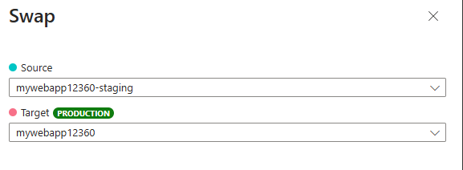

---
lab:
  topic: Azure App Service
  title: Intercambiar ranuras de implementación en Azure App Service
  description: 'Aprenda cómo intercambiar ranuras de implementación en Azure App Service. En este ejercicio: implementará una aplicación simple en App Service; realizará un pequeño cambio en la aplicación y lo implementará en una ranura de ensayo; y finalmente intercambiará las ranuras para que la aplicación actualizada esté en producción.'
  duration: 30 minutes
  level: 300
  islab: true
  primarytopics:
    - Azure
    - Azure App Service
---

# Intercambiar ranuras de implementación en Azure App Service

En este ejercicio, implementará un sitio web HTML estático en Azure App Service, creará una ranura de implementación de ensayo, realizará cambios en el código y los implementará en la ranura de ensayo, y luego intercambiará las ranuras de ensayo y de producción para promover los cambios a producción. Aprenderá cómo usar las ranuras de implementación para actualizaciones seguras de aplicaciones e implementaciones azul-verde (blue-green).

Tareas realizadas en este ejercicio:

* Descargar e implementar la aplicación de muestra en Azure App Service.
* Crear una ranura de implementación de ensayo.
* Hacer un cambio en la aplicación de muestra e implementarlo en la ranura de ensayo.
* Intercambiar las ranuras de ensayo y de producción predeterminada para mover los cambios a la ranura de producción.

Este ejercicio tarda aproximadamente **30** minutos en completarse.

## Descargar e implementar la aplicación de muestra

En esta sección, descargará la aplicación de muestra y establecerá variables para facilitar la entrada de los comandos, y luego creará un recurso de Azure App Service e implementará un sitio HTML estático usando comandos de la CLI de Azure.

1. En su navegador web, vaya al portal de Azure [https://portal.azure.com](https://portal.azure.com); inicie sesión con sus credenciales de Azure si se le solicita.

1. Use el botón **[\>_]** a la derecha de la barra de búsqueda en la parte superior de la página para crear un nuevo cloud shell en el portal de Azure, seleccionando un entorno ***Bash***. El cloud shell proporciona una interfaz de línea de comandos en un panel en la parte inferior del portal de Azure. Si se le solicita seleccionar una cuenta de almacenamiento para guardar sus archivos, seleccione **No se requiere cuenta de almacenamiento**, su suscripción y luego seleccione **Aplicar**.

    > **Nota**: Si ha creado previamente un cloud shell que usa un entorno *PowerShell*, cámbielo a ***Bash***.

1. En la barra de herramientas de cloud shell, en el menú **Configuración** (Settings), seleccione **Ir a la versión clásica** (Go to Classic version) (esto es necesario para usar el editor de código).

1. Ejecute el siguiente comando **git** para clonar el repositorio de la aplicación de muestra.

    ```bash
    git clone https://github.com/Azure-Samples/html-docs-hello-world.git
    ```

1. Establezca variables para guardar los nombres del grupo de recursos y de la aplicación ejecutando los siguientes comandos. Puede reemplazar el valor **rg-mywebapp** para **resourceGroup** si tiene un grupo de recursos que desea usar. Tome nota del valor de **appName** que se muestra después de que se ejecutan los comandos, lo necesitará más adelante en este ejercicio.

    ```bash
    resourceGroup=rg-mywebapp

    appName=mywebapp$RANDOM
    echo $appName
    ```

1. Navegue hasta el directorio que contiene el código de muestra y ejecute el comando **az webapp up**. **Nota:** Este comando puede tardar unos minutos en ejecutarse.

    ```bash
    cd html-docs-hello-world

    az webapp up -g $resourceGroup -n $appName --sku P0V3 --html
    ```

    Ahora que su implementación ha finalizado, es hora de ver la aplicación web.

    >**Nota:** Es posible que deba ejecutar **az login**, o **az login --use-device-code** en el cloud shell para que funcione el comando **az webapp up**.

1. En el portal de Azure navegue hasta la aplicación web que implementó. Puede ingresar el nombre que anotó anteriormente en la barra de búsqueda **Buscar recursos, servicios y documentos (G + /)** y seleccionar el recurso de la lista.

1. Seleccione el enlace a su aplicación web ubicado en el campo **Dominio predeterminado** en la sección **Esenciales**. El enlace abrirá el sitio en una nueva pestaña.

## Implementar código actualizado en una ranura de implementación

En esta sección, creará una ranura de implementación, modificará el HTML en la aplicación e implementará el código actualizado en la nueva ranura de implementación.

### Crear una ranura de implementación

1. Regrese a la pestaña con el portal de Azure y cloud shell.

1. Ingrese el siguiente comando en el cloud shell para crear una ranura de implementación llamada *staging* (ensayo).

    ```bash
    az webapp deployment slot create -n $appName -g $resourceGroup --slot staging
    ```

1. Espere a que termine el comando y luego seleccione **Implementación > Ranuras de implementación** (Deployment > Deployment slots) en el menú de la izquierda para ver las ranuras de implementación de su aplicación web. Tenga en cuenta que el nombre de la nueva ranura contiene *-staging* agregado al nombre de su aplicación web.

### Actualizar código e implementar en la ranura de ensayo

1. En el cloud shell, escriba **code index.html** para abrir el editor. Busque la etiqueta de encabezado **\<h1\>** y cambie *Azure App Service - Sample Static HTML Site* por *Azure App Service Staging Slot*, o por cualquier otra cosa que desee.

1. Use los comandos **ctrl-s** para guardar y **ctrl-q** para salir.

1. En el cloud shell, ejecute el siguiente comando para crear un archivo zip del proyecto actualizado. Se necesita un archivo zip o un recurso de aplicación web (WAR) para el siguiente paso.

    ```bash
    zip -r stagingcode.zip .
    ```

1. Ejecute el siguiente comando en el cloud shell para implementar sus actualizaciones en la ranura de ensayo.

    ```bash
    az webapp deploy -g $resourceGroup -n $appName --src-path ./stagingcode.zip --slot staging
    ```

1. Seleccione **Implementación > Ranuras de implementación** en el menú izquierdo de su aplicación web y luego seleccione la ranura de ensayo que creó anteriormente.

1. Seleccione el enlace en el campo **Dominio predeterminado** en la sección **Esenciales**. El enlace abrirá el sitio web para la ranura de ensayo en una nueva pestaña.

## Intercambiar las ranuras de ensayo y producción

Puede realizar un intercambio en el portal de Azure con la opción **Intercambiar** (Swap) en la barra de herramientas. La opción **Intercambiar** aparecerá en la barra de herramientas si selecciona **Información general** o **Implementación > Ranuras de implementación** en el menú izquierdo de su aplicación web.

1. En el portal de Azure, seleccione **Intercambiar** (Swap) en la barra de herramientas para abrir el panel **Intercambiar**.

1. Revise la configuración en el panel de intercambio. El campo **Origen** (Source) debe mostrar la ranura **-staging** y el campo **Destino** (Target) debe mostrar la ranura de producción predeterminada.

    

1. Seleccione **Iniciar intercambio** (Start Swap) y espere a que se complete la operación. Puede realizar un seguimiento de la finalización en el panel **Notificaciones** que puede abrir seleccionando el ícono de campana en la parte superior del portal.

1. Para verificar el intercambio, navegue hasta la aplicación web que implementó. Ingrese el nombre de la aplicación web que creó anteriormente (por ejemplo, *mywebapp12360*) en la barra de búsqueda **Buscar recursos, servicios y documentos (G + /)**, y luego seleccione el recurso de la lista.

1. Seleccione el enlace a su aplicación web ubicado en el campo **Dominio predeterminado** en la sección **Esenciales**. El enlace abrirá el sitio (ranura de producción) en una nueva pestaña.

1. Verifique sus cambios, es posible que deba actualizar la página para que aparezcan.

## Limpiar recursos

Ahora que ha terminado el ejercicio, debe eliminar los recursos de la nube que creó para evitar el uso innecesario de recursos.

1. En su navegador web, vaya al portal de Azure [https://portal.azure.com](https://portal.azure.com); inicie sesión con sus credenciales de Azure si se le solicita.
1. Vaya al grupo de recursos que creó y vea el contenido de los recursos usados en este ejercicio.
1. En la barra de herramientas, seleccione **Eliminar grupo de recursos**.
1. Ingrese el nombre del grupo de recursos y confirme que desea eliminarlo.

> **PRECAUCIÓN:** Al eliminar un grupo de recursos se eliminan todos los recursos que contiene. Si eligió un grupo de recursos existente para este ejercicio, cualquier recurso existente fuera del alcance de este ejercicio también se eliminará.
