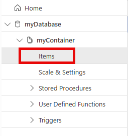

---
lab:
  topic: Azure Cosmos DB
  title: Crear recursos en Azure Cosmos DB for NoSQL usando .NET
  description: Aprenda cómo crear recursos de base de datos y contenedor en Azure Cosmos DB con el SDK de Microsoft .NET v3.
  duration: 30 minutes
  level: 400
  islab: true
  primarytopics:
    - .NET
    - Azure
    - Azure Cosmos DB
---

# Crear recursos en Azure Cosmos DB for NoSQL usando .NET

En este ejercicio, creará una cuenta de Azure Cosmos DB y compilará una aplicación de consola de .NET que utiliza el SDK de Microsoft Azure Cosmos DB para crear una base de datos, un contenedor y un elemento de muestra. Aprenderá cómo configurar la autenticación, realizar operaciones de base de datos mediante programación y verificar sus resultados en el portal de Azure.

Tareas realizadas en este ejercicio:

* Crear una cuenta de Azure Cosmos DB
* Crear una aplicación de consola que cree una base de datos, un contenedor y un elemento
* Ejecutar la aplicación de consola y verificar los resultados

Este ejercicio tarda aproximadamente **30** minutos en completarse.

## Crear una cuenta de Azure Cosmos DB

En esta sección del ejercicio, creará un grupo de recursos y una cuenta de Azure Cosmos DB. También registrará el punto de conexión y la clave de acceso de la cuenta.

1. En su navegador web, vaya al portal de Azure [https://portal.azure.com](https://portal.azure.com); inicie sesión con sus credenciales de Azure si se le solicita.

1. Use el botón **[\>_]** a la derecha de la barra de búsqueda en la parte superior de la página para crear un nuevo cloud shell en el portal de Azure, seleccionando un entorno ***Bash***. El cloud shell proporciona una interfaz de línea de comandos en un panel en la parte inferior del portal de Azure. Si se le solicita seleccionar una cuenta de almacenamiento para guardar sus archivos, seleccione **No se requiere cuenta de almacenamiento**, su suscripción y luego seleccione **Aplicar**.

    > **Nota**: Si ha creado previamente un cloud shell que usa un entorno *PowerShell*, cámbielo a ***Bash***.

1. En la barra de herramientas de cloud shell, en el menú **Configuración** (Settings), seleccione **Ir a la versión clásica** (Go to Classic version) (esto es necesario para usar el editor de código).

1. Cree un grupo de recursos para los recursos necesarios para este ejercicio. Si ya tiene un grupo de recursos que desea usar, continúe con el siguiente paso. Reemplace **myResourceGroup** con un nombre que desee usar para el grupo de recursos. Puede reemplazar **eastus** por una región cercana a usted si es necesario.

    ```
    az group create --location eastus --name myResourceGroup
    ```

1. Muchos de los comandos requieren nombres únicos y usan los mismos parámetros. Crear algunas variables reducirá los cambios necesarios en los comandos que crean recursos. Ejecute los siguientes comandos para crear las variables necesarias. Reemplace **myResourceGroup** con el nombre que está usando para este ejercicio.

    ```
    resourceGroup=myResourceGroup
    accountName=cosmosexercise$RANDOM
    ```

1. Ejecute los siguientes comandos para crear la cuenta de Azure Cosmos DB, el nombre de cada cuenta debe ser único.

    ```
    az cosmosdb create --name $accountName \
        --resource-group $resourceGroup
    ```

1. Ejecute el siguiente comando para recuperar el **documentEndpoint** para la cuenta de Azure Cosmos DB. Registre el punto de conexión de los resultados del comando, lo necesitará más adelante en el ejercicio.

    ```
    az cosmosdb show --name $accountName \
        --resource-group $resourceGroup \
        --query "documentEndpoint" --output tsv
    ```

1. Recupere la clave principal para la cuenta con el siguiente comando. Registre la clave principal de los resultados del comando, la necesitará más adelante en el ejercicio.

    ```
    az cosmosdb keys list --name $accountName \
        --resource-group $resourceGroup \
        --query "primaryMasterKey" --output tsv
    ```

## Crear recursos de datos y un elemento con una aplicación de consola de .NET

Ahora que los recursos necesarios se han implementado en Azure, el siguiente paso es configurar la aplicación de consola. Los siguientes pasos se realizan en el cloud shell.

>**Sugerencia:** Cambie el tamaño del cloud shell para mostrar más información, y código, arrastrando el borde superior. También puede usar los botones minimizar y maximizar para cambiar entre el cloud shell y la interfaz principal del portal.

1. Cree una carpeta para el proyecto y cámbiese a la carpeta.

    ```bash
    mkdir cosmosdb
    cd cosmosdb
    ```

1. Cree la aplicación de consola de .NET.

    ```bash
    dotnet new console
    ```

### Configurar la aplicación de consola

1. Ejecute los siguientes comandos para agregar los paquetes **Microsoft.Azure.Cosmos**, **Newtonsoft.Json** y **dotenv.net** al proyecto.

    ```bash
    dotnet add package Microsoft.Azure.Cosmos --version 3.*
    dotnet add package Newtonsoft.Json --version 13.*
    dotnet add package dotenv.net
    ```

1. Ejecute el siguiente comando para crear el archivo **.env** para guardar los secretos y luego ábralo en el editor de código.

    ```bash
    touch .env
    code .env
    ```

1. Agregue el siguiente código al archivo **.env**. Reemplace **YOUR_DOCUMENT_ENDPOINT** y **YOUR_ACCOUNT_KEY** con los valores que registró anteriormente.

    ```
    DOCUMENT_ENDPOINT="YOUR_DOCUMENT_ENDPOINT"
    ACCOUNT_KEY="YOUR_ACCOUNT_KEY"
    ```

1. Presione **ctrl+s** para guardar el archivo, luego **ctrl+q** para salir del editor.

Ahora es el momento de reemplazar el código de plantilla en el archivo **Program.cs** usando el editor en el cloud shell.

### Agregar el código de inicio para el proyecto

1. Ejecute el siguiente comando en el cloud shell para comenzar a editar la aplicación.

    ```bash
    code Program.cs
    ```

1. Reemplace cualquier código existente con el siguiente fragmento de código.

    El código proporciona la estructura general de la aplicación. Revise los comentarios en el código para comprender cómo funciona. Para completar la aplicación, agregará código en áreas específicas más adelante en el ejercicio.

```csharp
using Microsoft.Azure.Cosmos;
using dotenv.net;

string databaseName = "myDatabase"; // Name of the database to create or use
string containerName = "myContainer"; // Name of the container to create or use

// Load environment variables from .env file
DotEnv.Load();
var envVars = DotEnv.Read();
string cosmosDbAccountUrl = envVars["DOCUMENT_ENDPOINT"];
string accountKey = envVars["ACCOUNT_KEY"];

if (string.IsNullOrEmpty(cosmosDbAccountUrl) || string.IsNullOrEmpty(accountKey))
{
    Console.WriteLine("Please set the DOCUMENT_ENDPOINT and ACCOUNT_KEY environment variables.");
    return;
}

// CREATE THE COSMOS DB CLIENT USING THE ACCOUNT URL AND KEY


try
{
    // CREATE A DATABASE IF IT DOESN'T ALREADY EXIST


    // CREATE A CONTAINER WITH A SPECIFIED PARTITION KEY


    // DEFINE A TYPED ITEM (PRODUCT) TO ADD TO THE CONTAINER


    // ADD THE ITEM TO THE CONTAINER


}
catch (CosmosException ex)
{
    // Handle Cosmos DB-specific exceptions
    // Log the status code and error message for debugging
    Console.WriteLine($"Cosmos DB Error: {ex.StatusCode} - {ex.Message}");
}
catch (Exception ex)
{
    // Handle general exceptions
    // Log the error message for debugging
    Console.WriteLine($"Error: {ex.Message}");
}

// This class represents a product in the Cosmos DB container
public class Product
{
    public string? id { get; set; }
    public string? name { get; set; }
    public string? description { get; set; }
}
```

A continuación, agregará código en áreas específicas del proyecto para crear: el cliente, la base de datos, el contenedor y agregar un elemento de muestra al contenedor.

### Agregar código para crear el cliente y realizar operaciones

1. Agregue el siguiente código en el espacio después del comentario **// CREATE THE COSMOS DB CLIENT USING THE ACCOUNT URL AND KEY**. Este código define el cliente usado para conectarse a su cuenta de Azure Cosmos DB.

    ```csharp
    CosmosClient client = new(
        accountEndpoint: cosmosDbAccountUrl,
        authKeyOrResourceToken: accountKey
    );
    ```

    >Nota: Es una práctica recomendada usar el **DefaultAzureCredential** de la biblioteca *Azure Identity*. Esto puede requerir algunos requisitos de configuración adicionales en Azure según cómo esté configurada su suscripción.

1. Agregue el siguiente código en el espacio después del comentario **// CREATE A DATABASE IF IT DOESN'T ALREADY EXIST**.

    ```csharp
    Database database = await client.CreateDatabaseIfNotExistsAsync(databaseName);
    Console.WriteLine($"Created or retrieved database: {database.Id}");
    ```

1. Agregue el siguiente código en el espacio después del comentario **// CREATE A CONTAINER WITH A SPECIFIED PARTITION KEY**.

    ```csharp
    Container container = await database.CreateContainerIfNotExistsAsync(
        id: containerName,
        partitionKeyPath: "/id"
    );
    Console.WriteLine($"Created or retrieved container: {container.Id}");
    ```

1. Agregue el siguiente código en el espacio después del comentario **// DEFINE A TYPED ITEM (PRODUCT) TO ADD TO THE CONTAINER**. Esto define el elemento que se agrega al contenedor.

    ```csharp
    Product newItem = new Product
    {
        id = Guid.NewGuid().ToString(), // Generate a unique ID for the product
        name = "Sample Item",
        description = "This is a sample item in my Azure Cosmos DB exercise."
    };
    ```

1. Agregue el siguiente código en el espacio después del comentario **// ADD THE ITEM TO THE CONTAINER**.

    ```csharp
    ItemResponse<Product> createResponse = await container.CreateItemAsync(
        item: newItem,
        partitionKey: new PartitionKey(newItem.id)
    );

    Console.WriteLine($"Created item with ID: {createResponse.Resource.id}");
    Console.WriteLine($"Request charge: {createResponse.RequestCharge} RUs");
    ```

1. Ahora que el código está completo, guarde su progreso usando **ctrl + s** para guardar el archivo y **ctrl + q** para salir del editor.

1. Ejecute el siguiente comando en el cloud shell para probar si hay errores en el proyecto. Si ve errores, abra el archivo *Program.cs* en el editor y verifique si falta código o hay errores de pegado.

    ```
    dotnet build
    ```

Ahora que el proyecto está terminado, es hora de ejecutar la aplicación y verificar los resultados en el portal de Azure.

## Ejecutar la aplicación y verificar los resultados

1. Ejecute el comando `dotnet run` si se encuentra en el cloud shell. El resultado debería ser algo similar al siguiente ejemplo.

    ```
    Created or retrieved database: myDatabase
    Created or retrieved container: myContainer
    Created item: c549c3fa-054d-40db-a42b-c05deabbc4a6
    Request charge: 6.29 RUs
    ```

1. En el portal de Azure, navegue hasta el recurso de Azure Cosmos DB que creó anteriormente. Seleccione **Explorador de datos** (Data Explorer) en la navegación izquierda. En **Explorador de datos**, seleccione **myDatabase** y luego expanda **myContainer**. Puede ver el elemento que creó seleccionando **Items** (Elementos).

    

## Limpiar recursos

Ahora que ha terminado el ejercicio, debe eliminar los recursos de la nube que creó para evitar el uso innecesario de recursos.

1. En su navegador web, vaya al portal de Azure [https://portal.azure.com](https://portal.azure.com); inicie sesión con sus credenciales de Azure si se le solicita.
1. Vaya al grupo de recursos que creó y vea el contenido de los recursos usados en este ejercicio.
1. En la barra de herramientas, seleccione **Eliminar grupo de recursos**.
1. Ingrese el nombre del grupo de recursos y confirme que desea eliminarlo.

> **PRECAUCIÓN:** Al eliminar un grupo de recursos se eliminan todos los recursos que contiene. Si eligió un grupo de recursos existente para este ejercicio, cualquier recurso existente fuera del alcance de este ejercicio también se eliminará.
