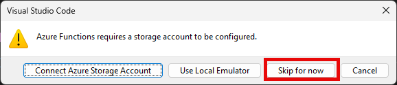
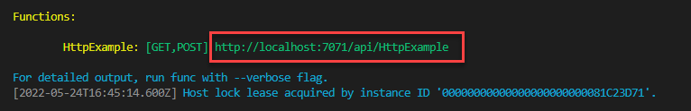
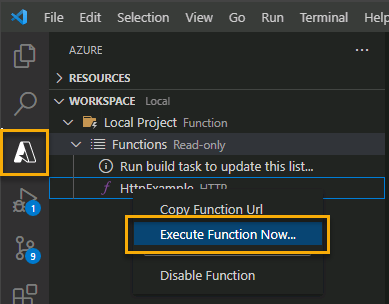
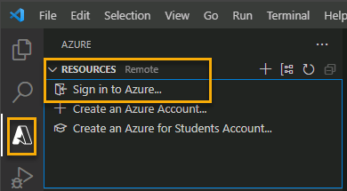
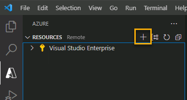
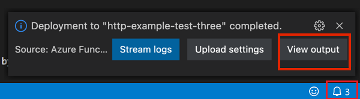
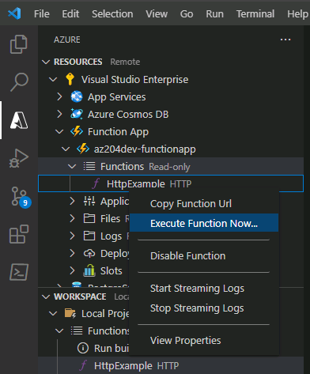

---
lab:
  topic: Azure Functions
  title: Crear una función de Azure con Visual Studio Code
  description: Aprenda cómo crear una función de Azure con un activador HTTP. Después de crear y probar el código localmente en Visual Studio Code, implementará la función en Azure.
  duration: 15 minutes
  level: 200
  islab: true
  primarytopics:
    - Azure
    - Visual Studio
    - Visual Studio Code
---

# Crear una función de Azure con Visual Studio Code

En este ejercicio, aprenderá a crear una función en C# que responde a solicitudes HTTP. Después de crear y probar el código localmente en Visual Studio Code, implementará y probará la función en Azure.

Tareas realizadas en este ejercicio:

* Crear su proyecto local
* Ejecutar la función localmente
* Implementar y ejecutar la función en Azure
* Limpiar recursos

Este ejercicio tarda aproximadamente **15** minutos en completarse.

## Antes de comenzar

Para completar el ejercicio, necesita:

* Una suscripción a Azure. Si aún no tiene una, puede [registrarse para obtener una](https://azure.microsoft.com/es-es/).

* [Visual Studio Code](https://code.visualstudio.com/) en una de las [plataformas compatibles](https://code.visualstudio.com/docs/supporting/requirements#_platforms).

* [.NET 8](https://dotnet.microsoft.com/es-es/download/dotnet/8.0) es la plataforma de destino.

* [C# Dev Kit](https://marketplace.visualstudio.com/items?itemName=ms-dotnettools.csdevkit) para Visual Studio Code.

* La extensión [Azure Functions](https://marketplace.visualstudio.com/items?itemName=ms-azuretools.vscode-azurefunctions) para Visual Studio Code.

* Azure Functions Core Tools versión 4.x. Ejecute los siguientes comandos en un terminal para instalar Azure Functions Core Tools en su sistema. Visite [Azure Function Core Tools en GitHub](https://github.com/Azure/azure-functions-core-tools?tab=readme-ov-file#installing) para ver las instrucciones de instalación en otras plataformas.

    ```
    winget uninstall Microsoft.Azure.FunctionsCoreTools
    winget install Microsoft.Azure.FunctionsCoreTools
    ```

    Si encuentra algún error al instalar Azure Function Core Tools, busque una solución basada en el código de error. Luego, vuelva a intentar el comando **winget install** en el paso anterior.

## Crear su proyecto local

En esta sección, utilizará Visual Studio Code para crear un proyecto local de Azure Functions en C#. Más adelante en este ejercicio, publicará el código de su función en Azure.

1. En Visual Studio Code, presione F1 para abrir la paleta de comandos, busque y ejecute el comando **Azure Functions: Crear nuevo proyecto...** (Azure Functions: Create New Project...).

1. Seleccione la ubicación del directorio para el espacio de trabajo de su proyecto y elija **Seleccionar** (Select). Debe crear una carpeta nueva o elegir una carpeta vacía para el espacio de trabajo del proyecto. No elija una carpeta de proyecto que ya sea parte de un espacio de trabajo.

1. Proporcione la siguiente información en las indicaciones:

    | Indicación | Acción |
    |--|--|
    | Seleccionar la carpeta que contendrá su proyecto de función | Seleccione **Examinar...** (Browse...) para seleccionar una carpeta para su aplicación. |
    | Seleccionar un lenguaje | Seleccione **C#**. |
    | Seleccionar un entorno de ejecución de .NET | Seleccione **.NET 8.0 aislado** (.NET 8.0 Isolated). |
    | Seleccionar una plantilla para la primera función de su proyecto | Seleccione **Desencadenador HTTP** (HTTP trigger).<sup>1</sup> |
    | Proporcionar un nombre de función | Ingrese `HttpExample`. |
    | Proporcionar un espacio de nombres | Ingrese `My.Function`. |
    | Nivel de autorización | Seleccione **Anónimo** (Anonymous), lo que permite que cualquier persona llame al punto de conexión de su función. |

    <sup>1</sup> Dependiendo de su configuración de VS Code, es posible que necesite usar la opción **Cambiar filtro de plantilla** (Change template filter) para ver la lista completa de plantillas.

1. Cuando se le pregunte *Seleccione cómo le gustaría abrir su proyecto*, seleccione **Abrir en la ventana actual** (Open in current window).

1. Visual Studio Code utiliza la información proporcionada y genera un proyecto de Azure Functions con un desencadenador HTTP. Puede ver los archivos del proyecto local en el Explorador.

    > **Nota**: Si VS Code muestra una ventana emergente con el título **¿Confía en los autores de los archivos en esta carpeta?**, seleccione el botón **Sí, confío en los autores** (Yes, I trust the authors).

### Ejecutar la función localmente

Visual Studio Code se integra con las herramientas Azure Functions Core Tools para permitirle ejecutar este proyecto en su equipo de desarrollo local antes de publicarlo en Azure.

1. Asegúrese de que el terminal esté abierto en Visual Studio Code. Puede abrir el terminal seleccionando **Terminal** y luego **Nuevo terminal** (New Terminal) en la barra de menú.

1. Presione **F5** para iniciar el proyecto de la aplicación de funciones en el depurador. Si se le solicita que elija una cuenta de almacenamiento, seleccione **Omitir por ahora** (Skip for now).

    

1. La salida de Core Tools se muestra en el panel **Terminal**. Puede ver el punto de conexión de la URL de su función desencadenada por HTTP ejecutándose localmente.

    

1. Con Core Tools en ejecución, abra la extensión **Azure**. En la sección **Espacio de trabajo** (Workspace) de la extensión, expanda **Proyecto local** (Local Project) > **Funciones** (Functions). Haga clic derecho en la función **HttpExample** y seleccione **Ejecutar función ahora...** (Execute Function Now...).

    

1. En **Ingresar cuerpo de la solicitud** (Enter request body) verá el valor del cuerpo del mensaje de solicitud `{ "name": "Azure" }`. Presione **Enter** para enviar este mensaje de solicitud a su función. Cuando la función se ejecuta localmente y devuelve una respuesta, se genera una notificación en Visual Studio Code.

    Seleccione el ícono de la campana de notificaciones para ver la notificación. La información sobre la ejecución de la función se muestra en el panel **Terminal**.

1. Presione **Shift + F5** para detener Core Tools y desconectar el depurador.

Después de verificar que la función se ejecuta correctamente en su equipo local, es hora de usar Visual Studio Code para publicar el proyecto directamente en Azure.

## Implementar y ejecutar la función en Azure

En esta sección, creará un recurso de aplicación de funciones de Azure (Azure Function App) e implementará la función en el recurso.

### Iniciar sesión en Azure

Antes de poder publicar su aplicación, debe iniciar sesión en Azure. Si ya inició sesión, vaya a la siguiente sección.

1. Si aún no ha iniciado sesión, elija el ícono de Azure en la barra de actividades, luego en el área **Azure: Recursos** (Azure: Resources), elija **Iniciar sesión en Azure...** (Sign in to Azure...).

    

1. Cuando se le solicite en el navegador, elija su cuenta de Azure e inicie sesión con sus credenciales de la cuenta de Azure.

1. Después de iniciar sesión correctamente, puede cerrar la nueva ventana del navegador. Las suscripciones que pertenecen a su cuenta de Azure se muestran en la barra lateral.

### Crear recursos en Azure

En esta sección, creará los recursos de Azure que necesita para implementar su aplicación de funciones local.

1. Elija el ícono de Azure en la barra de actividades, luego en el área **Recursos** (Resources) seleccione el botón **Crear recurso...** (Create resource...).

        

1. Proporcione la siguiente información en las indicaciones:

    | Indicación | Acción |
    |--|--|
    | Seleccionar un recurso para crear | Seleccione **Crear aplicación de funciones en Azure...** (Create Function App in Azure...) |
    | Seleccionar suscripción | Seleccione la suscripción a usar. *No verá esto si solo tiene una suscripción.* |
    | Ingresar un nombre único global para la aplicación de funciones | Escriba un nombre que sea válido en una ruta de URL, por ejemplo `myfunctionapp`. El nombre que escriba se valida para asegurar que sea único. |
    | Seleccionar una ubicación para nuevos recursos | Para un mejor rendimiento, seleccione una región cercana a usted. |
    | Seleccionar una pila en tiempo de ejecución | Seleccione **.NET 8.0 aislado** (.NET 8.0 Isolated). |
    | Seleccionar el tipo de autenticación del recurso | Seleccione **Secretos** (Secrets). |

    La extensión muestra el estado de los recursos individuales a medida que se crean en el área **AZURE** de la ventana del terminal.
    
1. Al finalizar, se crean los siguientes recursos de Azure en su suscripción, usando nombres basados en el nombre de su aplicación de funciones:

    * Un grupo de recursos, que es un contenedor lógico para recursos relacionados.
    * Una cuenta estándar de Azure Storage, que mantiene el estado y otra información sobre sus proyectos.
    * Un plan de consumo Flex, que define el host subyacente para su aplicación de funciones sin servidor.
    * Una aplicación de funciones, que proporciona el entorno para ejecutar el código de su función. Una aplicación de funciones le permite agrupar funciones como una unidad lógica para facilitar la administración, la implementación y el uso compartido de recursos dentro del mismo plan de alojamiento.
    * Una instancia de Application Insights conectada a la aplicación de funciones, que hace seguimiento del uso de su función sin servidor.

### Implementar el proyecto en Azure

> **! Importante:** Publicar en una función existente sobrescribe cualquier implementación anterior.

1. En la paleta de comandos, busque y ejecute el comando **Azure Functions: Implementar en aplicación de funciones...** (Azure Functions: Deploy to Function App...).

1. Seleccione la suscripción que utilizó al crear los recursos.

1. Seleccione la aplicación de funciones que creó. Cuando se le pregunte sobre la sobrescritura de implementaciones anteriores, seleccione **Implementar** (Deploy) para implementar el código de su función en el nuevo recurso de la aplicación de funciones.

1. Una vez completada la implementación, seleccione **Ver salida** (View Output) para ver los detalles de los resultados de la implementación. Si no ve la notificación, seleccione el ícono de la campana de notificaciones en la esquina inferior derecha para verla nuevamente.

    

### Ejecutar la función en Azure

1. De vuelta en el área **Recursos** (Resources) en la barra lateral, expanda su suscripción, su nueva aplicación de funciones y **Funciones** (Functions). **Haga clic derecho** en la función **HttpExample** y elija **Ejecutar función ahora...** (Execute Function Now...).

    

1. En **Ingresar cuerpo de la solicitud** (Enter request body) verá el valor del cuerpo del mensaje de solicitud `{ "name": "Azure" }`. Presione **Enter** para enviar este mensaje de solicitud a su función.

1. Cuando la función se ejecuta en Azure y devuelve una respuesta, se genera una notificación en Visual Studio Code. Seleccione el ícono de la campana de notificaciones para ver la notificación.

## Limpiar recursos

Ahora que ha terminado el ejercicio, debe eliminar los recursos de la nube que creó para evitar el uso innecesario de recursos.

1. En su navegador web, vaya al portal de Azure [https://portal.azure.com](https://portal.azure.com); inicie sesión con sus credenciales de Azure si se le solicita.
1. Vaya al grupo de recursos que creó y vea el contenido de los recursos usados en este ejercicio.
1. En la barra de herramientas, seleccione **Eliminar grupo de recursos**.
1. Ingrese el nombre del grupo de recursos y confirme que desea eliminarlo.

> **PRECAUCIÓN:** Al eliminar un grupo de recursos se eliminan todos los recursos que contiene. Si eligió un grupo de recursos existente para este ejercicio, cualquier recurso existente fuera del alcance de este ejercicio también se eliminará.
